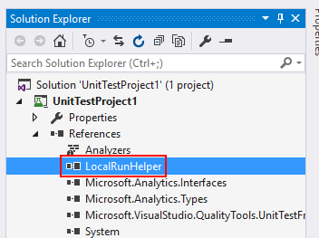
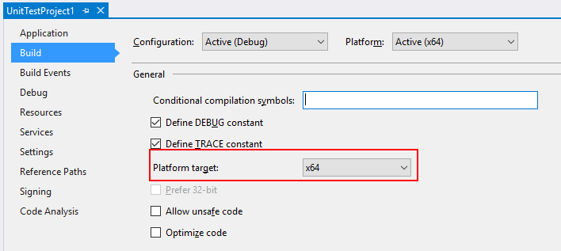
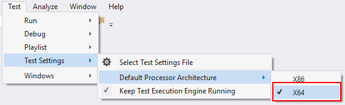

# Run and test U-SQL with Azure Data Lake U-SQL SDK

When developing U-SQL script, it is common to run and test U-SQL script locally before submit it to cloud. Azure Data Lake provides a Nuget package called Azure Data Lake U-SQL SDK for this scenario, through which you can easily scale U-SQL run and test. It is also possible to integrate this U-SQL test with CI (Continuous Integration) system to automate the compile and test.

If you care about how to manually local run and debug U-SQL script with GUI tooling, then you can use Azure Data Lake Tools for Visual Studio for that. You can learn more from [here](data-lake-analytics-data-lake-tools-local-run.md).

## Install Azure Data Lake U-SQL SDK

You can get the Azure Data Lake U-SQL SDK [here](https://www.nuget.org/packages/Microsoft.Azure.DataLake.USQL.SDK/) on Nuget.org. And before using it, you need to make sure you have dependencies as follows.

### Dependencies

The Data Lake U-SQL SDK requires the following dependencies:

- [Microsoft .NET Framework 4.6 or newer](https://www.microsoft.com/download/details.aspx?id=17851).
- Microsoft Visual C++ 14 and Windows SDK 10.0.10240.0 or newer (which is called CppSDK in this article). There are two ways to get CppSDK:

  - Install [Visual Studio Community Edition](https://developer.microsoft.com/downloads/vs-thankyou). You'll have a \Windows Kits\10 folder under the Program Files folder--for example, C:\Program Files (x86)\Windows Kits\10\. You'll also find the Windows 10 SDK version under \Windows Kits\10\Lib. If you don’t see these folders, reinstall Visual Studio and be sure to select the Windows 10 SDK during the installation. If you have this installed with Visual Studio, the U-SQL local compiler will find it automatically.

    

  - Install [Data Lake Tools for Visual Studio](https://aka.ms/adltoolsvs). You can find the prepackaged Visual C++ and Windows SDK files at `C:\Program Files (x86)\Microsoft Visual Studio 14.0\Common7\IDE\Extensions\Microsoft\ADL Tools\X.X.XXXX.X\CppSDK.`

    In this case, the U-SQL local compiler cannot find the dependencies automatically. You need to specify the CppSDK path for it. You can either copy the files to another location or use it as is.

## Understand basic concepts

### Data root

The data-root folder is a "local store" for the local compute account. It's equivalent to the Azure Data Lake Store account of a Data Lake Analytics account. Switching to a different data-root folder is just like switching to a different store account. If you want to access commonly shared data with different data-root folders, you must use absolute paths in your scripts. Or, create file system symbolic links (for example, **mklink** on NTFS) under the data-root folder to point to the shared data.

The data-root folder is used to:

- Store local metadata, including databases, tables, table-valued functions (TVFs), and assemblies.
- Look up the input and output paths that are defined as relative paths in U-SQL. Using relative paths makes it easier to deploy your U-SQL projects to Azure.

### File path in U-SQL

You can use both a relative path and a local absolute path in U-SQL scripts. The relative path is relative to the specified data-root folder path. We recommend that you use "/" as the path separator to make your scripts compatible with the server side. Here are some examples of relative paths and their equivalent absolute paths. In these examples, C:\LocalRunDataRoot is the data-root folder.

|Relative path|Absolute path|
|-------------|-------------|
|/abc/def/input.csv |C:\LocalRunDataRoot\abc\def\input.csv|
|abc/def/input.csv  |C:\LocalRunDataRoot\abc\def\input.csv|
|D:/abc/def/input.csv |D:\abc\def\input.csv|

### Working directory

When running the U-SQL script locally, a working directory is created during compilation under current running directory. In addition to the compilation outputs, the needed runtime files for local execution will be shadow copied to this working directory. The working directory root folder is called "ScopeWorkDir" and the files under the working directory are as follows:

|Directory/file|Directory/file|Directory/file|Definition|Description|
|--------------|--------------|--------------|----------|-----------|
|C6A101DDCB470506| | |Hash string of runtime version|Shadow copy of runtime files needed for local execution|
| |Script_66AE4909AA0ED06C| |Script name + hash string of script path|Compilation outputs and execution step logging|
| | |\_script\_.abr|Compiler output|Algebra file|
| | |\_ScopeCodeGen\_.*|Compiler output|Generated managed code|
| | |\_ScopeCodeGenEngine\_.*|Compiler output|Generated native code|
| | |referenced assemblies|Assembly reference|Referenced assembly files|
| | |deployed_resources|Resource deployment|Resource deployment files|
| | |xxxxxxxx.xxx[1..n]\_\*.*|Execution log|Log of execution steps|

## Use the SDK from the command line

### Command-line interface of the helper application

Under SDK directory\build\runtime, LocalRunHelper.exe is the command-line helper application that provides interfaces to most of the commonly used local-run functions. Note that both the command and the argument switches are case-sensitive. To invoke it:

```console
LocalRunHelper.exe <command> <Required-Command-Arguments> [Optional-Command-Arguments]
```

Run LocalRunHelper.exe without arguments or with the **help** switch to show the help information:

```console
> LocalRunHelper.exe help
    Command 'help' :  Show usage information
    Command 'compile' :  Compile the script
    Required Arguments :
        -Script param
                Script File Path
    Optional Arguments :
        -Shallow [default value 'False']
                Shallow compile
```

In the help information:

- **Command** gives the command’s name.  
- **Required Argument** lists arguments that must be supplied.  
- **Optional Argument** lists arguments that are optional, with default values.  Optional Boolean arguments don’t have parameters, and their appearances mean negative to their default value.

### Return value and logging

The helper application returns **0** for success and **-1** for failure. By default, the helper sends all messages to the current console. However, most of the commands support the **-MessageOut path_to_log_file** optional argument that redirects the outputs to a log file.

### Environment variable configuring

U-SQL local run needs a specified data root as local storage account, as well as a specified CppSDK path for dependencies. You can both set the argument in command-line or set environment variable for them.

- Set the **SCOPE_CPP_SDK** environment variable.

  If you get Microsoft Visual C++ and the Windows SDK by installing Data Lake Tools for Visual Studio, verify that you have the following folder:

    `C:\Program Files (x86)\Microsoft Visual Studio 14.0\Common7\IDE\Extensions\Microsoft\Microsoft Azure Data Lake Tools for Visual Studio 2015\X.X.XXXX.X\CppSDK`

  Define a new environment variable called **SCOPE_CPP_SDK** to point to this directory. Or copy the folder to the other location and specify **SCOPE_CPP_SDK** as that.

  In addition to setting the environment variable, you can specify the **-CppSDK** argument when you're using the command line. This argument overwrites your default CppSDK environment variable.

- Set the **LOCALRUN_DATAROOT** environment variable.

  Define a new environment variable called **LOCALRUN_DATAROOT** that points to the data root.

  In addition to setting the environment variable, you can specify the **-DataRoot** argument with the data-root path when you're using a command line. This argument overwrites your default data-root environment variable. You need to add this argument to every command line you're running so that you can overwrite the default data-root environment variable for all operations.

### SDK command line usage samples

#### Compile and run

The **run** command is used to compile the script and then execute compiled results. Its command-line arguments are a combination of those from **compile** and **execute**.

```console
LocalRunHelper run -Script path_to_usql_script.usql [optional_arguments]
```

The following are optional arguments for **run**:

|Argument|Default value|Description|
|--------|-------------|-----------|
|-CodeBehind|False|The script has .cs code behind|
|-CppSDK| |CppSDK Directory|
|-DataRoot| DataRoot environment variable|DataRoot for local run, default to 'LOCALRUN_DATAROOT' environment variable|
|-MessageOut| |Dump messages on console to a file|
|-Parallel|1|Run the plan with the specified parallelism|
|-References| |List of paths to extra reference assemblies or data files of code behind, separated by ';'|
|-UdoRedirect|False|Generate Udo assembly redirect config|
|-UseDatabase|master|Database to use for code behind temporary assembly registration|
|-Verbose|False|Show detailed outputs from runtime|
|-WorkDir|Current Directory|Directory for compiler usage and outputs|
|-RunScopeCEP|0|ScopeCEP mode to use|
|-ScopeCEPTempPath|temp|Temp path to use for streaming data|
|-OptFlags| |Comma-separated list of optimizer flags|

Here's an example:

`LocalRunHelper run -Script d:\test\test1.usql -WorkDir d:\test\bin -CodeBehind -References "d:\asm\ref1.dll;d:\asm\ref2.dll" -UseDatabase testDB –Parallel 5 -Verbose`

Besides combining **compile** and **execute**, you can compile and execute the compiled executables separately.

#### Compile a U-SQL script

The **compile** command is used to compile a U-SQL script to executables.

```console
LocalRunHelper compile -Script path_to_usql_script.usql [optional_arguments]
```

The following are optional arguments for **compile**:

|Argument|Description|
|--------|-----------|
| -CodeBehind [default value 'False']|The script has .cs code behind|
| -CppSDK [default value '']|CppSDK Directory|
| -DataRoot [default value 'DataRoot environment variable']|DataRoot for local run, default to 'LOCALRUN_DATAROOT' environment variable|
| -MessageOut [default value '']|Dump messages on console to a file|
| -References [default value '']|List of paths to extra reference assemblies or data files of code behind, separated by ';'|
| -Shallow [default value 'False']|Shallow compile|
| -UdoRedirect [default value 'False']|Generate Udo assembly redirect config|
| -UseDatabase [default value 'master']|Database to use for code behind temporary assembly registration|
| -WorkDir [default value 'Current Directory']|Directory for compiler usage and outputs|
| -RunScopeCEP [default value '0']|ScopeCEP mode to use|
| -ScopeCEPTempPath [default value 'temp']|Temp path to use for streaming data|
| -OptFlags [default value '']|Comma-separated list of optimizer flags|

Here are some usage examples.

Compile a U-SQL script:

```console
LocalRunHelper compile -Script d:\test\test1.usql
```

Compile a U-SQL script and set the data-root folder. Note that this will overwrite the set environment variable.

```console
LocalRunHelper compile -Script d:\test\test1.usql –DataRoot c:\DataRoot
```

Compile a U-SQL script and set a working directory, reference assembly, and database:

```console
LocalRunHelper compile -Script d:\test\test1.usql -WorkDir d:\test\bin -References "d:\asm\ref1.dll;d:\asm\ref2.dll" -UseDatabase testDB
```

#### Execute compiled results

The **execute** command is used to execute compiled results.

```console
LocalRunHelper execute -Algebra path_to_compiled_algebra_file [optional_arguments]
```

The following are optional arguments for **execute**:

|Argument|Default value|Description|
|--------|-------------|-----------|
|-DataRoot | '' |Data root for metadata execution. It defaults to the **LOCALRUN_DATAROOT** environment variable.|
|-MessageOut | '' |Dump messages on the console to a file.|
|-Parallel | '1' |Indicator to run the generated local-run steps with the specified parallelism level.|
|-Verbose | 'False' |Indicator to show detailed outputs from runtime.|

Here's a usage example:

```console
LocalRunHelper execute -Algebra d:\test\workdir\C6A101DDCB470506\Script_66AE4909AA0ED06C\__script__.abr –DataRoot c:\DataRoot –Parallel 5
```

## Use the SDK with programming interfaces

The programming interfaces are all located in the LocalRunHelper.exe. You can use them to integrate the functionality of the U-SQL SDK and the C# test framework to scale your U-SQL script local test. In this article, I will use the standard C# unit test project to show how to use these interfaces to test your U-SQL script.

### Step 1: Create C# unit test project and configuration

- Create a C# unit test project through File > New > Project > Visual C# > Test > Unit Test Project.
- Add LocalRunHelper.exe as a reference for the project. The LocalRunHelper.exe is located at \build\runtime\LocalRunHelper.exe in Nuget package.

   

- U-SQL SDK **only** support x64 environment, make sure to set build platform target as x64. You can set that through Project Property > Build > Platform target.

   

- Make sure to set your test environment as x64. In Visual Studio, you can set it through Test > Test Settings > Default Processor Architecture > x64.

   

- Make sure to copy all dependency files under NugetPackage\build\runtime\ to project working directory which is usually under ProjectFolder\bin\x64\Debug.

### Step 2: Create U-SQL script test case

Below is the sample code for U-SQL script test. For testing, you need to prepare scripts, input files and expected output files.

```usql
using System;
using Microsoft.VisualStudio.TestTools.UnitTesting;
using System.IO;
using System.Text;
using System.Security.Cryptography;
using Microsoft.Analytics.LocalRun;
namespace UnitTestProject1
{
    [TestClass]
    public class USQLUnitTest
    {
        [TestMethod]
        public void TestUSQLScript()
        {
            //Specify the local run message output path
            StreamWriter MessageOutput = new StreamWriter("../../../log.txt");
            LocalRunHelper localrun = new LocalRunHelper(MessageOutput);
            //Configure the DateRoot path, Script Path and CPPSDK path
            localrun.DataRoot = "../../../";
            localrun.ScriptPath = "../../../Script/Script.usql";
            localrun.CppSdkDir = "../../../CppSDK";
            //Run U-SQL script
            localrun.DoRun();
            //Script output
            string Result = Path.Combine(localrun.DataRoot, "Output/result.csv");
            //Expected script output
            string ExpectedResult = "../../../ExpectedOutput/result.csv";
            Test.Helpers.FileAssert.AreEqual(Result, ExpectedResult);
            //Don't forget to close MessageOutput to get logs into file
            MessageOutput.Close();
        }
    }
}
namespace Test.Helpers
{
    public static class FileAssert
    {
        static string GetFileHash(string filename)
        {
            Assert.IsTrue(File.Exists(filename));
            using (var hash = new SHA1Managed())
            {
                var clearBytes = File.ReadAllBytes(filename);
                var hashedBytes = hash.ComputeHash(clearBytes);
                return ConvertBytesToHex(hashedBytes);
            }
        }
        static string ConvertBytesToHex(byte[] bytes)
        {
            var sb = new StringBuilder();
            for (var i = 0; i < bytes.Length; i++)
            {
                sb.Append(bytes[i].ToString("x"));
            }
            return sb.ToString();
        }
        public static void AreEqual(string filename1, string filename2)
        {
            string hash1 = GetFileHash(filename1);
            string hash2 = GetFileHash(filename2);
            Assert.AreEqual(hash1, hash2);
        }
    }
}
```

### Programming interfaces in LocalRunHelper.exe

LocalRunHelper.exe provides the programming interfaces for U-SQL local compile, run, etc. The interfaces are listed as follows.

### Constructor

public LocalRunHelper([System.IO.TextWriter messageOutput = null])

|Parameter|Type|Description|
|---------|----|-----------|
|messageOutput|System.IO.TextWriter|for output messages, set to null to use Console|

### Properties

|Property|Type|Description|
|--------|----|-----------|
|AlgebraPath|string|The path to algebra file (algebra file is one of the compilation results)|
|CodeBehindReferences|string|If the script has additional code behind references, specify the paths separated with ';'|
|CppSdkDir|string|CppSDK directory|
|CurrentDir|string|Current directory|
|DataRoot|string|Data root path|
|DebuggerMailPath|string|The path to debugger mailslot|
|GenerateUdoRedirect|bool|If we want to generate assembly loading redirection override config|
|HasCodeBehind|bool|If the script has code behind|
|InputDir|string|Directory for input data|
|MessagePath|string|Message dump file path|
|OutputDir|string|Directory for output data|
|Parallelism|int|Parallelism to run the algebra|
|ParentPid|int|PID of the parent on which the service monitors to exit, set to 0 or negative to ignore|
|ResultPath|string|Result dump file path|
|RuntimeDir|string|Runtime directory|
|ScriptPath|string|Where to find the script|
|Shallow|bool|Shallow compile or not|
|TempDir|string|Temp directory|
|UseDataBase|string|Specify the database to use for code behind temporary assembly registration, master by default|
|WorkDir|string|Preferred working directory|

### Method

|Method|Description|Return|Parameter|
|------|-----------|------|---------|
|public bool DoCompile()|Compile the U-SQL script|True on success| |
|public bool DoExec()|Execute the compiled result|True on success| |
|public bool DoRun()|Run the U-SQL script (Compile + Execute)|True on success| |
|public bool IsValidRuntimeDir(string path)|Check if the given path is valid runtime path|True for valid|The path of runtime directory|

## FAQ about common issue

### Error 1

E_CSC_SYSTEM_INTERNAL: Internal error! Could not load file or assembly 'ScopeEngineManaged.dll' or one of its dependencies. The specified module could not be found.

Please check the following:

- Make sure you have x64 environment. The build target platform and the test environment should be x64, refer to **Step 1: Create C# unit test project and configuration** above.
- Make sure you have copied all dependency files under NugetPackage\build\runtime\ to project working directory.

## Next steps

- To learn U-SQL, see [Get started with Azure Data Lake Analytics U-SQL language](data-lake-analytics-u-sql-get-started.md).
- To log diagnostics information, see [Accessing diagnostics logs for Azure Data Lake Analytics](data-lake-analytics-diagnostic-logs.md).
- To see a more complex query, see [Analyze website logs using Azure Data Lake Analytics](data-lake-analytics-analyze-weblogs.md).
- To view job details, see [Use Job Browser and Job View for Azure Data Lake Analytics jobs](data-lake-analytics-data-lake-tools-view-jobs.md).
- To use the vertex execution view, see [Use the Vertex Execution View in Data Lake Tools for Visual Studio](data-lake-analytics-data-lake-tools-use-vertex-execution-view.md).
