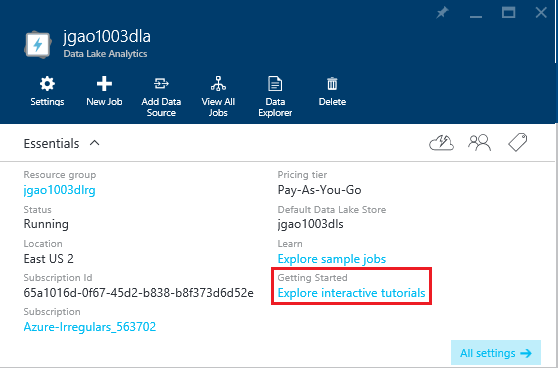

<properties 
   pageTitle="Learn Data Lake Analytics and U-SQL using the Azure Portal Interactive tutorials | Azure" 
   description="Quick start with learning Data Lake Analytics and U-SQL. " 
   services="data-lake-analytics" 
   documentationCenter="" 
   authors="edmacauley" 
   manager="paulettm" 
   editor="cgronlun"/>
 
<tags
   ms.service="data-lake-analytics"
   ms.devlang="na"
   ms.topic="get-started-article"
   ms.tgt_pltfrm="na"
   ms.workload="big-data" 
   ms.date="05/16/2016"
   ms.author="edmaca"/>

# Use Azure Data Lake Analytics interactive tutorials

The Azure Portal provides an interactive tutorial for you to get started with Data Lake Analytics. This articles shows you how to go through the tutorial for analyzing website logs.

>[AZURE.NOTE] If you want to go through the same tutorial using Visual Studio, see [Analyze website logs using Data Lake Analytics](data-lake-analytics-analyze-weblogs.md).
>More interactive tutorials to be added to the portal.

For other tutorials, see:

- [Get started with Data Lake Analytics using Azure Portal](data-lake-analytics-get-started-portal.md)
- [Get started with Data Lake Analytics using Azure PowerShell](data-lake-analytics-get-started-powershell.md)
- [Get started with Data Lake Analytics using .NET SDK](data-lake-analytics-get-started-net-sdk.md)
- [Develop U-SQL scripts using Data Lake Tools for Visual Studio](data-lake-analytics-data-lake-tools-get-started.md) 

**Prerequisites**

Before you begin this tutorial, you must have the following:

- **A Data Lake Analytics account**.  See [Get Started with Azure Data Lake Analytics using Azure Portal](data-lake-analytics-get-started-portal.md).

##Create Data Lake Analytics account 

You must have a Data Lake Analytics account before you can run any jobs.

Each Data Lake Analytics account has an [Azure Data Lake Store](../data-lake-store/data-lake-store-overview.md) account dependency.  This account is referred
as the default Data Lake Store account.  You can create the Data Lake Store account beforehand or when you create 
your Data Lake Analytics account. In this tutorial, you will create the Data Lake Store account with the Analytics 
account

**To create a Data  Lake Analytics account**

1. Sign on to the [Azure Portal](https://portal.azure.com/signin/index/?Microsoft_Azure_Kona=true&Microsoft_Azure_DataLake=true&hubsExtension_ItemHideKey=AzureDataLake_BigStorage%2cAzureKona_BigCompute).
2. Click **Microsoft Azure** in the upper left corner to open the StartBoard.
3. Click the **Marketplace** tile.  
3. Type **Azure Data Lake Analytics** in the search box on the **Everything** blade, and the press **ENTER**. You shall see **Azure Data Lake Analytics** in the list.
4. Click **Azure Data Lake Analytics** from the list.
5. Click **Create** on the bottom of the blade.
6. Type or select the following:

    

	- **Name**: Name the Analytics account.
	- **Data Lake Store**: Each Data Lake Analytics account has a dependent Data Lake Store account. The Data Lake Analytics account and the dependent Data Lake Store account must be located in the same Azure data center. Follow the instruction to create a new Data Lake Store account, or select an existing one.
	- **Subscription**: Choose the Azure subscription used for the Analytics account.
	- **Resource Group**. Select an existing Azure Resource Group or create a new one. Applications are typically made up of many components, for example a web app, database, database server, storage, and 3rd party services. Azure Resource Manager (ARM) enables you to work with the resources in your application as a group, referred to as an Azure Resource Group. You can deploy, update, monitor or delete all of the resources for your application in a single, coordinated operation. You use a template for deployment and that template can work for different environments such as testing, staging and production. You can clarify billing for your organization by viewing the rolled-up costs for the entire group. For more information, see [Azure Resource Manager Overview](resource-group-overview.md). 
	- **Location**. Select an Azure data center for the Data Lake Analytics account. 
7. Select **Pin to Startboard**. This is required for following this tutorial.
8. Click **Create**. It takes you to the portal StartBoard. A new tile is added to the Home page with the label showing "Deploying Azure Data Lake Analytics". It takes a few moments to create a Data  Lake Analytics account. When the account is created, the portal opens the account on a new blade.

	

##Run Website Log Analysis interactive tutorial

**To open the Website Log Analytics interactive tutorial**

1. From the Portal, click **Microsoft Azure** from the left menu to open the StartBoard.
2. Click the tile that is linked to your Data Lake Analytics account.
3. Click **Explore interactive tutorials** from the **Essentials** bar.

	

4. If you see an orange warning saying "Samples not set up, click ...", click **Copy Sample Data** to copy the sample data to the default Data Lake Store account. The interactive tutorial needs the data to run.
5. From the **Interactive Tutorials** blade, click **Website Log Analytics**. The portal opens the tutorial in a new portal blade.
5. Click **1 Introduction** and then follow the instructions

##See also

- [Overview of Microsoft Azure Data Lake Analytics](data-lake-analytics-overview.md)
- [Get started with Data Lake Analytics using Azure Portal](data-lake-analytics-get-started-portal.md)
- [Get started with Data Lake Analytics using Azure PowerShell](data-lake-analytics-get-started-powershell.md)
- [Develop U-SQL scripts using Data Lake Tools for Visual Studio](data-lake-analytics-data-lake-tools-get-started.md)
- [Analyze Website logs using Azure Data Lake Analytics](data-lake-analytics-analyze-weblogs.md)
