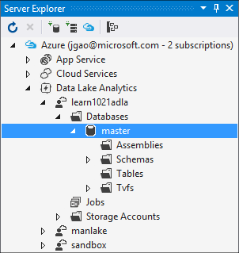

<properties
   pageTitle="Introduce Azure Data Lake Analytics U-SQL catalog | Azure"
   description="Introduce Azure Data Lake Analytics U-SQL catalog"
   services="data-lake-analytics"
   documentationCenter=""
   authors="edmacauley"
   manager="paulettm"
   editor="cgronlun"/>

<tags
   ms.service="data-lake-analytics"
   ms.devlang="na"
   ms.topic="article"
   ms.tgt_pltfrm="na"
   ms.workload="big-data"
   ms.date="05/16/2016"
   ms.author="edmaca"/>

# Use U-SQL catalog

The U-SQL catalog is used to structure data and code so they can be shared by U-SQL scripts. The catalog enables the highest performance possible with data in Azure Data Lake.

Each Azure Data Lake Analytics account has exactly one U-SQL Catalog associated with it. You cannot delete the U-SQL Catalog. Currently U-SQL Catalogs cannot be shared between Data Lake Store accounts.

Each U-SQL Catalog contains a database called **Master**. The Master Database cannot be deleted.  Each U-SQL Catalog can contain more additional databases.

U-SQL database contain:

- Assemblies – share .NET code among U-SQL scripts.
- Table-values functions – share U-SQL code among U-SQL scripts.
- Tables – share data among U-SQL scripts.
- Schemas - share table schemas among U-SQL scripts.

## Manage catalogs
Each Azure Data Lake Analytics account has a default Azure Data Lake Store account associated with it. This Data Lake Store account is referred as the default Data Lake Store account. U-SQL catalog is stored in the default Data Lake Store account under the /catalog folder. Do not delete any files in the /catalog folder.

### Use Azure Portal

See [Manage Data Lake Analytics using portal](data-lake-analytics-use-portal.md#view-u-sql-catalog)

### Use Data Lake Tools for Visual Studio.

You can use Data Lake Tools for Visual Studio to manage the catalog.  For more information about the tools, see [Using Data Lake Tools for Visual Studio](data-lake-analytics-data-lake-tools-get-started.md).

**To manage the catalog**

1. Open Visual Studio, and connect to azure. For the instructions, see [Connect to Azure](data-lake-analytics-data-lake-tools-get-started.md#connect-to-azure).
1. Open **Server Explorer** by press **CTRL+ALT+S**.
2. From **Server Explorer**, expand **Azure**, expand **Data Lake Analytics**, expand your Data Lake Analytics account, expand **Databases**, and then expand **master**.

    - To add a new Database, right-click **Database**, and then click **Create Database**.
    - To add a new assembly, right-click **Assemblies**, and then click **Register Assembly**.
    - To add a new schema, right-click **Schemas**, and then click "Create Schema**.
    - To add a new table, right-click **Tables**, and then click ""Create Table**.
    - To add a new table valued function, see [Develop U-SQL user defined operators for Data Lake Analytics jobs](data-lake-analytics-u-sql-develop-user-defined-operators.md).

## See also

- Get started
    - [Get started with Data Lake Analytics using Azure Portal](data-lake-analytics-get-started-portal.md)
    - [Get started with Data Lake Analytics using Azure PowerShell](data-lake-analytics-get-started-powershell.md)
    - [Get started with Data Lake Analytics using Azure .NET SDK](data-lake-analytics-get-started-net-sdk.md)
    - [Develop U-SQL scripts using Data Lake Tools for Visual Studio](data-lake-analytics-data-lake-tools-get-started.md)
    - [Get started with Azure Data Lake Analytics U-SQL language](data-lake-analytics-u-sql-get-started.md)

- U-SQL & development
    - [Get started with Azure Data Lake Analytics U-SQL language](data-lake-analytics-u-sql-get-started.md)
    - [Use U-SQL window functions for Azure Data Lake Aanlytics jobs](data-lake-analytics-use-window-functions.md)
    - [Develop U-SQL user defined operators for Data Lake Analytics jobs](data-lake-Analytics-u-sql-user-defined-operators.md)

- Management
    - [Manage Azure Data Lake Analytics using Azure Portal](data-lake-analytics-use-portal.md)
    - [Manage Azure Data Lake Analytics using Azure PowerShell](data-lake-analytics-use-powershell.md)
    - [Monitor and troubleshoot Azure Data Lake Analytics jobs using Azure Portal](data-lake-analytics-monitor-and-troubleshoot-jobs-tutorial.md)

- End-to-end tutorial
    - [Use Azure Data Lake Analytics interactive tutorials](data-lake-analytics-use-interactive-tutorials.md)
    - [Analyze Website logs using Azure Data Lake Analytics](data-lake-analytics-analyze-weblogs.md)
