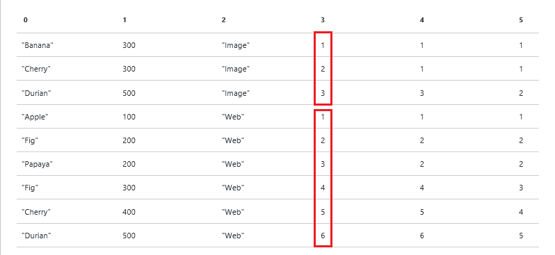
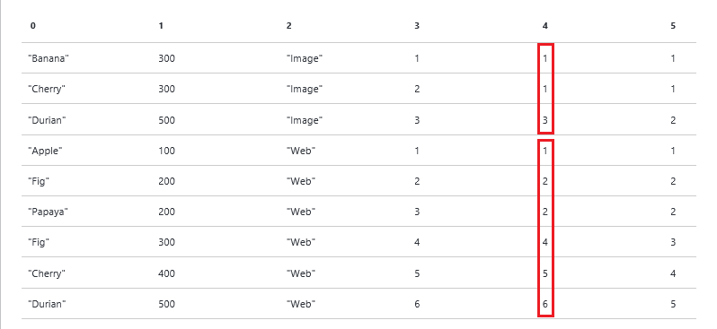
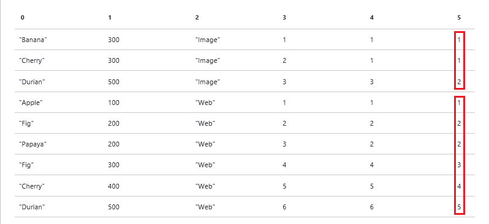

# Use U-SQL window functions for Azure Data Lake Analytics jobs
Window functions were introduced to the ISO/ANSI SQL Standard in 2003. U-SQL adopts a subset of window functions as defined by the ANSI SQL Standard.

Window functions are used to do computation within sets of rows called *windows*. Windows are defined by the OVER clause. Window functions solve some key scenarios in a highly efficient manner.

The window functions are categorized into: 

* [Reporting aggregation functions](#reporting-aggregation-functions), such as SUM and AVG
* [Ranking functions](#ranking-functions), such as DENSE_RANK, ROW_NUMBER, NTILE, and RANK
* [Analytic functions](#analytic-functions), such as cumulative distribution or percentiles, access data from a previous row (in the same result set) without using a self-join

## Sample datasets
This tutorial uses two datasets:

### The QueryLog Sample DataSet
  
QueryLog represents a list of what people searched for in search engine. Each query log includes:
  
* Query - What the user was searching for
* Latency - How fast the query came back to the user in milliseconds
* Vertical - What kind of content the user was interested in (Web links, Images, Videos)  
 
```
@querylog = 
    SELECT * FROM ( VALUES
        ("Banana"  , 300, "Image" ),
        ("Cherry"  , 300, "Image" ),
        ("Durian"  , 500, "Image" ),
        ("Apple"   , 100, "Web"   ),
        ("Fig"     , 200, "Web"   ),
        ("Papaya"  , 200, "Web"   ),
        ("Avocado" , 300, "Web"   ),
        ("Cherry"  , 400, "Web"   ),
        ("Durian"  , 500, "Web"   ) )
    AS T(Query,Latency,Vertical);
```

## The Employees Sample DataSet
  
The Employee dataset includes the following fields:
  
* EmpID - Employee ID
* EmpName - Employee name
* DeptName - Department name 
* DeptID - Department ID
* Salary - Employee salary

```
@employees = 
    SELECT * FROM ( VALUES
        (1, "Noah",   "Engineering", 100, 10000),
        (2, "Sophia", "Engineering", 100, 20000),
        (3, "Liam",   "Engineering", 100, 30000),
        (4, "Emma",   "HR",          200, 10000),
        (5, "Jacob",  "HR",          200, 10000),
        (6, "Olivia", "HR",          200, 10000),
        (7, "Mason",  "Executive",   300, 50000),
        (8, "Ava",    "Marketing",   400, 15000),
        (9, "Ethan",  "Marketing",   400, 10000) )
    AS T(EmpID, EmpName, DeptName, DeptID, Salary);
```  

## Compare window functions to Grouping
Windowing and Grouping are conceptually related. It is helpful to understand this relationship.

### Use aggregation and Grouping
The following query uses an aggregation to calculate the total salary for all employees:

    @result = 
        SELECT 
            SUM(Salary) AS TotalSalary
        FROM @employees;

The result is a single row with a single column. The $165000 is the sum of the Salary values from the whole table. 

| TotalSalary |
| --- |
| 165000 |


The following statement uses the GROUP BY clause to calculate the total salary for each department:

    @result=
        SELECT DeptName, SUM(Salary) AS SalaryByDept
        FROM @employees
        GROUP BY DeptName;

The results are:

| DeptName | SalaryByDept |
| --- | --- |
| Engineering |60000 |
| HR |30000 |
| Executive |50000 |
| Marketing |25000 |

The sum of the SalaryByDept column is $165000, which matches the amount in the previous script.

In both these cases the number of there are fewer output rows than input rows:

* Without GROUP BY, the aggregation collapses all the rows into a single row. 
* With GROUP BY, there are N output rows where N is the number of distinct values that appear in the data.  In this case, four rows are output.

### Use a window function
The OVER clause in the following sample is empty, so the window includes all rows. The SUM in this example is applied to the OVER clause.

You could read this query as: “The sum of Salary over a window of all rows.”

    @result=
        SELECT
            EmpName,
            SUM(Salary) OVER( ) AS SalaryAllDepts
        FROM @employees;

Unlike GROUP BY, there are as many output rows as input rows: 

| EmpName | TotalAllDepts |
| --- | --- |
| Noah |165000 |
| Sophia |165000 |
| Liam |165000 |
| Emma |165000 |
| Jacob |165000 |
| Olivia |165000 |
| Mason |165000 |
| Ava |165000 |
| Ethan |165000 |

The value of 165000 (the total of all salaries) is placed in each output row. That total comes from the "window" of all rows, so it includes all the salaries. 

The next example demonstrates how to refine the "window" to list all the employees, the department, and the total salary for the department. PARTITION BY is added to the OVER clause.

    @result=
    SELECT
        EmpName, DeptName,
        SUM(Salary) OVER( PARTITION BY DeptName ) AS SalaryByDept
    FROM @employees;

The results are:

| EmpName | DeptName | SalaryByDep |
| --- | --- | --- |
| Noah |Engineering |60000 |
| Sophia |Engineering |60000 |
| Liam |Engineering |60000 |
| Mason |Executive |50000 |
| Emma |HR |30000 |
| Jacob |HR |30000 |
| Olivia |HR |30000 |
| Ava |Marketing |25000 |
| Ethan |Marketing |25000 |

Again, there are the same number of input rows as output rows. However each row has a total salary for the corresponding department.

## Reporting aggregation functions
Window functions also support the following aggregates:

* COUNT
* SUM
* MIN
* MAX
* AVG
* STDEV
* VAR

The syntax:

    <AggregateFunction>( [DISTINCT] <expression>) [<OVER_clause>]

Note: 

* By default, aggregate functions, except COUNT, ignore null values.
* When aggregate functions are specified along with the OVER clause, the ORDER BY clause is not allowed in the OVER clause.

### Use SUM
The following example adds a total salary by department to each input row:

    @result=
        SELECT 
            *,
            SUM(Salary) OVER( PARTITION BY DeptName ) AS TotalByDept
        FROM @employees;

Here is the output:

| EmpID | EmpName | DeptName | DeptID | Salary | TotalByDept |
| --- | --- | --- | --- | --- | --- |
| 1 |Noah |Engineering |100 |10000 |60000 |
| 2 |Sophia |Engineering |100 |20000 |60000 |
| 3 |Liam |Engineering |100 |30000 |60000 |
| 7 |Mason |Executive |300 |50000 |50000 |
| 4 |Emma |HR |200 |10000 |30000 |
| 5 |Jacob |HR |200 |10000 |30000 |
| 6 |Olivia |HR |200 |10000 |30000 |
| 8 |Ava |Marketing |400 |15000 |25000 |
| 9 |Ethan |Marketing |400 |10000 |25000 |

### Use COUNT
The following example adds an extra field to each row to show the total number employees in each department.

    @result =
        SELECT *, 
            COUNT(*) OVER(PARTITION BY DeptName) AS CountByDept 
        FROM @employees;

The result:

| EmpID | EmpName | DeptName | DeptID | Salary | CountByDept |
| --- | --- | --- | --- | --- | --- |
| 1 |Noah |Engineering |100 |10000 |3 |
| 2 |Sophia |Engineering |100 |20000 |3 |
| 3 |Liam |Engineering |100 |30000 |3 |
| 7 |Mason |Executive |300 |50000 |1 |
| 4 |Emma |HR |200 |10000 |3 |
| 5 |Jacob |HR |200 |10000 |3 |
| 6 |Olivia |HR |200 |10000 |3 |
| 8 |Ava |Marketing |400 |15000 |2 |
| 9 |Ethan |Marketing |400 |10000 |2 |

### Use MIN and MAX
The following example adds an extra field to each row to show the lowest salary of each department:

    @result =
        SELECT 
            *,
            MIN(Salary) OVER( PARTITION BY DeptName ) AS MinSalary
        FROM @employees;

The results:

| EmpID | EmpName | DeptName | DeptID | Salary | MinSalary |
| --- | --- | --- | --- | --- | --- |
| 1 |Noah |Engineering |100 |10000 |10000 |
| 2 |Sophia |Engineering |100 |20000 |10000 |
| 3 |Liam |Engineering |100 |30000 |10000 |
| 7 |Mason |Executive |300 |50000 |50000 |
| 4 |Emma |HR |200 |10000 |10000 |
| 5 |Jacob |HR |200 |10000 |10000 |
| 6 |Olivia |HR |200 |10000 |10000 |
| 8 |Ava |Marketing |400 |15000 |10000 |
| 9 |Ethan |Marketing |400 |10000 |10000 |

## Ranking Functions
Ranking functions return a ranking value (a LONG) for each row in each partition as defined by the PARTITION BY and OVER clauses. The ordering of the rank is controlled by the ORDER BY in the OVER clause.

The following are supported ranking functions:

* RANK
* DENSE_RANK 
* NTILE
* ROW_NUMBER

**Syntax:**

    [ RANK() | DENSE_RANK() | ROW_NUMBER() | NTILE(<numgroups>) ]
        OVER (
            [PARTITION BY <identifier, > …[n]]
            [ORDER BY <identifier, > …[n] [ASC|DESC]] 
    ) AS <alias>

* The ORDER BY clause is optional for ranking functions. If the ORDER BY is not specified, then U-SQL assigns values based on the order it reads records, resulting in non-deterministic values for ROW_NUMBER, RANK, or DENSE_RANK.
* NTILE requires an expression that evaluates to a positive integer. This number specifies the number of groups into which each partition must be divided. This identifier is used only with the NTILE ranking function. 

For more information on the OVER clause, see [U-SQL reference](http://go.microsoft.com/fwlink/p/?LinkId=691348).

ROW_NUMBER, RANK, and DENSE_RANK all assign numbers to rows in a window. Rather than cover them separately, it’s more intuitive to see how they respond to the same input.

    @result =
    SELECT 
        *,
        ROW_NUMBER() OVER (PARTITION BY Vertical ORDER BY Latency) AS RowNumber,
        RANK() OVER (PARTITION BY Vertical ORDER BY Latency) AS Rank, 
        DENSE_RANK() OVER (PARTITION BY Vertical ORDER BY Latency) AS DenseRank 
    FROM @querylog;

Note the OVER clauses are identical. The result:

| Query | Latency: INT | Vertical | RowNumber | Rank | DenseRank |
| --- | --- | --- | --- | --- | --- |
| Banana |300 |Image |1 |1 |1 |
| Cherry |300 |Image |2 |1 |1 |
| Durian |500 |Image |3 |3 |2 |
| Apple |100 |Web |1 |1 |1 |
| Fig |200 |Web |2 |2 |2 |
| Papaya |200 |Web |3 |2 |2 |
| Fig |300 |Web |4 |4 |3 |
| Cherry |400 |Web |5 |5 |4 |
| Durian |500 |Web |6 |6 |5 |

### ROW_NUMBER
Within each Window (Vertical, either Image or Web), the row number increases by 1 ordered by Latency.  



### RANK
Unlike ROW_NUMBER(), RANK() uses the value of the latency, which is specified in the ORDER BY clause for the window.

RANK starts with (1, 1, 3) because the first two values for Latency are the same. Then the next value is 3 because the Latency value has moved on to 500. 
The key point being that even though duplicate values are given the same rank, the RANK number will skip to the next ROW_NUMBER value. 
You can see this pattern repeat with the sequence (2, 2, 4) in the Web vertical.



### DENSE_RANK
DENSE_RANK is just like RANK except it doesn’t skip to the next ROW_NUMBER. DENSE_RANK goes to the next number in the sequence. Notice the sequences (1, 1, 2) and (2, 2, 3) in the sample.



### Remarks
* If ORDER BY is not specified, the ranking function is applied to the rowset without any ordering, resulting in non-deterministic behavior.
* The following conditions must be true to guarantee that rows returned by a query using ROW_NUMBER are ordered the same with each execution.
  
  * Values of the partitioned column are unique.
  * Values of the ORDER BY columns are unique.
  * Combinations of values of the partition column and ORDER BY columns are unique.

### NTILE
NTILE distributes the rows in an ordered partition into a specified number of groups. The groups are numbered, starting at one. 

The following example splits the set of rows in each partition (vertical) into four groups, ordered by latency, and returns the group number for each row. 

The Image vertical has three rows, so it has three groups. 

The Web vertical has six rows.  The two extra rows are distributed to the first two groups. That's why there are two rows in group 1 and group 2, and only one row in group 3 and group 4.  

    @result =
        SELECT 
            *,
            NTILE(4) OVER(PARTITION BY Vertical ORDER BY Latency) AS Quartile   
        FROM @querylog;

The results:

| Query | Latency | Vertical | Quartile |
| --- | --- | --- | --- |
| Banana |300 |Image |1 |
| Cherry |300 |Image |2 |
| Durian |500 |Image |3 |
| Apple |100 |Web |1 |
| Fig |200 |Web |1 |
| Papaya |200 |Web |2 |
| Fig |300 |Web |2 |
| Cherry |400 |Web |3 |
| Durian |500 |Web |4 |

NTILE takes a parameter ("numgroups"). Numgroups is a positive int or long constant expression that specifies the number of groups into which each partition must be divided. 

* If the number of rows in the partition is evenly divisible by numgroups, then the groups will have equal size. 
* If the number of rows in a partition is not divisible by numgroups, groups will have slightly different sizes. Larger groups come before smaller groups in the order specified by the OVER clause. 

For example:

    100 rows divided into 4 groups: 
    [ 25, 25, 25, 25 ]

    102 rows divided into 4 groups: 
    [ 26, 26, 25, 25 ]

### Top N Records per Partition via RANK, DENSE_RANK or ROW_NUMBER
Many users want to select only TOP n rows per group, which can't be done with the traditional GROUP BY. 

You have seen the following example at the beginning of the Ranking functions section. It doesn't show top N records for each partition:

    @result =
    SELECT 
        *,
        ROW_NUMBER() OVER (PARTITION BY Vertical ORDER BY Latency) AS RowNumber,
        RANK() OVER (PARTITION BY Vertical ORDER BY Latency) AS Rank,
        DENSE_RANK() OVER (PARTITION BY Vertical ORDER BY Latency) AS DenseRank
    FROM @querylog;

The results:

| Query | Latency | Vertical | Rank | DenseRank | RowNumber |
| --- | --- | --- | --- | --- | --- |
| Banana |300 |Image |1 |1 |1 |
| Cherry |300 |Image |1 |1 |2 |
| Durian |500 |Image |3 |2 |3 |
| Apple |100 |Web |1 |1 |1 |
| Fig |200 |Web |2 |2 |2 |
| Papaya |200 |Web |2 |2 |3 |
| Fig |300 |Web |4 |3 |4 |
| Cherry |400 |Web |5 |4 |5 |
| Durian |500 |Web |6 |5 |6 |

### TOP N with DENSE RANK
The following example returns the top three records from each group, with no gaps in the sequential rank numbering of rows in each partition.

    @result =
    SELECT 
        *,
        DENSE_RANK() OVER (PARTITION BY Vertical ORDER BY Latency) AS DenseRank
    FROM @querylog;

    @result = 
        SELECT *
        FROM @result
        WHERE DenseRank <= 3;

The results:

| Query | Latency | Vertical | DenseRank |
| --- | --- | --- | --- |
| Banana |300 |Image |1 |
| Cherry |300 |Image |1 |
| Durian |500 |Image |2 |
| Apple |100 |Web |1 |
| Fig |200 |Web |2 |
| Papaya |200 |Web |2 |
| Fig |300 |Web |3 |

### TOP N with RANK
    @result =
        SELECT 
            *,
            RANK() OVER (PARTITION BY Vertical ORDER BY Latency) AS Rank
        FROM @querylog;

    @result = 
        SELECT *
        FROM @result
        WHERE Rank <= 3;

The results:    

| Query | Latency | Vertical | Rank |
| --- | --- | --- | --- |
| Banana |300 |Image |1 |
| Cherry |300 |Image |1 |
| Durian |500 |Image |3 |
| Apple |100 |Web |1 |
| Fig |200 |Web |2 |
| Papaya |200 |Web |2 |

### TOP N with ROW_NUMBER
    @result =
        SELECT 
            *,
            ROW_NUMBER() OVER (PARTITION BY Vertical ORDER BY Latency) AS RowNumber
        FROM @querylog;

    @result = 
        SELECT *
        FROM @result
        WHERE RowNumber <= 3;

The results:   

| Query | Latency | Vertical | RowNumber |
| --- | --- | --- | --- |
| Banana |300 |Image |1 |
| Cherry |300 |Image |2 |
| Durian |500 |Image |3 |
| Apple |100 |Web |1 |
| Fig |200 |Web |2 |
| Papaya |200 |Web |3 |

### Assign Globally Unique Row Number
It’s often useful to assign a globally unique number to each row. Ranking functions are easier and more efficient than using a reducer.

    @result =
        SELECT 
            *,
            ROW_NUMBER() OVER () AS RowNumber
        FROM @querylog;

<!-- ################################################### -->
## Analytic functions
Analytic functions are used to understand the distributions of values in windows. The most common scenario for using analytic functions is the computation of percentiles.

**Supported analytic window functions**

* CUME_DIST 
* PERCENT_RANK
* PERCENTILE_CONT
* PERCENTILE_DISC

### CUME_DIST

CUME_DIST computes the relative position of a specified value in a group of values. It calculates the percent of queries that have a latency less than or equal to the current query latency in the same vertical. 

The CUME_DIST for a row R, assuming ascending ordering, is the number of rows with values lower than or equal to the value of R, divided by the number of rows evaluated in the partition. 

CUME_DIST returns numbers in the range 0 < x <= 1.

**Syntax:**

    CUME_DIST() 
        OVER (
            [PARTITION BY <identifier, > …[n]]
            ORDER BY <identifier, > …[n] [ASC|DESC] 
    ) AS <alias>

The following example uses the CUME_DIST function to compute the latency percentile for each query within a vertical. 

    @result=
        SELECT 
            *,
            CUME_DIST() OVER(PARTITION BY Vertical ORDER BY Latency) AS CumeDist
        FROM @querylog;

The results:

| Query | Latency | Vertical | CumeDist |
| --- | --- | --- | --- |
| Durian |500 |Image |1 |
| Banana |300 |Image |0.666666666666667 |
| Cherry |300 |Image |0.666666666666667 |
| Durian |500 |Web |1 |
| Cherry |400 |Web |0.833333333333333 |
| Fig |300 |Web |0.666666666666667 |
| Fig |200 |Web |0.5 |
| Papaya |200 |Web |0.5 |
| Apple |100 |Web |0.166666666666667 |

There are six rows in the partition where the partition key is "Web".

* There are six rows with the value equal or lower than 500, so the CUME_DIST equals to 6/6=1
* There are five rows with the value equal or lower than 400, so the CUME_DIST equals to 5/6=0.83
* There are four rows with the value equal or lower than 300, so the CUME_DIST equals to 4/6=0.66
* There are three rows with the value equal or lower than 200, so the CUME_DIST equals to 3/6=0.5. There are two rows with the same latency value.
* There is one row with the value equal or lower than 100, so the CUME_DIST equals to 1/6=0.16. 

**Usage notes:**

* Tie values always evaluate to the same cumulative distribution value.
* NULL values are treated as the lowest possible values.
* An ORDER BY clause is required to calculate CUME_DIST.
* CUME_DIST is similar to the PERCENT_RANK function

Note: If the SELECT statement is not followed by OUTPUT, the ORDER BY clause is not allowed.

### PERCENT_RANK
PERCENT_RANK calculates the relative rank of a row within a group of rows. PERCENT_RANK is used to evaluate the relative standing of a value within a rowset or partition. The range of values returned by PERCENT_RANK is greater than 0 and less than or equal to 1. Unlike CUME_DIST, PERCENT_RANK is always 0 for the first row.

**Syntax:**

    PERCENT_RANK() 
        OVER (
            [PARTITION BY <identifier, > …[n]]
            ORDER BY <identifier, > …[n] [ASC|DESC] 
        ) AS <alias>

**Usage notes:**

* The first row in any set has a PERCENT_RANK of 0.
* NULL values are treated as the lowest possible values.
* PERCENT_RANK requires an ORDER BY clause.
* PERCENT_RANK is similar to the CUME_DIST function. 

The following example uses the PERCENT_RANK function to compute the latency percentile for each query within a vertical. 

The PARTITION BY clause is specified to partition the rows in the result set by the vertical. The ORDER BY clause in the OVER clause orders the rows in each partition. 

The value returned by the PERCENT_RANK function represents the rank of the queries’ latency within a vertical as a percentage. 

    @result=
        SELECT 
            *,
            PERCENT_RANK() OVER(PARTITION BY Vertical ORDER BY Latency) AS PercentRank
        FROM @querylog;

The results:

| Query | Latency: INT | Vertical | PercentRank |
| --- | --- | --- | --- |
| Banana |300 |Image |0 |
| Cherry |300 |Image |0 |
| Durian |500 |Image |1 |
| Apple |100 |Web |0 |
| Fig |200 |Web |0.2 |
| Papaya |200 |Web |0.2 |
| Fig |300 |Web |0.6 |
| Cherry |400 |Web |0.8 |
| Durian |500 |Web |1 |

### PERCENTILE_CONT & PERCENTILE_DISC
These two functions calculate a percentile based on a continuous or discrete distribution of the column values.

**Syntax:**

    [PERCENTILE_CONT | PERCENTILE_DISC] ( numeric_literal ) 
        WITHIN GROUP ( ORDER BY <identifier> [ ASC | DESC ] )
        OVER ( [ PARTITION BY <identifier, >…[n] ] ) AS <alias>

**numeric_literal** - The percentile to compute. The value must be between 0.0 and 1.0.

    **WITHIN GROUP (ORDER BY <identifier> [ ASC | DESC ])** - Specifies a list of numeric values to sort and compute the percentile over. Only a single column identifier is allowed. The expression must evaluate to a numeric type. Other data types are not allowed. The default sort order is ascending.

    **OVER ([ PARTITION BY <identifier,>…[n] ] )** - Divides the input rowset into partitions as per the partition key to which the percentile function is applied. For more information, see the RANKING section of this document.
Note: Any nulls in the data set are ignored.

**PERCENTILE_CONT** calculates a percentile based on a continuous distribution of the column value. The result is interpolated and might not be equal to any of the specific values in the column. 

**PERCENTILE_DISC** calculates the percentile based on a discrete distribution of the column values. The result is equal to a specific value in the column. In other words, PERCENTILE_DISC, in contrast to PERCENTILE_CONT, always returns an actual (original input) value.

You can see how both work in the example below which tries to find the median (percentile=0.50) value for Latency within each Vertical.

    @result = 
        SELECT 
            Vertical, 
            Query,
            PERCENTILE_CONT(0.5) 
                WITHIN GROUP (ORDER BY Latency)
                OVER ( PARTITION BY Vertical ) AS PercentileCont50,
            PERCENTILE_DISC(0.5) 
                WITHIN GROUP (ORDER BY Latency) 
                OVER ( PARTITION BY Vertical ) AS PercentileDisc50 

        FROM @querylog;

The results:

| Query | Latency: INT | Vertical | PercentileCont50 | PercentilDisc50 |
| --- | --- | --- | --- | --- |
| Banana |300 |Image |300 |300 |
| Cherry |300 |Image |300 |300 |
| Durian |500 |Image |300 |300 |
| Apple |100 |Web |250 |200 |
| Fig |200 |Web |250 |200 |
| Papaya |200 |Web |250 |200 |
| Fig |300 |Web |250 |200 |
| Cherry |400 |Web |250 |200 |
| Durian |500 |Web |250 |200 |

For PERCENTILE_CONT because values can be interpolated, the median for web is 250 even though no query in the web vertical had a latency of 250. 

PERCENTILE_DISC does not interpolate values, so the median for Web is 200 - which is an actual value found in the input rows.

## See also
* [Develop U-SQL scripts using Data Lake Tools for Visual Studio](data-lake-analytics-data-lake-tools-get-started.md)
* [Learn about the U-SQL language](http://usql.io)
* [Get started with Azure Data Lake Analytics U-SQL language](data-lake-analytics-u-sql-get-started.md)


