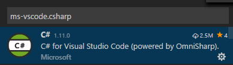
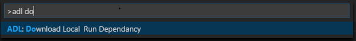

---
title: 'Azure Data Lake Tools: U-SQL local run and local debug with Visual Studio Code | Microsoft Docs'
description: 'Learn how to use Azure Data Lake Tools for Visual Studio Code to local run and local debug.'
Keywords: VScode,Azure Data Lake Tools,Local run,Local debug,Local Debug,preview storage file,upload to storage path
services: data-lake-analytics
documentationcenter: ''
author: jejiang
manager: DJ
editor: jejiang
tags: azure-portal

ms.assetid: dc9b21d8-c5f4-4f77-bcbc-eff458f48de2
ms.service: data-lake-analytics
ms.devlang: 
ms.topic: article
ms.tgt_pltfrm: 
ms.workload: big-data
ms.date: 07/14/2017
ms.author: jejiang
---

# U-SQL local run and local debug with Visual Studio Code

## Prerequisites
Make sure you have the following prerequisites in place before you start these procedures:
- Azure Data Lake Tool for Visual Studio Code. For instructions, see [Use Azure Data Lake Tools for Visual Studio Code](data-lake-analytics-data-lake-tools-for-vscode.md).
- C# for Visual Studio Code (if you want to perform a U-SQL local debug).

   
   
   > [!NOTE]
   > The U-SQL local run and debug features currently only support Windows users. 

## Set up the U-SQL local run environment

1. Select Ctrl+Shift+P to open the command palette, and then enter **ADL: Download LocalRun Dependency** to download the packages.  

   

2. Locate the dependency packages from the path shown in the **Output** pane, and then install BuildTools and Win10SDK 10240. Here is an example path:  
`C:\Users\xxx\.vscode\extensions\usqlextpublisher.usql-vscode-ext-x.x.x\LocalRunDependency
`  
  

   a. To install BuildTools, follow the wizard instructions.   

  

   b. To install Win10SDK 10240, follow the wizard instructions.  

  

3. Set up the environment variable. Set the **SCOPE_CPP_SDK** environment variable to:  
`C:\Users\xxx\.vscode\extensions\usqlextpublisher.usql-vscode-ext-x.x.x\LocalRunDependency\CppSDK_3rdparty
`  
4. Restart the OS to make sure that the environment variable settings take effect.  

   

## Start the local run service and submit the U-SQL job to a local account 
For the first-time user, you are prompted to download the ADL: Download LocalRun Dependency packages if they are not already installed.
1. Select Ctrl+Shift+P to open the command palette, and then enter **ADL: Start Local Run Service**.
2. Select **Accept** to accept the Microsoft Software License Terms for the first time. 

      
3. The cmd console opens. For first-time users, you need to enter **3**, and then locate the local folder path for your data input and output. For other options, you can use the default values. 

   
4. Select Ctrl+Shift+P to open the command palette, enter **ADL: Submit Job**, and then select **Local** to submit the job to your local account.

   
5. After you submit the job, you can view the submission details. To view the submission details select **jobUrl** in the **Output** window. You can also view the job submission status from the cmd console. Enter **7** in the cmd console if you want to know more job details.

   
    

## Start a local debug for the U-SQL job  
For the first-time user, you are prompted to download the ADL: Download LocalRun Dependency packages if they are not already installed.
  
1. Select Ctrl+Shift+P to open the command palette, and then enter **ADL: Start Local Run Service**. The cmd console opens. Make sure that the **DataRoot** is set.
3. Set a breakpoint in your C# code-behind.
4. Back in the script editor, select Ctrl+Shift+P to open the command console, and then enter **Local Debug** to start your local debug service.

## Next steps
- For using Azure Data Lake Tools for Visual Studio Code, see [Use Azure Data Lake Tools for Visual Studio Code](data-lake-analytics-data-lake-tools-for-vscode.md).
- For getting started information on Data Lake Analytics, see [Tutorial: Get started with Azure Data Lake Analytics](data-lake-analytics-get-started-portal.md).
- For information about Data Lake Tools for Visual Studio, see [Tutorial: Develop U-SQL scripts by using Data Lake Tools for Visual Studio](data-lake-analytics-data-lake-tools-get-started.md).
- For the information on developing assemblies, see [Develop U-SQL assemblies for Azure Data Lake Analytics jobs](data-lake-analytics-u-sql-develop-assemblies.md).
