---
title: Debug U-SQL jobs - Azure Data Lake Tools for Visual Studio Code
description: Learn how to use Azure Data Lake Tools for Visual Studio Code to run and debug U-SQL jobs locally.
ms.service: data-lake-analytics
ms.reviewer: whhender
ms.topic: how-to
ms.date: 01/23/2023
---
# Run U-SQL and debug locally in Visual Studio Code

[!INCLUDE [retirement-flag](includes/retirement-flag.md)]

This article describes how to run U-SQL jobs on a local development machine to speed up early coding phases or to debug code locally in Visual Studio Code. For instructions on Azure Data Lake Tool for Visual Studio Code, see [Use Azure Data Lake Tools for Visual Studio Code](data-lake-analytics-data-lake-tools-for-vscode.md).

Only Windows installations of the Azure Data Lake Tools for Visual Studio support the action to run U-SQL locally and debug U-SQL locally. Installations on macOS and Linux-based operating systems don't support this feature.

## Set up the U-SQL local run environment

1. Select Ctrl+Shift+P to open the command palette, and then enter **ADL: Download Local Run Package** to download the packages.  

   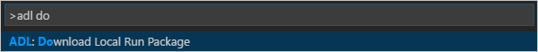

2. Locate the dependency packages from the path shown in the **Output** pane, and then install BuildTools and Win10SDK 10240. Here's an example path:  
`C:\Users\xxx\AppData\Roaming\LocalRunDependency` 

   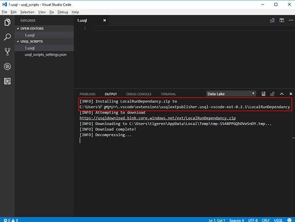

   2.1 To install **BuildTools**, select visualcppbuildtools_full.exe in the LocalRunDependency folder, then follow the wizard instructions.   

    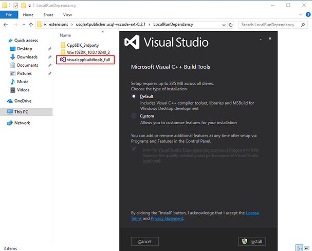

   2.2 To install **Win10SDK 10240**, select sdksetup.exe in the LocalRunDependency/Win10SDK_10.0.10240_2 folder, then follow the wizard instructions.  

    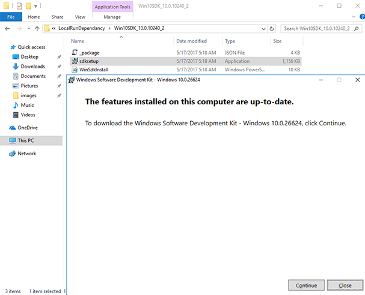

3. Set up the environment variable. Set the **SCOPE_CPP_SDK** environment variable to:  
`C:\Users\XXX\AppData\Roaming\LocalRunDependency\CppSDK_3rdparty`  

## Start the local run service and submit the U-SQL job to a local account 
For the first-time user, use **ADL: Download Local Run Package** to download local run packages, if you have not [set up U-SQL local run environment](#set-up-the-u-sql-local-run-environment).

1. Select Ctrl+Shift+P to open the command palette, and then enter **ADL: Start Local Run Service**.   
2. Select **Accept** to accept the Microsoft Software License Terms for the first time. 

   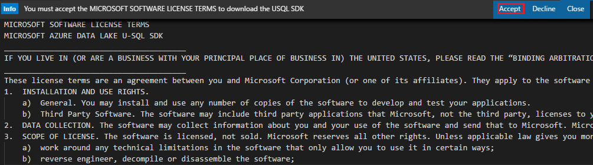   
3. The cmd console opens. For first-time users, you need to enter **3**, and then locate the local folder path for your data input and output. If you're unsuccessful defining the path with backslashes, try forward slashes. For other options, you can use the default values.

   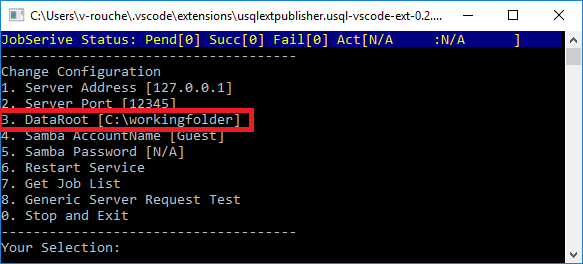
4. Select Ctrl+Shift+P to open the command palette, enter **ADL: Submit Job**, and then select **Local** to submit the job to your local account.

   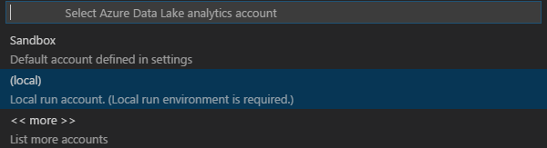
5. After you submit the job, you can view the submission details. To view the submission details, select **jobUrl** in the **Output** window. You can also view the job submission status from the cmd console. Enter **7** in the cmd console if you want to know more job details.

   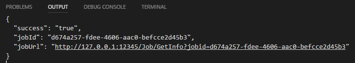
   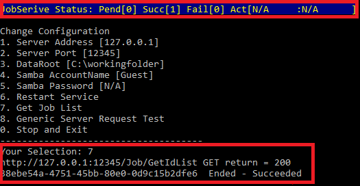 

## Start a local debug for the U-SQL job  
For the first-time user:

1. Use **ADL: Download Local Run Package** to download local run packages, if you have not [set up U-SQL local run environment](#set-up-the-u-sql-local-run-environment).
2. Install .NET Core SDK 2.0 as suggested in the message box, if not installed.
 
  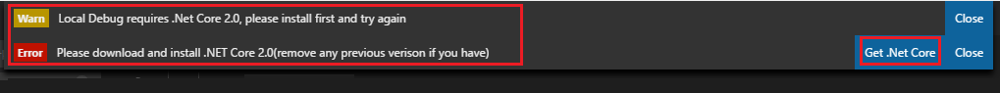
3. Install C# for Visual Studio Code as suggested in the message box if not installed. Select **Install** to continue, and then restart VSCode.

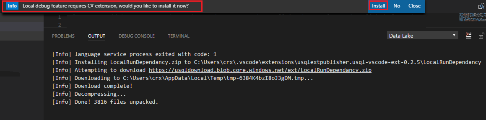

Follow steps below to perform local debug:
  
1. Select Ctrl+Shift+P to open the command palette, and then enter **ADL: Start Local Run Service**. The cmd console opens. Make sure that the **DataRoot** is set.
2. Set a breakpoint in your C# code-behind.
3. Back to script editor, right-click and select **ADL: Local Debug**.
    
   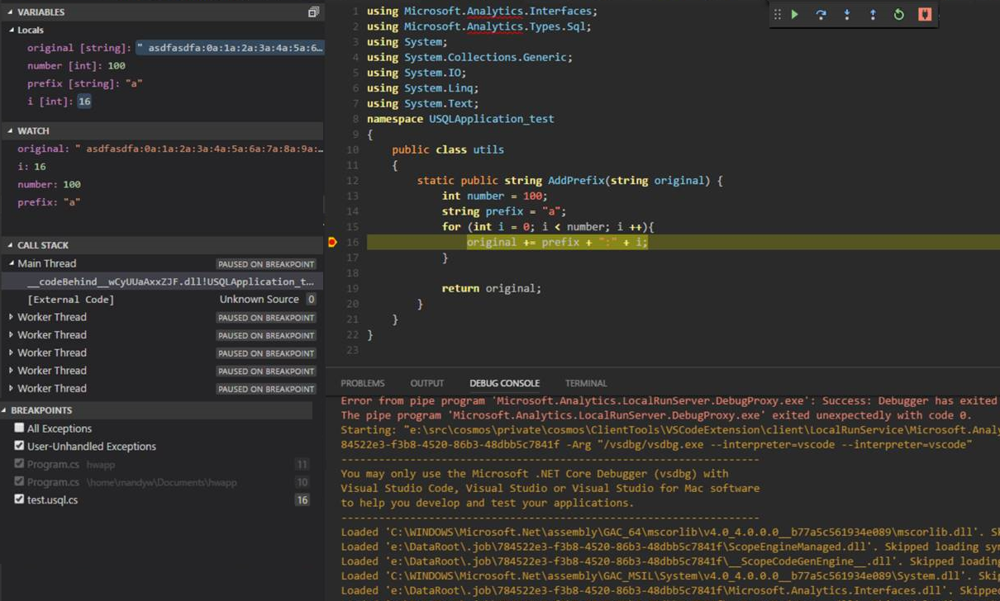

## Next steps
* [Use the Azure Data Lake Tools for Visual Studio Code](data-lake-analytics-data-lake-tools-for-vscode.md)
* [Develop U-SQL with Python, R, and C# for Azure Data Lake Analytics in VSCode](data-lake-analytics-u-sql-develop-with-python-r-csharp-in-vscode.md)
* [Get started with Data Lake Analytics using PowerShell](data-lake-analytics-get-started-powershell.md)
* [Get started with Data Lake Analytics using the Azure portal](data-lake-analytics-get-started-portal.md)
* [Use Data Lake Tools for Visual Studio for developing U-SQL applications](data-lake-analytics-data-lake-tools-get-started.md)
* [Use Data Lake Analytics(U-SQL) catalog](./data-lake-analytics-u-sql-get-started.md)
