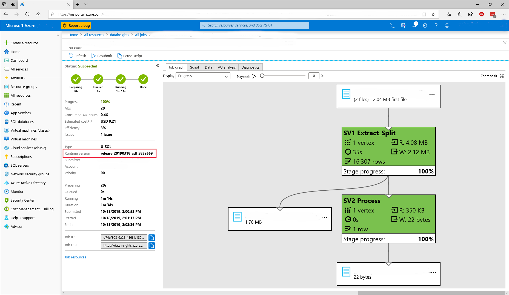

# Learn how to troubleshoot U-SQL runtime failures due to runtime changes

[!INCLUDE [retirement-flag](includes/retirement-flag.md)]

The Azure Data Lake U-SQL runtime, including the compiler, optimizer, and job manager, is what processes your U-SQL code.

## Choosing your U-SQL runtime version

When you submit U-SQL jobs from either Visual Studio, the ADL SDK or the Azure Data Lake Analytics portal, your job will use the currently available default runtime. New versions of the U-SQL runtime are released regularly and include both minor updates and security fixes.

You can also choose a custom runtime version; either because you want to try out a new update, need to stay on an older version of a runtime, or were provided with a hotfix for a reported problem where you can't wait for the regular new update.

> [!CAUTION]
> Choosing a runtime that is different from the default has the potential to break your U-SQL jobs. Use these other versions for testing only.

In rare cases, Microsoft Support may pin a different version of a runtime as the default for your account. Ensure that you revert this pin as soon as possible. If you remain pinned to that version, it will expire at some later date.

### Monitoring your jobs U-SQL runtime version

You can see the history of which runtime version your past jobs have used in your account's job history via the Visual Studio's job browser or the Azure portal's job history.

1. In the Azure portal, go to your Data Lake Analytics account.
2. Select **View All Jobs**. A list of all the active and recently finished jobs in the account appears.
3. Optionally, select **Filter** to help you find the jobs by **Time Range**, **Job Name**, and **Author** values.
4. You can see the runtime used in the completed jobs.

The available runtime versions change over time. The default runtime is always called "default" and we keep at least the previous runtime available for some time and make special runtimes available for various reasons. Explicitly named runtimes generally follow the following format (italics are used for variable parts and [] indicates optional parts):

release_YYYYMMDD_adl_buildno[_modifier]

For example, release_20190318_adl_3394512_2 means the second version of the build 3394512 of the runtime release of March 18 2019 and release_20190318_adl_3394512_private means a private build of the same release. Note: The date is related to when the last check-in has been taken for that release and not necessarily the official release date.

## Troubleshooting U-SQL runtime version issues

There are two possible runtime version issues that you may encounter:

1. A script or some user-code is changing behavior from one release to the next. Such breaking changes are normally communicated ahead of time with the publication of release notes. If you encounter such a breaking change, contact Microsoft Support to report this breaking behavior (in case it hasn't been documented yet) and submit your jobs against the older runtime version.

2. You have been using a non-default runtime either explicitly or implicitly when it has been pinned to your account, and that runtime has been removed after some time. If you encounter missing runtimes, upgrade your scripts to run with the current default runtime. If you need more time, contact Microsoft Support

## Known issues

1. Referencing Newtonsoft.Json file version 12.0.3 or onwards in a USQL script will cause the following compilation failure:

    *"We are sorry; jobs running in your Data Lake Analytics account will likely run more slowly or fail to complete. An unexpected problem is preventing us from automatically restoring this functionality to your Azure Data Lake Analytics account. Azure Data Lake engineers have been contacted to investigate."*  

    Where the call stack will contain:  
    `System.IndexOutOfRangeException: Index was outside the bounds of the array.`  
    `at Roslyn.Compilers.MetadataReader.PEFile.CustomAttributeTableReader.get_Item(UInt32 rowId)`  
    `...`

    **Solution**: Use Newtonsoft.Json file v12.0.2 or lower.
2. Customers might see temporary files and folders on their store. Those are produced as part of the normal job execution, but are usually deleted before the customers see them. Under certain circumstances, which are rare and random, they might remain visible. They're eventually deleted, and are never counted as part of user storage, or generate any form of charges whatsoever. Depending on the customers' job logic they might cause issues. For instance, if the job enumerates all files in the folder and then compares file lists, it might fail because of the unexpected temporary files being present. Similarly, if a downstream job enumerates all files from a given folder for further processing, it might also enumerate the temp files.  

    **Solution**: A fix is identified in the runtime where the temp files will be stored in account level temp folder rather than the current output folder. The temp files will be written in this new temp folder and will be deleted at the end the job execution.  
    Since this fix is handling the customer data, it's important to have this fix well validated within MSFT before it's released. It's expected to have this fix available as beta runtime in the middle of year 2021 and as default runtime in the second half of year 2021. 

## See also

- [Azure Data Lake Analytics overview](data-lake-analytics-overview.md)
- [Manage Azure Data Lake Analytics using Azure portal](data-lake-analytics-manage-use-portal.md)
- [Monitor jobs in Azure Data Lake Analytics using the Azure portal](data-lake-analytics-monitor-and-troubleshoot-jobs-tutorial.md)
