# Access control in Azure Data Lake Store

Azure Data Lake Store implements an access control model that derives from HDFS, which in turn derives from the POSIX access control model. This article summarizes the basics of the access control model for Data Lake Store. To learn more about the HDFS access control model, see [HDFS Permissions Guide](https://hadoop.apache.org/docs/current/hadoop-project-dist/hadoop-hdfs/HdfsPermissionsGuide.html).

## Access control lists on files and folders

There are two kinds of access control lists (ACLs), **Access ACLs** and **Default ACLs**.

* **Access ACLs**: These control access to an object. Files and folders both have Access ACLs.

* **Default ACLs**: A "template" of ACLs associated with a folder that determine the Access ACLs for any child items that are created under that folder. Files do not have Default ACLs.

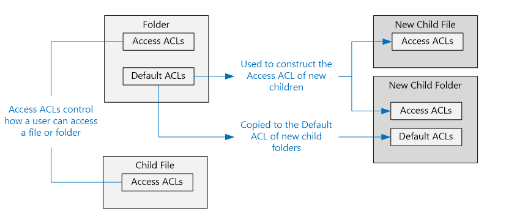

Both Access ACLs and Default ACLs have the same structure.

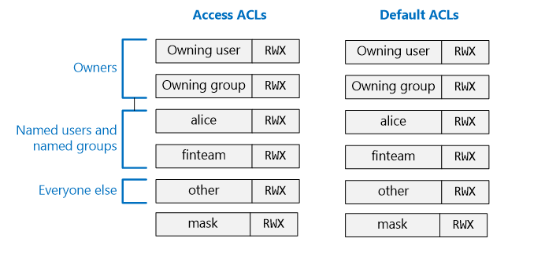

> [!NOTE]
> Changing the Default ACL on a parent does not affect the Access ACL or Default ACL of child items that already exist.
>
>

## Users and identities

Every file and folder has distinct permissions for these identities:

* The owning user of the file
* The owning group
* Named users
* Named groups
* All other users

The identities of users and groups are Azure Active Directory (Azure AD) identities. So unless otherwise noted, a "user," in the context of Data Lake Store, can either mean an Azure AD user or an Azure AD security group.

## Permissions

The permissions on a filesystem object are **Read**, **Write**, and **Execute**, and they can be used on files and folders as shown in the following table:

|            |    File     |   Folder |
|------------|-------------|----------|
| **Read (R)** | Can read the contents of a file | Requires **Read** and **Execute** to list the contents of the folder|
| **Write (W)** | Can write or append to a file | Requires **Write** and **Execute** to create child items in a folder |
| **Execute (X)** | Does not mean anything in the context of Data Lake Store | Required to traverse the child items of a folder |

### Short forms for permissions

**RWX** is used to indicate **Read + Write + Execute**. A more condensed numeric form exists in which **Read=4**, **Write=2**, and **Execute=1**, the sum of which represents the permissions. Following are some examples.

| Numeric form | Short form |      What it means     |
|--------------|------------|------------------------|
| 7            | RWX        | Read + Write + Execute |
| 5            | R-X        | Read + Execute         |
| 4            | R--        | Read                   |
| 0            | ---        | No permissions         |

### Permissions do not inherit

In the POSIX-style model that's used by Data Lake Store, permissions for an item are stored on the item itself. In other words, permissions for an item cannot be inherited from the parent items.

## Common scenarios related to permissions

Following are some common scenarios to help you understand which permissions are needed to perform certain operations on a Data Lake Store account.

### Permissions needed to read a file

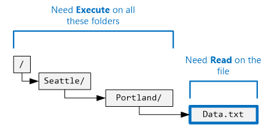

* For the file to be read, the caller needs **Read** permissions.
* For all the folders in the folder structure that contain the file, the caller needs **Execute** permissions.

### Permissions needed to append to a file

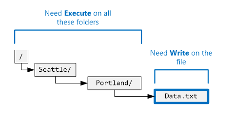

* For the file to be appended to, the caller needs **Write** permissions.
* For all the folders that contain the file, the caller needs **Execute** permissions.

### Permissions needed to delete a file

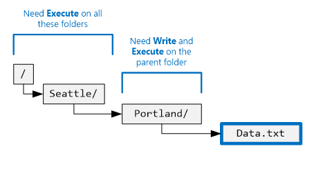

* For the parent folder, the caller needs **Write + Execute** permissions.
* For all the other folders in the file’s path, the caller needs **Execute** permissions.

> [!NOTE]
> Write permissions on the file are not required to delete it as long as the previous two conditions are true.
>
>

### Permissions needed to enumerate a folder

* For the folder to enumerate, the caller needs **Read + Execute** permissions.
* For all the ancestor folders, the caller needs **Execute** permissions.

## Viewing permissions in the Azure portal

From the **Data Explorer** blade of the Data Lake Store account, click **Access** to see the ACLs for a file or a folder. Click **Access** to see the ACLs for the **catalog** folder under the **mydatastore** account.

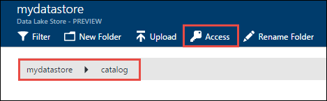

On this blade, the top section shows an overview of the permissions that you have. (In the screenshot, the user is Bob.) Following that, the access permissions are shown. After that, from the **Access** blade, click **Simple View** to see the simpler view.

Click **Advanced View** to see the more advanced view, where the concepts of Default ACLs, mask, and super-user are shown.

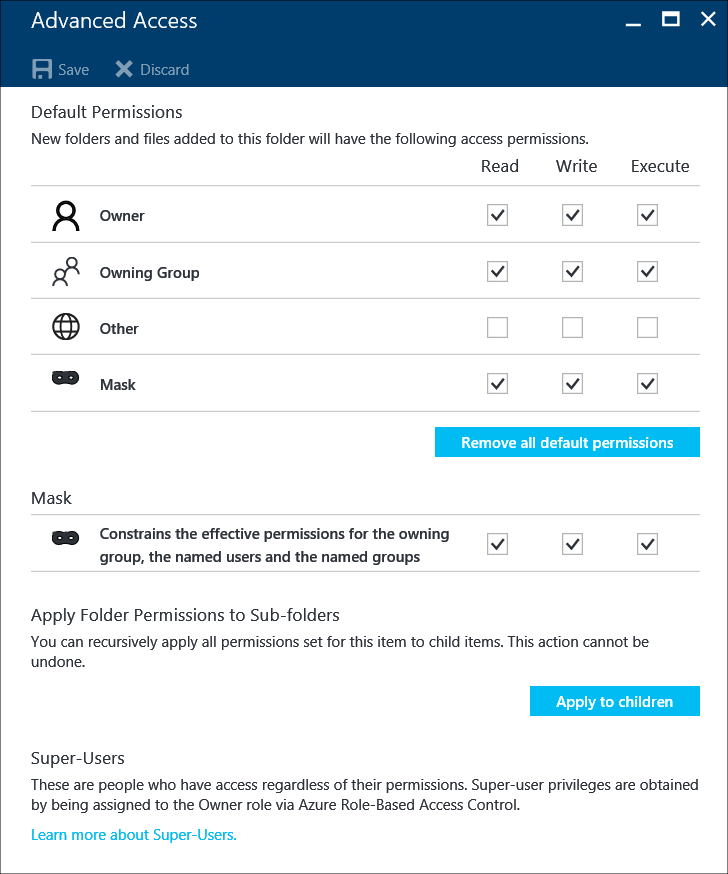

## The super-user

A super-user has the most rights of all the users in the Data Lake Store. A super-user:

* Has RWX Permissions to **all** files and folders.
* Can change the permissions on any file or folder.
* Can change the owning user or owning group of any file or folder.

In Azure, a Data Lake Store account has several Azure roles, including:

* Owners
* Contributors
* Readers

Everyone in the **Owners** role for a Data Lake Store account is automatically a super-user for that account. To learn more, see [Role-based access control](../active-directory/role-based-access-control-configure.md).
If you want to create a custom role-based-access control (RBAC) role that has super-user permissions, it needs to have the following permissions:
- Microsoft.DataLakeStore/accounts/Superuser/action
- Microsoft.Authorization/roleAssignments/write

## The owning user

The user who created the item is automatically the owning user of the item. An owning user can:

* Change the permissions of a file that is owned.
* Change the owning group of a file that is owned, as long as the owning user is also a member of the target group.

> [!NOTE]
> The owning user *cannot* change the owning user of another owned file. Only super-users can change the owning user of a file or folder.
>
>

## The owning group

In the POSIX ACLs, every user is associated with a "primary group." For example, user "alice" might belong to the "finance" group. Alice might also belong to multiple groups, but one group is always designated as her primary group. In POSIX, when Alice creates a file, the owning group of that file is set to her primary group, which in this case is "finance."

When a new filesystem item is created, Data Lake Store assigns a value to the owning group.

* **Case 1**: The root folder "/". This folder is created when a Data Lake Store account is created. In this case, the owning group is set to the user who created the account.
* **Case 2** (Every other case): When a new item is created, the owning group is copied from the parent folder.

The owning group can be changed by:
* Any super-users.
* The owning user, if the owning user is also a member of the target group.

## Access check algorithm

The following illustration represents the access check algorithm for Data Lake Store accounts.

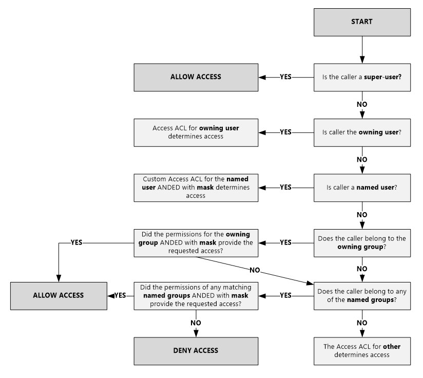

## The mask and "effective permissions"

The **mask** is an RWX value that is used to limit access for **named users**, the **owning group**, and **named groups** when you're performing the access check algorithm. Here are the key concepts for the mask.

* The mask creates "effective permissions." That is, it modifies the permissions at the time of access check.
* The mask can be directly edited by the file owner and any super-users.
* The mask can remove permissions to create the effective permission. The mask *cannot* add permissions to the effective permission.

Let's look at some examples. In the following example, the mask is set to **RWX**, which means that the mask does not remove any permissions. The effective permissions for the named user, owning group, and named group are not altered during the access check.

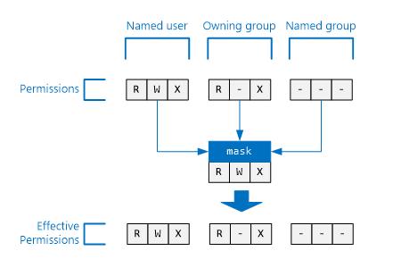

In the following example, the mask is set to **R-X**. This means that it **turns off the Write permissions** for **named user**, **owning group**, and **named group** at the time of access check.

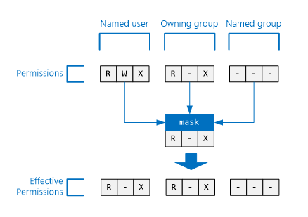

For reference, here is where the mask for a file or folder appears in the Azure portal.

> [!NOTE]
> For a new Data Lake Store account, the mask for the Access ACL and Default ACL of the root folder ("/") defaults to RWX.
>
>

## Permissions on new files and folders

When a new file or folder is created under an existing folder, the Default ACL on the parent folder determines:

- A child folder’s Default ACL and Access ACL.
- A child file's Access ACL (files do not have a Default ACL).

### The Access ACL of a child file or folder

When a child file or folder is created, the parent's Default ACL is copied as the Access ACL of the child file or folder. Also, if **other** user has RWX permissions in the parent's default ACL, it is removed from the child item's Access ACL.

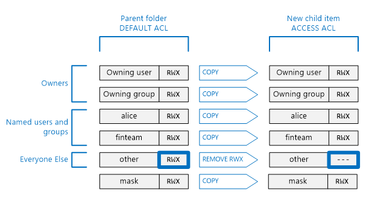

In most scenarios, the previous information is all you need to know about how a child item’s Access ACL is determined. However, if you are familiar with POSIX systems and want to understand in-depth how this transformation is achieved, see the section [Umask’s role in creating the Access ACL for new files and folders](#umasks-role-in-creating-the-access-acl-for-new-files-and-folders) later in this article.

### A child folder's Default ACL

When a child folder is created under a parent folder, the parent folder's Default ACL is copied over as is to the child folder's Default ACL.

## Advanced topics for understanding ACLs in Data Lake Store

Following are some advanced topics to help you understand how ACLs are determined for Data Lake Store files or folders.

### Umask’s role in creating the Access ACL for new files and folders

In a POSIX-compliant system, the general concept is that umask is a 9-bit value on the parent folder that's used to transform the permission for **owning user**, **owning group**, and **other** on the Access ACL of a new child file or folder. The bits of a umask identify which bits to turn off in the child item’s Access ACL. Thus it is used to selectively prevent the propagation of permissions for **owning user**, **owning group**, and **other**.

In an HDFS system, the umask is typically a sitewide configuration option that is controlled by administrators. Data Lake Store uses an **account-wide umask** that cannot be changed. The following table shows the unmask for Data Lake Store.

| User group  | Setting | Effect on new child item's Access ACL |
|------------ |---------|---------------------------------------|
| Owning user | ---     | No effect                             |
| Owning group| ---     | No effect                             |
| Other       | RWX     | Remove Read + Write + Execute         |

The following illustration shows this umask in action. The net effect is to remove **Read + Write + Execute** for **other** user. Because the umask did not specify bits for **owning user** and **owning group**, those permissions are not transformed.

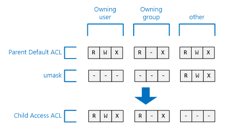

### The sticky bit

The sticky bit is a more advanced feature of a POSIX filesystem. In the context of Data Lake Store, it is unlikely that the sticky bit will be needed.

The following table shows how the sticky bit works in Data Lake Store.

| User group         | File    | Folder |
|--------------------|---------|-------------------------|
| Sticky bit **OFF** | No effect   | No effect.           |
| Sticky bit **ON**  | No effect   | Prevents anyone except **super-users** and the **owning user** of a child item from deleting or renaming that child item.               |

The sticky bit is not shown in the Azure portal.

## Common questions about ACLs in Data Lake Store

Here are some questions that come up often about ACLs in Data Lake Store.

### Do I have to enable support for ACLs?

No. Access control via ACLs is always on for a Data Lake Store account.

### Which permissions are required to recursively delete a folder and its contents?

* The parent folder must have **Write + Execute** permissions.
* The folder to be deleted, and every folder within it, requires **Read + Write + Execute** permissions.

> [!NOTE]
> You do not need Write permissions to delete files in folders. Also, the root folder "/" can **never** be deleted.
>
>

### Who is the owner of a file or folder?

The creator of a file or folder becomes the owner.

### Which group is set as the owning group of a file or folder at creation?

The owning group is copied from the owning group of the parent folder under which the new file or folder is created.

### I am the owning user of a file but I don’t have the RWX permissions I need. What do I do?

The owning user can change the permissions of the file to give themselves any RWX permissions they need.

### When I look at ACLs in the Azure portal I see user names but through APIs, I see GUIDs, why is that?

Entries in the ACLs are stored as GUIDs that correspond to users in Azure AD. The APIs return the GUIDs as is. The Azure portal tries to make ACLs easier to use by translating the GUIDs into friendly names when possible.

### Why do I sometimes see GUIDs in the ACLs when I'm using the Azure portal?

A GUID is shown when the user doesn't exist in Azure AD anymore. Usually this happens when the user has left the company or if their account has been deleted in Azure AD.

### Does Data Lake Store support inheritance of ACLs?

No.

### What is the difference between mask and umask?

| mask | umask|
|------|------|
| The **mask** property is available on every file and folder. | The **umask** is a property of the Data Lake Store account. So there is only a single umask in the Data Lake Store.    |
| The mask property on a file or folder can be altered by the owning user or owning group of a file or a super-user. | The umask property cannot be modified by any user, even a super-user. It is an unchangeable, constant value.|
| The mask property is used during the access check algorithm at runtime to determine whether a user has the right to perform on operation on a file or folder. The role of the mask is to create "effective permissions" at the time of access check. | The umask is not used during access check at all. The umask is used to determine the Access ACL of new child items of a folder. |
| The mask is a 3-bit RWX value that applies to named user, named group, and owning user at the time of access check.| The umask is a 9-bit value that applies to the owning user, owning group, and **other** of a new child.|

### Where can I learn more about POSIX access control model?

* [POSIX Access Control Lists on Linux](http://www.vanemery.com/Linux/ACL/POSIX_ACL_on_Linux.html)

* [HDFS permission guide](http://hadoop.apache.org/docs/current/hadoop-project-dist/hadoop-hdfs/HdfsPermissionsGuide.html)

* [POSIX FAQ](http://www.opengroup.org/austin/papers/posix_faq.html)

* [POSIX 1003.1 2008](http://standards.ieee.org/findstds/standard/1003.1-2008.html)

* [POSIX 1003.1 2013](http://pubs.opengroup.org/onlinepubs/9699919799.2013edition/)

* [POSIX 1003.1 2016](http://pubs.opengroup.org/onlinepubs/9699919799.2016edition/)

* [POSIX ACL on Ubuntu](https://help.ubuntu.com/community/FilePermissionsACLs)

* [ACL using access control lists on Linux](http://bencane.com/2012/05/27/acl-using-access-control-lists-on-linux/)

## See also

* [Overview of Azure Data Lake Store](data-lake-store-overview.md)
