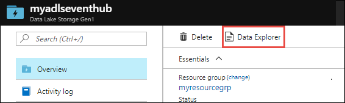
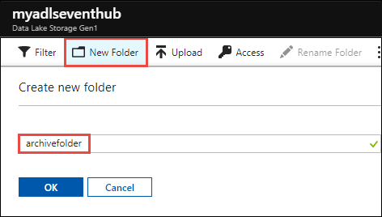
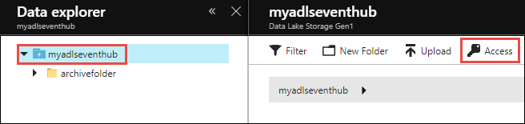
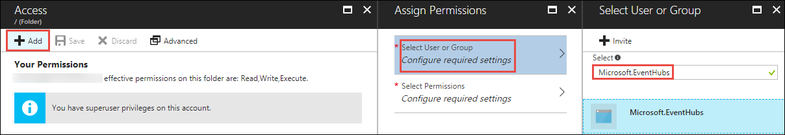
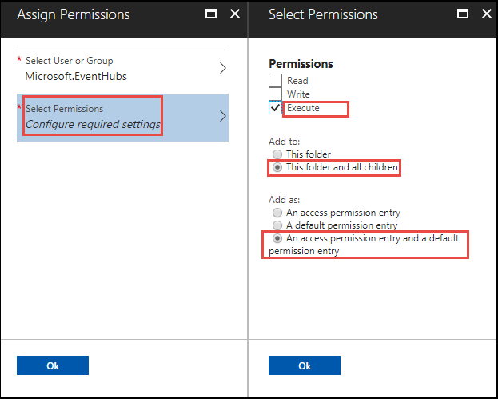
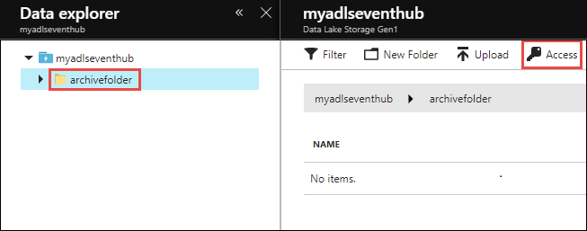
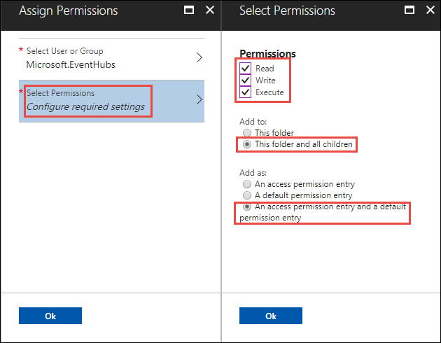
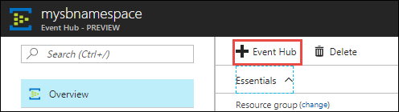
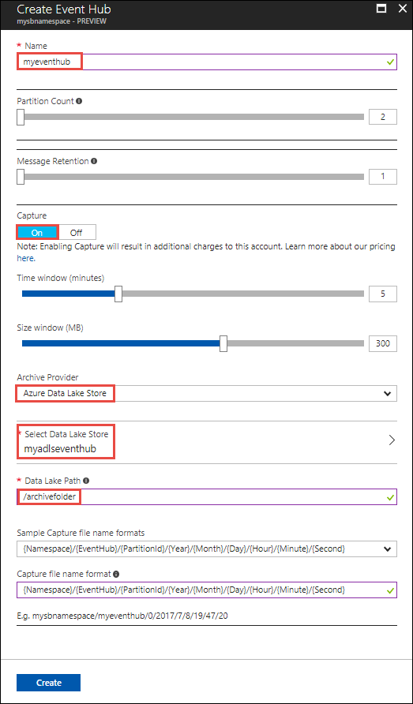
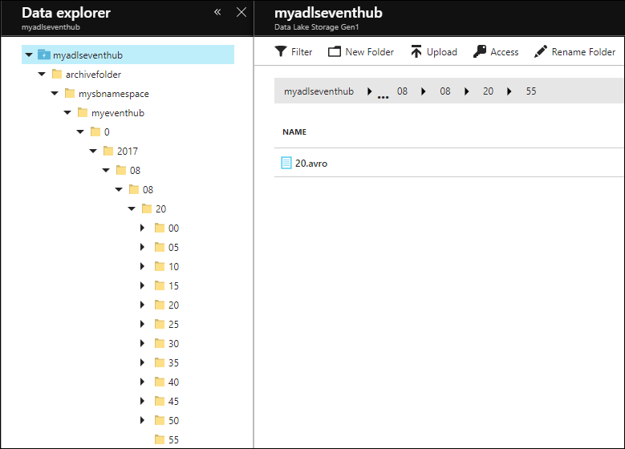

# Use Azure Data Lake Storage Gen1 to capture data from Event Hubs

Learn how to use Azure Data Lake Storage Gen1 to capture data received by Azure Event Hubs.

## Prerequisites

* **An Azure subscription**. See [Get Azure free trial](https://azure.microsoft.com/pricing/free-trial/).

* **An Azure Data Lake Storage Gen1 account**. For instructions on how to create one, see [Get started with Azure Data Lake Storage Gen1](data-lake-store-get-started-portal.md).

*  **An Event Hubs namespace**. For instructions, see [Create an Event Hubs namespace](../event-hubs/event-hubs-create.md#create-an-event-hubs-namespace). Make sure the Data Lake Storage Gen1 account and the Event Hubs namespace are in the same Azure subscription.

## Assign permissions to Event Hubs

In this section, you create a folder within the account where you want to capture the data from Event Hubs. You also assign permissions to Event Hubs so that it can write data into a Data Lake Storage Gen1 account. 

1. Open the Data Lake Storage Gen1 account where you want to capture data from Event Hubs and then click on **Data Explorer**.

    

1.  Click **New Folder** and then enter a name for folder where you want to capture the data.

    

1. Assign permissions at the root of Data Lake Storage Gen1. 

    a. Click **Data Explorer**, select the root of the Data Lake Storage Gen1 account, and then click **Access**.

    

    b. Under **Access**, click **Add**, click **Select User or Group**, and then search for `Microsoft.EventHubs`. 

    
    
    Click **Select**.

    c. Under **Assign Permissions**, click **Select Permissions**. Set **Permissions** to **Execute**. Set **Add to** to **This folder and all children**. Set **Add as** to **An access permission entry and a default permission entry**.

    > [!IMPORTANT]
    > When creating a new folder hierarchy for capturing data received by Azure Event Hubs, this is an easy way to ensure access to the destination folder.  However, adding permissions to all children of a top level folder with many child files and folders may take a long time.  If your root folder contains a large number of files and folders, it may be faster to add **Execute** permissions for `Microsoft.EventHubs` individually to each folder in the path to your final destination folder. 

    

    Click **OK**.

1. Assign permissions for the folder under the Data Lake Storage Gen1 account where you want to capture data.

    a. Click **Data Explorer**, select the folder in the Data Lake Storage Gen1 account, and then click **Access**.

    

    b. Under **Access**, click **Add**, click **Select User or Group**, and then search for `Microsoft.EventHubs`. 

    
    
    Click **Select**.

    c. Under **Assign Permissions**, click **Select Permissions**. Set **Permissions** to **Read, Write,** and **Execute**. Set **Add to** to **This folder and all children**. Finally, set **Add as** to **An access permission entry and a default permission entry**.

    
    
    Click **OK**. 

## Configure Event Hubs to capture data to Data Lake Storage Gen1

In this section, you create an Event Hub within an Event Hubs namespace. You also configure the Event Hub to capture data to an Azure Data Lake Storage Gen1 account. This section assumes that you have already created an Event Hubs namespace.

1. From the **Overview** pane of the Event Hubs namespace, click **+ Event Hub**.

    

1. Provide the following values to configure Event Hubs to capture data to Data Lake Storage Gen1.

    

    a. Provide a name for the Event Hub.
    
    b. For this tutorial, set **Partition Count** and **Message Retention** to the default values.
    
    c. Set **Capture** to **On**. Set the **Time Window** (how frequently to capture) and **Size Window** (data size to capture). 
    
    d. For **Capture Provider**, select **Azure Data Lake Store** and then select the Data Lake Storage Gen1 account you created earlier. For **Data Lake Path**, enter the name of the folder you created in the Data Lake Storage Gen1 account. You only need to provide the relative path to the folder.

    e. Leave the **Sample capture file name formats** to the default value. This option governs the folder structure that is created under the capture folder.

    f. Click **Create**.

## Test the setup

You can now test the solution by sending data to the Azure Event Hub. Follow the instructions at [Send events to Azure Event Hubs](../event-hubs/event-hubs-dotnet-framework-getstarted-send.md). Once you start sending the data, you see the data reflected in Data Lake Storage Gen1 using the folder structure you specified. For example, you see a folder structure, as shown in the following screenshot, in your Data Lake Storage Gen1 account.

> [!NOTE]
> Even if you do not have messages coming into Event Hubs, Event Hubs writes empty files with just the headers into the Data Lake Storage Gen1 account. The files are written at the same time interval that you provided while creating the Event Hubs.
> 
>

## Analyze data in Data Lake Storage Gen1

Once the data is in Data Lake Storage Gen1, you can run analytical jobs to process and crunch the data. See [USQL Avro Example](https://github.com/Azure/usql/tree/master/Examples/AvroExamples) on how to do this using Azure Data Lake Analytics.
  

## See also
* [Secure data in Data Lake Storage Gen1](data-lake-store-secure-data.md)
* [Copy data from Azure Storage Blobs to Data Lake Storage Gen1](data-lake-store-copy-data-azure-storage-blob.md)
