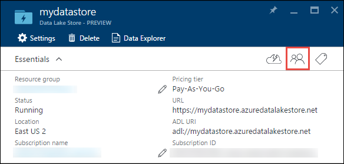
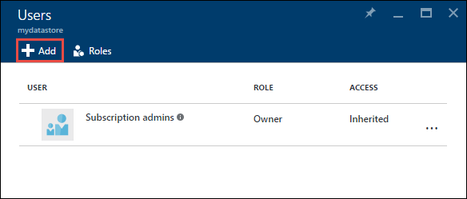
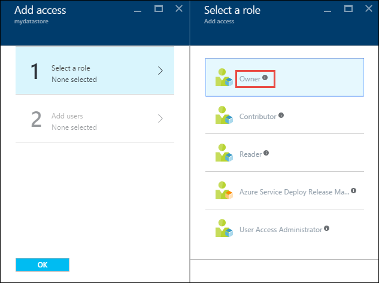
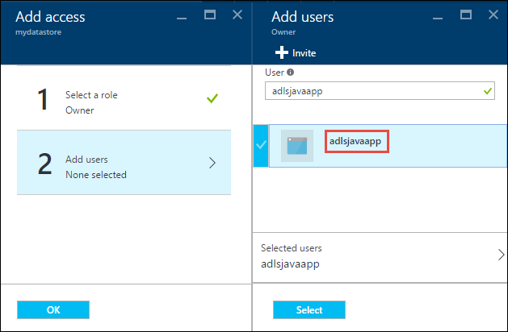

<properties
   pageTitle="Authenticate with Data Lake Store using Active Directory | Azure"
   description="Learn how to authenticate with Data Lake Store using Active Directory"
   services="data-lake-store"
   documentationCenter=""
   authors="nitinme"
   manager="jhubbard"
   editor="cgronlun"/>

<tags
   ms.service="data-lake-store"
   ms.devlang="na"
   ms.topic="article"
   ms.tgt_pltfrm="na"
   ms.workload="big-data"
   ms.date="09/15/2016"
   ms.author="nitinme"/>

# Authenticate with Data Lake Store using Azure Active Directory

Azure Data Lake Store uses Azure Active Directory for authentication. This article provides instructions on how to use client keys associated with an Azure Active Directory Web application to authenticate with Azure Data Lake Store.

## Prerequisites

* An Azure subscription. See [Get Azure free trial](https://azure.microsoft.com/pricing/free-trial/).

## Authenticate using Azure Active Directory client keys

In this section, we use client keys to authenticate using Azure Active Directory. Using client keys for authentication is a 3-step process.

1. Create an Azure Active Directory identity
2. Retrieve the client id, authentication key, and OAuth token for the identity
3. Assign the identity to the Azure Data Lake Store account

### Step 1: Create an Azure Active Directory identity

1. Log in to your Azure Account through the [classic portal](https://manage.windowsazure.com/).

2. Select **Active Directory** from the left pane.

     
     
3. Select the Active Directory that you want to use for creating the new application. If you have more than one Active Directory, you usually want to create the application in the directory where your subscription resides. You can only grant access to resource in your subscription for applications in the same directory as your subscription.  

     
    
    
3. To view the applications in your directory, click on **Applications**.

     

4. If you haven't created an application in that directory before you should see something similar to following image. Click on **ADD AN APPLICATION**

     

     Or, click **Add** in the bottom pane.

     

6. Provide a name for the application and select the type of application you want to create. For this tutorial, create a **WEB APPLICATION AND/OR WEB API** and click the next button. If you select **NATIVE CLIENT APPLICATION**, the remaining steps of this article will not match your experience.

     

7. Fill in the properties for your app. For **SIGN-ON URL**, provide the URI to a web site that describes your application. The existence of the web site is not validated. 
For **APP ID URI**, provide the URI that identifies your application.

     

	Click the check mark to complete the wizard and create the application.

### Step 2: Get client id, authentication key, and token endpoint

When programmatically logging in, you need the id for your application. If the application runs under its own credentials, you will also need an authentication key.

1. Click on the **Configure** tab to configure your application's password.

     

2. Copy the **CLIENT ID**.
  
     

3. If the application will run under its own credentials, scroll down to the **Keys** section and select how long you would like your password to be valid.

     

4. Select **Save** to create your key.

    

    The saved key is displayed and you can copy it. You will not be able to retrieve the key later so must copy it now.

    

5. Retrieve the token endpoint by selecting **View endpoints** at the bottom of the screen and retrieving the value for **OAuth 2.0 Token Endpoint** field, as shown below.  

	

### Step 3: Assign the identity to the Azure Data Lake Store account

1. Sign on to the new [Azure Portal](https://portal.azure.com) and open the Azure Data Lake Store account that you want to associate with the Azure Active Directory application you created earlier.

2. From the Data Lake Store blade, click the **Access** icon.

	

3. From the **Users** blade, click **Add**.

	

4. From the **Add Access** blade, click **Select a role**, and then select the **Owner** role.

	

5. In the **Add users** blade, search for the Azure Active Directory application you created earlier, select the application, and then click **Select**. Click **OK** to save the changes.

	

## Sample applications

Once you have set up your Azure Active Directory application and associated it with your Azure Data Lake Store account, you can write an application that retrieves the Azure Active Directory token to authenticate with Data Lake Store. Following are some examples on how to achieve this.

* [Get started with Azure Data Lake Store using Java SDK](data-lake-store-get-started-java-sdk.md)

## Next steps

- [Secure data in Data Lake Store](data-lake-store-secure-data.md)
- [Use Azure Data Lake Analytics with Data Lake Store](../data-lake-analytics/data-lake-analytics-get-started-portal.md)
- [Use Azure HDInsight with Data Lake Store](data-lake-store-hdinsight-hadoop-use-portal.md)
