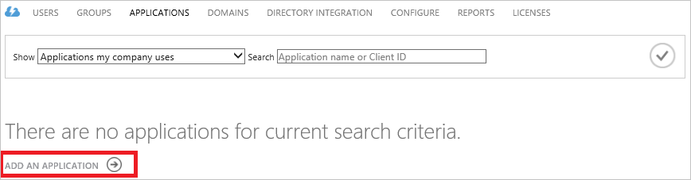
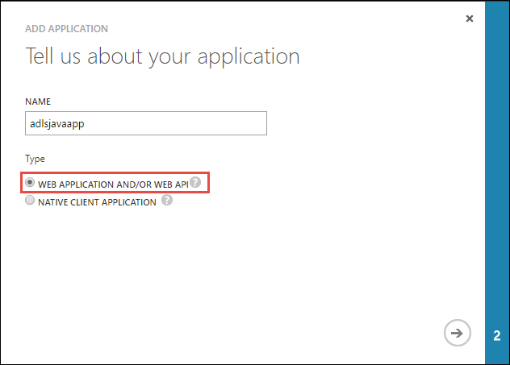
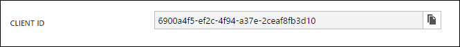
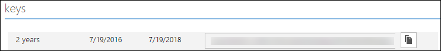
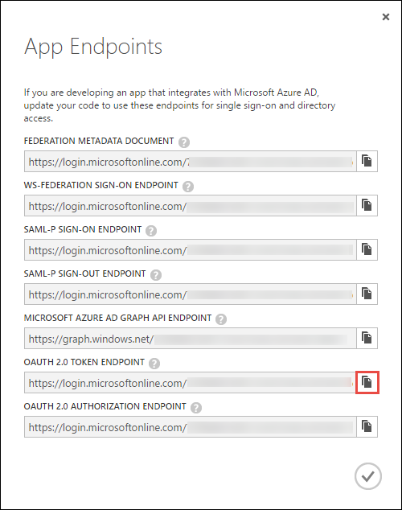

# Service-to-service authentication with Data Lake Store using Azure Active Directory
> [!div class="op_single_selector"]
> * [Service-to-service authentication](data-lake-store-authenticate-using-active-directory.md)
> * [End-user authentication](data-lake-store-end-user-authenticate-using-active-directory.md)
> 
> 

Azure Data Lake Store uses Azure Active Directory for authentication. Before authoring an application that works with Azure Data Lake Store or Azure Data Lake Analytics, you must first decide how you would like to authenticate your application with Azure Active Directory (Azure AD). The two main options available are:

* End-user authentication 
* Service-to-service authentication (this article) 

Both these options result in your application being provided with an OAuth 2.0 token, which gets attached to each request made to Azure Data Lake Store or Azure Data Lake Analytics.

This article talks about how create an Azure AD web application for service-to-service authentication. For instructions on Azure AD application configuration for end-user authentication see [End-user authentication with Data Lake Store using Azure Active Directory](data-lake-store-end-user-authenticate-using-active-directory.md).

## Prerequisites
* An Azure subscription. See [Get Azure free trial](https://azure.microsoft.com/pricing/free-trial/).

## Create an Active Directory application
In this section we learn about how to create and configure an Azure AD web application for service-to-service authentication with Azure Data Lake Store using Azure Active Directory. Note that creating an "Active Directory Application" creates a service principal for you, it does not actually create an app or any code.

### Step 1: Create an Azure Active Directory application
1. Log in to your Azure Account through the [classic portal](https://manage.windowsazure.com/).
2. Select **Active Directory** from the left pane.
   
     
3. Select the Active Directory that you want to use for creating the new application. If you have more than one Active Directory, you usually want to create the application in the directory where your subscription resides. You can only grant access to resource in your subscription for applications in the same directory as your subscription.  
   
     
4. To view the applications in your directory, click on **Applications**.
   
     
5. If you haven't created an application in that directory before, you should see something similar to following image. Click on **ADD AN APPLICATION**
   
     
   
     Or, click **Add** in the bottom pane.
   
     
6. Provide a name for the application and select the type of application you want to create. For this tutorial, create a **WEB APPLICATION AND/OR WEB API** and click the next button.
   
     

	> [!TIP]
	> Provide a name for the application that will be easier to search for. Later in this tutorial you will search for this application and assign it to a Data Lake Store account.
	> 
	> 

7. Fill in the properties for your app. For **SIGN-ON URL**, provide the URI to a web site that describes your application. The existence of the web site is not validated. 
   For **APP ID URI**, provide the URI that identifies your application.
   
     
   
    Click the check mark to complete the wizard and create the application.

### Step 2: Get client id, client secret, and token endpoint
When programmatically logging in, you need the id for your application. If the application runs under its own credentials, you will also need an authentication key.

1. Click on the **Configure** tab to configure your application's password.
   
     
2. Copy the **CLIENT ID**.
   
     
3. If the application will run under its own credentials, scroll down to the **Keys** section and select how long you would like your password to be valid.
   
     
4. Select **Save** to create your key.
   
    
   
    The saved key is displayed and you can copy it. You will not be able to retrieve the key later so must copy it now.
   
    
5. Retrieve the token endpoint by selecting **View endpoints** at the bottom of the screen and retrieving the value for **OAuth 2.0 Token Endpoint** field, as shown below.  
   
    

#### Note down the following properties that you will need for the next steps:
1. Name of Web Application ID created in step 1.6 above
2. The client ID retrieved in step 2.2 above
3. The key created in step 2.4 above
4. The Tenant ID retrieved in step 2.5 above

### Step 3: Assign the Azure AD application to the Azure Data Lake Store account file or folder (only for service-to-service authentication)
1. Sign on to the new [Azure portal](https://portal.azure.com) and open the Azure Data Lake Store account that you want to associate with the Azure Active Directory application you created earlier.
2. In your Data Lake Store account blade, click **Data Explorer**.
   
    
3. In the **Data Explorer** blade, click the file or folder for which you want to provide access to the Azure AD application, and then click **Access**. To configure access to a file, you must click **Access** from the **File Preview** blade.
   
    
4. The **Access** blade lists the standard access and custom access already assigned to the root. Click the **Add** icon to add custom-level ACLs.
   
    
5. Click the **Add** icon to open the **Add Custom Access** blade. In this blade, click **Select User or Group**, and then in **Select User or Group** blade, look for the Azure Active Directory application you created earlier. If you have a lot of groups to search from, use the text box at the top to filter on the group name. Click the group you want to add and then click **Select**.
   
    
6. Click **Select Permissions**, select the permissions and whether you want to assign the permissions as a default ACL, access ACL, or both. Click **OK**.
   
    
   
    For more information about permissions in Data Lake Store, and Default/Access ACLs, see [Access Control in Data Lake Store](data-lake-store-access-control.md).
7. In the **Add Custom Access** blade, click **OK**. The newly added group, with the associated permissions, will now be listed in the **Access** blade.
   
        

## Next steps
In this article you created an Azure AD web application and gathered the information you need in your client applications that you author using .NET SDK, Java SDK, etc. You can now proceed to the following articles that talk about how to use the Azure AD web application to first authenticate with Data Lake Store and then perform other operations on the store.

* [Get started with Azure Data Lake Store using .NET SDK](data-lake-store-get-started-net-sdk.md)
* [Get started with Azure Data Lake Store using Java SDK](data-lake-store-get-started-java-sdk.md)

This article walked you through the basic steps needed to get a user principal up and running for your application. You can look at the following articles to get further information:
* [Use PowerShell to create service principal](https://docs.microsoft.com/en-us/azure/azure-resource-manager/resource-group-authenticate-service-principal)
* [Use certificate authentication for service principal authentication](https://docs.microsoft.com/en-us/azure/azure-resource-manager/resource-group-authenticate-service-principal#create-service-principal-with-certificate)
* [Other methods to authenticate to Azure AD](https://docs.microsoft.com/en-us/azure/active-directory/active-directory-authentication-scenarios)

