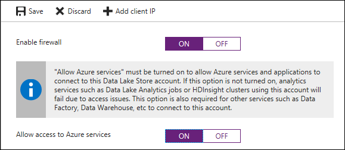

# Best practices for using Azure Data Lake Storage Gen1

[!INCLUDE [data-lake-storage-gen1-rename-note.md](../../includes/data-lake-storage-gen1-rename-note.md)]

In this article, you learn about best practices and considerations for working with Azure Data Lake Storage Gen1. This article provides information around security, performance, resiliency, and monitoring for Data Lake Storage Gen1. Before Data Lake Storage Gen1, working with truly big data in services like Azure HDInsight was complex. You had to shard data across multiple Blob storage accounts so that petabyte storage and optimal performance at that scale could be achieved. With Data Lake Storage Gen1, most of the hard limits for size and performance are removed. However, there are still some considerations that this article covers so that you can get the best performance with Data Lake Storage Gen1.

## Security considerations

Azure Data Lake Storage Gen1 offers POSIX access controls and detailed auditing for Microsoft Entra users, groups, and service principals. These access controls can be set to existing files and folders. The access controls can also be used to create defaults that can be applied to new files or folders. When permissions are set to existing folders and child objects, the permissions need to be propagated recursively on each object. If there are large number of files, propagating the permissions can take a long time. The time taken can range between 30-50 objects processed per second. Hence, plan the folder structure and user groups appropriately. Otherwise, it can cause unanticipated delays and issues when you work with your data.

Assume you have a folder with 100,000 child objects. If you take the lower bound of 30 objects processed per second, to update the permission for the whole folder could take an hour. More details on Data Lake Storage Gen1 ACLs are available at [Access control in Azure Data Lake Storage Gen1](data-lake-store-access-control.md). For improved performance on assigning ACLs recursively, you can use the Azure Data Lake Command-Line Tool. The tool creates multiple threads and recursive navigation logic to quickly apply ACLs to millions of files. The tool is available for Linux and Windows, and the [documentation](https://github.com/Azure/data-lake-adlstool) and [downloads](https://aka.ms/adlstool-download) for this tool can be found on GitHub. These same performance improvements can be enabled by your own tools written with the Data Lake Storage Gen1 [.NET](data-lake-store-data-operations-net-sdk.md) and [Java](data-lake-store-get-started-java-sdk.md) SDKs.

### Use security groups versus individual users

When working with big data in Data Lake Storage Gen1, most likely a service principal is used to allow services such as Azure HDInsight to work with the data. However, there might be cases where individual users need access to the data as well. In such cases, you must use Microsoft Entra ID [security groups](data-lake-store-secure-data.md#create-security-groups-in-azure-active-directory) instead of assigning individual users to folders and files.

Once a security group is assigned permissions, adding or removing users from the group doesn’t require any updates to Data Lake Storage Gen1. This also helps ensure you don't exceed the limit of [32 Access and Default ACLs](../azure-resource-manager/management/azure-subscription-service-limits.md#data-lake-storage-limits) (this includes the four POSIX-style ACLs that are always associated with every file and folder: [the owning user](data-lake-store-access-control.md#the-owning-user), [the owning group](data-lake-store-access-control.md#the-owning-group), [the mask](data-lake-store-access-control.md#the-mask), and other).

### Security for groups

As discussed, when users need access to Data Lake Storage Gen1, it’s best to use Microsoft Entra security groups. Some recommended groups to start with might be **ReadOnlyUsers**, **WriteAccessUsers**, and **FullAccessUsers** for the root of the account, and even separate ones for key subfolders. If there are any other anticipated groups of users that might be added later, but have not been identified yet, you might consider creating dummy security groups that have access to certain folders. Using security group ensures that later you do not need a long processing time for assigning new permissions to thousands of files.

### Security for service principals

Microsoft Entra service principals are typically used by services like Azure HDInsight to access data in Data Lake Storage Gen1. Depending on the access requirements across multiple workloads, there might be some considerations to ensure security inside and outside of the organization. For many customers, a single Microsoft Entra service principal might be adequate, and it can have full permissions at the root of the Data Lake Storage Gen1 account. Other customers might require multiple clusters with different service principals where one cluster has full access to the data, and another cluster with only read access. As with the security groups, you might consider making a service principal for each anticipated scenario (read, write, full) once a Data Lake Storage Gen1 account is created.

### Enable the Data Lake Storage Gen1 firewall with Azure service access

Data Lake Storage Gen1 supports the option of turning on a firewall and limiting access only to Azure services, which is recommended for a smaller attack vector from outside intrusions. Firewall can be enabled on the Data Lake Storage Gen1 account in the Azure portal via the **Firewall** > **Enable Firewall (ON)** > **Allow access to Azure services** options.



Once firewall is enabled, only Azure services such as HDInsight, Data Factory, Azure Synapse Analytics, etc. have access to Data Lake Storage Gen1. Due to the internal network address translation used by Azure, the Data Lake Storage Gen1 firewall does not support restricting specific services by IP and is only intended for restrictions of endpoints outside of Azure, such as on-premises.

## Performance and scale considerations

One of the most powerful features of Data Lake Storage Gen1 is that it removes the hard limits on data throughput. Removing the limits enables customers to grow their data size and accompanied performance requirements without needing to shard the data. One of the most important considerations for optimizing Data Lake Storage Gen1 performance is that it performs the best when given parallelism.

### Improve throughput with parallelism

Consider giving 8-12 threads per core for the most optimal read/write throughput. This is due to blocking reads/writes on a single thread, and more threads can allow higher concurrency on the VM. To ensure that levels are healthy and parallelism can be increased, be sure to monitor the VM’s CPU utilization.

### Avoid small file sizes

POSIX permissions and auditing in Data Lake Storage Gen1 comes with an overhead that becomes apparent when working with numerous small files. As a best practice, you must batch your data into larger files versus writing thousands or millions of small files to Data Lake Storage Gen1. Avoiding small file sizes can have multiple benefits, such as:

* Lowering the authentication checks across multiple files
* Reduced open file connections
* Faster copying/replication
* Fewer files to process when updating Data Lake Storage Gen1 POSIX permissions

Depending on what services and workloads are using the data, a good size to consider for files is 256 MB or greater. If the file sizes cannot be batched when landing in Data Lake Storage Gen1, you can have a separate compaction job that combines these files into larger ones. For more information and recommendation on file sizes and organizing the data in Data Lake Storage Gen1, see [Structure your data set](data-lake-store-performance-tuning-guidance.md#structure-your-data-set).

### Large file sizes and potential performance impact

Although Data Lake Storage Gen1 supports large files up to petabytes in size, for optimal performance and depending on the process reading the data, it might not be ideal to go above 2 GB on average. For example, when using **Distcp** to copy data between locations or different storage accounts, files are the finest level of granularity used to determine map tasks. So, if you are copying 10 files that are 1 TB each, at most 10 mappers are allocated. Also, if you have lots of files with mappers assigned, initially the mappers work in parallel to move large files. However, as the job starts to wind down only a few mappers remain allocated and you can be stuck with a single mapper assigned to a large file. Microsoft has submitted improvements to Distcp to address this issue in future Hadoop versions.

Another example to consider is when using Azure Data Lake Analytics with Data Lake Storage Gen1. Depending on the processing done by the extractor, some files that cannot be split (for example, XML, JSON) could suffer in performance when greater than 2 GB. In cases where files can be split by an extractor (for example, CSV), large files are preferred.

### Capacity plan for your workload

Azure Data Lake Storage Gen1 removes the hard IO throttling limits that are placed on Blob storage accounts. However, there are still soft limits that need to be considered. The default ingress/egress throttling limits meet the needs of most scenarios. If your workload needs to have the limits increased, work with Microsoft support. Also, look at the limits during the proof-of-concept stage so that IO throttling limits are not hit during production. If that happens, it might require waiting for a manual increase from the Microsoft engineering team. If IO throttling occurs, Azure Data Lake Storage Gen1 returns an error code of 429, and ideally should be retried with an appropriate exponential backoff policy.

### Optimize “writes” with the Data Lake Storage Gen1 driver buffer

To optimize performance and reduce IOPS when writing to Data Lake Storage Gen1 from Hadoop, perform write operations as close to the Data Lake Storage Gen1 driver buffer size as possible. Try not to exceed the buffer size before flushing, such as when streaming using Apache Storm or Spark streaming workloads. When writing to Data Lake Storage Gen1 from HDInsight/Hadoop, it is important to know that Data Lake Storage Gen1 has a driver with a 4-MB buffer. Like many file system drivers, this buffer can be manually flushed before reaching the 4-MB size. If not, it is immediately flushed to storage if the next write exceeds the buffer’s maximum size. Where possible, you must avoid an overrun or a significant underrun of the buffer when syncing/flushing policy by count or time window.

## Resiliency considerations

When architecting a system with Data Lake Storage Gen1 or any cloud service, you must consider your availability requirements and how to respond to potential interruptions in the service. An issue could be localized to the specific instance or even region-wide, so having a plan for both is important. Depending on the **recovery time objective** and the **recovery point objective** SLAs for your workload, you might choose a more or less aggressive strategy for high availability and disaster recovery.

### High availability and disaster recovery

High availability (HA) and disaster recovery (DR) can sometimes be combined together, although each has a slightly different strategy, especially when it comes to data. Data Lake Storage Gen1 already handles 3x replication under the hood to guard against localized hardware failures. However, since replication across regions is not built in, you must manage this yourself. When building a plan for HA, in the event of a service interruption the workload needs access to the latest data as quickly as possible by switching over to a separately replicated instance locally or in a new region.

In a DR strategy, to prepare for the unlikely event of a catastrophic failure of a region, it is also important to have data replicated to a different region. This data might initially be the same as the replicated HA data. However, you must also consider your requirements for edge cases such as data corruption where you may want to create periodic snapshots to fall back to. Depending on the importance and size of the data, consider rolling delta snapshots of 1-, 6-, and 24-hour periods on the local and/or secondary store, according to risk tolerances.

For data resiliency with Data Lake Storage Gen1, it is recommended to geo-replicate your data to a separate region with a frequency that satisfies your HA/DR requirements, ideally every hour. This frequency of replication minimizes massive data movements that can have competing throughput needs with the main system and a better recovery point objective (RPO). Additionally, you should consider ways for the application using Data Lake Storage Gen1 to automatically fail over to the secondary account through monitoring triggers or length of failed attempts, or at least send a notification to admins for manual intervention. Keep in mind that there is tradeoff of failing over versus waiting for a service to come back online. If the data hasn't finished replicating, a failover could cause potential data loss, inconsistency, or complex merging of the data.

Below are the top three recommended options for orchestrating replication between Data Lake Storage Gen1 accounts, and key differences between each of them.

|  |Distcp  |Azure Data Factory  |AdlCopy  |
|---------|---------|---------|---------|
|**Scale limits**     | Bounded by worker nodes        | Limited by Max Cloud Data Movement units        | Bound by Analytics units        |
|**Supports copying deltas**     |   Yes      | No         | No         |
|**Built-in orchestration**     |  No (use Oozie Airflow or cron jobs)       | Yes        | No (Use Azure Automation or Windows Task Scheduler)         |
|**Supported file systems**     | ADL, HDFS, WASB, S3, GS, CFS        |Numerous, see [Connectors](../data-factory/connector-azure-blob-storage.md).         | ADL to ADL, WASB to ADL (same region only)        |
|**OS support**     |Any OS running Hadoop         | N/A          | Windows 10         |

### Use Distcp for data movement between two locations

Short for distributed copy, Distcp is a Linux command-line tool that comes with Hadoop and provides distributed data movement between two locations. The two locations can be Data Lake Storage Gen1, HDFS, WASB, or S3. This tool uses MapReduce jobs on a Hadoop cluster (for example, HDInsight) to scale out on all the nodes. Distcp is considered the fastest way to move big data without special network compression appliances. Distcp also provides an option to only update deltas between two locations, handles automatic retries, as well as dynamic scaling of compute. This approach is incredibly efficient when it comes to replicating things like Hive/Spark tables that can have many large files in a single directory and you only want to copy over the modified data. For these reasons, Distcp is the most recommended tool for copying data between big data stores.

Copy jobs can be triggered by Apache Oozie workflows using frequency or data triggers, as well as Linux cron jobs. For intensive replication jobs, it is recommended to spin up a separate HDInsight Hadoop cluster that can be tuned and scaled specifically for the copy jobs. This ensures that copy jobs do not interfere with critical jobs. If running replication on a wide enough frequency, the cluster can even be taken down between each job. If failing over to secondary region, make sure that another cluster is also spun up in the secondary region to replicate new data back to the primary Data Lake Storage Gen1 account once it comes back up. For examples of using Distcp, see [Use Distcp to copy data between Azure Storage Blobs and Data Lake Storage Gen1](data-lake-store-copy-data-wasb-distcp.md).

### Use Azure Data Factory to schedule copy jobs

Azure Data Factory can also be used to schedule copy jobs using a **Copy Activity**, and can even be set up on a frequency via the **Copy Wizard**. Keep in mind that Azure Data Factory has a limit of cloud data movement units (DMUs), and eventually caps the throughput/compute for large data workloads. Additionally, Azure Data Factory currently does not offer delta updates between Data Lake Storage Gen1 accounts, so folders like Hive tables would require a complete copy to replicate. Refer to the [Copy Activity tuning guide](../data-factory/copy-activity-performance.md) for more information on copying with Data Factory.

### AdlCopy

AdlCopy is a Windows command-line tool that allows you to copy data between two Data Lake Storage Gen1 accounts only within the same region. The AdlCopy tool provides a standalone option or the option to use an Azure Data Lake Analytics account to run your copy job. Though it was originally built for on-demand copies as opposed to a robust replication, it provides another option to do distributed copying across Data Lake Storage Gen1 accounts within the same region. For reliability, it’s recommended to use the premium Data Lake Analytics option for any production workload. The standalone version can return busy responses and has limited scale and monitoring.

Like Distcp, the AdlCopy needs to be orchestrated by something like Azure Automation or Windows Task Scheduler. As with Data Factory, AdlCopy does not support copying only updated files, but recopies and overwrite existing files. For more information and examples of using AdlCopy, see [Copy data from Azure Storage Blobs to Data Lake Storage Gen1](data-lake-store-copy-data-azure-storage-blob.md).

## Monitoring considerations

Data Lake Storage Gen1 provides detailed diagnostic logs and auditing. Data Lake Storage Gen1 provides some basic metrics in the Azure portal under the Data Lake Storage Gen1 account and in Azure Monitor. Availability of Data Lake Storage Gen1 is displayed in the Azure portal. However, this metric is refreshed every seven minutes and cannot be queried through a publicly exposed API. To get the most up-to-date availability of a Data Lake Storage Gen1 account, you must run your own synthetic tests to validate availability. Other metrics such as total storage utilization, read/write requests, and ingress/egress can take up to 24 hours to refresh. So, more up-to-date metrics must be calculated manually through Hadoop command-line tools or aggregating log information. The quickest way to get the most recent storage utilization is running this HDFS command from a Hadoop cluster node (for example, head node):

```console
hdfs dfs -du -s -h adl://<adlsg1_account_name>.azuredatalakestore.net:443/
```

### Export Data Lake Storage Gen1 diagnostics

One of the quickest ways to get access to searchable logs from Data Lake Storage Gen1 is to enable log shipping to **Log Analytics** under the **Diagnostics** blade for the Data Lake Storage Gen1 account. This provides immediate access to incoming logs with time and content filters, along with alerting options (email/webhook) triggered within 15-minute intervals. For instructions, see [Accessing diagnostic logs for Azure Data Lake Storage Gen1](data-lake-store-diagnostic-logs.md).

For more real-time alerting and more control on where to land the logs, consider exporting logs to Azure EventHub where content can be analyzed individually or over a time window in order to submit real-time notifications to a queue. A separate application such as a [Logic App](../connectors/connectors-create-api-azure-event-hubs.md) can then consume and communicate the alerts to the appropriate channel, as well as submit metrics to monitoring tools like NewRelic, Datadog, or AppDynamics. Alternatively, if you are using a third-party tool such as ElasticSearch, you can export the logs to Blob Storage and use the [Azure Logstash plugin](https://github.com/Azure/azure-diagnostics-tools/tree/master/Logstash/logstash-input-azureblob) to consume the data into your Elasticsearch, Kibana, and Logstash (ELK) stack.

### Turn on debug-level logging in HDInsight

If Data Lake Storage Gen1 log shipping is not turned on, Azure HDInsight also provides a way to turn on [client-side logging for Data Lake Storage Gen1](data-lake-store-performance-tuning-mapreduce.md) via log4j. You must set the following property in **Ambari** > **YARN** > **Config** > **Advanced yarn-log4j configurations**:

`log4j.logger.com.microsoft.azure.datalake.store=DEBUG`

Once the property is set and the nodes are restarted, Data Lake Storage Gen1 diagnostics is written to the YARN logs on the nodes (/tmp/\<user\>/yarn.log), and important details like errors or throttling (HTTP 429 error code) can be monitored. This same information can also be monitored in Azure Monitor logs or wherever logs are shipped to in the [Diagnostics](data-lake-store-diagnostic-logs.md) blade of the Data Lake Storage Gen1 account. It is recommended to at least have client-side logging turned on or utilize the log shipping option with Data Lake Storage Gen1 for operational visibility and easier debugging.

### Run synthetic transactions

Currently, the service availability metric for Data Lake Storage Gen1 in the Azure portal has 7-minute refresh window. Also, it cannot be queried using a publicly exposed API. Hence, it is recommended to build a basic application that does synthetic transactions to Data Lake Storage Gen1 that can provide up to the minute availability. An example might be creating a WebJob, Logic App, or Azure Function App to perform a read, create, and update against Data Lake Storage Gen1 and send the results to your monitoring solution. The operations can be done in a temporary folder and then deleted after the test, which might be run every 30-60 seconds, depending on requirements.

## Directory layout considerations

When landing data into a data lake, it’s important to pre-plan the structure of the data so that security, partitioning, and processing can be utilized effectively. Many of the following recommendations can be used whether it’s with Azure Data Lake Storage Gen1, Blob Storage, or HDFS. Every workload has different requirements on how the data is consumed, but below are some common layouts to consider when working with IoT and batch scenarios.

### IoT structure

In IoT workloads, there can be a great deal of data being landed in the data store that spans across numerous products, devices, organizations, and customers. It’s important to pre-plan the directory layout for organization, security, and efficient processing of the data for down-stream consumers. A general template to consider might be the following layout:

```console
{Region}/{SubjectMatter(s)}/{yyyy}/{mm}/{dd}/{hh}/
```

For example, landing telemetry for an airplane engine within the UK might look like the following structure:

```console
UK/Planes/BA1293/Engine1/2017/08/11/12/
```

There's an important reason to put the date at the end of the folder structure. If you want to lock down certain regions or subject matters to users/groups, then you can easily do so with the POSIX permissions. Otherwise, if there was a need to restrict a certain security group to viewing just the UK data or certain planes, with the date structure in front a separate permission would be required for numerous folders under every hour folder. Additionally, having the date structure in front would exponentially increase the number of folders as time went on.

### Batch jobs structure

From a high-level, a commonly used approach in batch processing is to land data in an “in” folder. Then, once the data is processed, put the new data into an “out” folder for downstream processes to consume. This directory structure is seen sometimes for jobs that require processing on individual files and might not require massively parallel processing over large datasets. Like the IoT structure recommended above, a good directory structure has the parent-level folders for things such as region and subject matters (for example, organization, product/producer). This structure helps with securing the data across your organization and better management of the data in your workloads. Furthermore, consider date and time in the structure to allow better organization, filtered searches, security, and automation in the processing. The level of granularity for the date structure is determined by the interval on which the data is uploaded or processed, such as hourly, daily, or even monthly.

Sometimes file processing is unsuccessful due to data corruption or unexpected formats. In such cases, directory structure might benefit from a **/bad** folder to move the files to for further inspection. The batch job might also handle the reporting or notification of these *bad* files for manual intervention. Consider the following template structure:

```console
{Region}/{SubjectMatter(s)}/In/{yyyy}/{mm}/{dd}/{hh}/
{Region}/{SubjectMatter(s)}/Out/{yyyy}/{mm}/{dd}/{hh}/
{Region}/{SubjectMatter(s)}/Bad/{yyyy}/{mm}/{dd}/{hh}/
```

For example, a marketing firm receives daily data extracts of customer updates from their clients in North America. It might look like the following snippet before and after being processed:

```console
NA/Extracts/ACMEPaperCo/In/2017/08/14/updates_08142017.csv
NA/Extracts/ACMEPaperCo/Out/2017/08/14/processed_updates_08142017.csv
```

In the common case of batch data being processed directly into databases such as Hive or traditional SQL databases, there isn’t a need for an **/in** or **/out** folder since the output already goes into a separate folder for the Hive table or external database. For example, daily extracts from customers would land into their respective folders, and orchestration by something like Azure Data Factory, Apache Oozie, or Apache Airflow would trigger a daily Hive or Spark job to process and write the data into a Hive table.

## Next steps

* [Overview of Azure Data Lake Storage Gen1](data-lake-store-overview.md)
* [Access Control in Azure Data Lake Storage Gen1](data-lake-store-access-control.md)
* [Security in Azure Data Lake Storage Gen1](data-lake-store-security-overview.md)
* [Tuning Azure Data Lake Storage Gen1 for performance](data-lake-store-performance-tuning-guidance.md)
* [Performance tuning guidance for using HDInsight Spark with Azure Data Lake Storage Gen1](data-lake-store-performance-tuning-spark.md)
* [Performance tuning guidance for using HDInsight Hive with Azure Data Lake Storage Gen1](data-lake-store-performance-tuning-hive.md)
* [Create HDInsight clusters with Data Lake Storage Gen1](data-lake-store-hdinsight-hadoop-use-portal.md)
