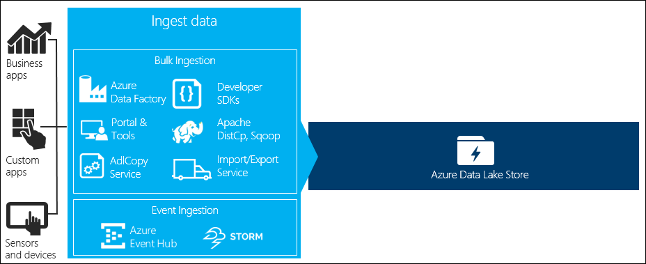
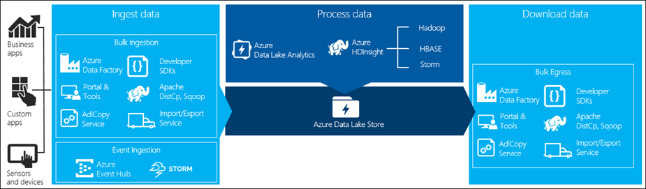
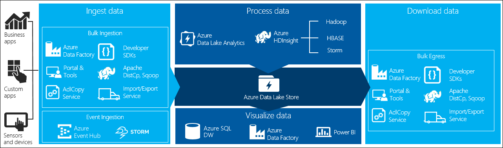

<properties 
   pageTitle="Data scenarios involving Data Lake Store | Microsoft Azure" 
   description="Understand the different scenarios and tools using which data can ingested, processed, downloaded, and visualized in a Data Lake Store" 
   services="data-lake-store" 
   documentationCenter="" 
   authors="nitinme" 
   manager="paulettm" 
   editor="cgronlun"/>
 
<tags
   ms.service="data-lake-store"
   ms.devlang="na"
   ms.topic="article"
   ms.tgt_pltfrm="na"
   ms.workload="big-data" 
   ms.date="03/09/2016"
   ms.author="nitinme"/>

# Data scenarios involving Azure Data Lake Store

There are four key stages in big data processing:

* Ingesting large amounts of data into a data store, at real-time or in batches
* Processing the data
* Downloading the data
* Visualizing the data

In this article, we look at these stages with respect to Azure Data Lake Store to understand the options and tools available to meet your big data needs.

## Ingest data into Data Lake Store

This section highlights the different sources of data and the different ways in which that data can be ingested into a Data Lake Store account.

### Ad hoc data

This represents smaller data sets that are used for prototyping a big data application. There are different ways of ingesting ad hoc data depending on the source of the data.

| Data Source        | Ingest it using                                                                        |
|--------------------|----------------------------------------------------------------------------------------|
| Local computer     | <ul> <li>[Azure Portal](/data-lake-store-get-started-portal.md)</li> <li>[Azure PowerShell](data-lake-store-get-started-powershell.md)</li> <li>[Azure Cross-platform CLI](data-lake-store-get-started-cli.md)</li> <li>[Using Data Lake Tools for Visual Studio](../data-lake-analytics/data-lake-analytics-data-lake-tools-get-started.md#upload-source-data-files) </li></ul> |
| Azure Storage Blob | <ul> <li>[Azure Data Factory](../data-factory/data-factory-azure-datalake-connector.md#sample-copy-data-from-azure-blob-to-azure-data-lake-store)</li> <li>[AdlCopy tool](data-lake-store-copy-data-azure-storage-blob.md)</li>  </ul>                          |

 
### Streamed data

This represents data that can be generated by various sources such as applications, devices, sensors, etc. This data can be ingested into a Data Lake Store by variety tools. These tools will usually capture and process the data on an event-by-event basis in real-time, and then write the events in batches into Data Lake Store so that they can be further processed. 

Following are tools that you can use:
 
* [Azure Stream Analytics] (../stream-analytics-data-lake-output) - Events ingested into Event Hubs can be written to Azure Data Lake using an Azure Data Lake Store output.
* [Azure HDInsight Storm](../hdinsight/hdinsight-storm-write-data-lake-store.md) - You can write data directly to Data Lake Store from the Storm cluster.
* [EventProcessorHost](../event-hubs/event-hubs-csharp-ephcs-getstarted.md#receive-messages-with-eventprocessorhost) – You can receive events from Event Hubs and then write it to Data Lake Store using the [Data Lake Store .NET SDK](data-lake-store-get-started-net-sdk.md).

### Relational data

You can also source data from relational databases. Over a period of time, relational databases collect huge amounts of data which can provide key insights if processed through a big data pipeline. You can use the following tools to move such data into Data Lake Store.

* [Apache Sqoop](data-lake-store-data-transfer-sql-sqoop.md)
* [Azure Data Factory](../data-factory/data-factory-data-movement-activities.md)

### Web server log data (upload using custom applications)

This type of dataset is specifically called out because analysis of web server log data is a common use case for big data applications and requires large volumes of log files to be uploaded to the Data Lake Store. You can use any of the following tools to write your own scripts or applications to upload such data.

* [Azure Cross-platform CLI](data-lake-store-get-started-cli.md)
* [Azure PowerShell](data-lake-store-get-started-powershell.md)
* [Azure Data Lake Store .NET SDK](data-lake-store-get-started-net-sdk.md)
* [Azure Data Factory](../data-factory/data-factory-data-movement-activities.md)

For uploading web server log data, and also for uploading other kinds of data (e.g. social sentiments data), it is a good approach to write your own custom scripts/applications because it gives you the flexibility to include your data uploading component as part of your larger big data application. In some cases this code may take the form of a script or simple command line utility. In other cases, the code may be used to integrate big data processing into a business application or solution.

### Data associated with Azure HDInsight clusters

Most HDInsight cluster types (Hadoop, HBase, Storm) support Data Lake Store as a data storage repository. HDInsight clusters access data from Azure Storage Blobs (WASB). For better performance, you can copy the data from WASB into a Data Lake Store account associated with the cluster. You can use the following tools to copy the data.

* [Apache DistCp](data-lake-store-copy-data-wasb-distcp.md)
* [AdlCopy Service](data-lake-store-copy-data-azure-storage-blob.md)
* [Azure Data Factory](../data-factory/data-factory-azure-datalake-connector.md#sample-copy-data-from-azure-blob-to-azure-data-lake-store)

### Really large datasets

For uploading datasets that range in several terabytes, using the methods described above can sometimes be slow and costly. In such cases, you can use the following options.

* **"Offline" upload of data**. You can use [Azure Import/Export service](../storage/storage-import-export-service.md) to ship hard disk drives with your data to an Azure data center and your data is then uploaded to an Azure Storage Blob. You can then use [Azure Data Factory](../data-factory/data-factory-azure-datalake-connector.md#sample-copy-data-from-azure-blob-to-azure-data-lake-store) or [AdlCopy tool](data-lake-store-copy-data-azure-storage-blob.md) to move data from Azure Storage Blobs to Data Lake Store.

	>[AZURE.NOTE] While using the Import/Export service, the file sizes on the disks that you ship to Azure data center should not be greater than 200 GB.

* **Using Azure ExpressRoute**. Azure ExpressRoute lets you create private connections between Azure datacenters and infrastructure on your premises. This provides a reliable option for transferring large amounts of data. For more information, see [Azure ExpressRoute documentation](../expressroute/expressroute-introduction.md).

## Process data stored in Data Lake Store

Once the data is available in Data Lake Store you can run analysis on that data using the supported big data applications. Currently, you can use Azure HDInsight and Azure Data Lake Analytics to run data analysis jobs on the data stored in Data Lake Store. 

You can look at the following examples.

* [Create an HDInsight cluster with Data Lake Store as storage](data-lake-store-hdinsight-hadoop-use-portal.md)
* [Use Azure Data Lake Analytics with Data Lake Store](../data-lake-analytics/data-lake-analytics-get-started-portal.md)

## Download data from Data Lake Store

You might also want to download or move data from Azure Data Lake Store for scenarios such as:

* Move data to other repositories to interface with your existing data processing pipelines. For example, you might want to move data from Data Lake Store to Azure SQL Database or on-premises SQL Server.
* Download data to your local computer for processing in IDE environments while building application prototypes.

In such cases, you can use any of the following options:

* [Apache Sqoop](data-lake-store-data-transfer-sql-sqoop.md)
* [Azure Data Factory](../data-factory/data-factory-data-movement-activities.md)
* [Apache DistCp](data-lake-store-copy-data-wasb-distcp.md)

You can also use the following methods to write your own script/application to download data from Data Lake Store.

* [Azure Cross-platform CLI](data-lake-store-get-started-cli.md)
* [Azure PowerShell](data-lake-store-get-started-powershell.md)
* [Azure Data Lake Store .NET SDK](data-lake-store-get-started-net-sdk.md)

## Visualize data in Data Lake Store

You can use a mix of services to create visual representations of data stored in Data Lake Store.

* You can start by using [Azure Data Factory to move data from Data Lake Store to Azure SQL Data Warehouse](../data-factory/data-factory-data-movement-activities.md#supported-data-stores)
* After that, you can [integrate Power BI with Azure SQL Data Warehouse](../sql-data-warehouse/sql-data-warehouse-integrate-power-bi) to create visual representation of the data.
