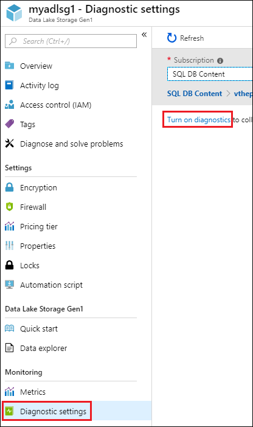
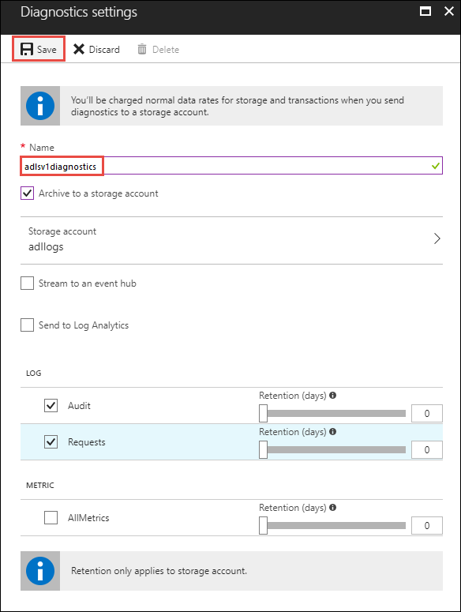
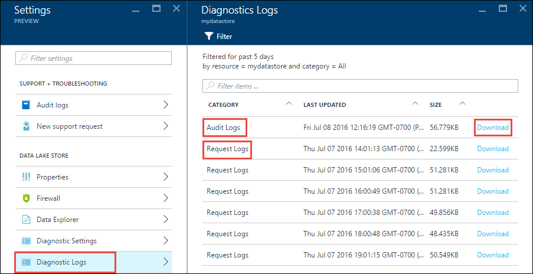
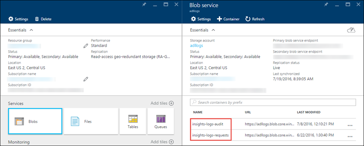
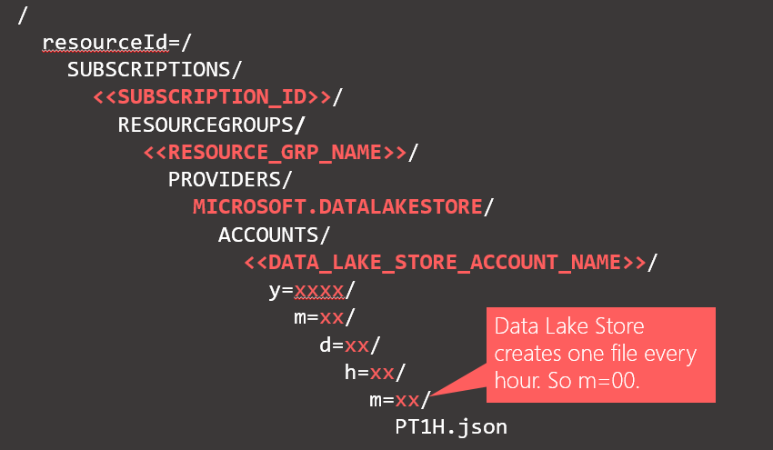

# Accessing diagnostic logs for Azure Data Lake Storage Gen1
Learn to enable diagnostic logging for your Azure Data Lake Storage Gen1 account and how to view the logs collected for your account.

Organizations can enable diagnostic logging for their Azure Data Lake Storage Gen1 account to collect data access audit trails that provides information such as list of users accessing the data, how frequently the data is accessed, how much data is stored in the account, etc. When enabled, the diagnostics and/or requests are logged on a best-effort basis. Both Requests and Diagnostics log entries are created only if there are requests made against the service endpoint.

## Prerequisites
* **An Azure subscription**. See [Get Azure free trial](https://azure.microsoft.com/pricing/free-trial/).
* **Azure Data Lake Storage Gen1 account**. Follow the instructions at [Get started with Azure Data Lake Storage Gen1 using the Azure Portal](data-lake-store-get-started-portal.md).

## Enable diagnostic logging for your Data Lake Storage Gen1 account
1. Sign on to the new [Azure portal](https://portal.azure.com).
2. Open your Data Lake Storage Gen1 account, and from your Data Lake Storage Gen1 account blade, click **Diagnostic settings**.
3. In the **Diagnostics settings** blade, click **Turn on diagnostics**.

	

3. In the **Diagnostics settings** blade, make the following changes to configure diagnostic logging.
   
    
   
   * For **Name**, enter a value for the diagnostic log configuration.
   * You can choose to store/process the data in different ways.
     
		* Select the option to **Archive to a storage account** to store logs to an Azure Storage account. You use this option if you want to archive the data that will be batch-processed at a later date. If you select this option you must provide an Azure Storage account to save the logs to.
		
		* Select the option to **Stream to an event hub** to stream log data to an Azure Event Hub. Most likely you will use this option if you have a downstream processing pipeline to analyze incoming logs at real time. If you select this option, you must provide the details for the Azure Event Hub you want to use.

		* Select the option to **Send to Log Analytics** to use the Azure Monitor service to analyze the generated log data. If you select this option, you must provide the details for the Log Analytics workspace that you would use the perform log analysis. See [View or analyze data collected with Azure Monitor logs search](../azure-monitor/learn/tutorial-viewdata.md) for details on using Azure Monitor logs.
     
   * Specify whether you want to get audit logs or request logs or both.
   * Specify the number of days for which the data must be retained. Retention is only applicable if you are using Azure storage account to archive log data.
   * Click **Save**.

Once you have enabled diagnostic settings, you can watch the logs in the **Diagnostic Logs** tab.

## View diagnostic logs for your Data Lake Storage Gen1 account
There are two ways to view the log data for your Data Lake Storage Gen1 account.

* From the Data Lake Storage Gen1 account settings view
* From the Azure Storage account where the data is stored

### Using the Data Lake Storage Gen1 Settings view
1. From your Data Lake Storage Gen1 account **Settings** blade, click **Diagnostic Logs**.
   
     
2. In the **Diagnostics Logs** blade, you should see the logs categorized by **Audit Logs** and **Request Logs**.
   
   * Request logs capture every API request made on the Data Lake Storage Gen1 account.
   * Audit Logs are similar to request Logs but provide a much more detailed breakdown of the operations being performed on the Data Lake Storage Gen1 account. For example, a single upload API call in request logs might result in multiple "Append" operations in the audit logs.
3. To download the logs, click the **Download** link against each log entry.

### From the Azure Storage account that contains log data
1. Open the Azure Storage account blade associated with Data Lake Storage Gen1 for logging, and then click Blobs. The **Blob service** blade lists two containers.
   
    
   
   * The container **insights-logs-audit** contains the audit logs.
   * The container **insights-logs-requests** contains the request logs.
2. Within these containers, the logs are stored under the following structure.
   
    
   
    As an example, the complete path to an audit log could be `https://adllogs.blob.core.windows.net/insights-logs-audit/resourceId=/SUBSCRIPTIONS/<sub-id>/RESOURCEGROUPS/myresourcegroup/PROVIDERS/MICROSOFT.DATALAKESTORE/ACCOUNTS/mydatalakestorage/y=2016/m=07/d=18/h=04/m=00/PT1H.json`
   
    Similarly, the complete path to a request log could be `https://adllogs.blob.core.windows.net/insights-logs-requests/resourceId=/SUBSCRIPTIONS/<sub-id>/RESOURCEGROUPS/myresourcegroup/PROVIDERS/MICROSOFT.DATALAKESTORE/ACCOUNTS/mydatalakestorage/y=2016/m=07/d=18/h=14/m=00/PT1H.json`

## Understand the structure of the log data
The audit and request logs are in a JSON format. In this section, we look at the structure of JSON for request and audit logs.

### Request logs
Here's a sample entry in the JSON-formatted request log. Each blob has one root object called **records** that contains an array of log objects.

    {
    "records": 
      [        
        . . . .
        ,
        {
             "time": "2016-07-07T21:02:53.456Z",
             "resourceId": "/SUBSCRIPTIONS/<subscription_id>/RESOURCEGROUPS/<resource_group_name>/PROVIDERS/MICROSOFT.DATALAKESTORE/ACCOUNTS/<data_lake_storage_gen1_account_name>",
             "category": "Requests",
             "operationName": "GETCustomerIngressEgress",
             "resultType": "200",
             "callerIpAddress": "::ffff:1.1.1.1",
             "correlationId": "4a11c709-05f5-417c-a98d-6e81b3e29c58",
             "identity": "1808bd5f-62af-45f4-89d8-03c5e81bac30",
             "properties": {"HttpMethod":"GET","Path":"/webhdfs/v1/Samples/Outputs/Drivers.csv","RequestContentLength":0,"ClientRequestId":"3b7adbd9-3519-4f28-a61c-bd89506163b8","StartTime":"2016-07-07T21:02:52.472Z","EndTime":"2016-07-07T21:02:53.456Z"}
        }
        ,
        . . . .
      ]
    }

#### Request log schema
| Name | Type | Description |
| --- | --- | --- |
| time |String |The timestamp (in UTC) of the log |
| resourceId |String |The ID of the resource that operation took place on |
| category |String |The log category. For example, **Requests**. |
| operationName |String |Name of the operation that is logged. For example, getfilestatus. |
| resultType |String |The status of the operation, For example, 200. |
| callerIpAddress |String |The IP address of the client making the request |
| correlationId |String |The ID of the log that can used to group together a set of related log entries |
| identity |Object |The identity that generated the log |
| properties |JSON |See below for details |

#### Request log properties schema
| Name | Type | Description |
| --- | --- | --- |
| HttpMethod |String |The HTTP Method used for the operation. For example, GET. |
| Path |String |The path the operation was performed on |
| RequestContentLength |int |The content length of the HTTP request |
| ClientRequestId |String |The ID that uniquely identifies this request |
| StartTime |String |The time at which the server received the request |
| EndTime |String |The time at which the server sent a response |

### Audit logs
Here's a sample entry in the JSON-formatted audit log. Each blob has one root object called **records** that contains an array of log objects

    {
    "records": 
      [        
        . . . .
        ,
        {
             "time": "2016-07-08T19:08:59.359Z",
             "resourceId": "/SUBSCRIPTIONS/<subscription_id>/RESOURCEGROUPS/<resource_group_name>/PROVIDERS/MICROSOFT.DATALAKESTORE/ACCOUNTS/<data_lake_storage_gen1_account_name>",
             "category": "Audit",
             "operationName": "SeOpenStream",
             "resultType": "0",
             "resultSignature": "0",
             "correlationId": "381110fc03534e1cb99ec52376ceebdf;Append_BrEKAmg;25.66.9.145",
             "identity": "A9DAFFAF-FFEE-4BB5-A4A0-1B6CBBF24355",
             "properties": {"StreamName":"adl://<data_lake_storage_gen1_account_name>.azuredatalakestore.net/logs.csv"}
        }
        ,
        . . . .
      ]
    }

#### Audit log schema
| Name | Type | Description |
| --- | --- | --- |
| time |String |The timestamp (in UTC) of the log |
| resourceId |String |The ID of the resource that operation took place on |
| category |String |The log category. For example, **Audit**. |
| operationName |String |Name of the operation that is logged. For example, getfilestatus. |
| resultType |String |The status of the operation, For example, 200. |
| resultSignature |String |Additional details on the operation. |
| correlationId |String |The ID of the log that can used to group together a set of related log entries |
| identity |Object |The identity that generated the log |
| properties |JSON |See below for details |

#### Audit log properties schema
| Name | Type | Description |
| --- | --- | --- |
| StreamName |String |The path the operation was performed on |

## Samples to process the log data
When sending logs from Azure Data Lake Storage Gen1 to Azure Monitor logs (see [View or analyze data collected with Azure Monitor logs search](../azure-monitor/learn/tutorial-viewdata.md) for details on using Azure Monitor logs), the following query will return a table containing a list of user display names, the time of the events, and the count of events for the time of the event along with a visual chart. It can easily be modified to show user GUID or other attributes:

```
search *
| where ( Type == "AzureDiagnostics" )
| summarize count(TimeGenerated) by identity_s, TimeGenerated
```


Azure Data Lake Storage Gen1 provides a sample on how to process and analyze the log data. You can find the sample at [https://github.com/Azure/AzureDataLake/tree/master/Samples/AzureDiagnosticsSample](https://github.com/Azure/AzureDataLake/tree/master/Samples/AzureDiagnosticsSample). 

## See also
* [Overview of Azure Data Lake Storage Gen1](data-lake-store-overview.md)
* [Secure data in Data Lake Storage Gen1](data-lake-store-secure-data.md)

