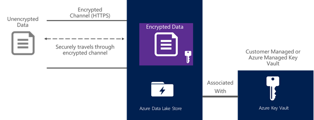
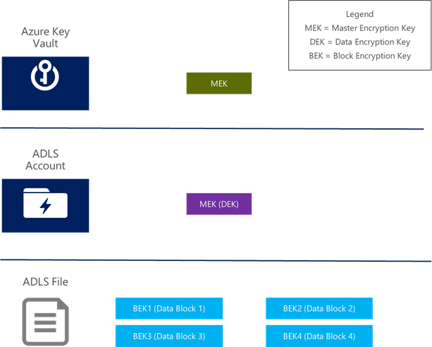
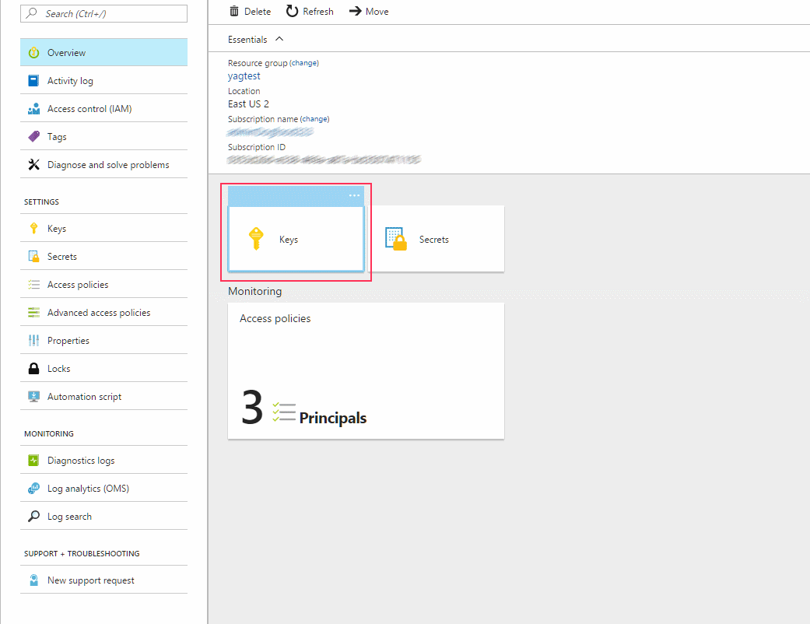
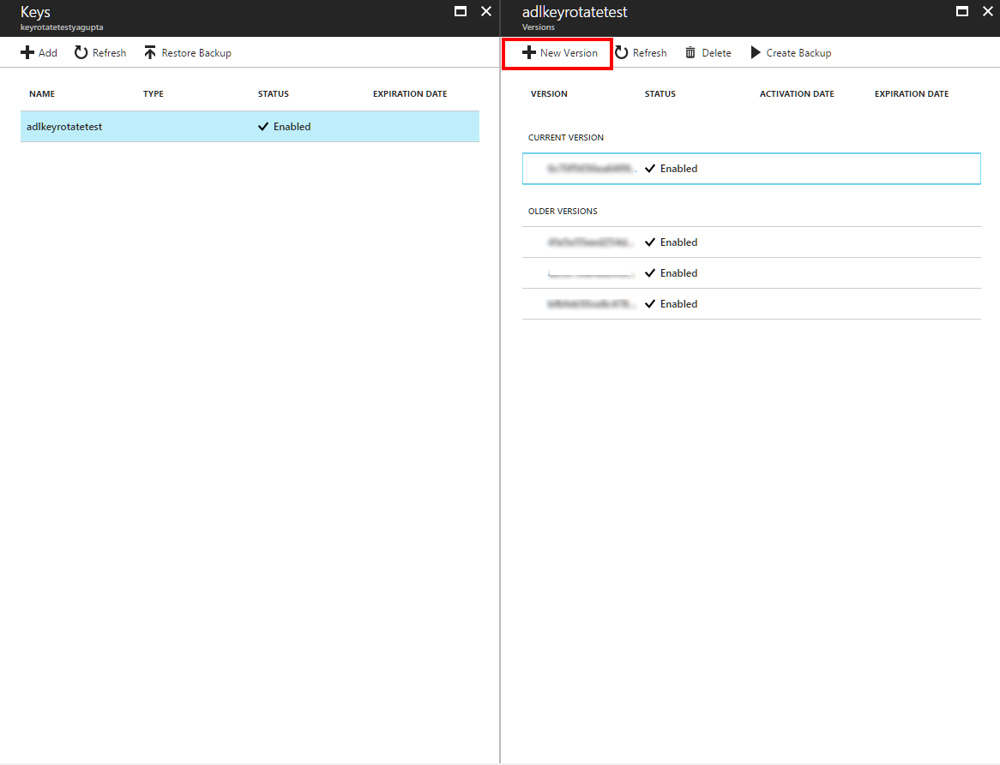
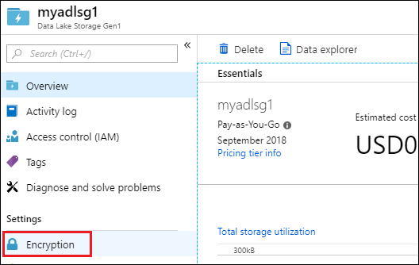
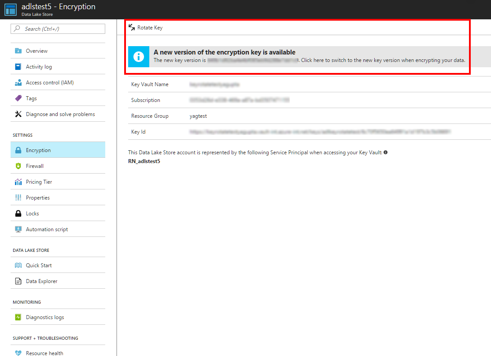

# Encryption of data in Azure Data Lake Storage Gen1

Encryption in Azure Data Lake Storage Gen1 helps you protect your data, implement enterprise security policies, and meet regulatory compliance requirements. This article provides an overview of the design, and discusses some of the technical aspects of implementation.

Data Lake Storage Gen1 supports encryption of data both at rest and in transit. For data at rest, Data Lake Storage Gen1 supports "on by default," transparent encryption. Here is what these terms mean in a bit more detail:

* **On by default**: When you create a new Data Lake Storage Gen1 account, the default setting enables encryption. Thereafter, data that is stored in Data Lake Storage Gen1 is always encrypted prior to storing on persistent media. This is the behavior for all data, and it cannot be changed after an account is created.
* **Transparent**: Data Lake Storage Gen1 automatically encrypts data prior to persisting, and decrypts data prior to retrieval. The encryption is configured and managed at the Data Lake Storage Gen1 account level by an administrator. No changes are made to the data access APIs. Thus, no changes are required in applications and services that interact with Data Lake Storage Gen1 because of encryption.

Data in transit (also known as data in motion) is also always encrypted in Data Lake Storage Gen1. In addition to encrypting data prior to storing to persistent media, the data is also always secured in transit by using HTTPS. HTTPS is the only protocol that is supported for the Data Lake Storage Gen1 REST interfaces. The following diagram shows how data becomes encrypted in Data Lake Storage Gen1:

## Set up encryption with Data Lake Storage Gen1

Encryption for Data Lake Storage Gen1 is set up during account creation, and it is always enabled by default. You can either manage the keys yourself, or allow Data Lake Storage Gen1 to manage them for you (this is the default).

For more information, see [Getting started](./data-lake-store-get-started-portal.md).

## How encryption works in Data Lake Storage Gen1

The following information covers how to manage master encryption keys, and it explains the three different types of keys you can use in data encryption for Data Lake Storage Gen1.

### Master encryption keys

Data Lake Storage Gen1 provides two modes for management of master encryption keys (MEKs). For now, assume that the master encryption key is the top-level key. Access to the master encryption key is required to decrypt any data stored in Data Lake Storage Gen1.

The two modes for managing the master encryption key are as follows:

*	Service managed keys
*	Customer managed keys

In both modes, the master encryption key is secured by storing it in Azure Key Vault. Key Vault is a fully managed, highly secure service on Azure that can be used to safeguard cryptographic keys. For more information, see [Key Vault](https://azure.microsoft.com/services/key-vault).

Here is a brief comparison of capabilities provided by the two modes of managing the MEKs.

| Question | Service managed keys | Customer managed keys |
| -------- | -------------------- | --------------------- |
|How is data stored?|Always encrypted prior to being stored.|Always encrypted prior to being stored.|
|Where is the Master Encryption Key stored?|Key Vault|Key Vault|
|Are any encryption keys stored in the clear outside of Key Vault? |No|No|
|Can the MEK be retrieved by Key Vault?|No. After the MEK is stored in Key Vault, it can only be used for encryption and decryption.|No. After the MEK is stored in Key Vault, it can only be used for encryption and decryption.|
|Who owns the Key Vault instance and the MEK?|The Data Lake Storage Gen1 service|You own the Key Vault instance, which belongs in your own Azure subscription. The MEK in Key Vault can be managed by software or hardware.|
|Can you revoke access to the MEK for the Data Lake Storage Gen1 service?|No|Yes. You can manage access control lists in Key Vault, and remove access control entries to the service identity for the Data Lake Storage Gen1 service.|
|Can you permanently delete the MEK?|No|Yes. If you delete the MEK from Key Vault, the data in the Data Lake Storage Gen1 account cannot be decrypted by anyone, including the Data Lake Storage Gen1 service.    If you have explicitly backed up the MEK prior to deleting it from Key Vault, the MEK can be restored, and the data can then be recovered. However, if you have not backed up the MEK prior to deleting it from Key Vault, the data in the Data Lake Storage Gen1 account can never be decrypted thereafter.|

Aside from this difference of who manages the MEK and the Key Vault instance in which it resides, the rest of the design is the same for both modes.

It's important to remember the following when you choose the mode for the master encryption keys:

*	You can choose whether to use customer managed keys or service managed keys when you provision a Data Lake Storage Gen1 account.
*	After a Data Lake Storage Gen1 account is provisioned, the mode cannot be changed.

### Encryption and decryption of data

There are three types of keys that are used in the design of data encryption. The following table provides a summary:

| Key                   | Abbreviation | Associated with | Storage location                             | Type       | Notes                                                                                                   |
|-----------------------|--------------|-----------------|----------------------------------------------|------------|---------------------------------------------------------------------------------------------------------|
| Master Encryption Key | MEK          | A Data Lake Storage Gen1 account | Key Vault                              | Asymmetric | It can be managed by Data Lake Storage Gen1 or you.                                                              |
| Data Encryption Key   | DEK          | A Data Lake Storage Gen1 account | Persistent storage, managed by the Data Lake Storage Gen1 service | Symmetric  | The DEK is encrypted by the MEK. The encrypted DEK is what is stored on persistent media. |
| Block Encryption Key  | BEK          | A block of data | None                                         | Symmetric  | The BEK is derived from the DEK and the data block.                                                      |

The following diagram illustrates these concepts:

#### Pseudo algorithm when a file is to be decrypted:
1.	Check if the DEK for the Data Lake Storage Gen1 account is cached and ready for use.
    - If not, then read the encrypted DEK from persistent storage, and send it to Key Vault to be decrypted. Cache the decrypted DEK in memory. It is now ready to use.
2.	For every block of data in the file:
    - Read the encrypted block of data from persistent storage.
    - Generate the BEK from the DEK and the encrypted block of data.
    - Use the BEK to decrypt data.

#### Pseudo algorithm when a block of data is to be encrypted:
1.	Check if the DEK for the Data Lake Storage Gen1 account is cached and ready for use.
    - If not, then read the encrypted DEK from persistent storage, and send it to Key Vault to be decrypted. Cache the decrypted DEK in memory. It is now ready to use.
2.	Generate a unique BEK for the block of data from the DEK.
3.	Encrypt the data block with the BEK, by using AES-256 encryption.
4.	Store the encrypted data block of data on persistent storage.

> [!NOTE] 
> The DEK is always stored encrypted by the MEK, whether on persistent media or cached in memory.

## Key rotation

When you are using customer-managed keys, you can rotate the MEK. To learn how to set up a Data Lake Storage Gen1 account with customer-managed keys, see [Getting started](./data-lake-store-get-started-portal.md).

### Prerequisites

When you set up the Data Lake Storage Gen1 account, you have chosen to use your own keys. This option cannot be changed after the account has been created. The following steps assume that you are using customer-managed keys (that is, you have chosen your own keys from Key Vault).

Note that if you use the default options for encryption, your data is always encrypted by using keys managed by Data Lake Storage Gen1. In this option, you don't have the ability to rotate keys, as they are managed by Data Lake Storage Gen1.

### How to rotate the MEK in Data Lake Storage Gen1

1. Sign in to the [Azure portal](https://portal.azure.com/).
2. Browse to the Key Vault instance that stores your keys associated with your Data Lake Storage Gen1 account. Select **Keys**.

    

3. Select the key associated with your Data Lake Storage Gen1 account, and create a new version of this key. Note that Data Lake Storage Gen1 currently only supports key rotation to a new version of a key. It doesn't support rotating to a different key.

   

4. Browse to the Data Lake Storage Gen1 account, and select **Encryption**.

   

5. A message notifies you that a new key version of the key is available. Click **Rotate Key** to update the key to the new version.

   

This operation should take less than two minutes, and there is no expected downtime due to key rotation. After the operation is complete, the new version of the key is in use.

> [!IMPORTANT]
> After the key rotation operation is complete, the old version of the key is no longer actively used for encrypting new data. There may be cases however where accessing older data may need the old key. To allow for reading of such older data, do not delete the old key