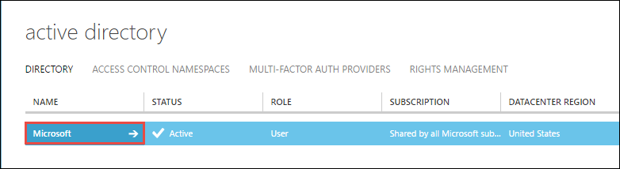
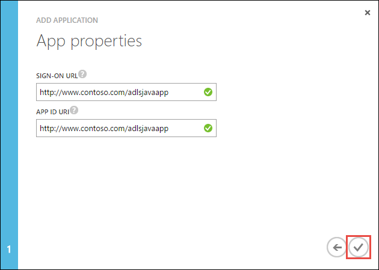
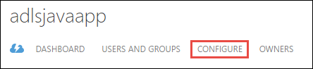
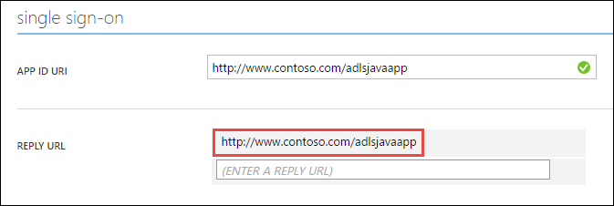

---
title: Authenticate with Data Lake Store using Active Directory | Microsoft Docs
description: Learn how to authenticate with Data Lake Store using Active Directory
services: data-lake-store
documentationcenter: ''
author: nitinme
manager: jhubbard
editor: cgronlun

ms.assetid: ec586ecd-1b42-459e-b600-fadbb7b80a9b
ms.service: data-lake-store
ms.devlang: na
ms.topic: article
ms.tgt_pltfrm: na
ms.workload: big-data
ms.date: 10/17/2016
ms.author: nitinme

---
# End-user authentication with Data Lake Store using Azure Active Directory
> [!div class="op_single_selector"]
> * [Service-to-service authentication](data-lake-store-authenticate-using-active-directory.md)
> * [End-user authentication](data-lake-store-end-user-authenticate-using-active-directory.md)
> 
> 

Azure Data Lake Store uses Azure Active Directory for authentication. Before authoring an application that works with Azure Data Lake Store or Azure Data Lake Analytics, you must first decide how you would like to authenticate your application with Azure Active Directory (Azure AD). The two main options available are:

* End-user authentication, and 
* Service-to-service authentication. 

Both these options result in your application being provided with an OAuth 2.0 token, which gets attached to each request made to Azure Data Lake Store or Azure Data Lake Analytics.

This article talks about how create an Azure AD web application for end-user authentication. For instructions on Azure AD application configuration for service-to-service authentication see [Service-to-service authentication with Data Lake Store using Azure Active Directory](data-lake-store-authenticate-using-active-directory.md).

## Prerequisites
* An Azure subscription. See [Get Azure free trial](https://azure.microsoft.com/pricing/free-trial/).
* Your subscription ID. You can retrieve it from the Azure Portal. For example, it is available from the Data Lake Store account blade.
  
    
* Your Azure AD domain name. You can retrieve it by hovering the mouse in the top-right corner of the Azure Portal. From the screenshot below, the domain name is **contoso.microsoft.com**, and the GUID within brackets is the tenant ID. 
  
    

## End-user authentication
This is the recommended approach if you want an end-user to log in to your application via Azure AD. Your application will be able to access Azure resources with the same level of access as the end-user that logged in. Your end-user will need to provide their credentials periodically in order for your application to maintain access.

The result of having the end-user log in is that your application is given an access token and a refresh token. The access token gets attached to each request made to Data Lake Store or Data Lake Analytics, and it is valid for one hour by default. The refresh token can be used to obtain a new access token, and it is valid for up to two weeks by default, if used regularly. You can use two different approaches for end-user log in.

### Using the OAuth 2.0 pop-up
Your application can trigger an OAuth 2.0 authorization pop-up, in which the end-user can enter their credentials. This pop-up also works with the Azure AD Two-factor Authentication (2FA) process, if required. 

> [!NOTE]
> This method is not yet supported in the Azure AD Authentication Library (ADAL) for Python or Java.
> 
> 

### Directly passing in user credentials
Your application can directly provide user credentials to Azure AD. This method only works with organizational ID user accounts; it is not compatible with personal / “live ID” user accounts, including those ending in @outlook.com or @live.com. Furthermore, this method is not compatible with user accounts that require Azure AD Two-factor Authentication (2FA).

### What do I need to use this approach?
* Azure AD domain name. This is already listed in the prerequisite of this article.
* Azure AD **web application**
* Client ID for the Azure AD web application
* Reply URI for the Azure AD web application
* Set delegated permissions

For instructions on how to create an Azure AD web application and configure it for the requirements listed above, see the section [Create an Active Directory application](#create-an-active-directory-application) below. 

## Create an Active Directory application
In this section we learn about how to create and configure an Azure AD web application for end-user authentication with Azure Data Lake Store using Azure Active Directory.

### Step 1: Create an Azure Active Directory application
> [!NOTE]
> The steps below use the Azure Portal. You can also create an Azure AD application using [Azure PowerShell](../resource-group-authenticate-service-principal.md) or [Azure CLI](../resource-group-authenticate-service-principal-cli.md).
> 
> 

1. Log in to your Azure Account through the [classic portal](https://manage.windowsazure.com/).
2. Select **Active Directory** from the left pane.
   
     
3. Select the Active Directory that you want to use for creating the new application. If you have more than one Active Directory, you usually want to create the application in the directory where your subscription resides. You can only grant access to resource in your subscription for applications in the same directory as your subscription.  
   
     
4. To view the applications in your directory, click on **Applications**.
   
     
5. If you haven't created an application in that directory before you should see something similar to following image. Click on **ADD AN APPLICATION**
   
     
   
     Or, click **Add** in the bottom pane.
   
     
6. Provide a name for the application and select the type of application you want to create. For this tutorial, create a **WEB APPLICATION AND/OR WEB API** and click the next button.
   
     
7. Fill in the properties for your app. For **SIGN-ON URL**, provide the URI to a web site that describes your application. The existence of the web site is not validated. 
   For **APP ID URI**, provide the URI that identifies your application.
   
     
   
    Click the check mark to complete the wizard and create the application.

### Step 2: Get client id, reply URI, and set delegated permissions
1. Click on the **Configure** tab to configure your application's password.
   
     
2. Copy the **CLIENT ID**.
   
     
3. Under the **Single sign-on** section, copy the **Reply URI**.
   
    
4. Under **Permissions to other applications**, click **Add application**
   
    
5. In the **Permissions to other applications** wizard, select **Azure Data Lake** and **Windows** **Azure Service Management API**, and click the checkmark.
6. By default the **Delegated Permissions** for the newly added services is set to zero. Click the **Delegated Permissions** drop-down for Azure Data Lake and Windows Azure Management Service and select the available checkboxes to set the values to 1. The result should look like this.
   
     
7. Click **Save**.

## Next steps
In this article you created an Azure AD web application and gathered the information you need in your client applications that you author using .NET SDK, Java SDK, etc. You can now proceed to the following articles that talk about how to use the Azure AD web application to first authenticate with Data Lake Store and then perform other operations on the store.

* [Get started with Azure Data Lake Store using .NET SDK](data-lake-store-get-started-net-sdk.md)
* [Get started with Azure Data Lake Store using Java SDK](data-lake-store-get-started-java-sdk.md)

