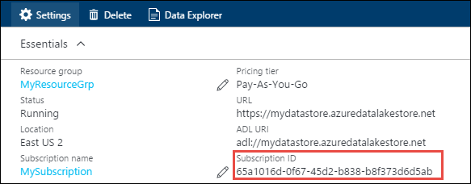
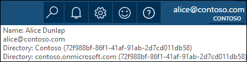
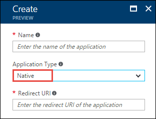
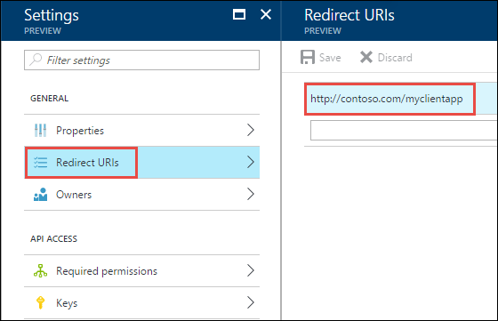
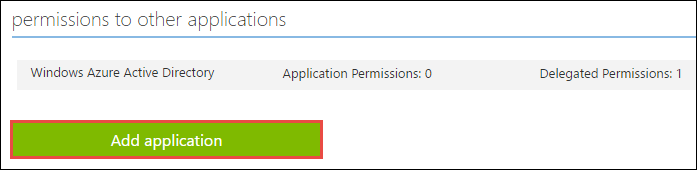
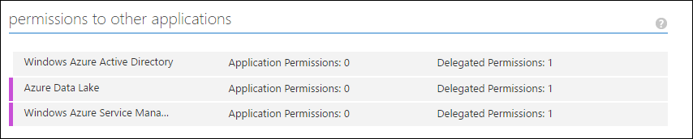
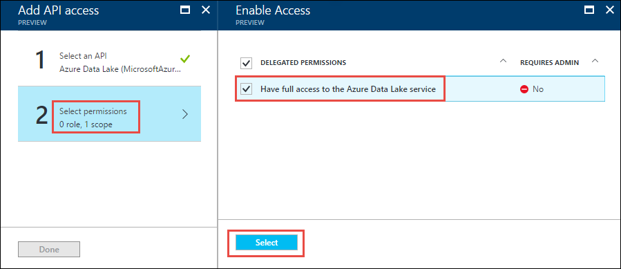

# End-user authentication with Azure Data Lake Storage Gen1 using Azure Active Directory
> [!div class="op_single_selector"]
> * [End-user authentication](data-lake-store-end-user-authenticate-using-active-directory.md)
> * [Service-to-service authentication](data-lake-store-service-to-service-authenticate-using-active-directory.md)
>
>

Azure Data Lake Storage Gen1 uses Azure Active Directory for authentication. Before authoring an application that works with Data Lake Storage Gen1 or Azure Data Lake Analytics, you must decide how to authenticate your application with Azure Active Directory (Azure AD). The two main options available are:

* End-user authentication (this article)
* Service-to-service authentication (pick this option from the drop-down above)

Both these options result in your application being provided with an OAuth 2.0 token, which gets attached to each request made to Data Lake Storage Gen1 or Azure Data Lake Analytics.

This article talks about how to create an **Azure AD native application for end-user authentication**. For instructions on Azure AD application configuration for service-to-service authentication, see [Service-to-service authentication with Data Lake Storage Gen1 using Azure Active Directory](./data-lake-store-service-to-service-authenticate-using-active-directory.md).

## Prerequisites
* An Azure subscription. See [Get Azure free trial](https://azure.microsoft.com/pricing/free-trial/).

* Your subscription ID. You can retrieve it from the Azure portal. For example, it's available from the Data Lake Storage Gen1 account blade.

    

* Your Azure AD domain name. You can retrieve it by hovering the mouse in the top-right corner of the Azure portal. From the screenshot below, the domain name is **contoso.onmicrosoft.com**, and the GUID within brackets is the tenant ID.

    

* Your Azure tenant ID. For instructions on how to retrieve the tenant ID, see [Get the tenant ID](../active-directory/develop/howto-create-service-principal-portal.md#sign-in-to-the-application).

## End-user authentication
This authentication mechanism is the recommended approach if you want an end user to sign in to your application via Azure AD. Your application is then able to access Azure resources with the same level of access as the end user that logged in. Your end user needs to provide their credentials periodically in order for your application to maintain access.

The result of having the end-user sign-in is that your application is given an access token and a refresh token. The access token gets attached to each request made to Data Lake Storage Gen1 or Data Lake Analytics, and it's valid for one hour by default. The refresh token can be used to obtain a new access token, and it's valid for up to two weeks by default. You can use two different approaches for end-user sign-in.

### Using the OAuth 2.0 pop-up
Your application can trigger an OAuth 2.0 authorization pop-up, in which the end user can enter their credentials. This pop-up also works with the Azure AD Two-factor Authentication (2FA) process, if necessary.

> [!NOTE]
> This method is not yet supported in the Azure AD Authentication Library (ADAL) for Python or Java.
>
>

### Directly passing in user credentials
Your application can directly provide user credentials to Azure AD. This method only works with organizational ID user accounts; it isn't compatible with personal / “live ID” user accounts, including the accounts ending in @outlook.com or @live.com. Furthermore, this method isn't compatible with user accounts that require Azure AD Two-factor Authentication (2FA).

### What do I need for this approach?
* Azure AD domain name. This requirement is already listed in the prerequisite of this article.
* Azure AD tenant ID. This requirement is already listed in the prerequisite of this article.
* Azure AD **native application**
* Application ID for the Azure AD native application
* Redirect URI for the Azure AD native application
* Set delegated permissions

## Step 1: Create an Active Directory native application

Create and configure an Azure AD native application for end-user authentication with Data Lake Storage Gen1 using Azure Active Directory. For instructions, see [Create an Azure AD application](../active-directory/develop/howto-create-service-principal-portal.md).

While following the instructions in the link, make sure you select **Native** for application type, as shown in the following screenshot:

## Step 2: Get application ID and redirect URI

See [Get the application ID](../active-directory/develop/howto-create-service-principal-portal.md#sign-in-to-the-application) to retrieve the application ID.

To retrieve the redirect URI, do the following steps.

1. From the Azure portal, select **Azure Active Directory**, select **App registrations**, and then find and select the Azure AD native application that you created.

2. From the **Settings** blade for the application, select **Redirect URIs**.

	

3. Copy the value displayed.

## Step 3: Set permissions

1. From the Azure portal, select **Azure Active Directory**, select **App registrations**, and then find and select the Azure AD native application that you created.

2. From the **Settings** blade for the application, select **Required permissions**, and then select **Add**.

	

3. In the **Add API Access** blade, select **Select an API**, select **Azure Data Lake**, and then select **Select**.

	

4.  In the **Add API Access** blade, select **Select permissions**, select the check box to give **Full access to Data Lake Store**, and then select **Select**.

	

	Select **Done**.

5. Repeat the last two steps to grant permissions for **Windows Azure Service Management API** as well.

## Next steps
In this article, you created an Azure AD native application and gathered the information you need in your client applications that you author using .NET SDK, Java SDK, REST API, etc. You can now proceed to the following articles that talk about how to use the Azure AD web application to first authenticate with Data Lake Storage Gen1 and then perform other operations on the store.

* [End-user-authentication with Data Lake Storage Gen1 using Java SDK](data-lake-store-end-user-authenticate-java-sdk.md)
* [End-user authentication with Data Lake Storage Gen1 using .NET SDK](data-lake-store-end-user-authenticate-net-sdk.md)
* [End-user authentication with Data Lake Storage Gen1 using Python](data-lake-store-end-user-authenticate-python.md)
* [End-user authentication with Data Lake Storage Gen1 using REST API](data-lake-store-end-user-authenticate-rest-api.md)