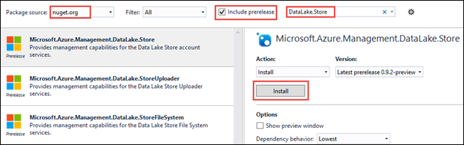
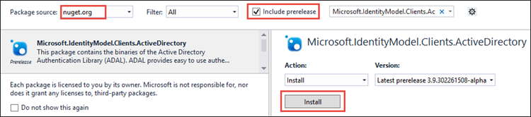

<properties
   pageTitle="Use Data Lake Store .NET SDK to develop applications | Azure"
   description="Use Azure Data Lake Store .NET SDK to develop applications"
   services="data-lake-store"
   documentationCenter=""
   authors="nitinme"
   manager="paulettm"
   editor="cgronlun"/>

<tags
   ms.service="data-lake-store"
   ms.devlang="na"
   ms.topic="get-started-article"
   ms.tgt_pltfrm="na"
   ms.workload="big-data"
   ms.date="07/18/2016"
   ms.author="nitinme"/>

# Get started with Azure Data Lake Store using .NET SDK

> [AZURE.SELECTOR]
- [Portal](data-lake-store-get-started-portal.md)
- [PowerShell](data-lake-store-get-started-powershell.md)
- [.NET SDK](data-lake-store-get-started-net-sdk.md)
- [Java SDK](data-lake-store-get-started-java-sdk.md)
- [REST API](data-lake-store-get-started-rest-api.md)
- [Azure CLI](data-lake-store-get-started-cli.md)
- [Node.js](data-lake-store-manage-use-nodejs.md)

Learn how to use the Azure Data Lake Store .NET SDK to create an Azure Data Lake account and perform basic operations such as create folders, upload and download data files, delete your account, etc. For more information about Data Lake, see [Azure Data Lake Store](data-lake-store-overview.md).

## Prerequisites

* Visual Studio 2013 or 2015. The instructions below use Visual Studio 2015.
* **An Azure subscription**. See [Get Azure free trial](https://azure.microsoft.com/pricing/free-trial/).
* **Enable your Azure subscription** for Data Lake Store public preview. See [instructions](data-lake-store-get-started-portal.md#signup).
* **Create an Azure Active Directory Application**. There are two ways you can authenticate using Azure Active Direcotry - **interactive** and **non-interactive**. There are different prerequisites based on how you want to authenticate.
	* **For interactive authentication** (used in this article) - In Azure Active Directory, you must create a **Native Client application**. Once you have created the application, retrieve the following values related to the application.
		- Get **client ID** and **redirect URI** for the application
		- Set delegated permissions

	* **For non-interactive authentication** - In Azure Active Directory, you must create a **Web application**. Once you have created the application, retrieve the following values related to the application.
		- Get **client ID**, **client secret**,  and **redirect URI** for the application
		- Set delegated permissions
		- Assign the Azure Active Directory application to a role. The role can be at the level of the scope at which you want to give permission to the Azure Active Directory application. For example, you can assign the application at the subscription level or at the level of a resource group. 

	See [Create Active Directory application and service principal using portal](../resource-group-create-service-principal-portal.md) for instructions on how to retrieve these values, set the permissions, and assign roles.

## Create a .NET application

1. Open Visual Studio and create a console application.

2. From the **File** menu, click **New**, and then click **Project**.

3. From **New Project**, type or select the following values:

	| Property | Value                       |
	|----------|-----------------------------|
	| Category | Templates/Visual C#/Windows |
	| Template | Console Application         |
	| Name     | CreateADLApplication        |

4. Click **OK** to create the project.

5. Add the Nuget packages to your project.

	1. Right-click the project name in the Solution Explorer and click **Manage NuGet Packages**.
	2. In the **Nuget Package Manager** tab, make sure that **Package source** is set to **nuget.org** and that **Include prerelease** check box is selected.
	3. Search for and install the following Data Lake Store packages:

		* `Microsoft.Azure.Management.DataLake.Store`
		* `Microsoft.Azure.Management.DataLake.StoreUploader`

		

	4. Also install the `Microsoft.IdentityModel.Clients.ActiveDirectory` package for Azure Active Directory authentication. Make sure you *clear* the **Include prerelease** check box so that you install a stable version of this package.

		

	5. Close the **Nuget Package Manager**.

7. Open **Program.cs**, delete the existing code, and then include the following statements to add references to namespaces.

		using System;
        using System.IO;
        using System.Security;
        using System.Text;
        using System.Collections.Generic;
        using System.Linq;

        using Microsoft.Azure.Management.DataLake.Store;
        using Microsoft.Azure.Management.DataLake.Store.Models;
        using Microsoft.Azure.Management.DataLake.StoreUploader;
        using Microsoft.IdentityModel.Clients.ActiveDirectory;
        using Microsoft.Rest;

8. Declare the variables as shown below, and provide the values for Data Lake Store name and the resource group name. The Data Lake Store name you provide will be created by the application. The resource group you provide here should already exist. Also, make sure the local path and file name you provide here must exist on the computer. Add the following code snippet after the namespace declarations.

		namespace SdkSample
        {
            class Program
            {
                private static DataLakeStoreAccountManagementClient _adlsClient;
                private static DataLakeStoreFileSystemManagementClient _adlsFileSystemClient;

                private static string _adlsAccountName;
                private static string _resourceGroupName;
                private static string _location;

                private static void Main(string[] args)
                {
                    _adlsAccountName = "<DATA-LAKE-STORE-NAME>"; // TODO: Replace this value with the name for a NEW Store account.
                    _resourceGroupName = "<RESOURCE-GROUP-NAME>"; // TODO: Replace this value. This resource group should already exist.
                    _location = "East US 2";

                    string localFolderPath = @"C:\local_path\"; // TODO: Make sure this exists and can be overwritten.
                    string localFilePath = localFolderPath + "file.txt"; // TODO: Make sure this exists and can be overwritten.
                    string remoteFolderPath = "/data_lake_path/";
                    string remoteFilePath = remoteFolderPath + "file.txt";
				}
			}
		}

In the remaining sections of the article, you can see how to use the available .NET methods to perform operations such as authenticate users, create Data Lake Store account, upload files, etc. If you are looking for a complete sample on how to work with Data Lake Store, see the [Appendix](#appendix-sample-code) at the bottom of this article.

## Authenticate the user

There are two ways to authenticate using Azure Active Directory:

* **Interactive**, where a user-signs in using the application. This is implemented in the method `AuthenticateUser` in the code snippet below.

* **Non-interactive**, where the application provides its own credentials. This is implemented in the method `AuthenticateAppliaction`  in the code snippet below.

### Interactive authentication

The following snippet shows an `AuthenticateUser` method that you can use for an interactive log in experience.

 	// Authenticate the user with AAD through an interactive popup.
    // You need to have an application registered with AAD in order to authenticate.
    //   For more information and instructions on how to register your application with AAD, see:
    //   https://azure.microsoft.com/en-us/documentation/articles/resource-group-create-service-principal-portal/
	public static TokenCredentials AuthenticateUser(string tenantId, string resource, string appClientId, Uri appRedirectUri, string userId = "")
	{
	    var authContext = new AuthenticationContext("https://login.microsoftonline.com/" + tenantId);
	
	    var tokenAuthResult = authContext.AcquireToken(resource, appClientId, appRedirectUri,
	        PromptBehavior.Auto, UserIdentifier.AnyUser);
	
	    return new TokenCredentials(tokenAuthResult.AccessToken);
	}

### Non-interactive authentication

The following snippet shows an `AuthenticateApplication` method that you can use for a non-interactive log in experience.

	// Authenticate the application with AAD through the application's secret key.
	// You need to have an application registered with AAD in order to authenticate.
	//   For more information and instructions on how to register your application with AAD, see:
	//   https://azure.microsoft.com/en-us/documentation/articles/resource-group-create-service-principal-portal/
	public static TokenCredentials AuthenticateApplication(string tenantId, string resource, string appClientId, Uri appRedirectUri, SecureString clientSecret)
	{
	    var authContext = new AuthenticationContext("https://login.microsoftonline.com/" + tenantId);
	    var credential = new ClientCredential(appClientId, clientSecret);
	
	    var tokenAuthResult = authContext.AcquireToken(resource, credential);
	
	    return new TokenCredentials(tokenAuthResult.AccessToken);
	}
	
## Create a Data Lake Store account

The following snippet shows a `CreateAccount` method that you can use to create a Data Lake Store account.

	// Create Data Lake Store account
    public static void CreateAccount()
    {
        var adlsParameters = new DataLakeStoreAccount(location: _location);
        _adlsClient.Account.Create(_resourceGroupName, _adlsAccountName, adlsParameters);
    } 

## List all Data Lake Store accounts within a subscription

The following snippet shows `ListAdlStoreAccounts` method that you can use to list all Data Lake Store accounts within a given Azure subscription.

	// List all ADLS accounts within the subscription
	public static List<DataLakeStoreAccount> ListAdlStoreAccounts()
	{
	    var response = _adlsClient.Account.List(_adlsAccountName);
	    var accounts = new List<DataLakeStoreAccount>(response);
	
	    while (response.NextPageLink != null)
	    {
	        response = _adlsClient.Account.ListNext(response.NextPageLink);
	        accounts.AddRange(response);
	    }
	
	    return accounts;
	}

## Create a directory

The following snippet shows a `CreateDirectory` method that you can use to create a directory within a Data Lake Store account.

	// Create a directory
    public static void CreateDirectory(string path)
    {
        _adlsFileSystemClient.FileSystem.Mkdirs(_adlsAccountName, path);
    }

## Upload a file to Data Lake Store

The following snippet shows an `UploadFile` method that you can use to upload files to a Data Lake Store account.

	// Upload a file
    public static void UploadFile(string srcFilePath, string destFilePath, bool force = true)
    {
        var parameters = new UploadParameters(srcFilePath, destFilePath, _adlsAccountName, isOverwrite: force);
        var frontend = new DataLakeStoreFrontEndAdapter(_adlsAccountName, _adlsFileSystemClient);
        var uploader = new DataLakeStoreUploader(parameters, frontend);
        uploader.Execute();
    }

## Get file or directory info

The following snippet shows a `GetItemInfo` method that you can use to retrieve information about a file or directory available in Data Lake Store. 

	// Get file or directory info
    public static FileStatusProperties GetItemInfo(string path)
    {
        return _adlsFileSystemClient.FileSystem.GetFileStatus(_adlsAccountName, path).FileStatus;
    }

## List file or directories

The following snippet shows a `ListItem` method that can use to list the file and directories in a Data Lake Store account.
	
	// List files and directories
    public static List<FileStatusProperties> ListItems(string directoryPath)
    {
        return _adlsFileSystemClient.FileSystem.ListFileStatus(_adlsAccountName, directoryPath).FileStatuses.FileStatus.ToList();
    }

## Concatenate files

The following snippet shows a `ConcatenateFiles` method that you use to concatenate files. 

	// Concatenate files
    public static void ConcatenateFiles(string[] srcFilePaths, string destFilePath)
    {
        _adlsFileSystemClient.FileSystem.Concat(_adlsAccountName, destFilePath, srcFilePaths);
    }

## Append to a file

The following snippet shows a `AppendToFile` method that you use append data to a file already stored in a Data Lake Store account.

	// Append to file
    public static void AppendToFile(string path, string content)
    {
        var stream = new MemoryStream(Encoding.UTF8.GetBytes(content));

        _adlsFileSystemClient.FileSystem.Append(_adlsAccountName, path, stream);
    }

## Download a file

The following snippet shows a `DownloadFile` method that you use to download a file from a Data Lake Store account.

	// Download file
    public static void DownloadFile(string srcPath, string destPath)
    {
        var stream = _adlsFileSystemClient.FileSystem.Open(_adlsAccountName, srcPath);
        var fileStream = new FileStream(destPath, FileMode.Create);

        stream.CopyTo(fileStream);
        fileStream.Close();
        stream.Close();
    }

## Delete a Data Lake Store account

The following snippet shows a `DeleteAccount` method that you can use to delete a Data Lake Store account.

	// Delete account
    public static void DeleteAccount()
    {
        _adlsClient.Account.Delete(_resourceGroupName, _adlsAccountName);
    }

## Apendix: Sample code

The following snippet is a comprehensive code sample that you can copy paste into your application to see an end-to-end operation on Data Lake Store. Before running the code snippet, make sure you provide the required values such as Data Lake Store name, resource group name, etc. You must also provide the values required for Azure Active Direcctory authentication, such as **\<APPLICATION-CLIENT-ID>** , **\<APPLICATION-REPLY-URI>**, and **\<SUBSCRIPTION-ID>**.

Even though the code snippet below provides methods for both the approaches, interactive and non-interactive, the non-interactive code block is commented out. The interactive method requires you to provide the AAD application client ID and the redirect URI. The link in the prerequisite provides instructions on how to obtain these.

>[AZURE.NOTE] If you want to modify the code snippet and use the non-interactive (`AuthenticateApplication`) method instead, you must also provide client authentication key, in addition to the client ID and the client reply URI, as inputs to the method. The article [Create Active Directory application and service principal using portal](../resource-group-create-service-principal-portal.md) also provides information on how to generate and retrieve the client authentication key.
	
Finally, make sure the local path and file name you provide here must exist on the computer. If you are looking for some sample data to upload, you can get the **Ambulance Data** folder from the [Azure Data Lake Git Repository](https://github.com/MicrosoftBigData/usql/tree/master/Examples/Samples/Data/AmbulanceData).

    using System;
    using System.IO;
    using System.Security;
    using System.Text;
    using System.Collections.Generic;
    using System.Linq;

    using Microsoft.Azure.Management.DataLake.Store;
    using Microsoft.Azure.Management.DataLake.Store.Models;
    using Microsoft.Azure.Management.DataLake.StoreUploader;
    using Microsoft.IdentityModel.Clients.ActiveDirectory;
    using Microsoft.Rest;

    namespace SdkSample
    {
        class Program
        {
            private static DataLakeStoreAccountManagementClient _adlsClient;
            private static DataLakeStoreFileSystemManagementClient _adlsFileSystemClient;

            private static string _adlsAccountName;
            private static string _resourceGroupName;
            private static string _location;

            private static void Main(string[] args)
            {
                _adlsAccountName = "<DATA-LAKE-STORE-NAME>"; // TODO: Replace this value with the name for a NEW Store account.
                _resourceGroupName = "<RESOURCE-GROUP-NAME>"; // TODO: Replace this value. This resource group should already exist.
                _location = "East US 2";

                string localFolderPath = @"C:\local_path\"; // TODO: Make sure this exists and can be overwritten.
                string localFilePath = localFolderPath + "file.txt"; // TODO: Make sure this exists and can be overwritten.
                string remoteFolderPath = "/data_lake_path/";
                string remoteFilePath = remoteFolderPath + "file.txt";

                // Authenticate the user
                var tokenCreds = AuthenticateUser("common", "https://management.core.windows.net/",
                    "<APPLICATION-CLIENT-ID>", new Uri("<APPLICATION-REPLY-URI>")); // TODO: Replace bracketed values.

                SetupClients(tokenCreds, "<SUBSCRIPTION-ID>"); // TODO: Replace bracketed value.

                // Run sample scenarios
                WaitForNewline("Authenticated.", "Creating NEW account.");
                CreateAccount();
                WaitForNewline("Account created.", "Creating a directory.");

                // Create a directory in the Data Lake Store
                CreateDirectory(remoteFolderPath);
                WaitForNewline("Directory created.", "Showing directory info.");

                // Get info about the directory in the Data Lake Store
                var itemInfo = GetItemInfo(remoteFolderPath);
                Console.WriteLine("Type: " + itemInfo.Type);
                Console.WriteLine("Last modified (UTC): " +
                                  new DateTime(1970, 1, 1, 0, 0, 0, 0, DateTimeKind.Utc).AddMilliseconds(
                                      itemInfo.ModificationTime.Value));
                WaitForNewline("Directory info shown.", "Uploading a file.");

                // Upload a file to the Data Lake Store
                UploadFile(localFilePath, remoteFilePath);
                WaitForNewline("File uploaded.", "Listing files and directories.");

                // List the files in the Data Lake Store
                var itemList = ListItems(remoteFolderPath);
                var fileMenuItems = itemList.Select(a => String.Format("{0,15} {1}", a.Type, a.PathSuffix));
                Console.WriteLine(String.Join("\r\n", fileMenuItems));
                WaitForNewline("Files and directories listed.", "Appending content to a file.");

                // Append to a file in the Data Lake Store
                AppendToFile(remoteFilePath, "123");
                WaitForNewline("Content appended.", "Downloading a file.");

                // Download a file from the Data Lake Store
                DownloadFile(remoteFilePath, localFilePath);
                WaitForNewline("File downloaded.", "Deleting account.");

                // Delete account
                DeleteAccount();
                WaitForNewline("Account deleted. You can now exit.");
            }

            // Helper function to show status and wait for user input
            public static void WaitForNewline(string reason, string nextAction = "")
            {
                if (!String.IsNullOrWhiteSpace(nextAction))
                {
                    Console.WriteLine(reason + "\r\nPress ENTER to continue...");
                    Console.ReadLine();
                    Console.WriteLine(nextAction);
                }
                else
                {
                    Console.WriteLine(reason + "\r\nPress ENTER to continue...");
                    Console.ReadLine();
                }
            }

            // Authenticate the user with AAD through an interactive popup.
            // You need to have an application registered with AAD in order to authenticate.
            //   For more information and instructions on how to register your application with AAD, see:
            //   https://azure.microsoft.com/en-us/documentation/articles/resource-group-create-service-principal-portal/
            public static TokenCredentials AuthenticateUser(string tenantId, string resource, string appClientId, Uri appRedirectUri, string userId = "")
            {
                var authContext = new AuthenticationContext("https://login.microsoftonline.com/" + tenantId);

                var tokenAuthResult = authContext.AcquireToken(resource, appClientId, appRedirectUri,
                    PromptBehavior.Auto, UserIdentifier.AnyUser);

                return new TokenCredentials(tokenAuthResult.AccessToken);
            }
			
			/*
            // Authenticate the application with AAD through the application's secret key.
            // You need to have an application registered with AAD in order to authenticate.
            //   For more information and instructions on how to register your application with AAD, see:
            //   https://azure.microsoft.com/en-us/documentation/articles/resource-group-create-service-principal-portal/
            public static TokenCredentials AuthenticateApplication(string tenantId, string resource, string appClientId, Uri appRedirectUri, SecureString clientSecret)
            {
                var authContext = new AuthenticationContext("https://login.microsoftonline.com/" + tenantId);
                var credential = new ClientCredential(appClientId, clientSecret);

                var tokenAuthResult = authContext.AcquireToken(resource, credential);

                return new TokenCredentials(tokenAuthResult.AccessToken);
            }
			*/

            //Set up clients
            public static void SetupClients(TokenCredentials tokenCreds, string subscriptionId)
            {
                _adlsClient = new DataLakeStoreAccountManagementClient(tokenCreds);
                _adlsClient.SubscriptionId = subscriptionId;

                _adlsFileSystemClient = new DataLakeStoreFileSystemManagementClient(tokenCreds);
            }

            // Create account
            public static void CreateAccount()
            {
                // Create ADLS account
                var adlsParameters = new DataLakeStoreAccount(location: _location);
                _adlsClient.Account.Create(_resourceGroupName, _adlsAccountName, adlsParameters);
            }

            // Delete account
            public static void DeleteAccount()
            {
                _adlsClient.Account.Delete(_resourceGroupName, _adlsAccountName);
            }

            // List all ADLS accounts within the subscription
            public static List<DataLakeStoreAccount> ListAdlStoreAccounts()
            {
                var response = _adlsClient.Account.List(_adlsAccountName);
                var accounts = new List<DataLakeStoreAccount>(response);

                while (response.NextPageLink != null)
                {
                    response = _adlsClient.Account.ListNext(response.NextPageLink);
                    accounts.AddRange(response);
                }

                return accounts;
            }

            // Upload a file
            public static void UploadFile(string srcFilePath, string destFilePath, bool force = true)
            {
                var parameters = new UploadParameters(srcFilePath, destFilePath, _adlsAccountName, isOverwrite: force);
                var frontend = new DataLakeStoreFrontEndAdapter(_adlsAccountName, _adlsFileSystemClient);
                var uploader = new DataLakeStoreUploader(parameters, frontend);
                uploader.Execute();
            }

            // Concatenate files
            public static void ConcatenateFiles(string[] srcFilePaths, string destFilePath)
            {
                _adlsFileSystemClient.FileSystem.Concat(_adlsAccountName, destFilePath, srcFilePaths);
            }

            // Get file or directory info
            public static FileStatusProperties GetItemInfo(string path)
            {
                return _adlsFileSystemClient.FileSystem.GetFileStatus(_adlsAccountName, path).FileStatus;
            }

            // List files and directories
            public static List<FileStatusProperties> ListItems(string directoryPath)
            {
                return _adlsFileSystemClient.FileSystem.ListFileStatus(_adlsAccountName, directoryPath).FileStatuses.FileStatus.ToList();
            }

            // Download file
            public static void DownloadFile(string srcPath, string destPath)
            {
                var stream = _adlsFileSystemClient.FileSystem.Open(_adlsAccountName, srcPath);
                var fileStream = new FileStream(destPath, FileMode.Create);

                stream.CopyTo(fileStream);
                fileStream.Close();
                stream.Close();
            }

            // Append to file
            public static void AppendToFile(string path, string content)
            {
                var stream = new MemoryStream(Encoding.UTF8.GetBytes(content));

                _adlsFileSystemClient.FileSystem.Append(_adlsAccountName, path, stream);
            }

            // Create a directory
            public static void CreateDirectory(string path)
            {
                _adlsFileSystemClient.FileSystem.Mkdirs(_adlsAccountName, path);
            }
        }
    }

## Next steps

- [Secure data in Data Lake Store](data-lake-store-secure-data.md)
- [Use Azure Data Lake Analytics with Data Lake Store](../data-lake-analytics/data-lake-analytics-get-started-portal.md)
- [Use Azure HDInsight with Data Lake Store](data-lake-store-hdinsight-hadoop-use-portal.md)
