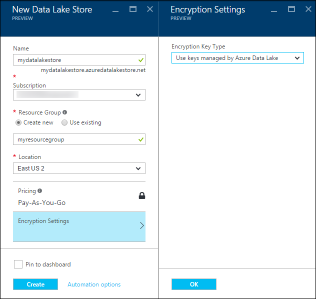
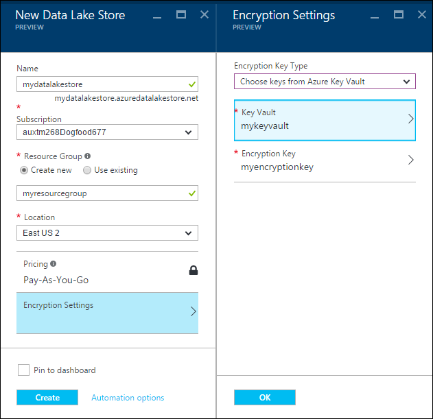
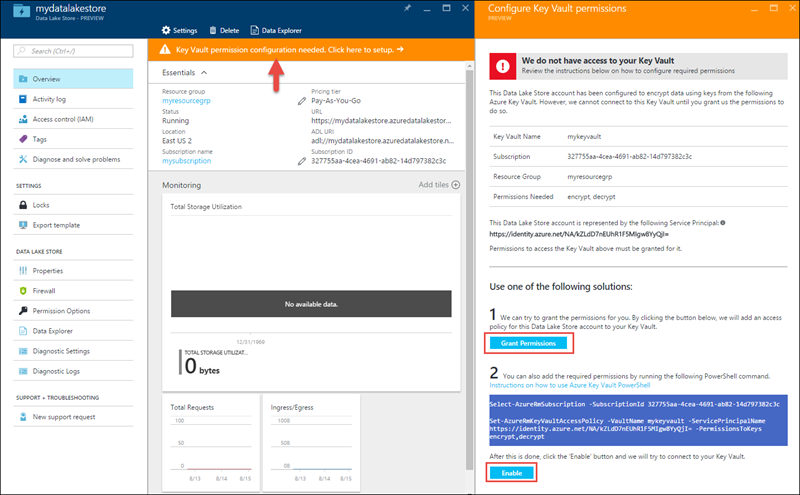

# Get started with Azure Data Lake Store using the Azure Portal
> [!div class="op_single_selector"]
> * [Portal](data-lake-store-get-started-portal.md)
> * [PowerShell](data-lake-store-get-started-powershell.md)
> * [.NET SDK](data-lake-store-get-started-net-sdk.md)
> * [Java SDK](data-lake-store-get-started-java-sdk.md)
> * [REST API](data-lake-store-get-started-rest-api.md)
> * [Azure CLI](data-lake-store-get-started-cli.md)
> * [Azure CLI 2.0](data-lake-store-get-started-cli-2.0.md)
> * [Node.js](data-lake-store-manage-use-nodejs.md)
> * [Python](data-lake-store-get-started-python.md)
>
> 

Learn how to use the Azure Portal to create an Azure Data Lake Store account and perform basic operations such as create folders, upload and download data files, delete your account, etc. For more information about Data Lake Store, see [Overview of Azure Data Lake Store](data-lake-store-overview.md).

## Prerequisites
Before you begin this tutorial, you must have the following:

* **An Azure subscription**. See [Get Azure free trial](https://azure.microsoft.com/pricing/free-trial/).

## Do you learn faster with videos?
Watch the following videos to get started with Data Lake Store.

* [Create a Data Lake Store account](https://mix.office.com/watch/1k1cycy4l4gen)
* [Manage data in Data Lake Store using the Data Explorer](https://mix.office.com/watch/icletrxrh6pc)

## Create an Azure Data Lake Store account
1. Sign on to the new [Azure Portal](https://portal.azure.com).
2. Click **NEW**, click **Data + Storage**, and then click **Azure Data Lake Store**. Read the information in the **Azure Data Lake Store** blade, and then click **Create** in the bottom left corner of the blade.
3. In the **New Data Lake Store** blade, provide the values as shown in the screen capture below:
   
    
   
   * **Name**. Enter a unique name for the Data Lake Store account.
   * **Subscription**. Select the subscription under which you want to create a new Data Lake Store account.
   * **Resource Group**. Select an existing resource group, or select the **Create new** option to create one. A resource group is a container that holds related resources for an application. For more information, see [Resource Groups in Azure](../azure-resource-manager/resource-group-overview.md#resource-groups).
   * **Location**: Select a location where you want to create the Data Lake Store account.
   * **Encryption Settings**. You can choose whether you want to encrypt your Data Lake Store account. If you choose to encrypt, you can also specify how to manage the master encryption key that you want to use for encrypting the data in your account.
     
     * (Optional) Select **Do not enable encryption** from the drop-down to opt out of encryption.
     * (Default) Select **Use keys managed by Azure Data Lake** if you want Azure Data Lake Store to manage your encryption keys.
       
         
     * (Optional) Select **Choose keys from Azure Key Vault** if you want to use your own keys present in your Azure Key Vault. With this option, you can also create a Key Vault account and keys if you do not already have one.
       
         
       
       Click **OK** in the **Encryption Settings** blade.
       
       > [!NOTE]
       > If you use the keys from an Azure Key Vault to configure encryption for the Data Lake Store account, you must assign permissions for the Azure Data Lake Store account to access the Azure Key Vault. For instructions on how to do this, see [Assign permissions to the Azure Key Vault](#assign-permissions-to-the-azure-key-vault)
       > 
       > 
4. Click **Create**. If you chose to pin the account to the dashboard, you are taken back to the dashboard and you can see the progress of your Data Lake Store account provisioning. Once the Data Lake Store account is provisioned, the account blade shows up.

## Assign permissions to the Azure Key Vault
If you used keys from an Azure Key Vault to configure encryption on the Data Lake Store account, you must configure access between the Data Lake Store account and the Azure Key Vault account. Perform the following steps to do so.

1. If you used keys from the Azure Key Vault, the blade for the Data Lake Store account displays a warning at the top. Click the warning to open the **Configure Key Vault Permissions** blade.
   
    
2. The blade shows two options to configure access.
   
   * In the first option, click **Grant Permission** to configure access. The first option is enabled only when the user that created the Data Lake Store account is also an admin for the Azure Key Vault.
   * The other option is to run the PowerShell cmdlet displayed on the blade. You need to be the owner of the Azure Key Vault or have the ability to grant permissions on the Azure Key Vault. After you have run the cmdlet, come back to the blade and click **Enable** to configure access.

## Create folders in Azure Data Lake Store account
You can create folders under your Data Lake Store account to manage and store data.

1. Open the Data Lake Store account that you just created. From the left pane, click **Browse**, click **Data Lake Store**, and then from the Data Lake Store blade, click the account name under which you want to create folders. If you pinned the account to the startboard, click that account tile.
2. In your Data Lake Store account blade, click **Data Explorer**.
   
    
3. In your Data Lake Store account blade, click **New Folder**, enter a name for the new folder, and then click **OK**.
   
    
   
    The newly created folder will be listed in the **Data Explorer** blade. You can create nested folders upto any level.
   
    

## Upload data to Azure Data Lake Store account
You can upload your data to an Azure Data Lake Store account directly at the root level or to a folder that you created within the account. In the screen capture below, follow the steps to upload a file to a sub-folder from the **Data Explorer** blade. In this screen capture, the file is uploaded to a sub-folder shown in the breadcrumbs (marked in a red box).

If you are looking for some sample data to upload, you can get the **Ambulance Data** folder from the [Azure Data Lake Git Repository](https://github.com/MicrosoftBigData/usql/tree/master/Examples/Samples/Data/AmbulanceData).

## Properties and actions available on the stored data
Click the newly added file to open the **Properties** blade. The properties associated with the file and the actions you can perform on the file are available in this blade. You can also copy the full path to file in your Azure Data Lake Store account, highlighted in the red box in the screen capture below.

* Click **Preview** to see a preview of the file, directly from the browser. You can specify the format of the preview as well. Click **Preview**, click **Format** in the **File Preview** blade, and in the **File Preview Format** blade specify the options such as number of rows to display, encoding to use, delimiter to use, etc.
  
  
* Click **Download** to download the file to your computer.
* Click **Rename file** to rename the file.
* Click **Delete file** to delete the file.

## Secure your data
You can secure the data stored in your Azure Data Lake Store account using Azure Active Directory and access control (ACLs). For instructions on how to do that, see [Securing data in Azure Data Lake Store](data-lake-store-secure-data.md).

## Delete Azure Data Lake Store account
To delete an Azure Data Lake Store account, from your Data Lake Store blade, click **Delete**. To confirm the action, you'll be prompted to enter the name of the account you wish to delete. Enter the name of the account, and then click **Delete**.

## Next steps
* [Secure data in Data Lake Store](data-lake-store-secure-data.md)
* [Use Azure Data Lake Analytics with Data Lake Store](../data-lake-analytics/data-lake-analytics-get-started-portal.md)
* [Use Azure HDInsight with Data Lake Store](data-lake-store-hdinsight-hadoop-use-portal.md)
* [Access diagnostic logs for Data Lake Store](data-lake-store-diagnostic-logs.md)

