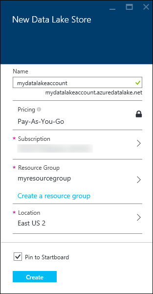
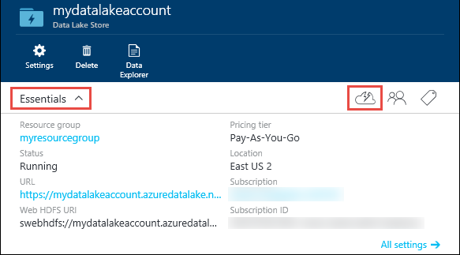
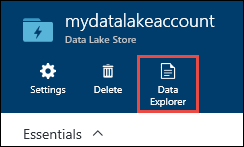
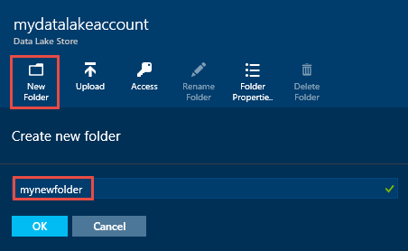
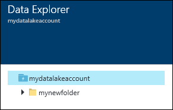
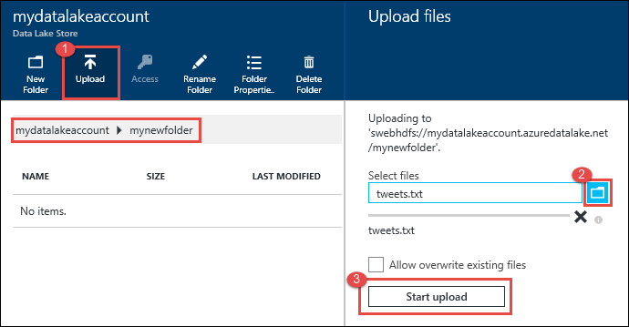
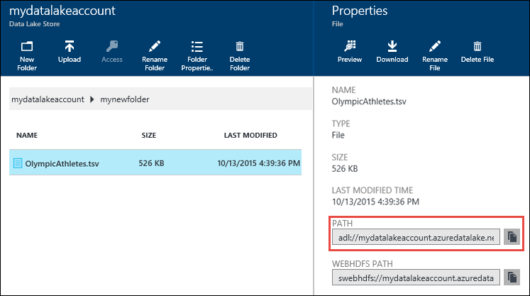
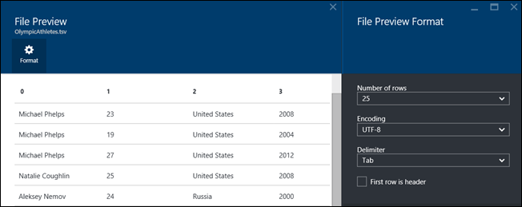
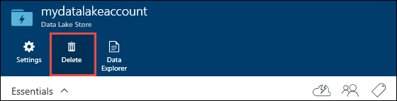

<properties 
   pageTitle="Get started with Data Lake Store | Azure" 
   description="Use the portal to create a Data Lake Store account and perform basic operations in the Data Lake Store" 
   services="data-lake-store" 
   documentationCenter="" 
   authors="nitinme" 
   manager="paulettm" 
   editor="cgronlun"/>
 
<tags
   ms.service="data-lake-store"
   ms.devlang="na"
   ms.topic="article"
   ms.tgt_pltfrm="na"
   ms.workload="big-data" 
   ms.date="10/27/2015"
   ms.author="nitinme"/>

# Get started with Azure Data Lake Store using the Azure preview portal

> [AZURE.SELECTOR]
- [Portal](data-lake-store-get-started-portal.md)
- [PowerShell](data-lake-store-get-started-powershell.md)
- [.NET SDK](data-lake-store-get-started-net-sdk.md)

Learn how to use the Azure Preview Portal to create an Azure Data Lake Store account and perform basic operations such as create folders, upload and download data files, delete your account, etc. For more information about Data Lake Store, see [Overview of Azure Data Lake Store](data-lake-store-overview.md).

## Prerequisites

Before you begin this tutorial, you must have the following:

- **An Azure subscription**. See [Get Azure free trial](http://azure.microsoft.com/documentation/videos/get-azure-free-trial-for-testing-hadoop-in-hdinsight/).

## Create an Azure Data Lake Store account

1. Sign on to the new [Azure preview portal](https://portal.azure.com).

2. Click **NEW**, click **Marketplace**, search for **Data Lake**, and from the results click **Azure Data Lake Store**. Read the information in the **Azure Data Lake Store** blade, and then click **Create** in the bottom left corner of the blade.

3. In the **New Data Lake Store** blade, provide the values as shown in the screen capture below:

	

	- **Subscription**. Select the subscription under which you want to create a new Data Lake Store account.
	- **Resource Group**. Select an existing resource group, or click **Create a resource group** to create one. A resource group is a container that holds related resources for an application. For more information, see [Resource Groups in Azure](resource-group-overview.md#resource-groups).
	- **Location**: Select a location where you want to create the Data Lake Store account.

4. Select **Pin to Startboard** if you want the Data Lake Store account to be accessible from the Startboard.

5. Click **Create**. If you chose to pin the account to the startboard, you are taken back to the startboard and you can see the progress of your Data Lake Store account provisioning. Once the Data Lake Store account is provisioned, the account blade shows up.

6. Expand the **Essentials** drop-down to see the information about your Data Lake Store account such as the resource group it is a part of, the location, etc. Click the **Quick Start** icon to see links to other resources related to Data Lake Store.

	

## Create directory structures in Azure Data Lake Store account

You can create directories under your Data Lake Store account to manage and store data.

1. Open the Data Lake Store account that you just created. From the left pane, click **Browse**, click **Data Lake Store**, and then from the Data Lake Store blade, click the account name under which you want to create directories. If you pinned the account to the startboard, click that account tile.

2. In your Data Lake Store account blade, click **Data Explorer**.

	

3. In your Data Lake Store account blade, click **New Folder**, enter a name for the new folder, and then click **OK**.
	
	
	
	The newly created directory will be listed in the **Data Explorer** blade. You can create nested directories upto any level.

	

## Upload data to Azure Data Lake Store account

You can upload your data to an Azure Data Lake Store account directly at the root level or to a directory that you created within the account. In the screen capture below, follow the steps to upload a file to a sub-directory from the **Data Explorer** blade. In this screen capture, the file is uploaded to a sub-directory shown in the breadcrumbs (marked in a red box).

## Properties and actions available on the stored data

Click the newly added file to open the **Properties** blade. The properties associated with the file and the actions you can perform on the file are available in this blade. You can also copy the full path to file in your Azure Data Lake Store account, highlighted in the red box in the screen capture below.

* Click **Preview** to see a preview of the file, directly from the browser. You can specify the format of the preview as well. Click **Preview**, click **Format** in the **File Preview** blade, and in the **File Preview Format** blade specify the options such as number of rows to display, encoding to use, delimiter to use, etc.

  

* Click **Download** to download the file to your computer.

* Click **Rename file** to rename the file.

* Click **Delete file** to delete the file.

## Secure your data

You can secure the data stored in your Azure Data Lake Store account using Azure Active Directory and access control (ACLs). For instructions on how to do that, see [Securing data in Azure Data Lake Store](data-lake-store-secure-data.md).

## Delete Azure Data Lake Store account

To delete an Azure Data Lake Store account, from your Data Lake Store blade, click **Delete**. To confirm the action, you'll be prompted to enter the name of the account you wish to delete. Enter the name of the account, and then click **Delete**.

## See Also

- [Use Azure Data Lake Analytics with Data Lake Store](data-lake-analytics-get-started-portal.md)
- [Use Azure HDInsight with Data Lake Store](data-lake-store-hdinsight-hadoop-use-portal.md)
- [Get Started with Data Lake Store using PowerShell](data-lake-store-get-started-powershell.md)
- [Get Started with Data Lake Store using .NET SDK](data-lake-store-get-started-net-sdk.md)