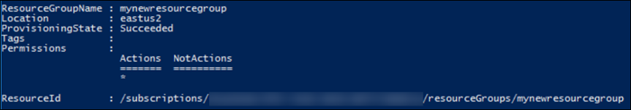
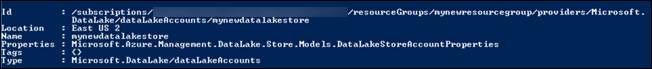
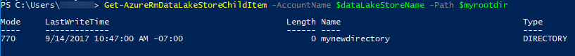

---
title: Get started with Azure Data Lake Storage Gen1 - PowerShell | Microsoft Docs
description: Use Azure PowerShell to create an Azure Data Lake Storage Gen1 account and perform basic operations.

author: twooley
ms.service: data-lake-store
ms.topic: conceptual
ms.date: 06/27/2018
ms.author: twooley

---
# Get started with Azure Data Lake Storage Gen1 using Azure PowerShell

> [!div class="op_single_selector"]
> * [Portal](data-lake-store-get-started-portal.md)
> * [PowerShell](data-lake-store-get-started-powershell.md)
> * [Azure CLI](data-lake-store-get-started-cli-2.0.md)
>
>

[!INCLUDE [data-lake-storage-gen1-rename-note.md](../../includes/data-lake-storage-gen1-rename-note.md)]

Learn how to use Azure PowerShell to create an Azure Data Lake Storage Gen1 account and perform basic operations such as create folders, upload and download data files, delete your account, etc. For more information about Data Lake Storage Gen1, see [Overview of Data Lake Storage Gen1](data-lake-store-overview.md).

## Prerequisites

[!INCLUDE [updated-for-az](../../includes/updated-for-az.md)]

* **An Azure subscription**. See [Get Azure free trial](https://azure.microsoft.com/pricing/free-trial/).
* **Azure PowerShell 1.0 or greater**. See [How to install and configure Azure PowerShell](/powershell/azure/overview).

## Authentication

This article uses a simpler authentication approach with Data Lake Storage Gen1 where you're prompted to enter your Azure account credentials. The access level to Data Lake Storage Gen1 account and file system is then governed by the access level of the logged in user. However, there are other approaches to authenticate with Data Lake Storage Gen1, which are end-user authentication or service-to-service authentication. For instructions and more information on how to authenticate, see [End-user authentication](data-lake-store-end-user-authenticate-using-active-directory.md) or [Service-to-service authentication](data-lake-store-authenticate-using-active-directory.md).

## Create a Data Lake Storage Gen1 account

1. From your desktop, open a new Windows PowerShell window. Enter the following snippet to log in to your Azure account, set the subscription, and register the Data Lake Storage Gen1 provider. When prompted to log in, make sure you log in as one of the subscription administrators/owner:

    ```PowerShell
    # Log in to your Azure account
    Connect-AzAccount

    # List all the subscriptions associated to your account
    Get-AzSubscription

    # Select a subscription
    Set-AzContext -SubscriptionId <subscription ID>

    # Register for Azure Data Lake Storage Gen1
    Register-AzResourceProvider -ProviderNamespace "Microsoft.DataLakeStore"
    ```

1. A Data Lake Storage Gen1 account is associated with an Azure resource group. Start by creating a resource group.

    ```PowerShell
    $resourceGroupName = "<your new resource group name>"
    New-AzResourceGroup -Name $resourceGroupName -Location "East US 2"
    ```

    

1. Create a Data Lake Storage Gen1 account. The name you specify must only contain lowercase letters and numbers.

    ```PowerShell
    $dataLakeStorageGen1Name = "<your new Data Lake Storage Gen1 account name>"
    New-AzDataLakeStoreAccount -ResourceGroupName $resourceGroupName -Name $dataLakeStorageGen1Name -Location "East US 2"
    ```

    

1. Verify that the account is successfully created.

    ```PowerShell
    Test-AzDataLakeStoreAccount -Name $dataLakeStorageGen1Name
    ```

    The output for the cmdlet should be **True**.

## Create directory structures

You can create directories under your Data Lake Storage Gen1 account to manage and store data.

1. Specify a root directory.

    ```PowerShell
    $myrootdir = "/"
    ```

1. Create a new directory called **mynewdirectory** under the specified root.

    ```PowerShell
    New-AzDataLakeStoreItem -Folder -AccountName $dataLakeStorageGen1Name -Path $myrootdir/mynewdirectory
    ```

1. Verify that the new directory is successfully created.

    ```PowerShell
    Get-AzDataLakeStoreChildItem -AccountName $dataLakeStorageGen1Name -Path $myrootdir
    ```

    It should show an output as shown in the following screenshot:

    

## Upload data

You can upload your data to Data Lake Storage Gen1 directly at the root level, or to a directory that you created within the account. The snippets in this section demonstrate how to upload some sample data to the directory (**mynewdirectory**) you created in the previous section.

If you are looking for some sample data to upload, you can get the **Ambulance Data** folder from the [Azure Data Lake Git Repository](https://github.com/MicrosoftBigData/usql/tree/master/Examples/Samples/Data/AmbulanceData). Download the file and store it in a local directory on your computer, such as  C:\sampledata\.

```PowerShell
Import-AzDataLakeStoreItem -AccountName $dataLakeStorageGen1Name `
   -Path "C:\sampledata\vehicle1_09142014.csv" `
   -Destination $myrootdir\mynewdirectory\vehicle1_09142014.csv
```

## Rename, download, and delete data

To rename a file, use the following command:

```PowerShell
Move-AzDataLakeStoreItem -AccountName $dataLakeStorageGen1Name `
    -Path $myrootdir\mynewdirectory\vehicle1_09142014.csv `
    -Destination $myrootdir\mynewdirectory\vehicle1_09142014_Copy.csv
```

To download a file, use the following command:

```PowerShell
Export-AzDataLakeStoreItem -AccountName $dataLakeStorageGen1Name `
    -Path $myrootdir\mynewdirectory\vehicle1_09142014_Copy.csv `
    -Destination "C:\sampledata\vehicle1_09142014_Copy.csv"
```

To delete a file, use the following command:

```PowerShell
Remove-AzDataLakeStoreItem -AccountName $dataLakeStorageGen1Name `
    -Paths $myrootdir\mynewdirectory\vehicle1_09142014_Copy.csv
```

When prompted, enter **Y** to delete the item. If you have more than one file to delete, you can provide all the paths separated by comma.

```PowerShell
Remove-AzDataLakeStoreItem -AccountName $dataLakeStorageGen1Name `
    -Paths $myrootdir\mynewdirectory\vehicle1_09142014.csv, $myrootdir\mynewdirectoryvehicle1_09142014_Copy.csv
```

## Delete your account

Use the following command to delete your Data Lake Storage Gen1 account.

```PowerShell
Remove-AzDataLakeStoreAccount -Name $dataLakeStorageGen1Name
```

When prompted, enter **Y** to delete the account.

## Next steps

* [Performance tuning guidance for using PowerShell with Azure Data Lake Storage Gen1](data-lake-store-performance-tuning-powershell.md)
* [Use Azure Data Lake Storage Gen1 for big data requirements](data-lake-store-data-scenarios.md)
* [Secure data in Data Lake Storage Gen1](data-lake-store-secure-data.md)
* [Use Azure Data Lake Analytics with Data Lake Storage Gen1](../data-lake-analytics/data-lake-analytics-get-started-portal.md)
* [Use Azure HDInsight with Data Lake Storage Gen1](data-lake-store-hdinsight-hadoop-use-portal.md)
