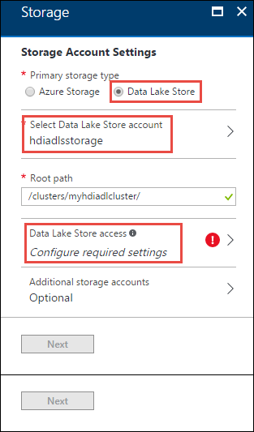
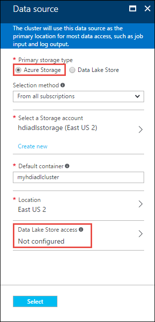
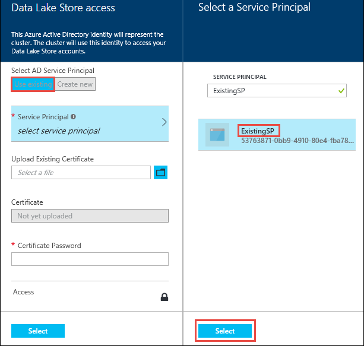
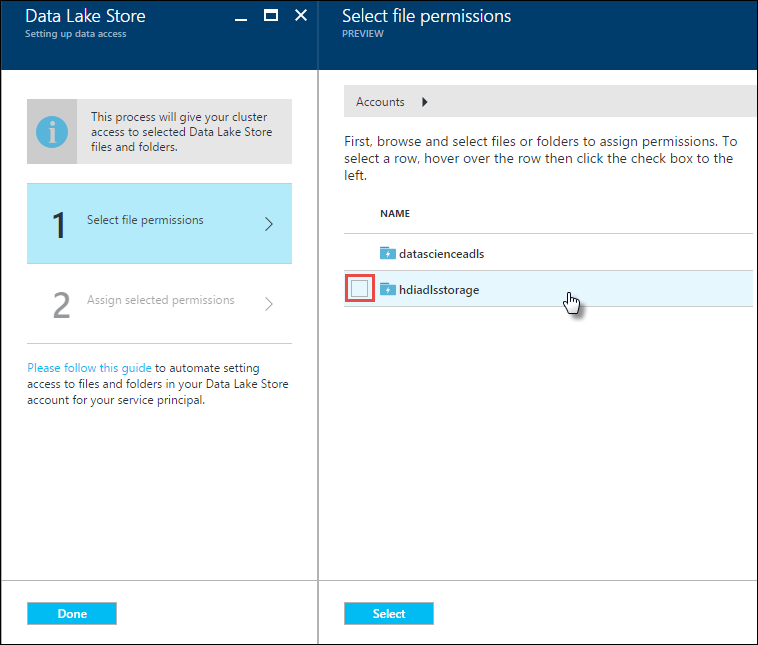
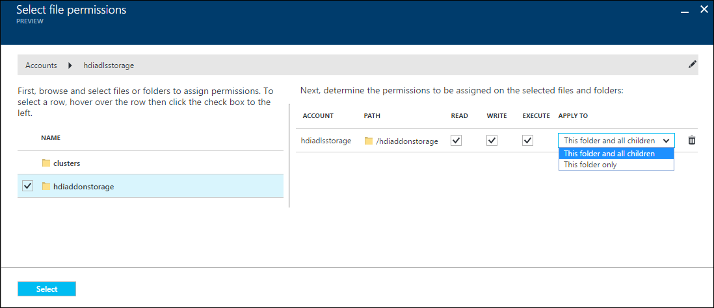
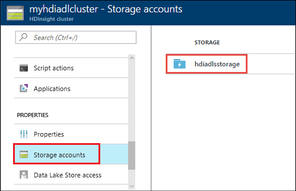
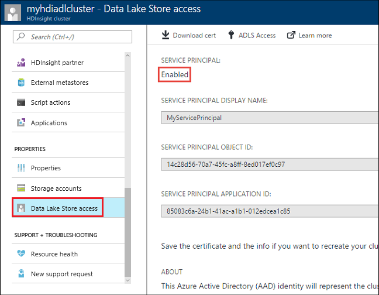

# Create HDInsight clusters with Azure Data Lake Storage Gen1 by using the Azure portal

> [!div class="op_single_selector"]
> * [Use the Azure portal](data-lake-store-hdinsight-hadoop-use-portal.md)
> * [Use PowerShell (for default storage)](data-lake-store-hdinsight-hadoop-use-powershell-for-default-storage.md)
> * [Use PowerShell (for additional storage)](data-lake-store-hdinsight-hadoop-use-powershell.md)
> * [Use Resource Manager](data-lake-store-hdinsight-hadoop-use-resource-manager-template.md)
>
>

Learn how to use the Azure portal to create a HDInsight cluster with Azure Data Lake Storage Gen1 as the default storage or an additional storage. Even though additional storage is optional for a HDInsight cluster, it's recommended to store your business data in the additional storage accounts.

## Prerequisites

Before you begin, ensure that you've met the following requirements:

* **An Azure subscription**. Go to [Get Azure free trial](https://azure.microsoft.com/pricing/free-trial/).
* **An Azure Data Lake Storage Gen1 account**. Follow the instructions from [Get started with Azure Data Lake Storage Gen1 by using the Azure portal](data-lake-store-get-started-portal.md). You must also create a root folder on the account.  In this article, a root folder called __/clusters__ is used.
* **a Microsoft Entra service principal**. This how-to guide provides instructions on how to create a service principal in Microsoft Entra ID. However, to create a service principal, you must be a Microsoft Entra administrator. If you're an administrator, you can skip this prerequisite and continue.

>[!NOTE]
>You can create a service principal only if you're a Microsoft Entra administrator. Your Microsoft Entra administrator must create a service principal before you can create an HDInsight cluster with Data Lake Storage Gen1. Also, the service principal must be created with a certificate, as described at [Create a service principal with certificate](../active-directory/develop/howto-authenticate-service-principal-powershell.md#create-service-principal-with-self-signed-certificate).
>

## Create an HDInsight cluster

In this section, you create a HDInsight cluster with Data Lake Storage Gen1 as the default or the additional storage. This article focuses only on the part of configuring Data Lake Storage Gen1. For the general cluster creation information and procedures, see [Create Hadoop clusters in HDInsight](../hdinsight/hdinsight-hadoop-provision-linux-clusters.md).

### Create a cluster with Data Lake Storage Gen1 as default storage

To create an HDInsight cluster with a Data Lake Storage Gen1 as the default storage account:

1. Sign in to the [Azure portal](https://portal.azure.com).
2. Follow [Create clusters](../hdinsight/hdinsight-hadoop-create-linux-clusters-portal.md#create-clusters) for the general information on creating HDInsight clusters.
3. On the **Storage** blade, under **Primary storage type**, select **Azure Data Lake Storage Gen1**, and then enter the following information:

    

    * **Select Data Lake Store account**: Select an existing Data Lake Storage Gen1 account. An existing Data Lake Storage Gen1 account is required.  See [Prerequisites](#prerequisites).
    * **Root path**: Enter a path where the cluster-specific files are to be stored. On the screenshot, it is __/clusters/myhdiadlcluster/__, in which the __/clusters__ folder must exist, and the Portal creates *myhdicluster* folder.  The *myhdicluster* is the cluster name.
    * **Data Lake Store access**: Configure access between the Data Lake Storage Gen1 account and HDInsight cluster. For instructions, see [Configure Data Lake Storage Gen1 access](#configure-data-lake-storage-gen1-access).
    * **Additional storage accounts**: Add Azure storage accounts as additional storage accounts for the cluster. To add additional Data Lake Storage Gen1 accounts is done by giving the cluster permissions on data in more Data Lake Storage Gen1 accounts while configuring a Data Lake Storage Gen1 account as the primary storage type. See [Configure Data Lake Storage Gen1 access](#configure-data-lake-storage-gen1-access).

4. On the **Data Lake Store access**, click **Select**, and then continue with cluster creation as described in [Create Hadoop clusters in HDInsight](../hdinsight/hdinsight-hadoop-create-linux-clusters-portal.md).

### Create a cluster with Data Lake Storage Gen1 as additional storage

The following instructions create a HDInsight cluster with an Azure Blob storage account as the default storage, and a storage account with Data Lake Storage Gen1 as an additional storage.

To create a HDInsight cluster with Data Lake Storage Gen1 as an additional storage account:

1. Sign in to the [Azure portal](https://portal.azure.com).
2. Follow [Create clusters](../hdinsight/hdinsight-hadoop-create-linux-clusters-portal.md#create-clusters) for the general information on creating HDInsight clusters.
3. On the **Storage** blade, under **Primary storage type**, select **Azure Storage**, and then enter the following information:

    

    * **Selection method** - To specify a storage account that is part of your Azure subscription,  select **My subscriptions**, and then select the storage account. To specify a storage account that is outside your Azure subscription, select **Access key**, and then provide the information for the outside storage account.

    * **Default container** - Use either the default value or specify your own name.
    * **Additional storage accounts** - Add more Azure storage accounts as the additional storage.
    * **Data Lake Store access** - Configure access between the Data Lake Storage Gen1 account and HDInsight cluster. For instructions see [Configure Data Lake Storage Gen1 access](#configure-data-lake-storage-gen1-access).

## Configure Data Lake Storage Gen1 access

In this section, you configure Data Lake Storage Gen1 access from HDInsight clusters using a Microsoft Entra service principal.

### Specify a service principal

From the Azure portal, you can either use an existing service principal or create a new one.

To create a service principal from the Azure portal:
1. See [Create Service Principal and Certificates](../active-directory/develop/howto-create-service-principal-portal.md) using Microsoft Entra ID.

To use an existing service principal from the Azure portal:

1. Service Principal should have owner permissions on the Storage account. See [Set up permissions for the Service Principal to be owner on the storage account](#configure-serviceprincipal-permissions).
1. Select **Data Lake Store access**.
1. On the **Data Lake Storage Gen1 access** blade, select **Use existing**.
1. Select **Service principal**, and then select a service principal.
1. Upload the certificate (.pfx file) that's associated with your selected service principal, and then enter the certificate password.

    

1. Select **Access** to configure the folder access.  See [Configure file permissions](#configure-file-permissions).

### <a name="configure-serviceprincipal-permissions"></a>Set up permissions for the Service Principal to be owner on the storage account
1. On the Access Control(IAM) blade of storage account click Add a role assignment. 
2. On the Add a role assignment blade select Role as ‘owner’, and select the SPN and click save.

### <a name="configure-file-permissions"></a>Configure file permissions

The configuration is different depending on whether the account is used as the default storage or an additional storage account:

* Used as default storage

  * permission at the root level of the Data Lake Storage Gen1 account
  * permission at the root level of the HDInsight cluster storage. For example, the __/clusters__ folder used earlier in the tutorial.

* Use as an additional storage

  * Permission at the folders where you need file access.

To assign permission at the storage account with Data Lake Storage Gen1 at the root level:

1. On the **Data Lake Storage Gen1 access** blade, select **Access**. The **Select file permissions** blade is opened. It lists all the storage accounts in your subscription.
1. Hover (do not click) the mouse over the name of the account with Data Lake Storage Gen1 to make the check box visible, then select the check box.

    

   By default, __READ__, __WRITE__, AND __EXECUTE__ are all selected.

1. Click **Select** on the bottom of the page.
1. Select **Run** to assign permission.
1. Select **Done**.

To assign permission at the HDInsight cluster root level:

1. On the **Data Lake Storage Gen1 access** blade, select **Access**. The **Select file permissions** blade is opened. It lists all the storage accounts with Data Lake Storage Gen1 in your subscription.
1. From the **Select file permissions** blade, select the storage account with Data Lake Storage Gen1 name to show its content.
1. Select the HDInsight cluster storage root by selecting the checkbox on the left of the folder. According to the screenshot earlier, the cluster storage root is __/clusters__ folder that you specified while selecting Data Lake Storage Gen1 as default storage.
1. Set the permissions on the folder.  By default, read, write, and execute are all selected.
1. Click **Select** on the bottom of the page.
1. Select **Run**.
1. Select **Done**.

If you are using Data Lake Storage Gen1 as additional storage, you must assign permission only for the folders that you want to access from the HDInsight cluster. For example, in the screenshot below, you provide access only to the **mynewfolder** folder in a storage account with Data Lake Storage Gen1.



## <a name="verify-cluster-set-up"></a>Verify cluster setup

After the cluster setup is complete, on the cluster blade, verify your results by doing either or both of the following steps:

* To verify that the associated storage for the cluster is the account with Data Lake Storage Gen1 that you specified, select **Storage accounts** in the left pane.

    

* To verify that the service principal is correctly associated with the HDInsight cluster, select **Data Lake Storage Gen1 access** in the left pane.

    

## Examples

After you set up the cluster with Data Lake Storage Gen1 as your storage, see these examples of how to use HDInsight cluster to analyze the data that's stored in Data Lake Storage Gen1.

### Run a Hive query against data in a Data Lake Storage Gen1 (as primary storage)

To run a Hive query, use the Hive views interface in the Ambari portal. For instructions on how to use Ambari Hive views, see [Use the Hive View with Hadoop in HDInsight](../hdinsight/hadoop/apache-hadoop-use-hive-ambari-view.md).

When you work with data in a Data Lake Storage Gen1, there are a few strings to change.

If you use, for example, the cluster that you created with Data Lake Storage Gen1 as primary storage, the path to the data is: *adl://<data_lake_storage_gen1_account_name>/azuredatalakestore.net/path/to/file*. A Hive query to create a table from sample data that's stored in the Data Lake Storage Gen1 looks like the following statement:

```console
CREATE EXTERNAL TABLE websitelog (str string) LOCATION 'adl://hdiadlsg1storage.azuredatalakestore.net/clusters/myhdiadlcluster/HdiSamples/HdiSamples/WebsiteLogSampleData/SampleLog/'
```

Descriptions:

* `adl://hdiadlsg1storage.azuredatalakestore.net/` is the root of the account with Data Lake Storage Gen1.
* `/clusters/myhdiadlcluster` is the root of the cluster data that you specified while creating the cluster.
* `/HdiSamples/HdiSamples/WebsiteLogSampleData/SampleLog/` is the location of the sample file that you used in the query.

### Run a Hive query against data in a Data Lake Storage Gen1 (as additional storage)

If the cluster that you created uses Blob storage as default storage, the sample data is not contained in the storage account with Data Lake Storage Gen1 that's used as additional storage. In such a case, first transfer the data from Blob storage to the storage account with Data Lake Storage Gen1, and then run the queries as shown in the preceding example.

For information on how to copy data from Blob storage to a storage account with Data Lake Storage Gen1, see the following articles:

* [Use Distcp to copy data between Azure Blob storage and Data Lake Storage Gen1](data-lake-store-copy-data-wasb-distcp.md)
* [Use AdlCopy to copy data from Azure Blob storage to Data Lake Storage Gen1](data-lake-store-copy-data-azure-storage-blob.md)

### Use Data Lake Storage Gen1 with a Spark cluster

You can use a Spark cluster to run Spark jobs on data that is stored in a Data Lake Storage Gen1. For more information, see [Use HDInsight Spark cluster to analyze data in Data Lake Storage Gen1](../hdinsight/spark/apache-spark-use-with-data-lake-store.md).

### Use Data Lake Storage Gen1 in a Storm topology

## See also

* [Use Data Lake Storage Gen1 with Azure HDInsight clusters](../hdinsight/hdinsight-hadoop-use-data-lake-storage-gen1.md)
* [PowerShell: Create an HDInsight cluster to use Data Lake Storage Gen1](data-lake-store-hdinsight-hadoop-use-powershell.md)

[makecert]: /windows-hardware/drivers/devtest/makecert
[pvk2pfx]: /windows-hardware/drivers/devtest/pvk2pfx
