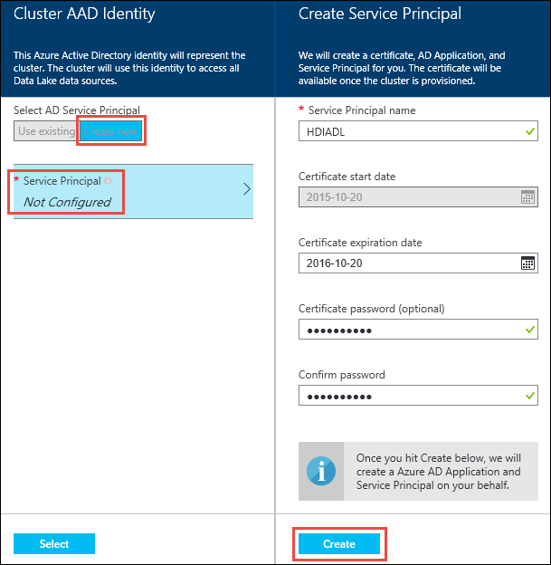
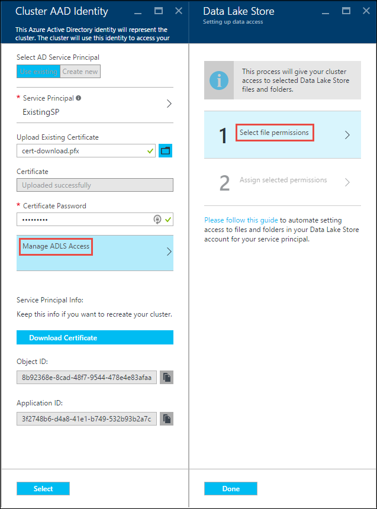
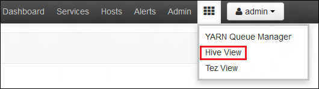
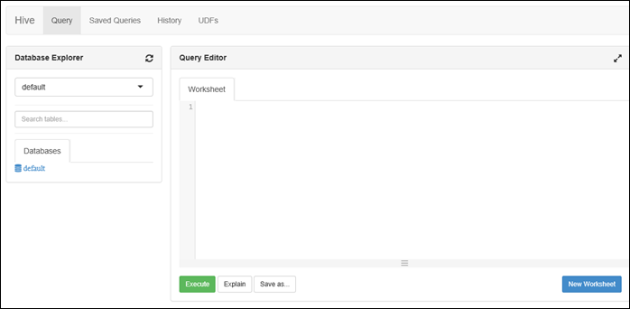
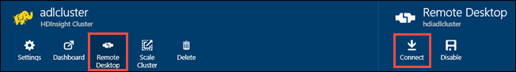

<properties
   pageTitle="Create HDInsight Hadoop clusters with Azure Data Lake Store using the portal | Azure"
   description="Use Azure Portal to create and use HDInsight Hadoop clusters with Azure Data Lake Store"
   services="data-lake-store,hdinsight" 
   documentationCenter=""
   authors="nitinme"
   manager="paulettm"
   editor="cgronlun"/>

<tags
   ms.service="data-lake-store"
   ms.devlang="na"
   ms.topic="article"
   ms.tgt_pltfrm="na"
   ms.workload="big-data"
   ms.date="04/27/2016"
   ms.author="nitinme"/>

# Create an HDInsight cluster with Data Lake Store using Azure Portal

> [AZURE.SELECTOR]
- [Using Portal](data-lake-store-hdinsight-hadoop-use-portal.md)
- [Using PowerShell](data-lake-store-hdinsight-hadoop-use-powershell.md)

Learn how to use Azure Portal to create an HDInsight cluster (Hadoop, HBase, or Storm) with access to Azure Data Lake Store. Some important considerations for this release:

* **For Hadoop clusters (Windows and Linux)**, the Data Lake Store can only be used as an additional storage account. The default storage account for the such clusters will still be Azure Storage Blobs (WASB).

* **For Storm clusters (Windows and Linux)**, the Data Lake Store can be used to write data from a Storm topology. Data Lake Store can also be used to store reference data that can then be read by a Storm topology. For more information, see [Use Data Lake Store in a Storm topology](#use-data-lake-store-in-a-storm-topology).

* **For HBase clusters (Windows and Linux)**, the Data Lake Store can be used as a default storage or additional storage. For more information, see [Use Data Lake Store with HBase clusters](#use-data-lake-store-with-hbase-clusters).

> [AZURE.NOTE] Option to create HDInsight clusters with access to Data Lake Store is available only for HDInsight version 3.2 (for Windows as well as Linux). 

## Prerequisites

Before you begin this tutorial, you must have the following:

- **An Azure subscription**. See [Get Azure free trial](https://azure.microsoft.com/pricing/free-trial/).
- **Enable your Azure subscription** for Data Lake Store Public Preview. See [instructions](data-lake-store-get-started-portal.md#signup).
- **Azure Data Lake Store account**. Follow the instructions at [Get started with Azure Data Lake Store using the Azure Portal](data-lake-store-get-started-portal.md). Once you have created the account, perform the following tasks to upload some sample data. You'll need this data later in the tutorial to run jobs from an HDInsight cluster that access data in the Data Lake Store.

	* [Create a folder in your Data Lake Store](data-lake-store-get-started-portal.md#createfolder).
	* [Upload a file to your Data Lake Store](data-lake-store-get-started-portal.md#uploaddata). If you are looking for some sample data to upload, you can get the **Ambulance Data** folder from the [Azure Data Lake Git Repository](https://github.com/Azure/usql/tree/master/Examples/Samples/Data/AmbulanceData).

## Create an HDInsight cluster with access to Azure Data Lake Store

In this section, you create an HDInsight Hadoop cluster that uses the Data Lake Store as an additional storage. In this release, for a Hadoop cluster, Data Lake Store can only be used as an additional storage for the cluster. The default storage will still be the Azure storage blobs (WASB). So, we'll first create the storage account and storage containers required for the cluster.

1. Sign on to the new [Azure Portal](https://portal.azure.com).

2. Follow the steps at [Create Hadoop clusters in HDInsight](../hdinsight/hdinsight-provision-clusters.md#create-using-the-preview-portal) to start provisioning an HDInsight cluster.

3. On the **Optional Configuration** blade, click **Data Source**. In the **Data Source** blade, specify the details for the storage account and storage container, specify **Location** as **East US 2**, and then click **Cluster AAD Identity**.

	

4. On the **Cluster AAD Identity** blade, you can choose to select an existing Service Principal or create a new one.

	* **Create a new Service Principal**

		* In the **Cluster AAD Identity** blade, click **Create new**, click **Service Principal**, and then in the **Create a Service Principal** blade, provide values to create a new service principal. As part of that, a certificate and an Azure Active Directory application is also created. Click **Create**.

			

		* On the **Cluster AAD Identity** blade, click **Manage ADLS Access**. The pane shows the Data Lake Store accounts associated with the subscription. However, you can set the permissions only for the account that you created. Select READ/WRITE/EXECUTE permissions for the account you want to associate with the HDInsight cluster and then click **Save Permissions**.

			

		* On the **Cluster AAD Identity** blade, click **Download Certificate** to download the certificate associated with the service principal you created. This is useful if you want to use the same service principal in the future, while creating additional HDInsight clusters. Click **Select**.

			

	* **Choose an existing Service Principal**.

		* In the **Cluster AAD Identity** blade, click **Use existing**, click **Service Principal**, and then in the **Select a Service Principal** blade, search for an existing service principal. Click a service principal name and then click **Select**.

			

		* On the **Cluster AAD Identity** blade, upload the certificate (.pfx) associated with the service principal you selected, and then provide the certificate password.

		* Click **Manage ADLS Access**. The pane shows the Data Lake Store accounts associated with the subscription. However, you can set the permissions only for the account that you created. Select READ/WRITE/EXECUTE permissions for the account you want to associate with the HDInsight cluster and then click **Save Permissions**.

			

		* Click **Save Permissions** and then click **Select**.

6. Click **Select** on the **Data Source** blade and continue with cluster provisioning as described at [Create Hadoop clusters in HDInsight](../hdinsight/hdinsight-provision-clusters.md#create-using-the-preview-portal).

7. Once the cluster is provisioned, you can verify that the Service Principal is associated with the HDInsight cluster. To do so, from the cluster blade, click **Settings**, click **Cluster AAD Identity**, and you should see the associated Service Principal.

	

## Run test jobs on the HDInsight cluster to use the Azure Data Lake Store

After you have configured an HDInsight cluster, you can run test jobs on the cluster to test that the HDInsight cluster can access data in Azure Data Lake Store. To do so, we will run some hive queries that target the Data Lake Store.

### For a Linux cluster

1. Open the cluster blade for the cluster that you just provisioned and then click **Dashboard**. This opens Ambari for the Linux cluster. When accessing Ambari, you will be prompted to authenticate to the site. Enter the admin (default admin,) account name and password you used when creating the cluster.

	

	You can also navigate directly to Ambari by going to https://CLUSTERNAME.azurehdinsight.net in a web browser (where **CLUSTERNAME** is the name of your HDInsight cluster).

2. Open the Hive view. Select the set of squares from the page menu (next to the **Admin** link and button on the right of the page,) to list available views. Select the **Hive** view.

	

3. You should see a page similar to the following:

	

4. In the **Query Editor** section of the page, paste the following HiveQL statement into the worksheet:

		CREATE EXTERNAL TABLE vehicles (str string) LOCATION 'adl://mydatalakestore.azuredatalakestore.net:443/mynewfolder'

5. Click the **Execute** button at the bottom of the **Query Editor** to start the query. A **Query Process Results** section should appear beneath the **Query Editor** and display information about the job.

6. Once the query has finished, the **Query Process Results** section will display the results of the operation. The **Results** tab should contain the following information:

7. Run the following query to verify that the table was created.

		SHOW TABLES;

	The **Results** tab should show the following:

		hivesampletable
		vehicles

	**vehicles** is the table you created earlier. **hivesampletable** is a sample table available in all HDInsight clusters by default.

8. You can also run a query to retrieve data from the **vehicles** table.

		SELECT * FROM vehicles LIMIT 5;

### For a Windows cluster

1. Open the cluster blade for the cluster that you just provisioned and then click **Dashboard**.

	

	When prompted, enter the administrator credentials for the cluster.

2. This opens the Microsoft Azure HDInsight Query Console. Click **Hive Editor**.

	

3. In the Hive Editor, enter the following query and then click **Submit**.

		CREATE EXTERNAL TABLE vehicles (str string) LOCATION 'adl://mydatalakestore.azuredatalakestore.net:443/mynewfolder'

	In this Hive query, we create a table from data stored in Data Lake Store at `adl://mydatalakestore.azuredatalakestore.net:443/mynewfolder`. This location has a sample data file that you should have uploaded earlier.

	The **Job Session** table at the bottom shows the status of the job changing from **Initializing**, to **Running**, to **Completed**. You can also click **View Details** to see more information about the completed job.

	

4. Run the following query to verify that the table was created.

		SHOW TABLES;

	Click **View Details** corresponding to this query and the output should show the following:

		hivesampletable
		vehicles

	**vehicles** is the table you created earlier. **hivesampletable** is a sample table available in all HDInsight clusters by default.

5. You can also run a query to retrieve data from the **vehicles** table.

		SELECT * FROM vehicles LIMIT 5;

## Access Data Lake Store using HDFS commands

Once you have configured the HDInsight cluster to use Data Lake Store, you can use the HDFS shell commands to access the store.

### For a Linux cluster

In this section you will SSH into the cluster and run the HDFS commands. Windows does not provide a built-in SSH client. We recommend using **PuTTY**, which can be downloaded from [http://www.chiark.greenend.org.uk/~sgtatham/putty/download.html](http://www.chiark.greenend.org.uk/~sgtatham/putty/download.html).

For more information on using PuTTY, see [Use SSH with Linux-based Hadoop on HDInsight from Windows](../hdinsight/hdinsight-hadoop-linux-use-ssh-windows.md).

Once connected, use the following HDFS filesystem command to list the files in the Data Lake Store.

	hdfs dfs -ls adl://<Data Lake Store account name>.azuredatalakestore.net:443/

This should list the file that you uploaded earlier to the Data Lake Store.

	15/09/17 21:41:15 INFO web.CaboWebHdfsFileSystem: Replacing original urlConnectionFactory with org.apache.hadoop.hdfs.web.URLConnectionFactory@21a728d6
	Found 1 items
	-rwxrwxrwx   0 NotSupportYet NotSupportYet     671388 2015-09-16 22:16 adl://mydatalakestore.azuredatalakestore.net:443/mynewfolder

You can also use the `hdfs dfs -put` command to upload some files to the Data Lake Store, and then use `hdfs dfs -ls` to verify whether the files were successfully uploaded.

### For a Windows cluster

1. Sign on to the new [Azure Portal](https://portal.azure.com).

2. Click **Browse**, click **HDInsight clusters**, and then click the HDInsight cluster that you created.

3. In the cluster blade, click **Remote Desktop**, and then in the **Remote Desktop** blade, click **Connect**.

	

	When prompted, enter the credentials you provided for the remote desktop user.

4. In the remote session, start Windows PowerShell, and use the HDFS filesystem commands to list the files in the Azure Data Lake Store.

	 	hdfs dfs -ls adl://<Data Lake Store account name>.azuredatalakestore.net:443/

	This should list the file that you uploaded earlier to the Data Lake Store.

		15/09/17 21:41:15 INFO web.CaboWebHdfsFileSystem: Replacing original urlConnectionFactory with org.apache.hadoop.hdfs.web.URLConnectionFactory@21a728d6
		Found 1 items
		-rwxrwxrwx   0 NotSupportYet NotSupportYet     671388 2015-09-16 22:16 adl://mydatalakestore.azuredatalakestore.net:443/mynewfolder

	You can also use the `hdfs dfs -put` command to upload some files to the Data Lake Store, and then use `hdfs dfs -ls` to verify whether the files were successfully uploaded.

## Use Data Lake Store in a Storm topology

You can use the Data Lake Store to write data from a Storm topology. For instructions on how to achieve this scenario, see [Use Azure Data Lake Store with Apache Storm with HDInsight](../hdinsight/hdinsight-storm-write-data-lake-store.md).

## Use Data Lake Store with HBase clusters

With HBase clusters, you can use Data Lake Store as a default storage as well as additional storage. To do so:

1.  In the **Data Source** blade, for **HBase Data Location**, select **Data Lake Store** .
2.  Select the name of the Data Lake Store that you want to use, or create a new one.
3.  Finally, specify the **HBase Root Folder** within the Data Lake Store. If the Data Lake Store account does not have a root folder, create a new one.

	

### Considerations when using Data Lake Store as default storage for HBase clusters

* You can use the same Data Lake Store account for more than one HBase cluster. However, the **HBase Root Folder** that you provide for the cluster (step # 4 in the screen capture above) must be unique. You **must not** use the same root folder across two different HBase clusters.
* Even though you use Data Lake Store account as default storage, the HBase cluster log files are still stored in the Azure Storage Blobs (WASB) associated with the cluster. This is highlighted in the blue box in the screen capture above.

## See also

* [PowerShell: Create an HDInsight cluster to use Data Lake Store](data-lake-store-hdinsight-hadoop-use-powershell.md)

[makecert]: https://msdn.microsoft.com/library/windows/desktop/ff548309(v=vs.85).aspx
[pvk2pfx]: https://msdn.microsoft.com/library/windows/desktop/ff550672(v=vs.85).aspx
