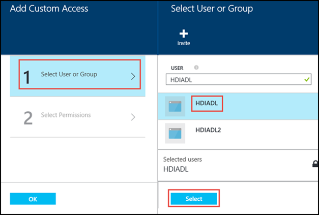
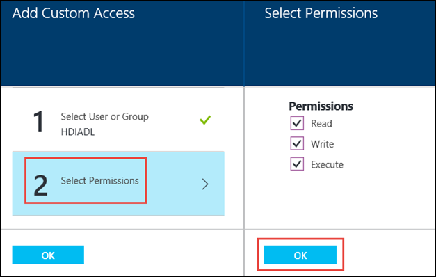
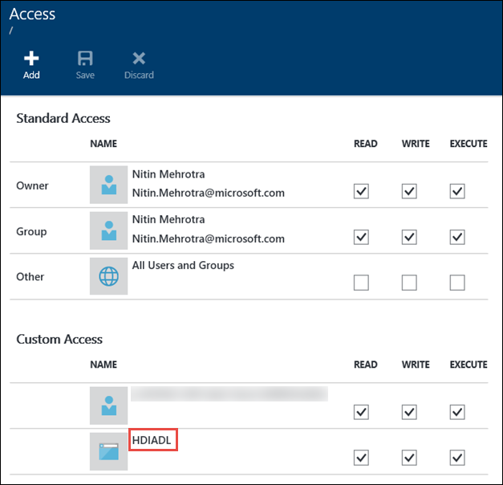
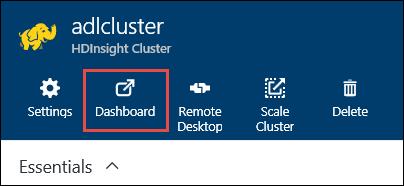
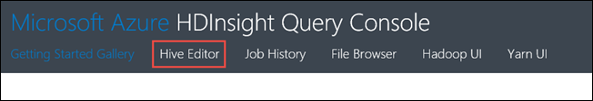

<properties 
   pageTitle="Configure HDInsight Hadoop clusters with Azure Data Lake Store using the portal | Azure" 
   description="Use Azure Preview portal to configure and use HDInsight Hadoop clusters with Azure Data Lake Store" 
   services="data-lake-store" 
   documentationCenter="" 
   authors="nitinme" 
   manager="paulettm" 
   editor="cgronlun"/>
 
<tags
   ms.service="data-lake-store"
   ms.devlang="na"
   ms.topic="article"
   ms.tgt_pltfrm="na"
   ms.workload="big-data" 
   ms.date="10/27/2015"
   ms.author="nitinme"/>

# Configure an HDInsight Hadoop cluster with Azure Data Lake Store using Azure preview portal

> [AZURE.SELECTOR]
- [Portal](data-lake-store-hdinsight-hadoop-use-portal.md)
- [PowerShell](data-lake-store-hdinsight-hadoop-use-powershell.md)

Learn how to use Azure PowerShell to configure an HDInsight Hadoop cluster to work with an Azure Data Lake Store. In this release, the Azure Data Lake Store can only be used as an additional storage account. The default storage account for the cluster will still be Azure Storage Blobs (WASB). 

Configuring HDInsight to work with Azure Data Lake Store using the Azure Preview Portal involves the following steps:

* Set up authentication for role-based access to Azure Data Lake Store
* Create HDInsight cluster with authentication to Azure Data Lake Store
* Run a test job on the cluster

## Prerequisites

Before you begin this tutorial, you must have the following:

- **An Azure subscription**. See [Get Azure free trial](http://azure.microsoft.com/documentation/videos/get-azure-free-trial-for-testing-hadoop-in-hdinsight/).
- **Azure PowerShell**. See [Install and configure Azure PowerShell](../install-configure-powershell.md) for instructions.
- **Windows SDK**. You can install it from [here](https://dev.windows.com/en-us/downloads). You use this to create a security certificate. 

## Set up authentication for role-based access to Data Lake Store

Every Azure subscription is associated with an Azure Active Directory. Users and services that access resources of the subscription using the Azure portal or Azure Resource Manager API must first authenticate with that Azure Active Directory. Access is granted to Azure subscriptions and services by assigning them the appropriate role on an Azure resource.  For services, a service principal identifies the service in the Azure Active Directory (AAD). This section illustrates how to grant an application service, like HDInsgiht, access to an Azure resource (the Azure Data Lake account you created earlier) by creating a service principal for the application and assigning roles to that via Azure PowerShell.

To set up Active Directory authentication for Data Lake Store, you must perform the following tasks.

* Create a self-signed certificate
* Create an application in Azure Active Directory and a Service Principal
* Create an Azure Data Lake Store and assign the Service Principal

### Create a self-signed certificate

Make sure you [Windows SDK](https://dev.windows.com/en-us/downloads) is installed before proceeding with the steps in this section. You must have also created a directory, such as **C:\mycertdir**, where the certificate will be created.

1. Make sure Windows SDK is added to the PATH variable. Look for the following in the PATH variable definition.

		C:\Program Files (x86)\Windows Kits\10\bin\x86

2. Use the [MakeCert][makecert] utility to create a self-signed certificate and a private key. Use the following commands.

		$certificateFileDir = "<my certificate directory>"
		cd $certificateFileDir
		$startDate = (Get-Date).ToString('MM/dd/yyyy')
		$endDate = (Get-Date).AddDays(365).ToString('MM/dd/yyyy')

		makecert -sv mykey.pvk -n "cn=HDI-ADL" CertFile.cer -b $startDate -e $endDate -r -len 2048

	You will be prompted to enter the private key password. After the command successfully executes, you should see a **CertFile.cer** and **mykey.pvk** in the certificate directory you specified.

4. Use the [Pvk2Pfx][pvk2pfx] utility to convert the .pvk and .cer files that MakeCert created to a .pfx file. Run the following command.

		pvk2pfx -pvk mykey.pvk -spc CertFile.cer -pfx CertFile.pfx -po myPassword

	When prompted enter the private key password you specified earlier. The value you specify for the **-po** parameter is the password that is associated with the .pfx file. After the command successfully completes, you should also see a CertFile.pfx in the certificate directory you specified.

###  Create an Azure Active Directory application and a service principal

In this section, you perform the steps to create a service principal for an Azure Active Directory application, assign a role to the service principal, and authenticate as the service principal by providing a certificate. Run the following commands to create an application in Azure Active Directory. 

1. From your desktop, open a new Azure PowerShell window, and enter the following snippet. When prompted to log in, make sure you log in as one of the subscription admininistrators/owner:

        # Log in to your Azure account
		Login-AzureRmAccount
        
		# List all the subscriptions associated to your account
		Get-AzureRmSubscription
		
		# Select a subscription 
		Set-AzureRMContext -SubscriptionName <subscription name>

2. Paste the following cmdlets in the PowerShell console window. Make sure the value you specify for the **-DisplayName** property is unique. Also, the values for **-HomePage** and **-IdentiferUris** are placeholder values and are not verified. 

		$certificateFilePath = "$certificateFileDir\CertFile.pfx"
		
		$password = Read-Host –Prompt "Enter the password" –AsSecureString  # This is the password you specified for the .pfx file (e.g. "myPassword")
		
		$certificatePFX = New-Object System.Security.Cryptography.X509Certificates.X509Certificate2($certificateFilePath, $password)
		
		$rawCertificateData = $certificatePFX.GetRawCertData()
		
		$credential = [System.Convert]::ToBase64String($rawCertificateData)

		$application = New-AzureRmADApplication `
					-DisplayName "HDIADL" ` 
					-HomePage "https://contoso.com" `
					-IdentifierUris "https://mycontoso.com" `
					-KeyValue $credential  `
					-KeyType "AsymmetricX509Cert"  `
					-KeyUsage "Verify"  `
					-StartDate $startDate  `
					-EndDate $endDate

		$applicationId = $application.ApplicationId

2. Create a service principal using the application ID.

		$servicePrincipal = New-AzureRmADServicePrincipal -ApplicationId $applicationId
		
		$objectId = $servicePrincipal.Id

	You have now created a service principal, but the service does not have any permissions or scope assigned. You should now use this service principal to grant access to Data Lake Store. 

### Configure service principal to access Data Lake Store

1. Sign on to the new [Azure preview portal](https://portal.azure.com).

2. If you do not have a Data Lake Store account, create one. Follow the instructions at [Get started with Azure Data Lake Store using the Azure preview portal](data-lake-store-get-started-portal.md).

	If you already have a Data Lake Store account, from the left pane, click **Browse**, click **Data Lake Store**, and then click the account name to which you want to grant access.

	Perform the following tasks under your Data Lake Store account. 

	* [Create a folder in your Data Lake Store](data-lake-store-get-started-portal.md#createfolder).
	* [Upload a file to you Data Lake Store](data-lake-store-get-started-portal.md#uploaddata). You can download a sample data file from [AzureDataLake Git Repository](https://github.com/MicrosoftBigData/AzureDataLake/raw/master/Samples/SampleData/OlympicAthletes.tsv).

	You will use the uploaded files later when you test the Data Lake Store account with the HDInsight cluster.

3. In the Data Lake Store blade, click **Data Explorer**.

	

4. In the **Data Explorer** blade, click the root of your account, and then in your account blade, click the **Access** icon.

	

5. The **Access** blade lists the standard access and custom access already assigned to the root. Click the **Add** icon to add custom-level ACLs and include the service principal you created earlier.

	

6. Click the **Add** icon to open the **Add Custom Access** blade. In this blade, click **Select User or Group**, and then in **Select User or Group** blade, search for the service principal you created earlier in Azure Active Directory. The name of service principal created earlier is **HDIADL**. Click the service principal name and then click **Select**.

	

7. Click **Select Permissions**, select the permissions you want to assign to the service principal, and then click **OK**.

	

8. In the **Add Custom Access** blade, click **OK**. The newly added group, with the associated permissions, will now be listed in the **Access** blade.

	

7. If required, you can also modify the access permissions after you have added the service principal. Clear or select the check box for each permission type (Read, Write, Execute) based on whether you want to remove or assign that permission. Click **Save** to save the changes, or **Discard** to undo the changes.

## Create an HDInsight cluster with access to Azure Data Lake Store

In this section, you create an HDInsight cluster that uses the Data Lake Store as an additional storage. For this release, the HDInsight cluster and the Data Lake Store must be in the same location (East US 2). Also, for this release, the Data Lake Store can only be used as an additional storage account. The default storage account for the cluster will still be Azure Storage Blobs (WASB).

1. Sign on to the new [Azure preview portal](https://portal.azure.com).

2. Follow the steps at [Create Hadoop clusters in HDInsight](../hdinsight/hdinsight-provision-clusters.md#create-using-the-preview-portal) to start provisioning an HDInsight cluster.
 
3. On the **Optional Configuration** blade, click **Data Source**. In the **Data Source** blade, specify the details for the storage account and storage container, specify **Location** as **East US 2**, and then click **Cluster AAD Identity**.

	

4. On the **Cluster AAD Identity** blade, click **Service Principal**, and then in the **Select a Service Principal** blade, search for the service principal you created earlier in Azure Active Directory. The name of service principal you created earlier is **HDIADL**. Click the service principal name and then click **Select**.

	

5. On the **Cluster AAD Identity** blade, upload the certificate (.pfx) you created earlier and provide the password you used to create the certificate. Click **Select**. This completes the Azure Active Directory configuration for HDInsight cluster.

	

6. Click Select on the **Data Source** blade and continue with cluster provisioning as described at [Create Hadoop clusters in HDInsight](../hdinsight/hdinsight-provision-clusters.md#create-using-the-preview-portal).

## Run test jobs on the HDInsight cluster to use the Azure Data Lake Store

After you have configured an HDInsight cluster, you can run test jobs on the cluster to test that the HDInsight cluster can access data in Azure Data Lake Store. To do so, we will run some hive queries that target the Data Lake Store.

1. Open the cluster blade for the cluster that you just provisioned and then click **Dashboard**.

	

	When prompted, enter the administrator credentials for the cluster.

2. This opens the Microsoft Azure HDInsight Query Console. Click **Hive Editor**.

	

3. In the Hive Editor, enter the following query and then click **Submit**.

		CREATE EXTERNAL TABLE athletes (str string) LOCATION 'adl://mydatalakeaccount.azuredatalake.net:443/mynewfolder'

	In this Hive query, we create a table from data stored in Data Lake Store at `adl://mydatalakeaccount.azuredatalake.net:443/mynewfolder`. This location has a sample data file (OlympicAthletes.tsv) that you uploaded earlier. 

	The **Job Session** table at the bottom shows the status of the job changing from **Initializing**, to **Running**, to **Completed**. You can also click **View Details** to see more information about the completed job.

	

4. Run the following query to verify that the table was created.

		SHOW TABLES;

	Click View Details corresponding to this query and the output should show the following:

		hivesampletable
		athletes

	**athletes** is the table you created earlier. **hivesampletable** is a sample table available in all HDInsight clusters by default.

5. You can also run a query to retrieve data from the **athletes**.

		SELECT * FROM athletes LIMIT 5;

## Access Data Lake storage using HDFS commands

Once you have configured the HDInsight cluster to use Data Lake storage, you can use the HDFS shell commands to access the Data Lake storage.

1. Sign on to the new [Azure preview portal](https://portal.azure.com).

2. Click **Browse**, click **HDInsight clusters**, and then click the HDInsight cluster that you created.

3. In the cluster blade, click **Remote Desktop**, and then in the **Remote Desktop** blade, click **Connect**.

	

	When prompted, enter the credentials you provided for the remote desktop user. 

4. In the remote session, start Windows PowerShell, and use the HDFS filesystem commands to list the files in the Azure Data Lake.

	 	hdfs dfs -ls adl://<Data Lake account name>.azuredatalake.net:443/

	This should list the file that you uploaded earlier to the Azure Data Lake account.

		15/09/17 21:41:15 INFO web.CaboWebHdfsFileSystem: Replacing original urlConnectionFactory with org.apache.hadoop.hdfs.web.URLConnectionFactory@21a728d6
		Found 1 items
		-rwxrwxrwx   0 NotSupportYet NotSupportYet     671388 2015-09-16 22:16 adl://mydatalakeaccount.azuredatalake.net:443/mynewfolder

	You can also use the `hdfs dfs -put` command to upload some files to the Azure Data Lake, and then use `hdfs dfs -ls` to verify whether the files were successfully uploaded.

## See Also

* [PowerShell: Create an HDInsight cluster to use Data Lake Store]([PowerShell](data-lake-store-hdinsight-hadoop-use-powershell.md))

[makecert]: https://msdn.microsoft.com/en-us/library/windows/desktop/ff548309(v=vs.85).aspx
[pvk2pfx]: https://msdn.microsoft.com/en-us/library/windows/desktop/ff550672(v=vs.85).aspx