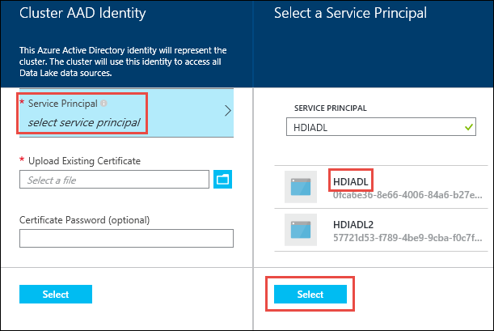

# Create HDInsight clusters with Data Lake Store by using the Azure portal
> [!div class="op_single_selector"]
> * [Use the Azure portal](data-lake-store-hdinsight-hadoop-use-portal.md)
> * [Use PowerShell (for default storage)](data-lake-store-hdinsight-hadoop-use-powershell-for-default-storage.md)
> * [Use PowerShell (for additional storage)](data-lake-store-hdinsight-hadoop-use-powershell.md)
> * [Use Resource Manager](data-lake-store-hdinsight-hadoop-use-resource-manager-template.md)
>
>

Learn how to use the Azure portal to create a HDInsight cluster with an Azure Data Lake Store account as the default storage or an additional storage. Even though additional storage is optional for a HDInsight cluster, it is recommended to store your business data in the additional storage accounts.

## Prerequisites
Before you begin this tutorial, ensure that you've met the following requirements:

* **An Azure subscription**. Go to [Get Azure free trial](https://azure.microsoft.com/pricing/free-trial/).
* **An Azure Data Lake Store account**. Follow the instructions from [Get started with Azure Data Lake Store by using the Azure portal](data-lake-store-get-started-portal.md). You must also create a root folder on the account.  In this tutorial, a root folder called __/clusters__ is used.
* **An Azure Active Directory service principal**. This tutorial provides instructions on how to create a service principal in Azure Active Directory (Azure AD). However, to create a service principal, you must be an Azure AD administrator. If you are an administrator, you can skip this prerequisite and proceed with the tutorial.

	>[!NOTE]
	>You can create a service principal only if you are an Azure AD administrator. Your Azure AD administrator must create a service principal before you can create an HDInsight cluster with Data Lake Store. Also, the service principal must be created with a certificate, as described at [Create a service principal with certificate](../azure-resource-manager/resource-group-authenticate-service-principal.md#create-service-principal-with-certificate-from-certificate-authority).
	>

## Create an HDInsight cluster

In this section, you create a HDInsight cluster with Data Lake Store accounts as the default or the additional storage. This article only focuses the part of configuring Data Lake Store accounts.  For the general cluster creation information and procedures, see [Create Hadoop clusters in HDInsight](../hdinsight/hdinsight-hadoop-provision-linux-clusters.md).

### Create a cluster with Data Lake Store as default storage

**To create a HDInsight cluster with a Data Lake Store as the default storage account**

1. Sign in to the [Azure portal](https://portal.azure.com).
2. Follow [Create clusters](../hdinsight/hdinsight-hadoop-create-linux-clusters-portal.md#create-clusters) for the general information on creating HDInsight clusters.
3. On the **Storage** blade, under **Primary storage type**, select **Data Lake Store**, and then enter the following information:

	

    - **Select Data Lake Store account**: Select an existing Data Lake Store account. An existing Data Lake Store account is required.  See [Prerequisites](#prereuisites).
    - **Root path**: Enter a path where the cluster-specific files are to be stored. On the screenshot, it is __/clusters/myhdiadlcluster/__, in which the __/clusters__ folder must exist, and the Portal creates *myhdicluster* folder.  The *myhdicluster* is the cluster name.
    - **Data Lake Store access**: Configure access between the Data Lake Store account and HDInsight cluster. For instructions, see [Configure Data Lake Store access](#configure-data-lake-store-access).
    - **Additional storage accounts**: Add Azure Storage Accounts as additional storage accounts for the cluster. To add additional Data Lake Stores is done by giving the cluster permissions on data in more Data Lake Store accounts while configuring a Data Lake Store account as the primary storage type. See [Configure Data Lake Store access](#configure-data-lake-store-access).

4. On the **Data Lake Store access**, click **Select**, and then continue with cluster creation as described in [Create Hadoop clusters in HDInsight](../hdinsight/hdinsight-hadoop-create-linux-clusters-portal.md).

### Create a cluster with Data Lake Store as additional storage

The following instructions create a HDInsight cluster with an Azure Storage account as the default storage, and a Data Lake Store account as an additional storage.
**To create a HDInsight cluster with a Data Lake Store as the default storage account**

1. Sign in to the [Azure portal](https://portal.azure.com).
2. Follow [Create clusters](../hdinsight/hdinsight-hadoop-create-linux-clusters-portal.md#create-clusters) for the general information on creating HDInsight clusters.
3. On the **Storage** blade, under **Primary storage type**, select **Azure Storage**, and then enter the following information:

	

    - **Selection method**: use one of the following options:

    	* To specify a storage account that is part of your Azure subscription, select **My subscriptions**, and then select the storage account.
    	* To specify a storage account that is outside your Azure subscription, select **Access key**, and then provide the information for the outside storage account.

    - **Default container**: use either the default value or specify your own name.

    - Additional Storage accounts: add more Azure Storage accounts as the additional storage.
    - Data Lake Store access: configure access between the Data Lake Store account and HDInsight cluster. For instructions see [Configure Data Lake Store access](#configure-data-lake-store-access).

## Configure Data Lake Store access 

In this section, you configure Data Lake Store access from HDInsight clusters using an Azure Active Directory service principal. 

### Specify a service principal

From the Azure portal, you can either use an existing service principal or create a new one.

**To create a service principal from the Azure portal**

1. Click **Data Lake Store access** from the Store blade.
2. On the **Data Lake Store access** blade, click **Create new**.
3. Click **Service Principal**, and then follow the instructions to create a service principal.
4. Download the certificate if you decide to use it again in the future. Downloading the certificate is useful if you want to use the same service principal when you create additional HDInsight clusters.

    

4. Click **Access** to configure the folder access.  See [Configure file permissions](#configure-file-permissions).

**To use an existing service principal from the Azure portal**

1. Click **Data Lake Store access**.
1. On the **Data Lake Store access** blade, click **Use existing**.
2. Click **Service Principal**, and then select a service principal. 
3. Upload the certificate (.pfx file) that's associated with your selected service principal, and then enter the certificate password.

    

4. Click **Access** to configure the folder access.  See [Configure file permissions](#configure-file-permissions).

### Configure file permissions

The configures are different depending on whether the account is used as the default storage or an additional storage account:

- Used as default storage

    - permission at the root level of the Data Lake Store account
    - permission at the root level of the HDInsight cluster storage. For example, the __/clusters__ folder used earlier in the tutorial.
- Use as an additional storage

    - Permission at the folders where you need file access.

**To assign permission at the Data Lake Store account root level**

1. On the **Data Lake Store access** blade, click **Access**. The **Select file permissions** blade is opened. It lists all the Data Lake Store accounts in your subscription.
2. Hover (do not click) the mouse over the name of the Data Lake Store account to make the check box visible, then select the check box.

	

  By default, __READ__, __WRITE__, AND __EXECUTE__ are all selected.

3. Click **Select** on the bottom of the page.
4. Click **Run** to assign permission.
5. Click **Done**.

**To assign permission at the HDInsight cluster root level**

1. On the **Data Lake Store access** blade, click **Access**. The **Select file permissions** blade is opened. It lists all the Data Lake Store accounts in your subscription.
1. From the **Select file permissions** blade, click the Data Lake Store name to show its content.
2. Select the HDInsight cluster storage root by selecting the checkbox on the left of the folder. According to the screenshot earlier, the cluster storage root is __/clusters__ folder that you specified while selecting the Data Lake Store as default storage.
3. Set the permissions on the folder.  By default, read, write, and execute are all selected.
4. Click **Select** on the bottom of the page.
5. Click **Run**.
6. Click **Done**.

If you are using Data Lake Store as additional storage, you must assign permission only for the folders that you want to access from the HDInsight cluster. For example, in the screenshot below, you provide access only to **hdiaddonstorage** folder in a Data Lake Store account.

## Verify cluster set up

After the cluster setup is complete, on the cluster blade, verify your results by doing either or both of the following steps:

* To verify that the associated storage for the cluster is the Data Lake Store account that you specified, click **Storage accounts** in the left pane.

	

* To verify that the service principal is correctly associated with the HDInsight cluster, click **Data Lake Store access** in the left pane.

	

## Examples

After you have set up the cluster with Data Lake Store as your storage, refer to these examples of how to use HDInsight cluster to analyze the data that's stored in Data Lake Store.

### Run a Hive query against data in a Data Lake Store (as primary storage)

To run a Hive query, use the Hive views interface in the Ambari portal. For instructions on how to use Ambari Hive views, see [Use the Hive View with Hadoop in HDInsight](../hdinsight/hdinsight-hadoop-use-hive-ambari-view.md).

When you work with data in a Data Lake Store, there are a few strings to change.

If you use, for example, the cluster that you created with Data Lake Store as primary storage, the path to the data is: *adl://<data_lake_store_account_name>/azuredatalakestore.net/path/to/file*. A Hive query to create a table from sample data that's stored in the Data Lake Store account looks like the following statement:

	CREATE EXTERNAL TABLE websitelog (str string) LOCATION 'adl://hdiadlsstorage.azuredatalakestore.net/clusters/myhdiadlcluster/HdiSamples/HdiSamples/WebsiteLogSampleData/SampleLog/'

Descriptions:
* `adl://hdiadlstorage.azuredatalakestore.net/` is the root of the Data Lake Store account.
* `/clusters/myhdiadlcluster` is the root of the cluster data that you specified while creating the cluster.
* `/HdiSamples/HdiSamples/WebsiteLogSampleData/SampleLog/` is the location of the sample file that you used in the query.

### Run a Hive query against data in a Data Lake Store (as additional storage)

If the cluster that you created uses Blob storage as default storage, the sample data is not contained in the Azure Data Lake Store account that's used as additional storage. In such a case, first transfer the data from Blob storage to the Data Lake Store, and then run the queries as shown in the preceding example.

For information on how to copy data from Blob storage to a Data Lake Store, see the following articles:

* [Use Distcp to copy data between Azure Storage blobs and Data Lake Store](data-lake-store-copy-data-wasb-distcp.md)
* [Use AdlCopy to copy data from Azure Storage blobs to Data Lake Store](data-lake-store-copy-data-azure-storage-blob.md)

### Use Data Lake Store with a Spark cluster
You can use a Spark cluster to run Spark jobs on data that is stored in a Data Lake Store. For more information, see [Use HDInsight Spark cluster to analyze data in Data Lake Store](../hdinsight/hdinsight-apache-spark-use-with-data-lake-store.md).

### Use Data Lake Store in a Storm topology
You can use the Data Lake Store to write data from a Storm topology. For instructions on how to achieve this scenario, see [Use Azure Data Lake Store with Apache Storm with HDInsight](../hdinsight/hdinsight-storm-write-data-lake-store.md).

## See also
* [PowerShell: Create an HDInsight cluster to use Data Lake Store](data-lake-store-hdinsight-hadoop-use-powershell.md)

[makecert]: https://msdn.microsoft.com/library/windows/desktop/ff548309(v=vs.85).aspx
[pvk2pfx]: https://msdn.microsoft.com/library/windows/desktop/ff550672(v=vs.85).aspx
