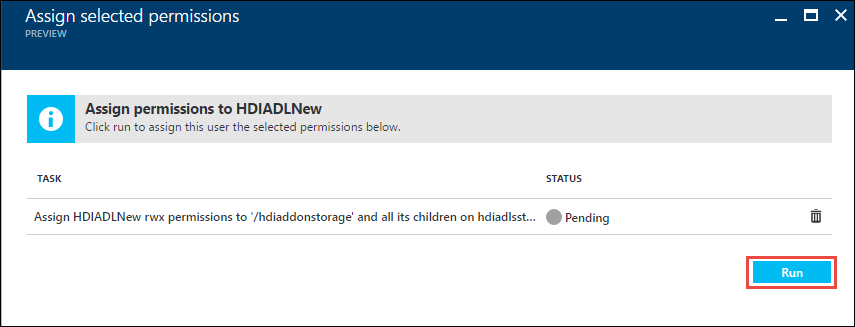

# Create an HDInsight cluster with Data Lake Store using Azure Portal
> [!div class="op_single_selector"]
> * [Using Portal](data-lake-store-hdinsight-hadoop-use-portal.md)
> * [Using PowerShell (for default storage)](data-lake-store-hdinsight-hadoop-use-powershell-for-default-storage.md)
> * [Using PowerShell (for additional storage)](data-lake-store-hdinsight-hadoop-use-powershell.md)
> * [Using Resource Manager](data-lake-store-hdinsight-hadoop-use-resource-manager-template.md)
>
>

Learn how to use Azure Portal to create an HDInsight cluster with access to Azure Data Lake Store. For supported cluster types, Data Lake Store be used as an default storage or additional storage account. When Data Lake Store is used as additional storage, the default storage account for the clusters will still be Azure Storage Blobs (WASB) and the cluster-related files (such as logs, etc.) are still written to the default storage, while the data that you want to process can be stored in a Data Lake Store account. Using Data Lake Store as an additional storage account does not impact performance or the ability to read/write to the storage from the cluster.

## Using Data Lake Store for HDInsight cluster storage

Here are some important considerations for using HDInsight with Data Lake Store:

* Option to create HDInsight clusters with access to Data Lake Store as default storage is available for HDInsight version 3.5.

* Option to create HDInsight clusters with access to Data Lake Store as additional storage is available for HDInsight versions 3.2, 3.4, and 3.5.

* For HBase clusters (Windows and Linux), Data Lake Store is **not supported** as a storage option, for both default storage as well as additional storage.

* For Storm clusters (Windows and Linux), Data Lake Store can be used to write data from a Storm topology. Data Lake Store can also be used to store reference data that can then be read by a Storm topology. For more information, see [Use Data Lake Store in a Storm topology](#use-data-lake-store-in-a-storm-topology).

## Prerequisites
Before you begin this tutorial, you must have the following:

* **An Azure subscription**. See [Get Azure free trial](https://azure.microsoft.com/pricing/free-trial/).

* **Azure Data Lake Store account**. Follow the instructions at [Get started with Azure Data Lake Store using the Azure Portal](data-lake-store-get-started-portal.md).

* **Azure Active Directory Service Principal**. Steps in this tutorial provide instructions on how to create a service principal in Azure AD. However, you must be an Azure AD administrator to be able to create a service principal. If you are an Azure AD administrator, you can skip this prerequisite and proceed with the tutorial.

    **If you are not an Azure AD administrator**, you will not be able to perform the steps required to create a service principal. In such a case, your Azure AD administrator must first create a service principal before you can create an HDInsight cluster with Data Lake Store. Also, the service principal must be created using a certificate, as described at [Create a service principal with certificate](../azure-resource-manager/resource-group-authenticate-service-principal.md#create-service-principal-with-certificate).

## Create an HDInsight cluster with access to Azure Data Lake Store
In this section, you create an HDInsight Hadoop cluster that uses the Data Lake Store as an additional storage. In this release, for a Hadoop cluster, Data Lake Store can only be used as an additional storage for the cluster. The default storage will still be the Azure storage blobs (WASB). So, we'll first create the storage account and storage containers required for the cluster.

1. Sign on to the new [Azure Portal](https://portal.azure.com).

2. Follow the steps at [Create Hadoop clusters in HDInsight](../hdinsight/hdinsight-provision-clusters.md) to start provisioning an HDInsight cluster.

3. On the **Storage** blade, specify whether you want Azure Storage (WASB) or Data Lake Store as your default storage. If you want to use Azure Data Lake Store as default storage, skip to next step.

	If you want to use Azure Storage Blobs as default storage, for **Primary Storage Type**, click **Azure Storage**. After that, for **Selection method**, you can choose **My subscriptions** if you want to specify a storage account that is part of your Azure subscription and then select the storage account. Otherwise, click **Access key** and provide the information for the storage account that you want to choose from outside your Azure subscription. For **Default container**, you can choose to go with the default container name suggested by the portal or specify your own. 

	When you are using Azure Storage Blobs as default storage, you can still use Azure Data Lake Store as additional storage for the cluster. To do so, click **Data Lake Store access**, and then skip to Step 5.

	

4. If you want to use Azure Data Lake Store as default storage, for **Primary Storage Type**, click **Data Lake Store**. Select a Data Lake Store account that already exists, provide a root folder path where the cluster-specific files will be stored, specify **Location** as **East US 2**, and then click **Data Lake Store access**. You can use this option only with HDInsight 3.5 clusters (Standard edition). Within HDInsight 3.5 clusters this option is not available for HBase cluster type.

	In the screen capture below, the root folder path is /clusters/myhdiadlcluster, where **myhdiadlcluster** is the name of the cluster being created. In such a case, make sure the **/clusters** folder already exists in the Data Lake Store account. The **myhdiadlcluster** folder will be created during cluster creation. Similarly, if the root path was set to /hdinsight/clusters/data/myhdiadlcluter, you must ensure that **/hdinsight/clusters/data/** already exists in the Data Lake Store account.

	

5. On the **Data Lake Store access** blade, you can choose to select an existing Service Principal or create a new one. If you want to use an existing service principal, skip to the next step.

	If you want to create a new Service Principal, in the **Data Lake Store access** blade, click **Create new**, click **Service Principal**, and then in the **Create a Service Principal** blade, provide values to create a new service principal. As part of that, a certificate and an Azure Active Directory application is also created. Click **Create**.

	

	You can also click **Download Certificate** to download the certificate associated with the service principal you created. This is useful if you want to use the same service principal in the future, while creating additional HDInsight clusters. Click **Select**.

6. If you want to use an existing Service Principal, in the **Data Lake Store access** blade, click **Use existing**, click **Service Principal**, and then in the **Select a Service Principal** blade, search for an existing service principal. Click a service principal name and then click **Select**.

	

	On the **Data Lake Store access** blade, upload the certificate (.pfx) associated with the service principal you selected, and then provide the certificate password.

6. On the **Data Lake Store access** blade, click **Access**. In the next pane, **Select file permissions** is already selected by default, and lists all the Data Lake Store accounts in your subscription. Click the Data Lake Store account that you want to associate with the cluster to list the files and folders in that account. You can then assign permissions at the file or folder level. If you want to associate the permissions at the root level of the account, select the check box next to the account name.

	

	> [!NOTE]
	> If you are using the Data Lake Store account as the default storage for a cluter, you **must** assign the permissions to the service principal at the root level of the Data Lake Store account.

7. If you want to assign permissions for file or folders within an account, select the Data Lake Store account to see the files/folders in the next pane. Select the files/folders, select the permissions (READ/WRITE/EXECUTE) you want to assign on them, specify whether the permissions apply recursively to the child items as well, and then click **Select**.

	

8. In the next screen, click **Run** to assign the permissions for the Azure Active Directory service principal on the account, file, folder you selected.

	

9. After the permission are successfully assigned, click **Done** on all the blades till you are back on the **Data Lake Store access** blade.

4. Click **Select** on the **Data Lake Store access** and then continue with cluster creation as described at [Create Hadoop clusters in HDInsight](../hdinsight/hdinsight-hadoop-create-linux-clusters-portal.md).

10. Once the cluster is provisioned, you can verify that the associated storage for the cluster is the Data Lake Store account you specified. You can verify this by clicking the **Storage accounts** tab from the cluster blade. 

	

	You can also verify that the Service Principal is associated with the HDInsight cluster. To do so, from the cluster blade, click **Data Lake Store access** to see the associated Service Principal.

	

## Show me some examples

Once you have provisioned the cluster with Data Lake Store as storage, here are some examples on how to use HDInsight cluster to analyze the data stored in Data Lake Store.

### Run a Hive query against data stored in Data Lake Store (as primary storage)

To run a Hive query, you can use the Hive Views interface available from the Ambari portal. For instructions on how to use the Ambari Hive views, see [Use the Hive View with Hadoop in HDInsight](../hdinsight/hdinsight-hadoop-use-hive-ambari-view.md). There are a couple of things you will have to change when working with data in Data Lake Store.

* If you the take the example of the cluster we created with Data Lake Store as primary storage, the path to data will be `adl://<data_lake_store_account_name>/azuredatalakestore.net/path/to/file`. A Hive query to create a table from sample data stored in the Data Lake Store account will look like this:

		CREATE EXTERNAL TABLE websitelog (str string) LOCATION 'adl://hdiadlsstorage.azuredatalakestore.net/clusters/myhdiadlcluster/HdiSamples/HdiSamples/WebsiteLogSampleData/SampleLog/'

In the query above,

* `adl://hdiadlstorage.azuredatalakestore.net/` is the root of the Data Lake Store account.
* `/clusters/myhdiadlcluster` is the root for the cluster data that you specified while creating the cluster.
* `/HdiSamples/HdiSamples/WebsiteLogSampleData/SampleLog/` is the location of the sample file that you use in the query

### Run a Hive query against data stored in Data Lake Store (as additional storage)

If the cluster you created uses Azure Storage (WASB) as default storage, the sample data will not be in the Azure Data Lake Store account that is used as additional storage. In such cases, you must first transfer the data from WASB to Azure Data Lake Store and then run the queries in the same manner as shown above.

For information on how to copy data from WASB to Azure Data Lake Store, see the following:

* [Use Distcp to copy data between Azure Storage Blobs and Data Lake Store](data-lake-store-copy-data-wasb-distcp.md)
* [Use AdlCopy to copy data from Azure Storage Blobs to Data Lake Store](data-lake-store-copy-data-azure-storage-blob.md) 

### Use Data Lake Store with Spark cluster
You can use a Spark cluster to run Spark jobs on data that is stored in Data Lake Store. For instructions on this, see [Use HDInsight Spark cluster to analyze data in Data Lake Store](../hdinsight/hdinsight-apache-spark-use-with-data-lake-store.md).

### Use Data Lake Store in a Storm topology
You can use the Data Lake Store to write data from a Storm topology. For instructions on how to achieve this scenario, see [Use Azure Data Lake Store with Apache Storm with HDInsight](../hdinsight/hdinsight-storm-write-data-lake-store.md).

## See also
* [PowerShell: Create an HDInsight cluster to use Data Lake Store](data-lake-store-hdinsight-hadoop-use-powershell.md)

[makecert]: https://msdn.microsoft.com/library/windows/desktop/ff548309(v=vs.85).aspx
[pvk2pfx]: https://msdn.microsoft.com/library/windows/desktop/ff550672(v=vs.85).aspx
