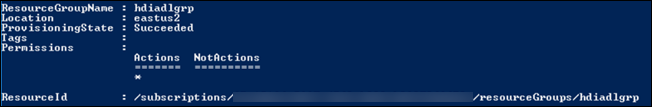
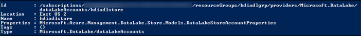
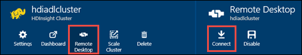

<properties
   pageTitle="Create HDInsight clusters with Azure Data Lake Store using PowerShell | Azure"
   description="Use Azure PowerShell to create and use HDInsight clusters with Azure Data Lake"
   services="data-lake-store,hdinsight" 
   documentationCenter=""
   authors="nitinme"
   manager="paulettm"
   editor="cgronlun"/>

<tags
   ms.service="data-lake-store"
   ms.devlang="na"
   ms.topic="article"
   ms.tgt_pltfrm="na"
   ms.workload="big-data"
   ms.date="07/01/2016"
   ms.author="nitinme"/>

# Create an HDInsight cluster with Data Lake Store using Azure PowerShell

> [AZURE.SELECTOR]
- [Using Portal](data-lake-store-hdinsight-hadoop-use-portal.md)
- [Using PowerShell](data-lake-store-hdinsight-hadoop-use-powershell.md)

Learn how to use Azure PowerShell to configure an HDInsight cluster (Hadoop, HBase, or Storm) with access to Azure Data Lake Store. Some important considerations for this release:

* **For Spark clusters (Linux), and Hadoop/Storm clusters (Windows and Linux)**, the Data Lake Store can only be used as an additional storage account. The default storage account for the such clusters will still be Azure Storage Blobs (WASB).

* **For HBase clusters (Windows and Linux)**, the Data Lake Store can be used as a default storage or additional storage.

> [AZURE.NOTE] Some important points to note. 
> 
> * Option to create HDInsight clusters with access to Data Lake Store is available only for HDInsight versions 3.2 and 3.4 (for Hadoop, HBase, and Storm clusters on Windows as well as Linux). For Spark clusters on Linux, this option is only available on HDInsight 3.4 clusters.
>
> * As mentioned above, Data Lake Store is available as default storage for some cluster types (HBase) and additional storage for other cluster types (Hadoop, Spark, Storm). Using Data Lake Store as an additional storage account does not impact performance or the ability to read/write to the storage from the cluster. In a scenario where Data Lake Store is used as additional storage, cluster-related files (such as logs, etc.) are written to the default storage (Azure Blobs), while the data that you want to process can be stored in a Data Lake Store account.

In this article, we provision a Hadoop cluster with Data Lake Store as additional storage.

Configuring HDInsight to work with Data Lake Store using PowerShell involves the following steps:

* Create an Azure Data Lake Store
* Set up authentication for role-based access to Data Lake Store
* Create HDInsight cluster with authentication to Data Lake Store
* Run a test job on the cluster

## Prerequisites

Before you begin this tutorial, you must have the following:

- **An Azure subscription**. See [Get Azure free trial](https://azure.microsoft.com/pricing/free-trial/).
- **Enable your Azure subscription** for Data Lake Store public preview. See [instructions](data-lake-store-get-started-portal.md#signup).
- **Windows SDK**. You can install it from [here](https://dev.windows.com/en-us/downloads). You use this to create a security certificate.

##Install Azure PowerShell 1.0 and greater

To begin with, you must uninstall the 0.9x versions of Azure PowerShell. To check the version of the installed PowerShell, run the following command from a PowerShell window:

	Get-Module *azure*

To uninstall the older version, run **Programs and Features** in the control panel and remove the installed version if it's earlier than PowerShell 1.0.

There are two main options for installing Azure PowerShell.

- [PowerShell Gallery](https://www.powershellgallery.com/). Run the following commands from elevated PowerShell ISE or elevated Windows PowerShell console:

		# Install the Azure Resource Manager modules from PowerShell Gallery
		Install-Module AzureRM
		Install-AzureRM

		# Install the Azure Service Management module from PowerShell Gallery
		Install-Module Azure

		# Import AzureRM modules for the given version manifest in the AzureRM module
		Import-AzureRM

		# Import Azure Service Management module
		Import-Module Azure

	For more information, see [PowerShell Gallery](https://www.powershellgallery.com/).

- [Microsoft Web Platform Installer (WebPI)](http://aka.ms/webpi-azps). If you have Azure PowerShell 0.9.x installed, you will be prompted to uninstall 0.9.x. If you installed Azure PowerShell modules from PowerShell Gallery, the installer requires the modules be removed prior to installation to ensure a consistent Azure PowerShell Environment. For the instructions, see [Install Azure PowerShell 1.0 via WebPI](https://azure.microsoft.com/blog/azps-1-0/).

WebPI will receive monthly updates. PowerShell Gallery will receive updates on a continuous basis. If you are comfortable with installing from PowerShell Gallery, that will be the first channel for the latest and greatest in Azure PowerShell.

## Create an Azure Data Lake Store

Follow these steps to create a Data Lake Store.

1. From your desktop, open a new Azure PowerShell window, and enter the following snippet. When prompted to log in, make sure you log in as one of the subscription admininistrators/owner:

        # Log in to your Azure account
		Login-AzureRmAccount

		# List all the subscriptions associated to your account
		Get-AzureRmSubscription

		# Select a subscription
		Set-AzureRmContext -SubscriptionId <subscription ID>

		# Register for Data Lake Store
		Register-AzureRmResourceProvider -ProviderNamespace "Microsoft.DataLakeStore"

	>[AZURE.NOTE] If you receive an error similar to `Register-AzureRmResourceProvider : InvalidResourceNamespace: The resource namespace 'Microsoft.DataLakeStore' is invalid` when registering the Data Lake Store resource provider, it is possible that your subsrcription is not whitelisted for Azure Data Lake Store. Make sure you enable your Azure subscription for Data Lake Store public preview by following these [instructions](data-lake-store-get-started-portal.md#signup).

3. An Azure Data Lake Store account is associated with an Azure Resource Group. Start by creating an Azure Resource Group.

		$resourceGroupName = "<your new resource group name>"
    	New-AzureRmResourceGroup -Name $resourceGroupName -Location "East US 2"

	

2. Create an Azure Data Lake Store account. The account name you specify must only contain lowercase letters and numbers.

		$dataLakeStoreName = "<your new Data Lake Store name>"
    	New-AzureRmDataLakeStoreAccount -ResourceGroupName $resourceGroupName -Name $dataLakeStoreName -Location "East US 2"

	

3. Verify that the account is successfully created.

		Test-AzureRmDataLakeStoreAccount -Name $dataLakeStoreName

	The output for this should be **True**.

4. Upload some sample data to Azure Data Lake. We'll use this later in this article to verify that the data is accessible from an HDInsight cluster. If you are looking for some sample data to upload, you can get the **Ambulance Data** folder from the [Azure Data Lake Git Repository](https://github.com/MicrosoftBigData/usql/tree/master/Examples/Samples/Data/AmbulanceData).

		$myrootdir = "/"
		Import-AzureRmDataLakeStoreItem -AccountName $dataLakeStoreName -Path "C:\<path to data>\vehicle1_09142014.csv" -Destination $myrootdir\vehicle1_09142014.csv

## Set up authentication for role-based access to Data Lake Store

Every Azure subscription is associated with an Azure Active Directory. Users and services that access resources of the subscription using the Azure Classic Portal or Azure Resource Manager API must first authenticate with that Azure Active Directory. Access is granted to Azure subscriptions and services by assigning them the appropriate role on an Azure resource.  For services, a service principal identifies the service in the Azure Active Directory (AAD). This section illustrates how to grant an application service, like HDInsight, access to an Azure resource (the Azure Data Lake Store account you created earlier) by creating a service principal for the application and assigning roles to that via Azure PowerShell.

To set up Active Directory authentication for Azure Data Lake, you must perform the following tasks.

* Create a self-signed certificate
* Create an application in Azure Active Directory and a Service Principal

### Create a self-signed certificate

Make sure you have [Windows SDK](https://dev.windows.com/en-us/downloads) installed before proceeding with the steps in this section. You must have also created a directory, such as **C:\mycertdir**, where the certificate will be created.

1. From the PowerShell window, navigate to the location where you installed Windows SDK (typically, `C:\Program Files (x86)\Windows Kits\10\bin\x86` and use the [MakeCert][makecert] utility to create a self-signed certificate and a private key. Use the following commands.

		$certificateFileDir = "<my certificate directory>"
		cd $certificateFileDir
		$startDate = (Get-Date).ToString('MM/dd/yyyy')
		$endDate = (Get-Date).AddDays(365).ToString('MM/dd/yyyy')

		makecert -sv mykey.pvk -n "cn=HDI-ADL-SP" CertFile.cer -b $startDate -e $endDate -r -len 2048

	You will be prompted to enter the private key password. After the command successfully executes, you should see a **CertFile.cer** and **mykey.pvk** in the certificate directory you specified.

4. Use the [Pvk2Pfx][pvk2pfx] utility to convert the .pvk and .cer files that MakeCert created to a .pfx file. Run the following command.

		pvk2pfx -pvk mykey.pvk -spc CertFile.cer -pfx CertFile.pfx -po <password>

	When prompted enter the private key password you specified earlier. The value you specify for the **-po** parameter is the password that is associated with the .pfx file. After the command successfully completes, you should also see a CertFile.pfx in the certificate directory you specified.

###  Create an Azure Active Directory and a service principal

In this section, you perform the steps to create a service principal for an Azure Active Directory application, assign a role to the service principal, and authenticate as the service principal by providing a certificate. Run the following commands to create an application in Azure Active Directory.

1. Paste the following cmdlets in the PowerShell console window. Make sure the value you specify for the **-DisplayName** property is unique. Also, the values for **-HomePage** and **-IdentiferUris** are placeholder values and are not verified.

		$certificateFilePath = "$certificateFileDir\CertFile.pfx"

		$password = Read-Host –Prompt "Enter the password" # This is the password you specified for the .pfx file

		$certificatePFX = New-Object System.Security.Cryptography.X509Certificates.X509Certificate2($certificateFilePath, $password)

		$rawCertificateData = $certificatePFX.GetRawCertData()

		$credential = [System.Convert]::ToBase64String($rawCertificateData)

		$application = New-AzureRmADApplication `
					-DisplayName "HDIADL" `
					-HomePage "https://contoso.com" `
					-IdentifierUris "https://mycontoso.com" `
					-KeyValue $credential  `
					-KeyType "AsymmetricX509Cert"  `
					-KeyUsage "Verify"  `
					-StartDate $startDate  `
					-EndDate $endDate

		$applicationId = $application.ApplicationId

2. Create a service principal using the application ID.

		$servicePrincipal = New-AzureRmADServicePrincipal -ApplicationId $applicationId

		$objectId = $servicePrincipal.Id

3. Grant the service principal access to the Data Lake Store you created earlier.

		Set-AzureRmDataLakeStoreItemAclEntry -AccountName $dataLakeStoreName -Path / -AceType User -Id $objectId -Permissions All

	At the prompt, enter **Y** to confirm.

## Create an HDInsight cluster with authentication to Data Lake Store

In this section, we create an HDInsight Hadoop cluster. For this release, the HDInsight cluster and the Data Lake Store must be in the same location (East US 2).

1. Start with retrieving the subscription tenant ID. You will need that later.

		$tenantID = (Get-AzureRmContext).Tenant.TenantId

2. For this release, for a Hadoop cluster, Data Lake Store can only be used as an additional storage for the cluster. The default storage will still be the Azure storage blobs (WASB). So, we'll first create the storage account and storage containers required for the cluster.

		# Create an Azure storage account
		$location = "East US 2"
		$storageAccountName = "<StorageAcccountName>"   # Provide a Storage account name

		New-AzureRmStorageAccount -ResourceGroupName $resourceGroupName -StorageAccountName $storageAccountName -Location $location -Type Standard_GRS

		# Create an Azure Blob Storage container
		$containerName = "<ContainerName>"              # Provide a container name
		$storageAccountKey = Get-AzureRmStorageAccountKey -Name $storageAccountName -ResourceGroupName $resourceGroupName | %{ $_.Key1 }
		$destContext = New-AzureStorageContext -StorageAccountName $storageAccountName -StorageAccountKey $storageAccountKey
		New-AzureStorageContainer -Name $containerName -Context $destContext

3. Create the HDInsight cluster. Use the following cmdlets.

		# Set these variables
		$clusterName = $containerName                   # As a best practice, have the same name for the cluster and container
		$clusterNodes = <ClusterSizeInNodes>            # The number of nodes in the HDInsight cluster
		$httpCredentials = Get-Credential
		$rdpCredentials = Get-Credential

		New-AzureRmHDInsightCluster -ClusterName $clusterName -ResourceGroupName $resourceGroupName -HttpCredential $httpCredentials -Location $location -DefaultStorageAccountName "$storageAccountName.blob.core.windows.net" -DefaultStorageAccountKey $storageAccountKey -DefaultStorageContainer $containerName  -ClusterSizeInNodes $clusterNodes -ClusterType Hadoop -Version "3.2" -RdpCredential $rdpCredentials -RdpAccessExpiry (Get-Date).AddDays(14) -ObjectID $objectId -AadTenantId $tenantID -CertificateFilePath $certificateFilePath -CertificatePassword $password

	After the cmdlet successfully completes, you should see an output like this:

		Name                      : hdiadlcluster
		Id                        : /subscriptions/65a1016d-0f67-45d2-b838-b8f373d6d52e/resourceGroups/hdiadlgroup/providers/Mi
		                            crosoft.HDInsight/clusters/hdiadlcluster
		Location                  : East US 2
		ClusterVersion            : 3.2.7.707
		OperatingSystemType       : Windows
		ClusterState              : Running
		ClusterType               : Hadoop
		CoresUsed                 : 16
		HttpEndpoint              : hdiadlcluster.azurehdinsight.net
		Error                     :
		DefaultStorageAccount     :
		DefaultStorageContainer   :
		ResourceGroup             : hdiadlgroup
		AdditionalStorageAccounts :

## Run test jobs on the HDInsight cluster to use the Data Lake Store

After you have configured an HDInsight cluster, you can run test jobs on the cluster to test that the HDInsight cluster can access Data Lake Store. To do so, we will run a sample Hive job that creates a table using the sample data that you uploaded earlier to your Data Lake Store.

### For a Linux cluster

In this section you will SSH into the cluster and run the a sample Hive query. Windows does not provide a built-in SSH client. We recommend using **PuTTY**, which can be downloaded from [http://www.chiark.greenend.org.uk/~sgtatham/putty/download.html](http://www.chiark.greenend.org.uk/~sgtatham/putty/download.html).

For more information on using PuTTY, see [Use SSH with Linux-based Hadoop on HDInsight from Windows ](../hdinsight/hdinsight-hadoop-linux-use-ssh-windows.md).

1. Once connected, start the Hive CLI by using the following command:

    	hive

2. Using the CLI, enter the following statements to create a new table named **vehicles** by using the sample data in the Data Lake Store:

		DROP TABLE vehicles;
		CREATE EXTERNAL TABLE vehicles (str string) LOCATION 'adl://<mydatalakestore>.azuredatalakestore.net:443/';
		SELECT * FROM vehicles LIMIT 10;

	You should see an output similar to the following:

		1,1,2014-09-14 00:00:03,46.81006,-92.08174,51,S,1
		1,2,2014-09-14 00:00:06,46.81006,-92.08174,13,NE,1
		1,3,2014-09-14 00:00:09,46.81006,-92.08174,48,NE,1
		1,4,2014-09-14 00:00:12,46.81006,-92.08174,30,W,1
		1,5,2014-09-14 00:00:15,46.81006,-92.08174,47,S,1
		1,6,2014-09-14 00:00:18,46.81006,-92.08174,9,S,1
		1,7,2014-09-14 00:00:21,46.81006,-92.08174,53,N,1
		1,8,2014-09-14 00:00:24,46.81006,-92.08174,63,SW,1
		1,9,2014-09-14 00:00:27,46.81006,-92.08174,4,NE,1
		1,10,2014-09-14 00:00:30,46.81006,-92.08174,31,N,1

### For a Windows cluster

Use the following cmdlets to run the Hive query. In this query we create a table from the data in the Data Lake Store and then run a select query on the created table.

	$queryString = "DROP TABLE vehicles;" + "CREATE EXTERNAL TABLE vehicles (str string) LOCATION 'adl://$dataLakeStoreName.azuredatalakestore.net:443/';" + "SELECT * FROM vehicles LIMIT 10;"

	$hiveJobDefinition = New-AzureRmHDInsightHiveJobDefinition -Query $queryString

	$hiveJob = Start-AzureRmHDInsightJob -ResourceGroupName $resourceGroupName -ClusterName $clusterName -JobDefinition $hiveJobDefinition -ClusterCredential $httpCredentials

	Wait-AzureRmHDInsightJob -ResourceGroupName $resourceGroupName -ClusterName $clusterName -JobId $hiveJob.JobId -ClusterCredential $httpCredentials

This will have the following output. **ExitValue** of 0 in the output suggests that the job completed successfully.

	Cluster         : hdiadlcluster.
	HttpEndpoint    : hdiadlcluster.azurehdinsight.net
	State           : SUCCEEDED
	JobId           : job_1445386885331_0012
	ParentId        :
	PercentComplete :
	ExitValue       : 0
	User            : admin
	Callback        :
	Completed       : done

Retrieve the output from the job by using the following cmdlet:

	Get-AzureRmHDInsightJobOutput -ClusterName $clusterName -JobId $hiveJob.JobId -DefaultContainer $containerName -DefaultStorageAccountName $storageAccountName -DefaultStorageAccountKey $storageAccountKey -ClusterCredential $httpCredentials

The job output resembles the following:

	1,1,2014-09-14 00:00:03,46.81006,-92.08174,51,S,1
	1,2,2014-09-14 00:00:06,46.81006,-92.08174,13,NE,1
	1,3,2014-09-14 00:00:09,46.81006,-92.08174,48,NE,1
	1,4,2014-09-14 00:00:12,46.81006,-92.08174,30,W,1
	1,5,2014-09-14 00:00:15,46.81006,-92.08174,47,S,1
	1,6,2014-09-14 00:00:18,46.81006,-92.08174,9,S,1
	1,7,2014-09-14 00:00:21,46.81006,-92.08174,53,N,1
	1,8,2014-09-14 00:00:24,46.81006,-92.08174,63,SW,1
	1,9,2014-09-14 00:00:27,46.81006,-92.08174,4,NE,1
	1,10,2014-09-14 00:00:30,46.81006,-92.08174,31,N,1

## Access Data Lake Store using HDFS commands

Once you have configured the HDInsight cluster to use Data Lake Store, you can use the HDFS shell commands to access the store.

### For a Linux cluster

In this section you will SSH into the cluster and run the HDFS commands. Windows does not provide a built-in SSH client. We recommend using **PuTTY**, which can be downloaded from [http://www.chiark.greenend.org.uk/~sgtatham/putty/download.html](http://www.chiark.greenend.org.uk/~sgtatham/putty/download.html).

For more information on using PuTTY, see [Use SSH with Linux-based Hadoop on HDInsight from Windows ](../hdinsight/hdinsight-hadoop-linux-use-ssh-windows.md).

Once connected, use the following HDFS filesystem command to list the files in the Data Lake Store.

	hdfs dfs -ls adl://<Data Lake Store account name>.azuredatalakestore.net:443/

This should list the file that you uploaded earlier to the Data Lake Store.

	15/09/17 21:41:15 INFO web.CaboWebHdfsFileSystem: Replacing original urlConnectionFactory with org.apache.hadoop.hdfs.web.URLConnectionFactory@21a728d6
	Found 1 items
	-rwxrwxrwx   0 NotSupportYet NotSupportYet     671388 2015-09-16 22:16 adl://mydatalakestore.azuredatalakestore.net:443/mynewfolder

You can also use the `hdfs dfs -put` command to upload some files to the Data Lake Store, and then use `hdfs dfs -ls` to verify whether the files were successfully uploaded.

### For a Windows cluster

1. Sign on to the new [Azure Portal](https://portal.azure.com).

2. Click **Browse**, click **HDInsight clusters**, and then click the HDInsight cluster that you created.

3. In the cluster blade, click **Remote Desktop**, and then in the **Remote Desktop** blade, click **Connect**.

	

	When prompted, enter the credentials you provided for the remote desktop user.

4. In the remote session, start Windows PowerShell, and use the HDFS filesystem commands to list the files in the Azure Data Lake Store.

	 	hdfs dfs -ls adl://<Data Lake Store account name>.azuredatalakestore.net:443/

	This should list the file that you uploaded earlier to the Data Lake Store.

		15/09/17 21:41:15 INFO web.CaboWebHdfsFileSystem: Replacing original urlConnectionFactory with org.apache.hadoop.hdfs.web.URLConnectionFactory@21a728d6
		Found 1 items
		-rwxrwxrwx   0 NotSupportYet NotSupportYet     671388 2015-09-16 22:16 adl://mydatalakestore.azuredatalakestore.net:443/vehicle1_09142014.csv

	You can also use the `hdfs dfs -put` command to upload some files to the Data Lake Store, and then use `hdfs dfs -ls` to verify whether the files were successfully uploaded.

## See Also

* [Portal: Create an HDInsight cluster to use Data Lake Store](data-lake-store-hdinsight-hadoop-use-portal.md)

[makecert]: https://msdn.microsoft.com/library/windows/desktop/ff548309(v=vs.85).aspx
[pvk2pfx]: https://msdn.microsoft.com/library/windows/desktop/ff550672(v=vs.85).aspx
