---
title: 'Manage Data Lake Storage Gen1 resources - Azure Storage Explorer'
description: Learn how to access and manage your Azure Data Lake Storage Gen1 data and resources in Azure Storage Explorer

author: jejiang
ms.service: data-lake-store
ms.topic: how-to
ms.date: 02/05/2018
ms.author: jejiang

---
# Manage Azure Data Lake Storage Gen1 resources by using Storage Explorer

[Azure Data Lake Storage Gen1](https://docs.microsoft.com/azure/data-lake-store/data-lake-store-overview) is a service for storing large amounts of unstructured data, such as text or binary data. You can get access to the data from anywhere via HTTP or HTTPS. Data Lake Storage Gen1 in Azure Storage Explorer enables you to access and manage Data Lake Storage Gen1 data and resources, along with other Azure entities like blobs and queues. Now you can use the same tool to manage your different Azure entities in one place.

Another advantage is that you don't need to have subscription permission to manage Data Lake Storage Gen1 data. In Storage Explorer, you can attach the Data Lake Storage Gen1 path to the **Local and Attached** node as long as someone grants the permission.

## Prerequisites

To complete the steps in this article, you need the following prerequisites:

* An Azure subscription. See [Get Azure free trial](https://azure.microsoft.com/pricing/free-trial).
* A Data Lake Storage Gen1 account. For instructions on how to create one, see [Get started with Azure Data Lake Storage Gen1](https://docs.microsoft.com/azure/data-lake-store/data-lake-store-get-started-portal).

## Install Storage Explorer

Install the newest Azure Storage Explorer bits from the [product webpage](https://azure.microsoft.com/features/storage-explorer/). The installation supports Windows, Linux, and Mac versions.

## Connect to an Azure subscription

1. In Storage Explorer, select the plug-in icon on the left.

   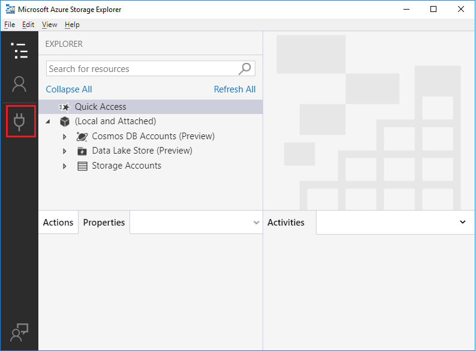

1. Select **Add an Azure Account**, and then select **Sign-in**.

   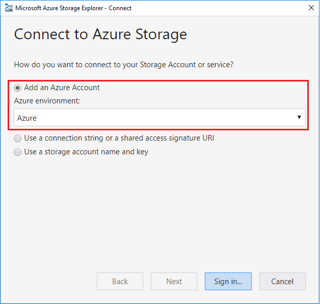

1. In the **Sign in to your account** dialog box, enter your Azure credentials.

    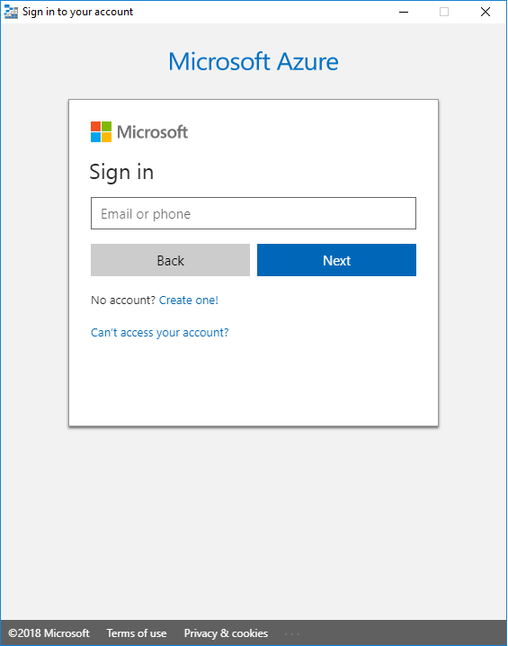

1. Select your subscription from the list, and then select **Apply**.

    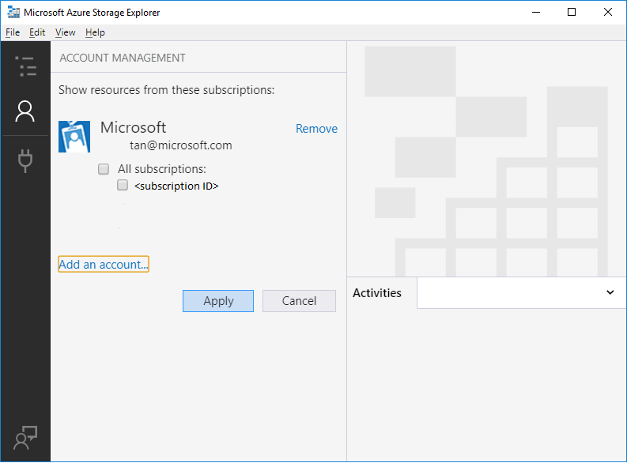

    The **EXPLORER** pane is updated and displays the accounts in the selected subscription.

    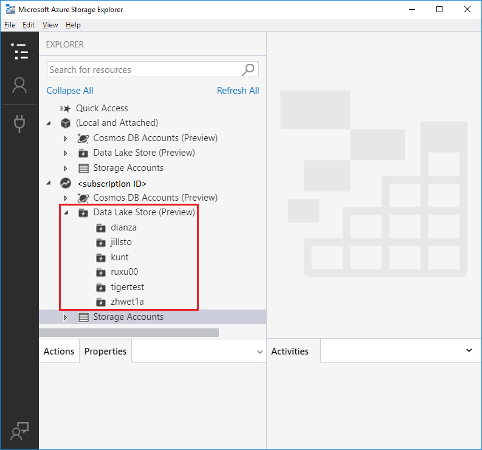

You have successfully connected Data Lake Storage Gen1 to your Azure subscription.

## Connect to Data Lake Storage Gen1

You can access resources that don't exist in your subscription if someone gives you the URI for the resources. You can then connect to Data Lake Storage Gen1 by using the URI after you sign in.

1. Open Storage Explorer.
2. In the left pane, expand **Local and Attached**.
3. Right-click **Data Lake Store**, and then select **Connect to Data Lake Store**.

      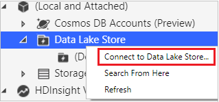

4. Enter the URI. The tool browses to the location of the URL that you just entered.

      

      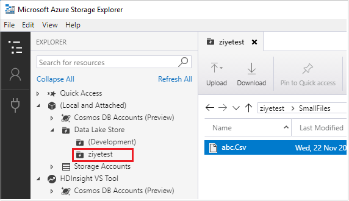

## View a Data Lake Storage Gen1 account's contents

A Data Lake Storage Gen1 account's resources contain folders and files.

The following steps illustrate how to view the contents of a Data Lake Storage Gen1 account within Storage Explorer:

1. Open Storage Explorer.
2. In the left pane, expand the subscription that contains the Data Lake Storage Gen1 account that you want to view.
3. Expand **Data Lake Store**.
4. Right-click the Data Lake Storage Gen1 account node that you want to view, and then select **Open**. You can also double-click the Data Lake Storage Gen1 account to open it.

   The main pane displays the Data Lake Storage Gen1 account's contents.

   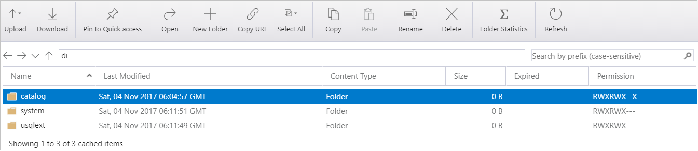

## Manage resources in Data Lake Storage Gen1

You can manage Data Lake Storage Gen1 resources by doing following operations:

* Browse through Data Lake Storage Gen1 resources across multiple Data Lake Storage Gen1 accounts.  
* Use a connection string to connect to and manage Data Lake Storage Gen1 directly.
* View Data Lake Storage Gen1 resources shared by others through an ACL under **Local and Attached**.
* Perform file and folder CRUD operations: support recursive folders and multi-selected files.
* Drag, drop, and add a folder to quickly access recent locations. This operation mirrors the desktop File Explorer experience.
* Copy and open a Data Lake Storage Gen1 hyperlink in Storage Explorer with one click.
* Display Activity Log in the lower-right pane to view activity status.
* Display folder statistics and file properties.

## Manage resources in Azure Storage Explorer

After you create a Data Lake Storage Gen1 account, you can:

* Upload folders and files, download folders and files, and open resources on your local computer.
* Pin to **Quick Access**, create a new folder, copy a URL, and select all.
* Copy and paste, rename, delete, get folder statistics, and refresh.

The following items illustrate how to manage resources within a Data Lake Storage Gen1 account. Follow the steps for the task that you want to perform.

### Upload files

1. On the main pane's toolbar, select **Upload**, and then select **Upload Files** on the drop-down menu.

   

2. In the **Select files to upload** dialog box, select the files that you want to upload.

   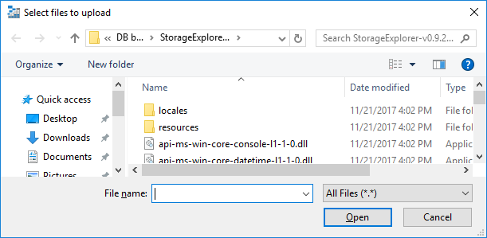

3. Select **Open** to begin the upload.

### Upload a folder

1. On the main pane's toolbar, select **Upload**, and then select **Upload Folder** on the drop-down menu.

   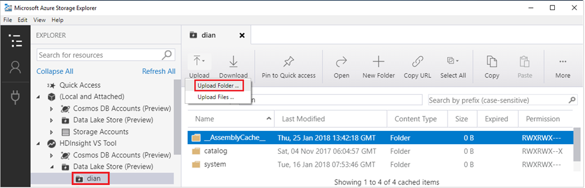

2. In the **Select folder to upload** dialog box, select a folder that you want to upload. Then click **Select Folder**.

   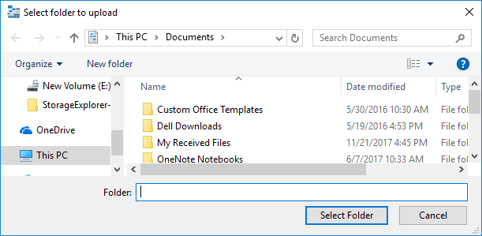

   The upload starts.

   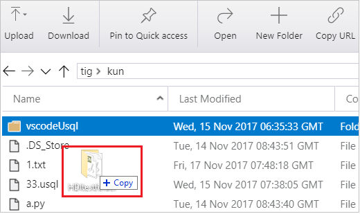

> [!NOTE]
> You can directly drag the folders and files on a local computer to start uploading.

### Download folders or files to your local computer

1. Select the folders or files that you want to download.
2. On the main pane's toolbar, select **Download**.
3. In the **Select a folder to save the downloaded files into** dialog box, specify the location and the name.
4. Select **Save**.

### Open a folder or file from your local computer

1. Select the folder or file that you want to open.
2. On the main pane's toolbar, select **Open**. Or right-click the selected folder or file, and then select **Open** on the shortcut menu.

The file is downloaded and opened through the application that's associated with the underlying file type. Or the folder is opened in the main pane.

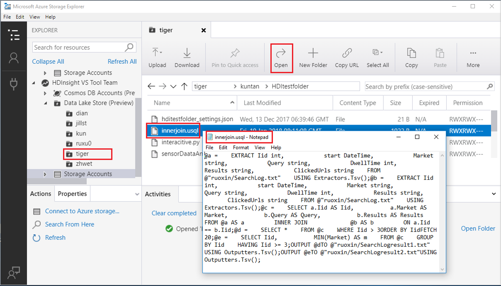

### Copy folders or files to the clipboard

1. Select the folders or files that you want to copy.
2. On the main pane's toolbar, select **Copy**. Or right-click the selected folders or files, and then select **Copy** on the shortcut menu.
3. In the left pane, browse to another Data Lake Storage Gen1 account, and double-click it to view it in the main pane.
4. On the main pane's toolbar, select **Paste** to create a copy. Or select **Paste** on the destination's shortcut menu.

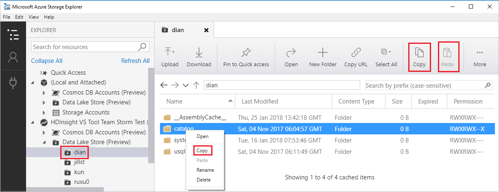

> [!NOTE]
> Copy/paste operations across storage types are not supported. You can copy Data Lake Storage Gen1 folders or files and paste them in another Data Lake Storage Gen1 account. But you *cannot* copy Data Lake Storage Gen1 folders or files and paste them to Azure Blob storage or the other way around.
>
> The copy/paste operation works by downloading the folders or files to the local computer and then uploading them to the destination. The tool *does not* perform the action in the back end. The copy/paste operation on large files is slow. The optimization of high-performance file copy/move is underway.

### Delete folders or files

1. Select the folders or files that you want to delete.
2. On the main pane's toolbar, select **Delete**. Or right-click the selected folders or files, and then select **Delete** on the shortcut menu.
3. Select **Yes** in the confirmation dialog box.

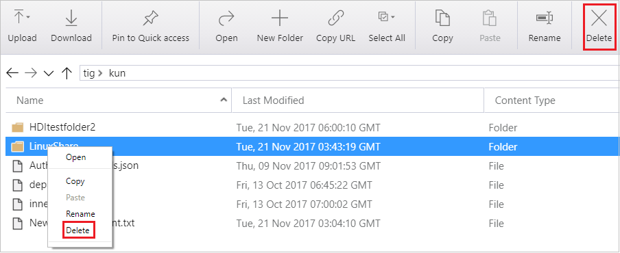

### Pin to Quick Access

1. Select the folder that you want to pin.
2. On the main pane's toolbar, select **Pin to Quick access**.

   In the left pane, the selected folder is added to the **Quick Access** node.

   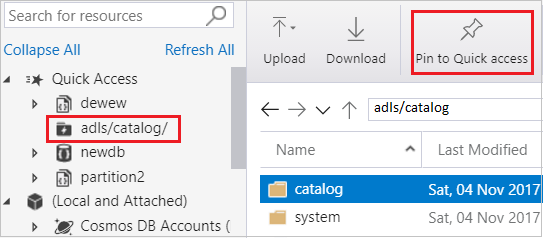

After you pin a folder to the **Quick Access** node, you can easily access the resources.

### Use deep links

If you have a URL, you can enter the URL into the address path in File Explorer or a browser. Then Storage Explorer.exe runs automatically to go to the location of the URL.

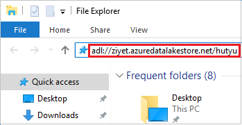

## Next steps

* View the [latest Storage Explorer release notes and videos](https://www.storageexplorer.com).
* Learn how to [manage Azure Cosmos DB in Azure Storage Explorer](https://docs.microsoft.com/azure/cosmos-db/storage-explorer).
* [Get started with Storage Explorer](https://docs.microsoft.com/azure/vs-azure-tools-storage-manage-with-storage-explorer).
* [Get started with Azure Data Lake Storage Gen1](https://docs.microsoft.com/azure/data-lake-store/data-lake-store-overview).
* Watch a [YouTube video about how to use Azure Cosmos DB in Azure Storage Explorer](https://www.youtube.com/watch?v=iNIbg1DLgWo&feature=youtu.be).
