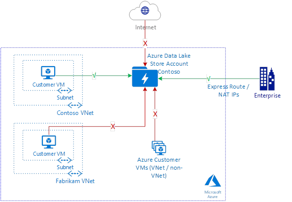
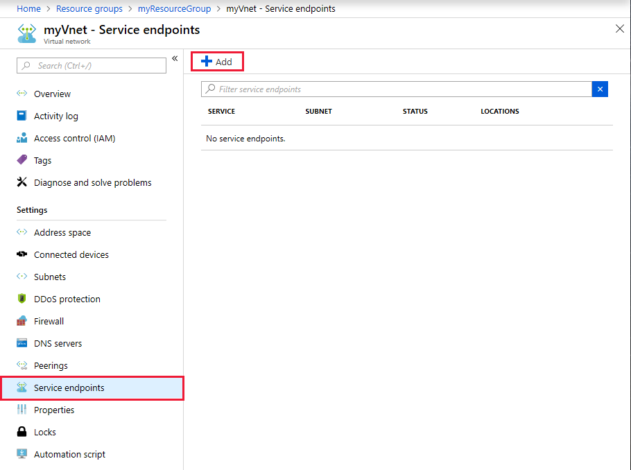
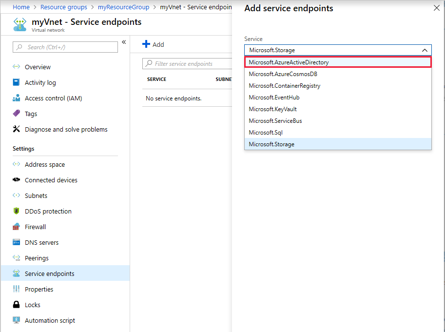
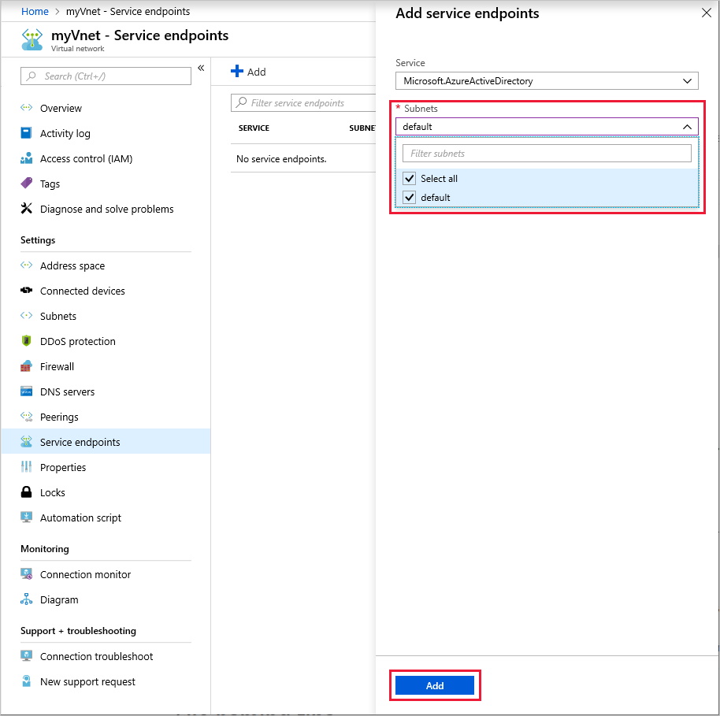
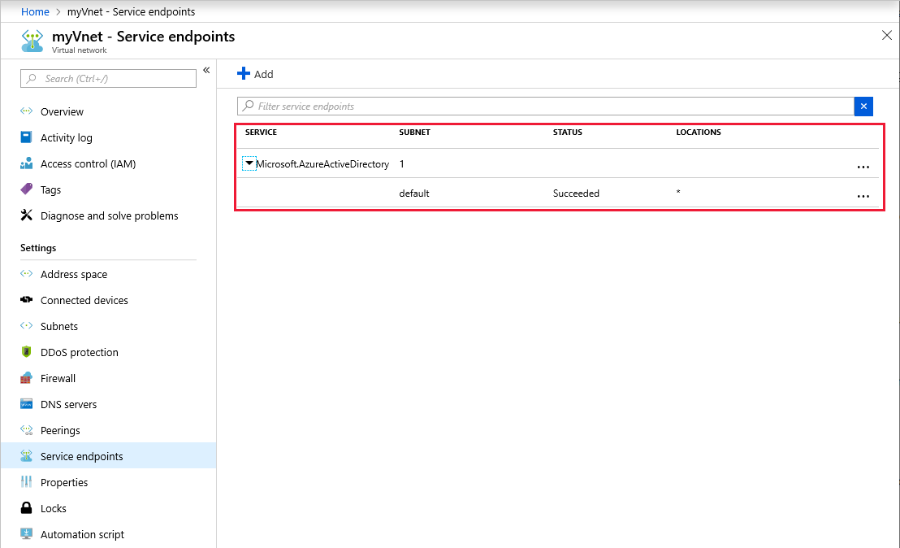
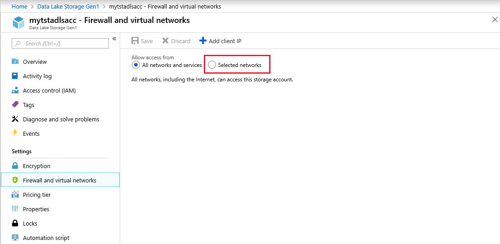
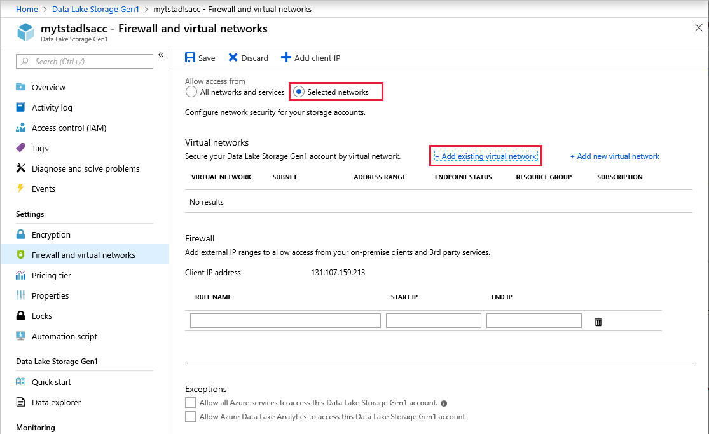
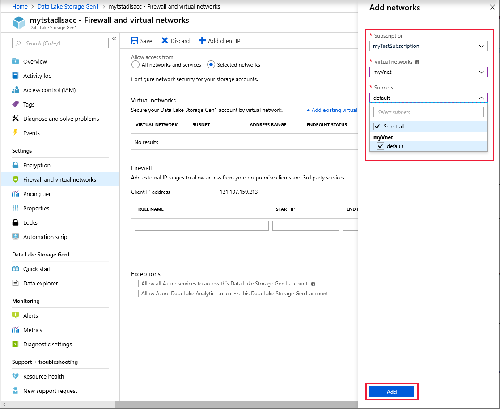
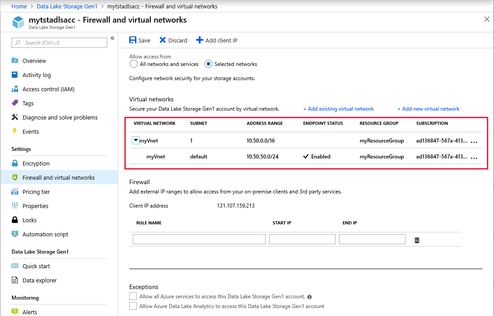
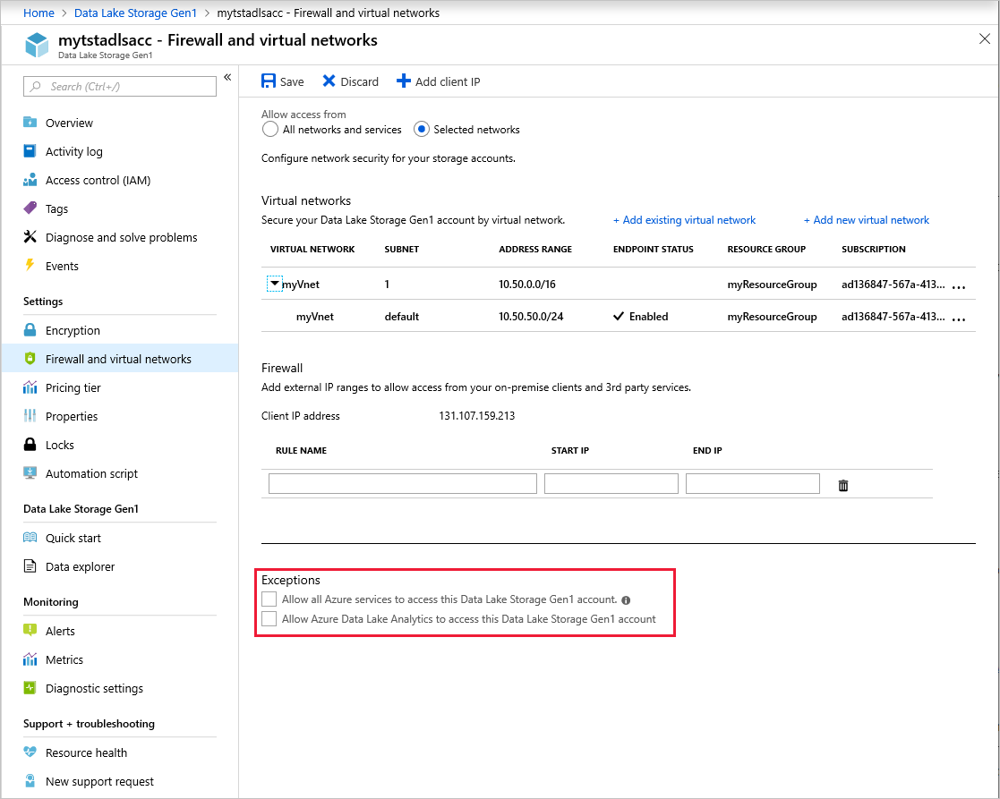

# Virtual Network integration for Azure Data Lake Storage Gen1 - Preview

Introducing Virtual Network integration for Azure Data Lake Storage Gen1 (in preview). VNet integration allows you to prevent unauthorized access to your Azure Data Lake Storage Gen1 accounts by locking these accounts to your specific virtual networks and subnets. You can now configure your ADLS Gen1 account to only accept traffic from the designated virtual vetworks and subnets and block access from everywhere else. This helps secure your ADLS account from external threats.

VNet integration for ADLS Gen1 makes use of the virtual network service endpoint security between your Virtual Network and Azure Active Directory service to generate additional security claims in the access token. These claims are then used for authenticating your virtual network to your ADLS Gen1 account and allowing access.

> [!NOTE]
> This is a preview technology and we do not recommend use in production environments.
>
> There is no additional charge associated with using these capabilities. Your account will be billed at the standard rate for ADLS Gen1 ([pricing](https://azure.microsoft.com/pricing/details/data-lake-store/?cdn=disable)) and all Azure services that you use ([pricing](https://azure.microsoft.com/pricing/#product-picker)).

## Scenarios for VNET Integration for ADLS Gen1

ADLS Gen1 VNet Integration allows you to restrict access to your ADLS Gen1 account from designated virtual networks and subnets.  Other VNets / VMs in Azure will not be allowed access to your account once it is locked to the specified VNet Subnet.  Functionally, ADLS Gen1 VNet Integration enables the same scenario as [virtual network service endpoints](https://docs.microsoft.com/azure/virtual-network/virtual-network-service-endpoints-overview).  There are a few key differences detailed in the sections below. 



> [!NOTE]
> The existing IP firewall rules can be used in addition to VNet rules to allow access from on-premises networks as well. 

## Optimal routing with ADLS Gen1 VNet integration

A key benefit of VNet service endpoints is [optimal routing](https://docs.microsoft.com/azure/virtual-network/virtual-network-service-endpoints-overview#key-benefits) from your virtual network.  To perform the same route optimization to ADLS Gen1 accounts, use the following [User Defined routes](https://docs.microsoft.com/azure/virtual-network/virtual-networks-udr-overview#user-defined) from your VNet to your ADLS Gen1 account:

- **ADLS Public IP Address** – Use the public IP address for your target ADLS Gen1 accounts.  You can identify the IP addresses for your ADLS Gen1 account by [resolving the DNS names](https://docs.microsoft.com/azure/data-lake-store/data-lake-store-connectivity-from-vnets#enabling-connectivity-to-azure-data-lake-storage-gen1-from-vms-with-restricted-connectivity) of your accounts.  Create a separate entry for each address.

```azurecli
# Create a Route table for your resource group
az network route-table create --resource-group $RgName --name $RouteTableName

# Create Route Table Rules for ADLS Public IP Addresses
# There will be one rule per ADLS Public IP Addresses 
az network route-table route create --name toADLSregion1 --resource-group $RgName --route-table-name $RouteTableName --address-prefix <ADLS Public IP Address> --next-hop-type Internet

# Update the VNet and apply the newly created Route Table to it
az network vnet subnet update --vnet-name $VnetName --name $SubnetName --resource-group $RgName --route-table $RouteTableName
```

## Data Exfiltration from the customer VNet

In addition to securing the ADLS accounts for access from Virtual Network, you may also be interested in making sure there is no exfiltration to an unauthorized account.

Our recommendation is to use a Firewall solution in your VNet to filter the outbound traffic based on the destination account URL and allow access to only authorized ADLS Gen1 accounts.

Some available options are:
- [Azure Firewall](https://docs.microsoft.com/azure/firewall/overview) : You can [deploy and configure an Azure Firewall](https://docs.microsoft.com/azure/firewall/tutorial-firewall-deploy-portal) for your VNet and secure the outbound ADLS traffic and lock it down to the known and authorized account URL.
- [Network Virtual Appliance](https://azure.microsoft.com/solutions/network-appliances/) Firewall: If your administrator only authorizes use of certain commercial Firewall vendors, you can use an NVA firewall solution available at the Azure Marketplace to perform the same function.

> [!NOTE]
> Using Firewalls in the data path will introduce an additional hop in the data path and might have a network perf impact for End-to-End data exchange, including throughput available and connection latency. 

## Limitations
1.	HDInsight clusters must be newly created after being added to the preview.  Clusters created before ADLS Gen1 VNet integration support was available must be recreated to support this new feature. 
2.	When creating a new HDInsight cluster, selecting an ADLS Gen1 account with VNet integration enabled will cause the process to fail. You must first disable the VNet rule or you can **Allow access from all networks and services** via the **Firewall and virtual networks** blade of the ADLS account.  See the [Exceptions](##Exceptions) section for more info.
3.	The ADLS Gen1 VNet integration preview does not work with [managed identities for Azure resources](https://docs.microsoft.com/azure/active-directory/managed-identities-azure-resources/overview).  
4.	File/folder data in your VNet-enabled ADLS Gen1 account is not accessible from the portal.  This includes access from a VM that’s within the VNET and activities such as using Data Explorer.  Account management activities continue to work.  File/Folder data in you VNET-enabled ADLS account is accessible via all non-portal resources: SDK access, PowerShell scripts, other Azure services (when not originating from the portal), etc…. 

## Configuration

### Step1: Configure your VNET to use AAD Service Endpoint
1.	Go to the Azure portal and log into your account. 
2.	[Create a new virtual network ](https://docs.microsoft.com/azure/virtual-network/quick-create-portal)in your subscription or navigate to an existing virtual network.  The VNET must currently be in the same region as the ADLS Gen 1 account. 
3.	From the Virtual network blade, choose **Service endpoints**. 
4.	Click **Add** to add a new service endpoint.

5.	Choose **Microsoft.AzureActiveDirectory** as the service for the endpoint.

6.	Choose the subnets for which you intend to allow connectivity, click **Add**.

7.	It can take up to 15 minutes for the service endpoint to be added. Once added, it will show up in the list. Verify that it shows up and all details are as configured. 


### Step 2: Set up the allowed VNET/Subnet for your ADLS Gen1 account
1.	After configuring your VNET, [create a new Azure Data Lake Storage Gen1 account](data-lake-store-get-started-portal.md#create-a-data-lake-storage-gen1-account) in your subscription or navigate to an existing ADLS Gen1 account. The ADLS Gen1 account must currently be in the same region as the VNET. 
2.	Choose **Firewall and virtual networks**.

  > [!NOTE]
  > If you do not see **Firewall and virtual networks** in the settings then please log off the portal. Close the browser. Clear the browser cache. Restart the machine and retry.

  
3.	Choose **Selected networks**. 
4.	Click **Add existing virtual network**.
  
5.	Choose the VNets and subnets to allow for connectivity then click **Add**.
  
6.	Ensure that the VNets and subnets show up correctly in the list and **Save**.
  

  > [!NOTE]
  > It may take up to 5 minutes for the settings to take into effect after saving.

7.	[Optional] In addition to VNets and subnets, if you wish to allow connectivity from specific IP addresses, you may do that in the **Firewall** section on the same page. 

## Exceptions
There are two check boxes in the Exceptions area on the **Firewall and virtual networks** blade that enable connectivity from a set of services and virtual machines on Azure.

- **Allow all Azure services to access this Data Lake Storage Gen1 account** allows all Azure services such as Azure Data Factory, Event Hubs, all Azure VMs, etc… to communicate to your ADLS account.

- **Allow Azure Data Lake Analytics to access this Data Lake Storage Gen1 account** allows the Azure Data Lake Analytics service connectivity to this ADLS account. 

We recommend that you keep these exceptions turned off and only turn them on if you need connectivity from these other services from outside of your VNet.
