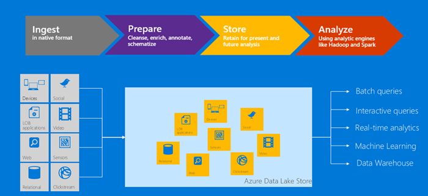

# What is Azure Data Lake Storage Gen1?

[!INCLUDE [data-lake-storage-gen1-rename-note.md](../../includes/data-lake-storage-gen1-rename-note.md)]

Azure Data Lake Storage Gen1 is an enterprise-wide hyper-scale repository for big data analytic workloads. Azure Data Lake enables you to capture data of any size, type, and ingestion speed in one single place for operational and exploratory analytics.

Data Lake Storage Gen1 can be accessed from Hadoop (available with HDInsight cluster) using the WebHDFS-compatible REST APIs. It's designed to enable analytics on the stored data and is tuned for performance for data analytics scenarios. Data Lake Storage Gen1 includes all enterprise-grade capabilities: security, manageability, scalability, reliability, and availability.

## Key capabilities

Some of the key capabilities of Data Lake Storage Gen1 include the following.

### Built for Hadoop

Data Lake Storage Gen1 is an Apache Hadoop file system that's compatible with Hadoop Distributed File System (HDFS), and works with the Hadoop ecosystem. Your existing HDInsight applications or services that use the WebHDFS API can easily integrate with Data Lake Storage Gen1. Data Lake Storage Gen1 also exposes a WebHDFS-compatible REST interface for applications.

You can easily analyze data stored in Data Lake Storage Gen1 using Hadoop analytic frameworks such as MapReduce or Hive. You can provision Azure HDInsight clusters and configure them to directly access data stored in Data Lake Storage Gen1.

### Unlimited storage, petabyte files

Data Lake Storage Gen1 provides unlimited storage and can store a variety of data for analytics. It doesn't impose any limits on account sizes, file sizes, or the amount of data that can be stored in a data lake. Individual files can range from kilobyte to petabytes in size. Data is stored durably by making multiple copies. There is no limit on the duration of time for which the data can be stored in the data lake.

### Performance-tuned for big data analytics

Data Lake Storage Gen1 is built for running large-scale analytic systems that require massive throughput to query and analyze large amounts of data. The data lake spreads parts of a file over a number of individual storage servers. This improves the read throughput when reading the file in parallel for performing data analytics.

### Enterprise ready: Highly available and secure

Data Lake Storage Gen1 provides industry-standard availability and reliability. Your data assets are stored durably by making redundant copies to guard against any unexpected failures.

Data Lake Storage Gen1 also provides enterprise-grade security for the stored data. For more information, see [Securing data in Azure Data Lake Storage Gen1](#DataLakeStoreSecurity).

### All data

Data Lake Storage Gen1 can store any data in its native format, without requiring any prior transformations. Data Lake Storage Gen1 does not require a schema to be defined before the data is loaded, leaving it up to the individual analytic framework to interpret the data and define a schema at the time of the analysis. The ability to store files of arbitrary sizes and formats makes it possible for Data Lake Storage Gen1 to handle structured, semi-structured, and unstructured data.

Data Lake Storage Gen1 containers for data are essentially folders and files. You operate on the stored data using SDKs, the Azure portal, and Azure Powershell. If you put your data into the store using these interfaces and using the appropriate containers, you can store any type of data. Data Lake Storage Gen1 does not perform any special handling of data based on the type of data it stores.

## Securing data

Data Lake Storage Gen1 uses Azure Active Directory (Azure AD) for authentication, and access control lists (ACLs) to manage access to your data.

| Feature | Description |
| --- | --- |
| Authentication |Data Lake Storage Gen1 integrates with Azure AD for identity and access management for all the data stored in Data Lake Storage Gen1. Because of the integration, Data Lake Storage Gen1 benefits from all Azure AD feature such as multi-factor authentication, Conditional Access, role-based access control, application usage monitoring, security monitoring and alerting, and so on. Data Lake Storage Gen1 supports the OAuth 2.0 protocol for authentication within the REST interface. See [Data Lake Storage Gen1 authentication](data-lakes-store-authentication-using-azure-active-directory.md).|
| Access control |Data Lake Storage Gen1 provides access control by supporting POSIX-style permissions exposed by the WebHDFS protocol. You can enable ACLs on the root folder, on subfolders, and on individual files. For more information about how ACLs work in the context of Data Lake Storage Gen1, see [Access control in Data Lake Storage Gen1](data-lake-store-access-control.md). |
| Encryption |Data Lake Storage Gen1 also provides encryption for data that's stored in the account. You specify the encryption settings while creating a Data Lake Storage Gen1 account. You can choose to have your data encrypted or opt for no encryption. For more information, see [Encryption in Data Lake Storage Gen1](data-lake-store-encryption.md). For instructions on how to provide encryption-related configuration, see [Get started with Data Lake Storage Gen1 using the Azure portal](data-lake-store-get-started-portal.md). |

For instructions on how to secure data in Data Lake Storage Gen1, see [Securing data in Azure Data Lake Storage Gen1](data-lake-store-secure-data.md).

## Application compatibility

Data Lake Storage Gen1 is compatible with most open-source components in the Hadoop ecosystem. It also integrates well with other Azure services. To learn more about how you can use Data Lake Storage Gen1 with open-source components and other Azure services, use the following links:

- See [Applications and services compatible with Azure Data Lake Storage Gen1](data-lake-store-compatible-oss-other-applications.md) for a list of open-source applications interoperable with Data Lake Storage Gen1.
- See [Integrating with other Azure services](data-lake-store-integrate-with-other-services.md) to understand how to use Data Lake Storage Gen1 with other Azure services to enable a wider range of scenarios.
- See [Scenarios for using Data Lake Storage Gen1](data-lake-store-data-scenarios.md) to learn how to use Data Lake Storage Gen1 in scenarios such as ingesting data, processing data, downloading data, and visualizing data.

## Data Lake Storage Gen1 file system

Data Lake Storage Gen1 can be accessed via the filesystem AzureDataLakeFilesystem (adl://) in Hadoop environments (available with HDInsight cluster). Applications and services that use adl:// can take advantage of further performance optimizations that aren't currently available in WebHDFS. As a result, Data Lake Storage Gen1 gives you the flexibility to either make use of the best performance with the recommended option of using adl:// or maintain existing code by continuing to use the WebHDFS API directly. Azure HDInsight fully leverages the AzureDataLakeFilesystem to provide the best performance on Data Lake Storage Gen1.

You can access your data in Data Lake Storage Gen1 using `adl://<data_lake_storage_gen1_name>.azuredatalakestore.net`. For more information about how to access the data in Data Lake Storage Gen1, see [View properties of the stored data](data-lake-store-get-started-portal.md#properties).

## Next steps

- [Get started with Data Lake Storage Gen1 using the Azure portal](data-lake-store-get-started-portal.md)
- [Get started with Data Lake Storage Gen1 using .NET SDK](data-lake-store-get-started-net-sdk.md)
- [Use Azure HDInsight with Data Lake Storage Gen1](data-lake-store-hdinsight-hadoop-use-portal.md)