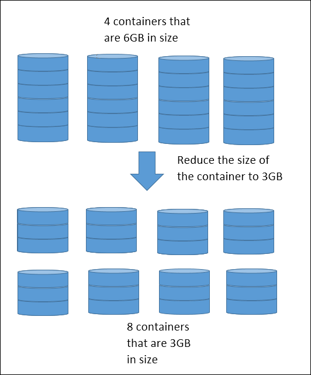
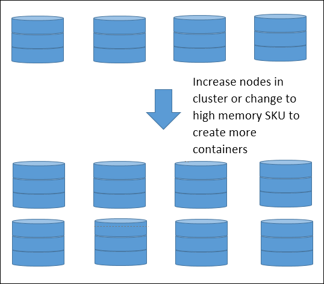

# Performance tuning guidance for Azure Data Lake Store

This article provides guidance on how to get the most optimal performance while writing data to or reading data from performance Azure Data Lake Store. This article is meant to help users understand the parameters that can be configured for commonly used  data upload/download tools and data analysis workloads. The tuning in this guide is specifically targeted to resource intensive workloads where there is a large amount of data that is being read from or written to Data Lake Store.

## Prerequisites

* **An Azure subscription**. See [Get Azure free trial](https://azure.microsoft.com/pricing/free-trial/).
* **An Azure Data Lake Store account**. For instructions on how to create one, see [Get started with Azure Data Lake Store](data-lake-store-get-started-portal.md)
* **Azure HDInsight cluster** with access to a Data Lake Store account. See [Create an HDInsight cluster with Data Lake Store](data-lake-store-hdinsight-hadoop-use-portal.md). Make sure you enable Remote Desktop for the cluster.

## Guidelines for data ingestion tools

This section provides general guidance to improve performance when data is copied or moved into Data Lake Store. In this section, we discuss factors that limit performance and ways to overcome those limitations. Below are a few considerations to keep note of.

* **Source Data** - There are many constraints that can arise from where the source data is coming from. Throughput can be a bottleneck if the source data is on slow spindles or remote storage with low throughput capabilities. SSDs, preferably on local disk, will provide the best performance due to higher disk throughput.

* **Network** - If you have your source data on VMs, the network connection between the VM and Data Lake Store is important. Use VMs with the largest available NIC to get more network bandwidth.

* **Cross-region copy** - There is a large network cost inherent to cross-region data I/O, for example running a data ingestion tool on a VM in US East 2 to write data to a Data Lake Store account in US Central. If you’re copying data across regions, you may see reduced performance. We recommend using data ingestion jobs on VMs in the same region as the destination Data Lake Store account to maximize network throughput.                                                                                                                                        

* **Cluster** - If you are running data ingestion jobs through an HDInsight cluster (such as for DistCp), we recommend using D-series VMs for the cluster because they contain more memory. Larger numbers of cores will also help to increase throughput.                                                                                                                                                                                                                                                                                                            

* **Concurrency of threads** - If you are using an HDInsight cluster to copy data from a storage container, there are limitations to the parallel number of threads that can be used based on your cluster size, container size, and thread settings. One of the most important ways to get better performance on Data Lake Store is to increase the concurrency. You should tune your settings to get the maximum amount to concurrency to obtain higher throughput. The table below are the settings for each ingestion method that can be configured to achieve more concurrency. Follow the links in the table to go to articles that talk about how to use the tool to ingest data into Data Lake Store and also how to performance-tune the tool for maximum throughput.

	| Tool               | Concurrency setting                                                                |
	|--------------------|------------------------------------------------------------------------------------|
	| [Powershell](data-lake-store-get-started-powershell.md)       | PerFileThreadCount, ConcurrentFileCount |
	| [AdlCopy](data-lake-store-copy-data-azure-storage-blob.md)    | Azure Data Lake Analytics units         |
	| [DistCp](data-lake-store-copy-data-wasb-distcp.md)            | -m (mapper)                             |
	| [Azure Data Factory](../data-factory/data-factory-azure-datalake-connector.md)| parallelCopies                          |
	| [Sqoop](data-lake-store-data-transfer-sql-sqoop.md)           | fs.azure.block.size, -m (mapper)        |

## Guidelines while working with HDInsight workloads

While running analytic workloads to work with data in Data Lake Store, we recommend that you use HDInsight 3.5 cluster versions to get the best performance with Data Lake Store. When your job is more I/O intensive, then certain parameters can be configured for performance reasons. For example, if the job mainly consists of read or writes, then increasing concurrency for I/O to and from Azure Data Lake Store could increase performance.

Azure Data Lake Store is best optimized for performance when there is more concurrency. There are a few general ways to increase concurrency for I/O intensive jobs.

1. **Run a larger number of compute YARN containers rather than a few number of large YARN containers** – Having more containers will increase concurrency for input and output operations thus leveraging the abilities of Data Lake Store.

	For example, let’s assume you have 2 D3v2 nodes in your HDInsight cluster. Each D3v2 node has 12GB of YARN memory so 2 D3v2 machines will have 24GB of YARN memory. Let’s also assume that you’ve set the YARN container sizes to 6GB. This means you can have 4 containers of 6GB each. Therefore, you can have 4 concurrent tasks running in parallel. To increase concurrency, you can reduce the size of the containers to 3GB which will give you 8 containers of 3GB each. This allows you to have 8 concurrent tasks running in parallel. Below is an illustration.

	

	A common question is why don’t I decrease the container size to 1GB of memory so that I can get 24 containers to further increase concurrency. It depends on whether the task needs 3GB of memory or does 1GB suffice.  You may be doing a simple operation in the container that only requires 1GB of memory or a complex operation that may take 3GB of memory.  If you reduce the size of the container too much, you may get an out of memory exception.  When this happens, you should increase the size of your containers.  In addition to memory, the number of virtual cores can also affect parallelism.

	

2. **Increase memory in your cluster to get more concurrency** – You can increase the memory in your cluster by increasing the size of your cluster or choosing a VM type that has more memory. This will increase the amount of YARN memory available so that you can create more containers, which increases the concurrency.  

	For example, let’s assume you have a single D3v2 node in your HDInsight cluster that has 12GB of YARN memory and 3GB containers.  You scale your cluster to 2 D3v2, which increases your YARN memory to 24GB.  This increases concurrency from 4 to 8.

	

3. **Start by setting the number of tasks to the number of concurrency you have** – By now, you have already set the container size appropriately to get the maximum amount of concurrency. You should now set the number of tasks to use all those containers. There are different names for tasks in each workload.

	You may also want to consider the size of your job. If the size of your job is large, then each task may have a large amount of data to process. You may want to use more tasks so that each task will not be processing too much data.

	For example, let’s assume you have 6 containers. We should set our tasks to 6 as a starting point. You may experiment with using higher numbers of tasks to see if performance improves. Setting a higher number of tasks does not increase concurrency. If we set tasks to higher than 6, then the task will not execute until the next wave. If we set tasks to lower than 6, then the concurrency will not be fully utilized.

	Each workload has different parameters available to set the number of tasks. The table below lists some of them.

	| Workload               | Parameter to set tasks                                                         |
	|--------------------|------------------------------------------------------------------------------------|
	| [Spark on HDInisight](data-lake-store-performance-tuning-spark.md)       | <ul><li>Num-executors</li><li>Executor-memory</li><li>Executor-cores</li></ul> |
	| [Hive on HDInsight](data-lake-store-performance-tuning-hive.md)    | hive.tez.container.size         |
	| [MapReduce on HDInsight](data-lake-store-performance-tuning-mapreduce.md)            | <ul><li>Mapreduce.map.memory</li><li>Mapreduce.job.maps</li><li>Mapreduce.reduce.memory</li><li>Mapreduce.job.reduces</li></ul> |
	| [Storm on HDInsight](data-lake-store-performance-tuning-storm.md)| <ul><li>Number of worker processes</li><li>Number of spout executor instances</li><li>Number of bolt executor instances </li><li>Number of spout tasks</li><li>Number of bolt tasks</li></ul>|

## See also
* [Overview of Azure Data Lake Store](data-lake-store-overview.md)
* [Get Started with Azure Data Lake Analytics](../data-lake-analytics/data-lake-analytics-get-started-portal.md)
