# Analyze data in Azure Data Lake Storage Gen1 by using Power BI
In this article you will learn how to use Power BI Desktop to analyze and visualize data stored in Azure Data Lake Storage Gen1.

## Prerequisites
Before you begin this tutorial, you must have the following:

* **An Azure subscription**. See [Get Azure free trial](https://azure.microsoft.com/pricing/free-trial/).
* **A Data Lake Storage Gen1 account**. Follow the instructions at [Get started with Azure Data Lake Storage Gen1 using the Azure portal](data-lake-store-get-started-portal.md). This article assumes that you have already created a Data Lake Storage Gen1 account, called **myadlsg1**, and uploaded a sample data file (**Drivers.txt**) to it. This sample file is available for download from [Azure Data Lake Git Repository](https://github.com/Azure/usql/tree/master/Examples/Samples/Data/AmbulanceData/Drivers.txt).
* **Power BI Desktop**. You can download this from [Microsoft Download Center](https://www.microsoft.com/en-us/download/details.aspx?id=45331). 

## Create a report in Power BI Desktop
1. Launch Power BI Desktop on your computer.
2. From the **Home** ribbon, click **Get Data**, and then click More. In the **Get Data** dialog box, click **Azure**, click **Azure Data Lake Store**, and then click **Connect**.
   
    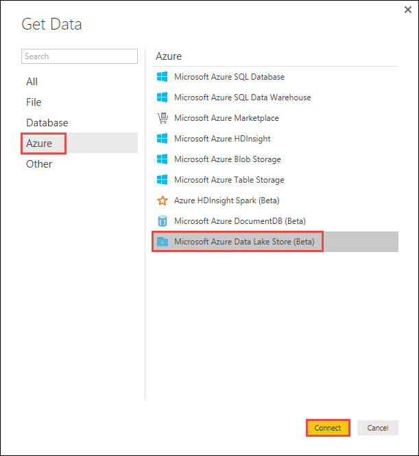
3. If you see a dialog box about the connector being in a development phase, opt to continue.
4. In the **Azure Data Lake Store** dialog box, provide the URL to your Data Lake Storage Gen1 account, and then click **OK**.
   
    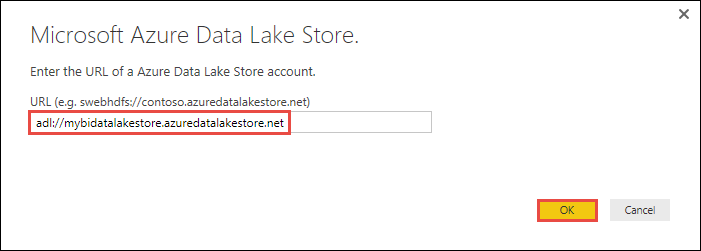
5. In the next dialog box, click **Sign in** to sign into the Data Lake Storage Gen1 account. You will be redirected to your organization's sign in page. Follow the prompts to sign into the account.
   
    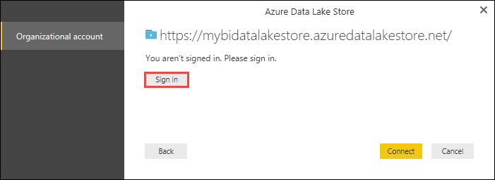
6. After you have successfully signed in, click **Connect**.
   
    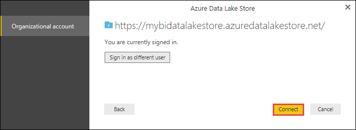
7. The next dialog box shows the file that you uploaded to your Data Lake Storage Gen1 account. Verify the info and then click **Load**.
   
    
8. After the data has been successfully loaded into Power BI, you will see the following fields in the **Fields** tab.
   
    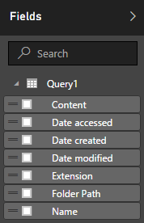
   
    However, to visualize and analyze the data, we prefer the data to be available per the following fields
   
    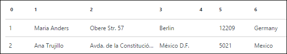
   
    In the next steps, we will update the query to convert the imported data in the desired format.
9. From the **Home** ribbon, click **Edit Queries**.
   
    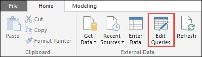
10. In the Query Editor, under the **Content** column, click **Binary**.
    
    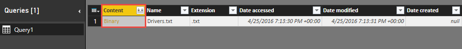
11. You will see a file icon, that represents the **Drivers.txt** file that you uploaded. Right-click the file, and click **CSV**.    
    
    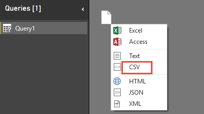
12. You should see an output as shown below. Your data is now available in a format that you can use to create visualizations.
    
    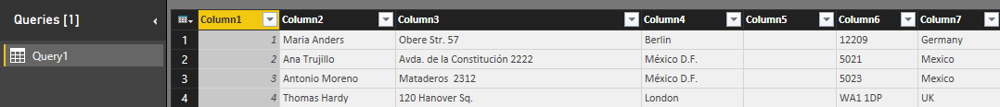
13. From the **Home** ribbon, click **Close and Apply**, and then click **Close and Apply**.
    
    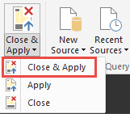
14. Once the query is updated, the **Fields** tab will show the new fields available for visualization.
    
    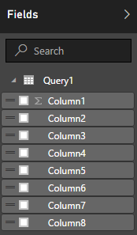
15. Let us create a pie chart to represent the drivers in each city for a given country/region. To do so, make the following selections.
    
    1. From the Visualizations tab, click the symbol for a pie chart.
       
        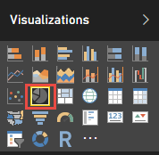
    2. The columns that we are going to use are **Column 4** (name of the city) and **Column 7** (name of the country/region). Drag these columns from **Fields** tab to **Visualizations** tab as shown below.
       
        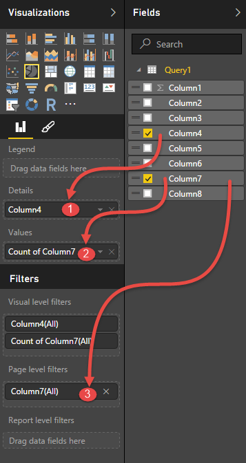
    3. The pie chart should now resemble like the one shown below.
       
        
16. By selecting a specific country/region from the page level filters, you can now see the number of drivers in each city of the selected country/region. For example, under the **Visualizations** tab, under **Page level filters**, select **Brazil**.
    
    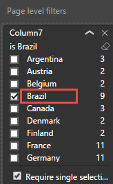
17. The pie chart is automatically updated to display the drivers in the cities of Brazil.
    
    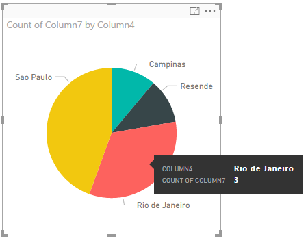
18. From the **File** menu, click **Save** to save the visualization as a Power BI Desktop file.

## Publish report to Power BI service
Once you have created the visualizations in Power BI Desktop, you can share it with others by publishing it to the Power BI service. For instructions on how to do that, see [Publish from Power BI Desktop](https://powerbi.microsoft.com/documentation/powerbi-desktop-upload-desktop-files/).

## See also
* [Analyze data in Data Lake Storage Gen1 using Data Lake Analytics](../data-lake-analytics/data-lake-analytics-get-started-portal.md)

