# Securing data stored in Azure Data Lake Storage Gen1
Securing data in Azure Data Lake Storage Gen1 is a three-step approach.  Both role-based access control (RBAC) and access control lists (ACLs) must be set to fully enable access to data for users and security groups.

1. Start by creating security groups in Azure Active Directory (AAD). These security groups are used to implement role-based access control (RBAC) in Azure portal. For more information, see [Role-based Access Control in Microsoft Azure](../role-based-access-control/role-assignments-portal.md).
2. Assign the AAD security groups to the Data Lake Storage Gen1 account. This controls access to the Data Lake Storage Gen1 account from the portal and management operations from the portal or APIs.
3. Assign the AAD security groups as access control lists (ACLs) on the Data Lake Storage Gen1 file system.
4. Additionally, you can also set an IP address range for clients that can access the data in Data Lake Storage Gen1.

This article provides instructions on how to use the Azure portal to perform the above tasks. For in-depth information on how Data Lake Storage Gen1 implements security at the account and data level, see [Security in Azure Data Lake Storage Gen1](data-lake-store-security-overview.md). For deep-dive information on how ACLs are implemented in Data Lake Storage Gen1, see [Overview of Access Control in Data Lake Storage Gen1](data-lake-store-access-control.md).

## Prerequisites
Before you begin this tutorial, you must have the following:

* **An Azure subscription**. See [Get Azure free trial](https://azure.microsoft.com/pricing/free-trial/).
* **A Data Lake Storage Gen1 account**. For instructions on how to create one, see [Get started with Azure Data Lake Storage Gen1](data-lake-store-get-started-portal.md)

## Create security groups in Azure Active Directory
For instructions on how to create AAD security groups and how to add users to the group, see [Managing security groups in Azure Active Directory](../active-directory/fundamentals/active-directory-groups-create-azure-portal.md).

> [!NOTE] 
> You can add both users and other groups to a group in Azure AD using the Azure portal. However, in order to add a service principal to a group, use [Azure AD’s PowerShell module](../active-directory/users-groups-roles/groups-settings-v2-cmdlets.md).
> 
> ```powershell
> # Get the desired group and service principal and identify the correct object IDs
> Get-AzureADGroup -SearchString "<group name>"
> Get-AzureADServicePrincipal -SearchString "<SPI name>"
> 
> # Add the service principal to the group
> Add-AzureADGroupMember -ObjectId <Group object ID> -RefObjectId <SPI object ID>
> ```
 
## Assign users or security groups to Data Lake Storage Gen1 accounts
When you assign users or security groups to Data Lake Storage Gen1 accounts, you control access to the management operations on the account using the Azure portal and Azure Resource Manager APIs. 

1. Open a Data Lake Storage Gen1 account. From the left pane, click **All resources**, and then from the All resources blade, click the account name to which you want to assign a user or security group.

2. In your Data Lake Storage Gen1 account blade, click **Access Control (IAM)**. The blade by default lists the subscription owners as the owner.
   
	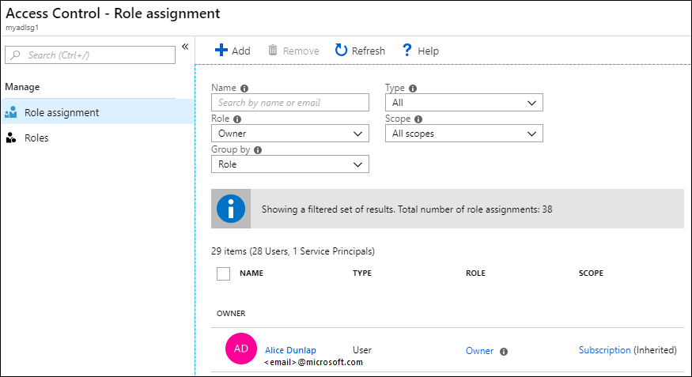

3. In the **Access Control (IAM)** blade, click **Add** to open the **Add permissions** blade. In the **Add permissions** blade, select a **Role** for the user/group. Look for the security group you created earlier in Azure Active Directory and select it. If you have a lot of users and groups to search from, use the **Select** text box to filter on the group name. 
   
	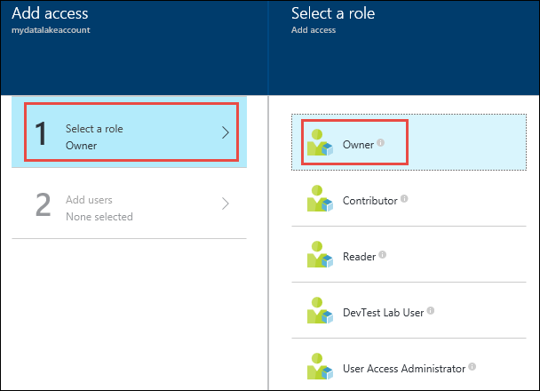
   
	The **Owner** and **Contributor** role provide access to a variety of administration functions on the data lake account. For users who will interact with data in the data lake but still need to view account management information, you can add them to the **Reader** role. The scope of these roles is limited to the management operations related to the Data Lake Storage Gen1 account.
   
	For data operations, individual file system permissions define what the users can do. Therefore, a user having a Reader role can only view administrative settings associated with the account but can potentially read and write data based on file system permissions assigned to them. Data Lake Storage Gen1 file system permissions are described at [Assign security group as ACLs to the Azure Data Lake Storage Gen1 file system](#filepermissions).

    > [!IMPORTANT]
    > Only the **Owner** role automatically enables file system access. The **Contributor**, **Reader**, and all other roles require ACLs to enable any level of access to folders and files.  The **Owner** role provides super-user file and folder permissions that cannot be overridden via ACLs. For more information on how RBAC policies map to data access, see [RBAC for account management](data-lake-store-security-overview.md#rbac-for-account-management).

4. If you want to add a group/user that is not listed in the **Add permissions** blade, you can invite them by typing their email address in the **Select** text box and then selecting them from the list.
   
	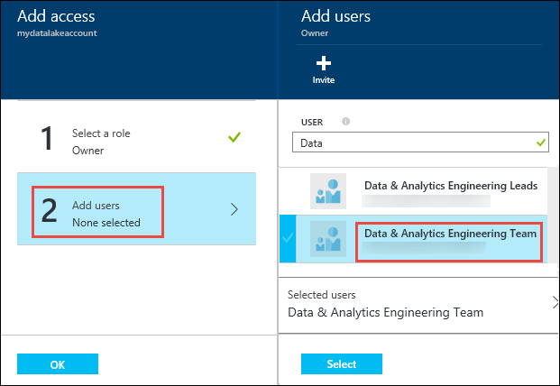
   
5. Click **Save**. You should see the security group added as shown below.
   
	

6. Your user/security group now has access to the Data Lake Storage Gen1 account. If you want to provide access to specific users, you can add them to the security group. Similarly, if you want to revoke access for a user, you can remove them from the security group. You can also assign multiple security groups to an account. 

## <a name="filepermissions"></a>Assign users or security groups as ACLs to the Data Lake Storage Gen1 file system
By assigning user/security groups to the Data Lake Storage Gen1 file system, you set access control on the data stored in Data Lake Storage Gen1.

1. In your Data Lake Storage Gen1 account blade, click **Data Explorer**.
   
    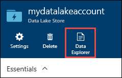
2. In the **Data Explorer** blade, click the folder for which you want to configure the ACL, and then click **Access**. To assign ACLs to a file, you must first click the file to preview it and then click **Access** from the **File Preview** blade.
   
    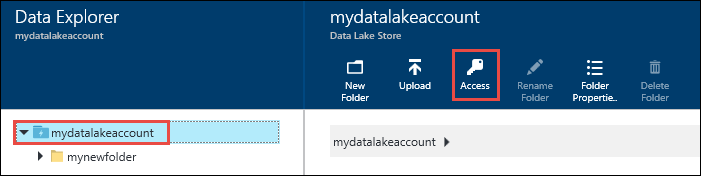
3. The **Access** blade lists the owners and assigned permissions already assigned to the root. Click the **Add** icon to add additional Access ACLs.
    > [!IMPORTANT]
    > Setting access permissions for a single file does not necessarily grant a user/group access to that file. The path to the file must be accessible to the assigned user/group. For more information and examples, see [Common scenarios related to permissions](data-lake-store-access-control.md#common-scenarios-related-to-permissions).
   
    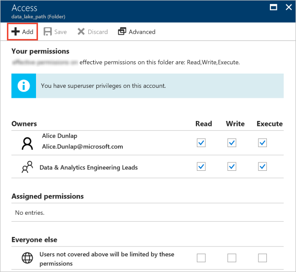
   
   * The **Owners** and **Everyone else** provide UNIX-style access, where you specify read, write, execute (rwx) to three distinct user classes: owner, group, and others.
   * **Assigned permissions** corresponds to the POSIX ACLs that enable you to set permissions for specific named users or groups beyond the file's owner or group. 
     
     For more information, see [HDFS ACLs](https://hadoop.apache.org/docs/current/hadoop-project-dist/hadoop-hdfs/HdfsPermissionsGuide.html#ACLs_Access_Control_Lists). For more information on how ACLs are implemented in Data Lake Storage Gen1, see [Access Control in Data Lake Storage Gen1](data-lake-store-access-control.md).
4. Click the **Add** icon to open the **Assign permissions** blade. In this blade, click **Select user or group**, and then in **Select user or group** blade, look for the security group you created earlier in Azure Active Directory. If you have a lot of groups to search from, use the text box at the top to filter on the group name. Click the group you want to add and then click **Select**.
   
    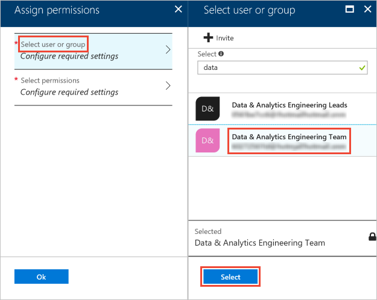
5. Click **Select permissions**, select the permissions, whether the permissions should be applied to recursively, and whether you want to assign the permissions as an access ACL, default ACL, or both. Click **OK**.
   
    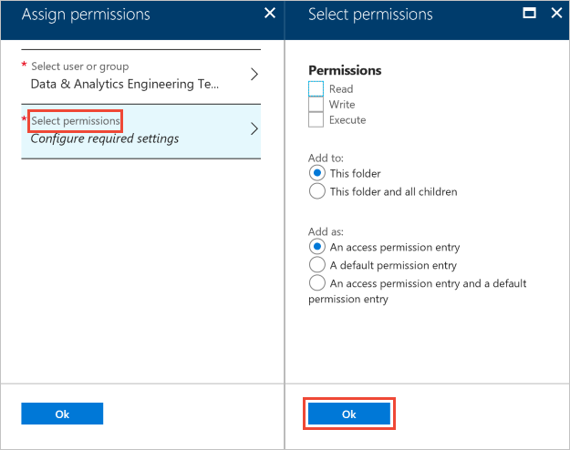
   
    For more information about permissions in Data Lake Storage Gen1, and Default/Access ACLs, see [Access Control in Data Lake Storage Gen1](data-lake-store-access-control.md).
6. After clicking **Ok** in the **Select permissions** blade, the newly added group and associated permissions will now be listed in the **Access** blade.
   
    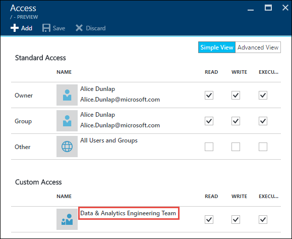
   
   > [!IMPORTANT]
   > In the current release, you can have up to 28 entries under **Assigned permissions**. If you want to add more than 28 users, you should create security groups, add users to security groups, add provide access to those security groups for the Data Lake Storage Gen1 account.
   > 
   > 
7. If required, you can also modify the access permissions after you have added the group. Clear or select the check box for each permission type (Read, Write, Execute) based on whether you want to remove or assign that permission to the security group. Click **Save** to save the changes, or **Discard** to undo the changes.

## Set IP address range for data access
Data Lake Storage Gen1 enables you to further lock down access to your data store at network level. You can enable firewall, specify an IP address, or define an IP address range for your trusted clients. Once enabled, only clients that have the IP addresses within defined range can connect to the store.


## Remove security groups for a Data Lake Storage Gen1 account
When you remove security groups from Data Lake Storage Gen1 accounts, you are only changing access to the management operations on the account using the Azure Portal and Azure Resource Manager APIs.  

Access to data is unchanged and is still managed by the access ACLs.  The exception to this are users/groups in the Owners role.  Users/groups removed from the Owners role are no longer super users and their access falls back to access ACL settings. 

1. In your Data Lake Storage Gen1 account blade, click **Access Control (IAM)**. 
   
    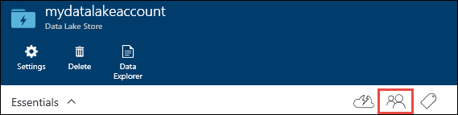
2. In the **Access Control (IAM)** blade, click the security group(s) you want to remove. Click **Remove**.
   
    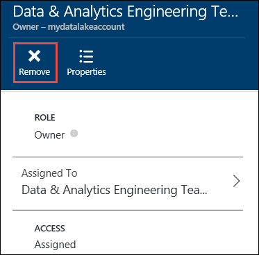

## Remove security group ACLs from a Data Lake Storage Gen1 file system
When you remove security group ACLs from a Data Lake Storage Gen1 file system, you change access to the data in the Data Lake Storage Gen1 account.

1. In your Data Lake Storage Gen1 account blade, click **Data Explorer**.
   
    
2. In the **Data Explorer** blade, click the folder for which you want to remove the ACL, and then click **Access**. To remove ACLs for a file, you must first click the file to preview it and then click **Access** from the **File Preview** blade. 
   
    
3. In the **Access** blade, click the security group you want to remove. In the **Access details** blade, click **Remove**.
   
    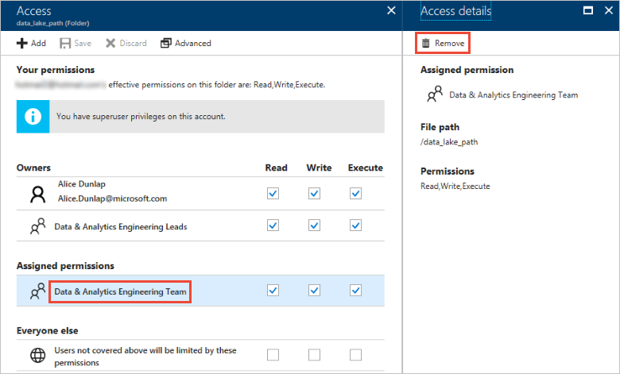

## See also
* [Overview of Azure Data Lake Storage Gen1](data-lake-store-overview.md)
* [Copy data from Azure Storage Blobs to Data Lake Storage Gen1](data-lake-store-copy-data-azure-storage-blob.md)
* [Use Azure Data Lake Analytics with Data Lake Storage Gen1](../data-lake-analytics/data-lake-analytics-get-started-portal.md)
* [Use Azure HDInsight with Data Lake Storage Gen1](data-lake-store-hdinsight-hadoop-use-portal.md)
* [Get Started with Data Lake Storage Gen1 using PowerShell](data-lake-store-get-started-powershell.md)
* [Get Started with Data Lake Storage Gen1 using .NET SDK](data-lake-store-get-started-net-sdk.md)
* [Access diagnostic logs for Data Lake Storage Gen1](data-lake-store-diagnostic-logs.md)

