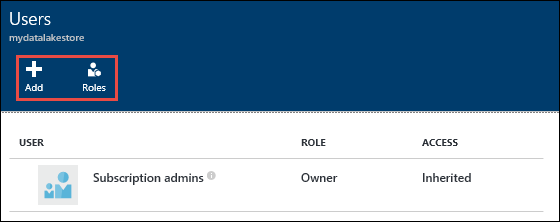

<properties 
   pageTitle="Securing data stored in Azure Data Lake Store | Microsoft Azure" 
   description="Learn how to secure data in Azure Data Lake Store using groups and access control lists" 
   services="data-lake-store" 
   documentationCenter="" 
   authors="nitinme" 
   manager="paulettm" 
   editor="cgronlun"/>
 
<tags
   ms.service="data-lake-store"
   ms.devlang="na"
   ms.topic="article"
   ms.tgt_pltfrm="na"
   ms.workload="big-data" 
   ms.date="06/22/2016"
   ms.author="nitinme"/>

# Securing data stored in Azure Data Lake Store

Securing data in Azure Data Lake Store is a three-step approach.

1. Start by creating security groups in Azure Active Directory (AAD). These security groups are used to implement role-based access control (RBAC) in Azure Portal. For more information see [Role-based Access Control in Microsoft Azure](../active-directory/role-based-access-control-configure.md).

2. Assign the AAD security groups to the Azure Data Lake Store account. This controls access to the Data Lake Store account from the portal and management operations from the portal or APIs.

3. Assign the AAD security groups as access control lists (ACLs) on the Data Lake Store file system.

4. Additionally, you can also set an IP address range for clients that can access the data in Data Lake Store.

This article provides instructions on how to use the Azure portal to perform the above tasks. For in-depth information on how Data Lake Store implements security at the account and data level, see [Security in Azure Data Lake Store](data-lake-store-security-overview.md).

## Prerequisites

Before you begin this tutorial, you must have the following:

- **An Azure subscription**. See [Get Azure free trial](https://azure.microsoft.com/pricing/free-trial/).
- **An Azure Data Lake Store account**. For instructions on how to create one, see [Get started with Azure Data Lake Store](data-lake-store-get-started-portal.md)

## Do you learn fast with videos?

[Watch this video](https://mix.office.com/watch/1q2mgzh9nn5lx) on how to secure data stored in Data Lake Store. 

## Create security groups in Azure Active Directory

For instructions on how to create AAD security groups and how to add users to the group, see [Managing security groups in Azure Active Directory](../active-directory/active-directory-accessmanagement-manage-groups.md).

## Assign users or security groups to Azure Data Lake Store accounts

When you assign users or security groups to Azure Data Lake Store accounts, you control access to the management operations on the account using the Azure portal and Azure Resource Manager APIs. 

1. Open an Azure Data Lake Store account. From the left pane, click **Browse**, click **Data Lake Store**, and then from the Data Lake Store blade, click the account name to which you want to assign a user or security group.

2. In your Data Lake Store account blade, click the user icon.

	

3. The **User** blade by default lists **Subscription admins** group as an owner. 

	
 
	There are two ways to add a group and assign relevant roles.

	* Add a user/group to the account and then assign a role, or
	* Add a role and then assign users/groups to role.

	In this section, we look at the first approach, adding a group and then assigning roles. You can perform similar steps to first select a role and then assign groups to that role.
	
4. In the **Users** blade, click **Add** to open the **Add access** blade. In the **Add access** blade, click **Select a role**, and then select a role for the user/group.

	 

	The **Owner** and **Contributor** role provide access to a variety of administration functions on the data lake account. For users who will interact with data in the data lake, you can add them to the **Reader **role. The scope of these roles is limited to the management operations related to the Azure Data Lake Store account.

	For data operations individual file system permissions define what the users can do. Therefore, a user having a Reader role can only view administrative settings associated with the account but can potentially read and write data based on file system permissions assigned to them. Data Lake Store file system permissions are described at [Assign security group as ACLs to the Azure Data Lake Store file system](#filepermissions).

5. In the **Add access** blade, click **Add users** to open the **Add users** blade. In this blade, look for the security group you created earlier in Azure Active Directory. If you have a lot of groups to search from, use the text box at the top to filter on the group name. Click **Select**.

	

	If you want to add a group/user that is not listed, you can invite them by using the **Invite** icon and specifying the e-mail address for the user/group.

6. Click **OK**. You should see the security group added as shown below.

	

7. Your user/security group now has access to the Azure Data Lake Store account. If you want to provide access to specific users, you can add them to the security group. Similarly, if you want to revoke access for a user, you can remove them from the security group. You can also assign multiple security groups to an account. 

## Assign users or security group as ACLs to the Azure Data Lake Store file system

By assigning user/security groups to the Azure Data Lake file system, you set access control on the data stored in Azure Data Lake Store.

>[AZURE.NOTE] In the current release, you can set ACLs only at the root node of the Data Lake Store account. Also, only users with the Owner role assigned can add/modify ACLs.

1. In your Data Lake Store account blade, click **Data Explorer**.

	

2. In the **Data Explorer** blade, click the root of your account, and then in your account blade, click the **Access** icon.

	

3. The **Access** blade lists the standard access and custom access already assigned to the root. Click the **Add** icon to add custom-level ACLs.

	

	* **Standard access** is the UNIX-style access, where you specify read, write, execute (rwx) to three distinct user classes: owner, group, and others.
	* **Custom access** corresponds to the POSIX ACLs that enables you to set permissions for specific named users or groups, and not only the file's owner or group. 
	
	For more information, see [HDFS ACLs](https://hadoop.apache.org/docs/current/hadoop-project-dist/hadoop-hdfs/HdfsPermissionsGuide.html#ACLs_Access_Control_Lists). 

4. Click the **Add** icon to open the **Add Custom Access** blade. In this blade, click **Select User or Group**, and then in **Select User or Group** blade, look for the security group you created earlier in Azure Active Directory. If you have a lot of groups to search from, use the text box at the top to filter on the group name. Click the group you want to add and then click **Select**.

	

5. Click **Select Permissions**, select the permissions you want to assign to that group, and then click **OK**.

	

	The permissions can be understood as follows:

	* **Read** - If this permission is set on a directory, it provides the ability to read the names of the files in the directory.
	* **Write** - If this permission is set on a directory, it provides the ability to modify the entries in the directory such as create a file, delete a file, or rename a file.
	* **Execute** - If this permission is set on a directory, it provides the ability to access the contents of the file in the directory. This also provides access to the metadata of the file, if the file name is known. However, this permission does not enable you to list files in the directory, unless the **Read** permission is also set.

	>[AZURE.NOTE] **Read + Execute** permission is required for enumeration of directories and is often required when providing a user or group read-only access to data.

6. In the **Add Custom Access** blade, click **OK**. The newly added group, with the associated permissions, will now be listed in the **Access** blade.

	

	> [AZURE.IMPORTANT] In the current release, you can only have 9 entries under **Custom Access**. If you want to add more than 9 users, you should create security groups, add users to security groups, add provide access to those security groups for the Data Lake Store account.

7. If required, you can also modify the access permissions after you have added the group. Clear or select the check box for each permission type (Read, Write, Execute) based on whether you want to remove or assign that permission to the security group. Click **Save** to save the changes, or **Discard** to undo the changes.

## Set IP address range for data access

Azure Data Lake Store enables you to further lock down access to your data store at network level. You can enable firewall, specify an IP address, or define an IP address range for your trusted clients. Once enabled, only clients that have the IP addresses within defined range can connect to the store.

## Remove security groups for an Azure Data Lake Store account

When you remove security groups from Azure Data Lake Store accounts, you are only changing access to the management operations on the account using the Azure Portal and Azure Resource Manager APIs.

1. In your Data Lake Store account blade, click the user icon.

	

2. In the **Users** blade click the security group you want to remove.

	

3. In the blade for the security group, click **Remove**.

	

## Remove security group ACLs from Azure Data Lake Store file system

When you remove security groups ACLs from Azure Data Lake Store file system, you are changing access to the data in the Data Lake Store.

1. In your Data Lake Store account blade, click **Data Explorer**.

	

2. In the **Data Explorer** blade, click the root of your account, and then in your account blade, click the **Access** icon.

	

3. In the **Access** blade, from the **Custom Access** section, click the security group you want to remove. In the **Custom Access** blade, click **Remove** and then click **OK**.

	

## See also

- [Overview of Azure Data Lake Store](data-lake-store-overview.md)
- [Copy data from Azure Storage Blobs to Data Lake Store](data-lake-store-copy-data-azure-storage-blob.md)
- [Use Azure Data Lake Analytics with Data Lake Store](../data-lake-analytics/data-lake-analytics-get-started-portal.md)
- [Use Azure HDInsight with Data Lake Store](data-lake-store-hdinsight-hadoop-use-portal.md)
- [Get Started with Data Lake Store using PowerShell](data-lake-store-get-started-powershell.md)
- [Get Started with Data Lake Store using .NET SDK](data-lake-store-get-started-net-sdk.md)
