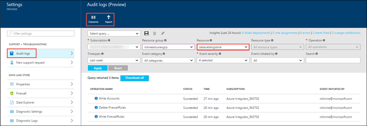

<properties
   pageTitle="Overview of security in Data Lake Store | Microsoft Azure"
   description="Understand how Azure Data Lake Store is a more secure big data store"
   services="data-lake-store"
   documentationCenter=""
   authors="nitinme"
   manager="paulettm"
   editor="cgronlun"/>

<tags
   ms.service="data-lake-store"
   ms.devlang="na"
   ms.topic="article"
   ms.tgt_pltfrm="na"
   ms.workload="big-data"
   ms.date="08/02/2016"
   ms.author="nitinme"/>

# Security in Azure Data Lake Store

Many enterprises are taking advantage of big data analytics for business insights to help them make smart decisions. An organization might have a complex and regulated environment, with an increasing number of diverse users. It is vital for an enterprise to make sure that critical business data is stored more securely, with the correct level of access granted to individual users. Azure Data Lake Store is designed to help meet these security requirements. In this article, learn about the security capabilities of Data Lake Store, including:

* Authentication
* Authorization
* Network isolation
* Data protection
* Auditing

## Authentication and identity management

Authentication is the process by which a user's identity is verified when the user interacts with Data Lake Store or with any service that connects to Data Lake Store. For identity management and authentication, Data Lake Store uses [Azure Active Directory](../active-directory/active-directory-whatis.md), a comprehensive identity and access management cloud solution that simplifies the management of users and groups.

Each Azure subscription can be associated with an instance of Azure Active Directory. Only users and service identities that are defined in your Azure Active Directory service can access your Data Lake Store account, by using the Azure portal, command-line tools, or through client applications your organization builds by using the Azure Data Lake Store SDK. Key advantages of using Azure Active Directory as a centralized access control mechanism are:

* Simplified identity lifecycle management. The identity of a user or a service (a service principal identity) can be quickly created and quickly revoked by simply deleting or disabling the account in the directory.

* Multi-factor authentication. [Multi-factor authentication](../multi-factor-authentication/multi-factor-authentication.md) provides an additional layer of security for user sign-ins and transactions.

* Authentication from any client through a standard open protocol, such as OAuth or OpenID.

* Federation with enterprise directory services and cloud identity providers.

## Authorization and access control

After Azure Active Directory authenticates a user so that the user can access Azure Data Lake Store, authorization controls access permissions for Data Lake Store. Data Lake Store separates authorization for account-related and data-related activities in the following manner:

* [Role-based access control](../active-directory/role-based-access-control-what-is.md) (RBAC) provided by Azure for account management
* POSIX ACL for accessing data in the store

### RBAC for account management

Four basic roles are defined for Data Lake Store by default. The roles permit different operations on a Data Lake Store account via the Azure portal, PowerShell cmdlets, and REST APIs. The Owner and Contributor roles can perform a variety of administration functions on the account. You can assign the Reader role to users who only interact with data.

Note that although roles are assigned for account management, some roles affect access to data. You need to use ACLs to control access to operations that a user can perform on the file system. The following table shows a summary of management rights and data access rights for the default roles.

| Roles                    | Management rights               | Data access rights | Explanation |
| ------------------------ | ------------------------------- | ------------------ | ----------- |
| No role assigned         | None                            | Governed by ACL    | The user cannot use the Azure portal or Azure PowerShell cmdlets to browse Data Lake Store. The user can use command-line tools only.
| Owner  | All  | All  | The Owner role is a superuser. This role can manage everything and has full access to data.
| Reader   | Read-only  | Governed by ACL    | The Reader role can view everything regarding account management, such as which user is assigned to which role. The Reader role can't make any changes.   |
| Contributor              | All except add and remove roles | Governed by ACL    | The Contributor role can manage some aspects of an account, such as deployments and creating and managing alerts. The Contributor role cannot add or remove roles.
| User Access Administrator | Add and remove roles            | Governed by ACL    | The User Access Administrator role can manage user access to accounts. |

For instructions, see [Assign users or security groups to Data Lake Store accounts](data-lake-store-secure-data.md#assign-users-or-security-groups-to-azure-data-lake-store-accounts).

### Using ACLs for operations on file systems

Data Lake Store is a hierarchical file system like Hadoop Distributed File System (HDFS), and it supports [POSIX ACLs](https://hadoop.apache.org/docs/current/hadoop-project-dist/hadoop-hdfs/HdfsPermissionsGuide.html#ACLs_Access_Control_Lists). It controls read (r), write (w), and execute (x) permissions to resources for the Owner role, for the Owners group, and for other users and groups. In the Data Lake Store Public Preview (the current release), ACLs are enabled on the root folder, on subfolders, and on individual files. The ACLs that you apply to the root folder also apply to all child folders and files.

We recommend that you define ACLs for multiple users by using [security groups](../active-directory/active-directory-accessmanagement-manage-groups.md). Add users to a security group, and then assign the ACLs for a file or folder to that security group. This is useful when you want to provide custom access, because you are limited to adding a maximum of nine entries for custom access. For more information about how to better secure data stored in Data Lake Store by using Azure Active Directory security groups, see [Assign users or security group as ACLs to the Azure Data Lake Store file system](data-lake-store-secure-data.md#filepermissions).

## Network isolation

Use Data Lake Store to help control access to your data store at the network level. You can establish firewalls and define an IP address range for your trusted clients. With an IP address range, only clients that have an IP address within the defined range can connect to Data Lake Store.

## Data protection

Organizations want to ensure that their business-critical data is secure throughout its lifecycle. For data in transit, Data Lake Store uses the industry-standard Transport Layer Security (TLS) protocol to secure data that moves between a client and Data Lake Store.

Data protection for data at rest will be available in future releases.

## Auditing and diagnostic logs

You can use auditing or diagnostic logs, depending on whether you are looking for logs for management-related activities or data-related activities.

*  Management-related activities use Azure Resource Manager APIs and are surfaced in the Azure portal via audit logs.
*  Data-related activities use WebHDFS REST APIs and are surfaced in the Azure portal via diagnostic logs.

### Auditing logs

To comply with regulations, an organization might require adequate audit trails if it needs to dig into specific incidents. Data Lake Store has built-in monitoring and auditing, and it logs all account management activities.

For account management audit trails, view and choose the columns you want to log. You also can export audit logs to Azure Storage.

### Diagnostic logs

You can set data access audit trails in the Azure portal (in Diagnostic Settings), and create an Azure Blob storage account in which the logs are stored.

After you configure diagnostic settings, you can view the logs on the **Diagnostic Logs** tab.

For more information on working with diagnostic logs with Azure Data Lake Store, see [Access diagnostic logs for Data Lake Store](data-lake-store-diagnostic-logs.md).

## Summary

Enterprise customers demand a data analytics cloud platform that is secure and easy to use. Azure Data Lake Store is designed to help address these requirements through identity management and authentication via Azure Active Directory integration, ACL-based authorization, network isolation, data encryption in transit and at rest (coming in the future), and auditing.

If you want to see new features in Data Lake Store, send us your feedback in the [Data Lake Store UserVoice forum](https://feedback.azure.com/forums/327234-data-lake).

## See also

- [Overview of Azure Data Lake Store](data-lake-store-overview.md)
- [Get started with Data Lake Store](data-lake-store-get-started-portal.md)
- [Secure data in Data Lake Store](data-lake-store-secure-data.md)
