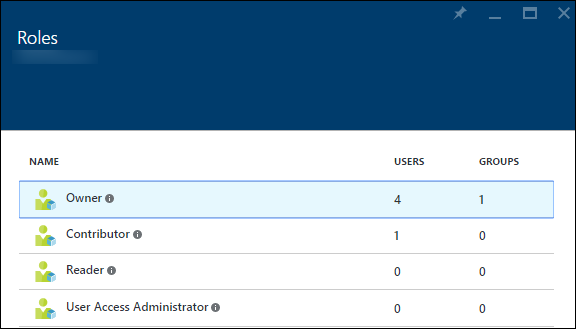
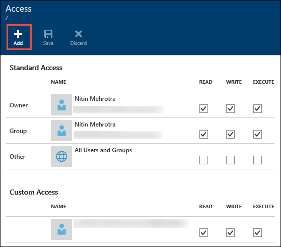
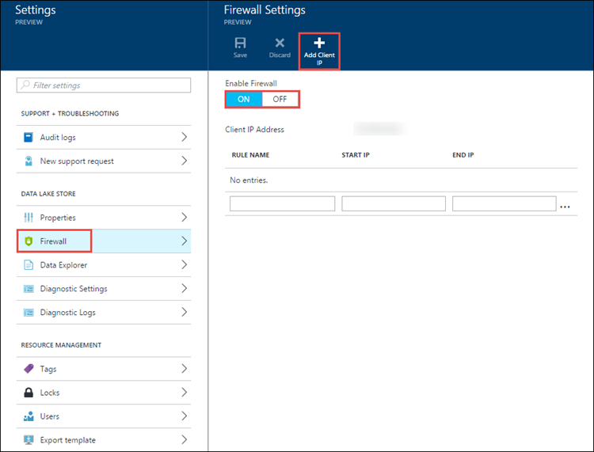
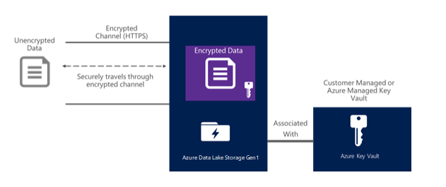
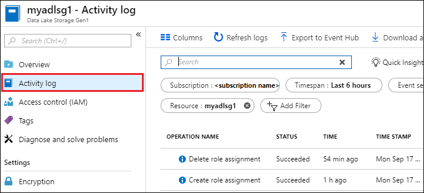
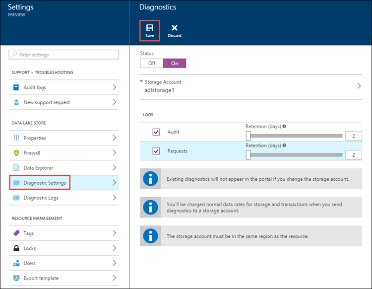

# Security in Azure Data Lake Storage Gen1

Many enterprises are taking advantage of big data analytics for business insights to help them make smart decisions. An organization might have a complex and regulated environment, with an increasing number of diverse users. It is vital for an enterprise to make sure that critical business data is stored more securely, with the correct level of access granted to individual users. Azure Data Lake Storage Gen1 is designed to help meet these security requirements. In this article, learn about the security capabilities of Data Lake Storage Gen1, including:

* Authentication
* Authorization
* Network isolation
* Data protection
* Auditing

## Authentication and identity management

Authentication is the process by which a user's identity is verified when the user interacts with Data Lake Storage Gen1 or with any service that connects to Data Lake Storage Gen1. For identity management and authentication, Data Lake Storage Gen1 uses [Azure Active Directory](../active-directory/fundamentals/active-directory-whatis.md), a comprehensive identity and access management cloud solution that simplifies the management of users and groups.

Each Azure subscription can be associated with an instance of Azure Active Directory. Only users and service identities that are defined in your Azure Active Directory service can access your Data Lake Storage Gen1 account, by using the Azure portal, command-line tools, or through client applications your organization builds by using the Data Lake Storage Gen1 SDK. Key advantages of using Azure Active Directory as a centralized access control mechanism are:

* Simplified identity lifecycle management. The identity of a user or a service (a service principal identity) can be quickly created and quickly revoked by simply deleting or disabling the account in the directory.
* Multi-factor authentication. [Multi-factor authentication](../active-directory/authentication/multi-factor-authentication.md) provides an additional layer of security for user sign-ins and transactions.
* Authentication from any client through a standard open protocol, such as OAuth or OpenID.
* Federation with enterprise directory services and cloud identity providers.

## Authorization and access control

After Azure Active Directory authenticates a user so that the user can access Data Lake Storage Gen1, authorization controls access permissions for Data Lake Storage Gen1. Data Lake Storage Gen1 separates authorization for account-related and data-related activities in the following manner:

* [Role-based access control](../role-based-access-control/overview.md) (RBAC) provided by Azure for account management
* POSIX ACL for accessing data in the store

### RBAC for account management

Four basic roles are defined for Data Lake Storage Gen1 by default. The roles permit different operations on a Data Lake Storage Gen1 account via the Azure portal, PowerShell cmdlets, and REST APIs. The Owner and Contributor roles can perform a variety of administration functions on the account. You can assign the Reader role to users who only view account management data.

Note that although roles are assigned for account management, some roles affect access to data. You need to use ACLs to control access to operations that a user can perform on the file system. The following table shows a summary of management rights and data access rights for the default roles.

| Roles | Management rights | Data access rights | Explanation |
| --- | --- | --- | --- |
| No role assigned |None |Governed by ACL |The user cannot use the Azure portal or Azure PowerShell cmdlets to browse Data Lake Storage Gen1. The user can use command-line tools only. |
| Owner |All |All |The Owner role is a superuser. This role can manage everything and has full access to data. |
| Reader |Read-only |Governed by ACL |The Reader role can view everything regarding account management, such as which user is assigned to which role. The Reader role can't make any changes. |
| Contributor |All except add and remove roles |Governed by ACL |The Contributor role can manage some aspects of an account, such as deployments and creating and managing alerts. The Contributor role cannot add or remove roles. |
| User Access Administrator |Add and remove roles |Governed by ACL |The User Access Administrator role can manage user access to accounts. |

For instructions, see [Assign users or security groups to Data Lake Storage Gen1 accounts](data-lake-store-secure-data.md#assign-users-or-security-groups-to-data-lake-storage-gen1-accounts).

### Using ACLs for operations on file systems

Data Lake Storage Gen1 is a hierarchical file system like Hadoop Distributed File System (HDFS), and it supports [POSIX ACLs](https://hadoop.apache.org/docs/current/hadoop-project-dist/hadoop-hdfs/HdfsPermissionsGuide.html#ACLs_Access_Control_Lists). It controls read (r), write (w), and execute (x) permissions to resources for the Owner role, for the Owners group, and for other users and groups. In Data Lake Storage Gen1, ACLs can be enabled on the root folder, on subfolders, and on individual files. For more information on how ACLs work in context of Data Lake Storage Gen1, see [Access control in Data Lake Storage Gen1](data-lake-store-access-control.md).

We recommend that you define ACLs for multiple users by using [security groups](../active-directory/fundamentals/active-directory-groups-create-azure-portal.md). Add users to a security group, and then assign the ACLs for a file or folder to that security group. This is useful when you want to provide assigned permissions, because you are limited to a maximum of 28 entries for assigned permissions. For more information about how to better secure data stored in Data Lake Storage Gen1 by using Azure Active Directory security groups, see [Assign users or security group as ACLs to the Data Lake Storage Gen1 file system](data-lake-store-secure-data.md#filepermissions).

## Network isolation

Use Data Lake Storage Gen1 to help control access to your data store at the network level. You can establish firewalls and define an IP address range for your trusted clients. With an IP address range, only clients that have an IP address within the defined range can connect to Data Lake Storage Gen1.

Azure virtual networks (VNet) support service tags for Data Lake Gen 1. A service tag represents a group of IP address prefixes from a given Azure service. Microsoft manages the address prefixes encompassed by the service tag and automatically updates the service tag as addresses change. For more information, see [Azure service tags overview](../virtual-network/service-tags-overview.md).

## Data protection

Data Lake Storage Gen1 protects your data throughout its life cycle. For data in transit, Data Lake Storage Gen1 uses the industry-standard Transport Layer Security (TLS 1.2) protocol to secure data over the network.

Data Lake Storage Gen1 also provides encryption for data that is stored in the account. You can chose to have your data encrypted or opt for no encryption. If you opt in for encryption, data stored in Data Lake Storage Gen1 is encrypted prior to storing on persistent media. In such a case, Data Lake Storage Gen1 automatically encrypts data prior to persisting and decrypts data prior to retrieval, so it is completely transparent to the client accessing the data. There is no code change required on the client side to encrypt/decrypt data.

For key management, Data Lake Storage Gen1 provides two modes for managing your master encryption keys (MEKs), which are required for decrypting any data that is stored in Data Lake Storage Gen1. You can either let Data Lake Storage Gen1 manage the MEKs for you, or choose to retain ownership of the MEKs using your Azure Key Vault account. You specify the mode of key management while creating a Data Lake Storage Gen1 account. For more information on how to provide encryption-related configuration, see [Get started with Azure Data Lake Storage Gen1 using the Azure Portal](data-lake-store-get-started-portal.md).

## Activity and diagnostic logs

You can use activity or diagnostic logs, depending on whether you are looking for logs for account management-related activities or data-related activities.

* Account management-related activities use Azure Resource Manager APIs and are surfaced in the Azure portal via activity logs.
* Data-related activities use WebHDFS REST APIs and are surfaced in the Azure portal via diagnostic logs.

### Activity log

To comply with regulations, an organization might require adequate audit trails of account management activities if it needs to dig into specific incidents. Data Lake Storage Gen1 has built-in monitoring and it logs all account management activities.

For account management audit trails, view and choose the columns that you want to log. You also can export activity logs to Azure Storage.

For more information on working with activity logs, see [View activity logs to audit actions on resources](../azure-resource-manager/management/view-activity-logs.md).

### Diagnostics logs

You can enable data access audit and diagnostic logging in the Azure portal and send the logs to an Azure Blob storage account, an event hub, or Azure Monitor logs.

For more information on working with diagnostic logs with Data Lake Storage Gen1, see [Accessing diagnostic logs for Data Lake Storage Gen1](data-lake-store-diagnostic-logs.md).

## Summary

Enterprise customers demand a data analytics cloud platform that is secure and easy to use. Data Lake Storage Gen1 is designed to help address these requirements through identity management and authentication via Azure Active Directory integration, ACL-based authorization, network isolation, data encryption in transit and at rest, and auditing.

If you want to see new features in Data Lake Storage Gen1, send us your feedback in the [Data Lake Storage Gen1 UserVoice forum](https://feedback.azure.com/forums/327234-data-lake).

## See also

* [Overview of Azure Data Lake Storage Gen1](data-lake-store-overview.md)
* [Get started with Data Lake Storage Gen1](data-lake-store-get-started-portal.md)
* [Secure data in Data Lake Storage Gen1](data-lake-store-secure-data.md)
