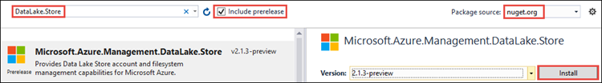

# Service-to-service authentication with Azure Data Lake Storage Gen1 using .NET SDK
> [!div class="op_single_selector"]
> * [Using Java](data-lake-store-service-to-service-authenticate-java.md)
> * [Using .NET SDK](data-lake-store-service-to-service-authenticate-net-sdk.md)
> * [Using Python](data-lake-store-service-to-service-authenticate-python.md)
> * [Using REST API](data-lake-store-service-to-service-authenticate-rest-api.md)
>
>

In this article, you learn about how to use the .NET SDK to do service-to-service authentication with Azure Data Lake Storage Gen1. For end-user authentication with Data Lake Storage Gen1 using .NET SDK, see [End-user authentication with Data Lake Storage Gen1 using .NET SDK](data-lake-store-end-user-authenticate-net-sdk.md).

## Prerequisites
* **Visual Studio 2013 or above**. The instructions below use Visual Studio 2019.

* **An Azure subscription**. See [Get Azure free trial](https://azure.microsoft.com/pricing/free-trial/).

* **Create an Azure Active Directory "Web" Application**. You must have completed the steps in [Service-to-service authentication with Data Lake Storage Gen1 using Azure Active Directory](data-lake-store-service-to-service-authenticate-using-active-directory.md).

## Create a .NET application
1. In Visual Studio, select the **File** menu, **New**, and then **Project**.
2. Choose **Console App (.NET Framework)**, and then select **Next**.
3. In **Project name**, enter `CreateADLApplication`, and then select **Create**.

4. Add the NuGet packages to your project.

   1. Right-click the project name in the Solution Explorer and click **Manage NuGet Packages**.
   2. In the **NuGet Package Manager** tab, make sure that **Package source** is set to **nuget.org** and that **Include prerelease** check box is selected.
   3. Search for and install the following NuGet packages:

      * `Microsoft.Azure.Management.DataLake.Store` - This tutorial uses v2.1.3-preview.
      * `Microsoft.Rest.ClientRuntime.Azure.Authentication` - This tutorial uses v2.2.12.

        
   4. Close the **NuGet Package Manager**.

5. Open **Program.cs**, delete the existing code, and then include the following statements to add references to namespaces.

```csharp
using System;
using System.IO;
using System.Linq;
using System.Text;
using System.Threading;
using System.Collections.Generic;
using System.Security.Cryptography.X509Certificates; // Required only if you are using an Azure AD application created with certificates

using Microsoft.Rest;
using Microsoft.Rest.Azure.Authentication;
using Microsoft.Azure.Management.DataLake.Store;
using Microsoft.Azure.Management.DataLake.Store.Models;
using Microsoft.IdentityModel.Clients.ActiveDirectory;
```

## Service-to-service authentication with client secret
Add this snippet in your .NET client application. Replace the placeholder values with the values retrieved from an Azure AD web application (listed as a prerequisite). This snippet lets you authenticate your application **non-interactively** with Data Lake Storage Gen1 using the client secret/key for Azure AD web application.

```csharp
private static void Main(string[] args)
{
    // Service principal / application authentication with client secret / key
    // Use the client ID of an existing AAD "Web App" application.
    string TENANT = "<AAD-directory-domain>";
    string CLIENTID = "<AAD_WEB_APP_CLIENT_ID>";
    System.Uri ARM_TOKEN_AUDIENCE = new System.Uri(@"https://management.core.windows.net/");
    System.Uri ADL_TOKEN_AUDIENCE = new System.Uri(@"https://datalake.azure.net/");
    string secret_key = "<AAD_WEB_APP_SECRET_KEY>";
    var armCreds = GetCreds_SPI_SecretKey(TENANT, ARM_TOKEN_AUDIENCE, CLIENTID, secret_key);
    var adlCreds = GetCreds_SPI_SecretKey(TENANT, ADL_TOKEN_AUDIENCE, CLIENTID, secret_key);
}
```

The preceding snippet uses a helper function `GetCreds_SPI_SecretKey`. The code for this helper function is available [here on GitHub](https://github.com/Azure-Samples/data-lake-analytics-dotnet-auth-options#getcreds_spi_secretkey).

## Service-to-service authentication with certificate

Add this snippet in your .NET client application. Replace the placeholder values with the values retrieved from an Azure AD web application (listed as a prerequisite). This snippet lets you authenticate your application **non-interactively** with Data Lake Storage Gen1 using the certificate for an Azure AD web application. For instructions on how to create an Azure AD application, see [Create service principal with certificates](../active-directory/develop/howto-authenticate-service-principal-powershell.md#create-service-principal-with-self-signed-certificate).

```csharp
private static void Main(string[] args)
{
    // Service principal / application authentication with certificate
    // Use the client ID and certificate of an existing AAD "Web App" application.
    string TENANT = "<AAD-directory-domain>";
    string CLIENTID = "<AAD_WEB_APP_CLIENT_ID>";
    System.Uri ARM_TOKEN_AUDIENCE = new System.Uri(@"https://management.core.windows.net/");
    System.Uri ADL_TOKEN_AUDIENCE = new System.Uri(@"https://datalake.azure.net/");
    var cert = new X509Certificate2(@"d:\cert.pfx", "<certpassword>");
    var armCreds = GetCreds_SPI_Cert(TENANT, ARM_TOKEN_AUDIENCE, CLIENTID, cert);
    var adlCreds = GetCreds_SPI_Cert(TENANT, ADL_TOKEN_AUDIENCE, CLIENTID, cert);
}
```

The preceding snippet uses a helper function `GetCreds_SPI_Cert`. The code for this helper function is available [here on GitHub](https://github.com/Azure-Samples/data-lake-analytics-dotnet-auth-options#getcreds_spi_cert).

## Next steps
In this article, you learned how to use service-to-service authentication to authenticate with Data Lake Storage Gen1 using .NET SDK. You can now look at the following articles that talk about how to use the .NET SDK to work with Data Lake Storage Gen1.

* [Account management operations on Data Lake Storage Gen1 using .NET SDK](data-lake-store-get-started-net-sdk.md)
* [Data operations on Data Lake Storage Gen1 using .NET SDK](data-lake-store-data-operations-net-sdk.md)
