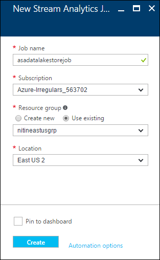
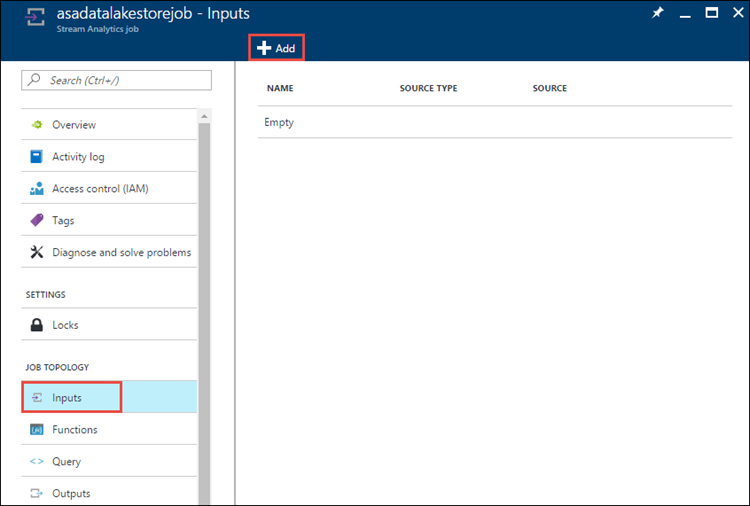
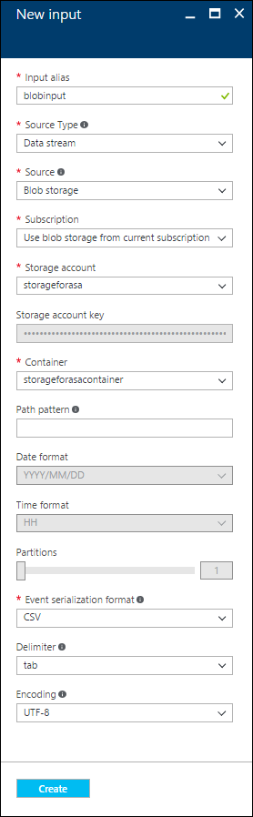
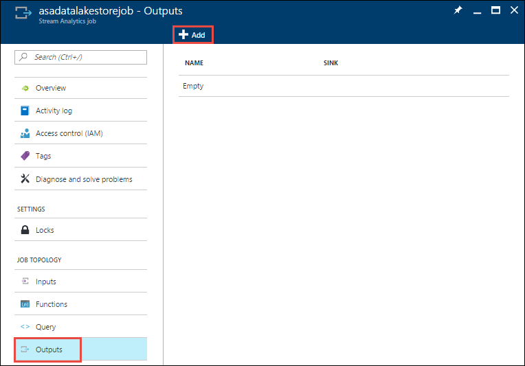
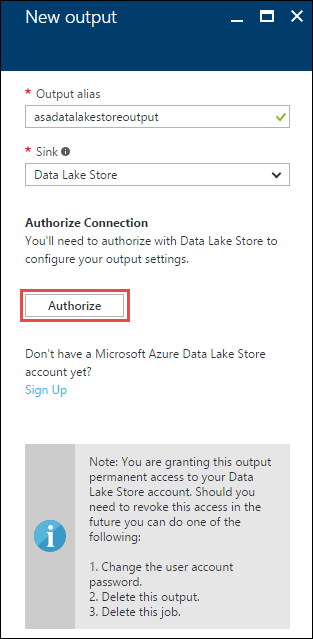
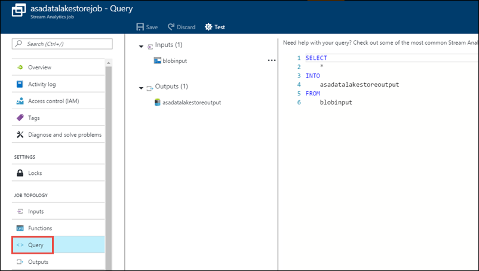
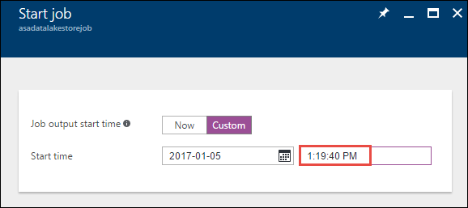
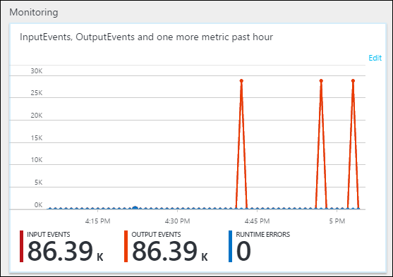
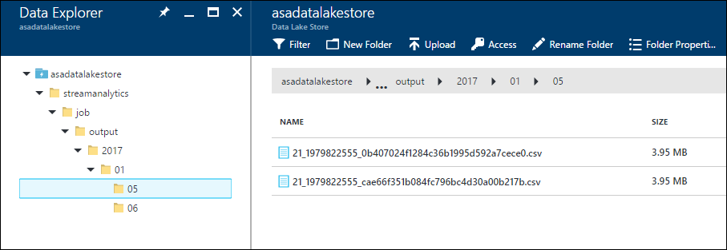

# Stream data from Azure Storage Blob into Azure Data Lake Storage Gen1 using Azure Stream Analytics
In this article, you learn how to use Azure Data Lake Storage Gen1 as an output for an Azure Stream Analytics job. This article demonstrates a simple scenario that reads data from an Azure Storage blob (input) and writes the data to Data Lake Storage Gen1 (output).

## Prerequisites
Before you begin this tutorial, you must have the following:

* **An Azure subscription**. See [Get Azure free trial](https://azure.microsoft.com/pricing/free-trial/).

* **Azure Storage account**. You will use a blob container from this account to input data for a Stream Analytics job. For this tutorial, assume you have a storage account called **storageforasa** and a container within the account called **storageforasacontainer**. Once you have created the container, upload a sample data file to it. 
  
* **A Data Lake Storage Gen1 account**. Follow the instructions at [Get started with Azure Data Lake Storage Gen1 using the Azure portal](data-lake-store-get-started-portal.md). Let's assume you have a Data Lake Storage Gen1 account called **myadlsg1**. 

## Create a Stream Analytics Job
You start by creating a Stream Analytics job that includes an input source and an output destination. For this tutorial, the source is an Azure blob container and the destination is Data Lake Storage Gen1.

1. Sign on to the [Azure portal](https://portal.azure.com).

2. From the left pane, click **Stream Analytics jobs**, and then click **Add**.

    

	> [!NOTE]
	> Make sure you create job in the same region as the storage account or you will incur additional cost of moving data between regions.
	>

## Create a Blob input for the job

1. Open the page for the Stream Analytics job, from the left pane click the **Inputs** tab, and then click **Add**.

	

2. On the **New input** blade, provide the following values.

    

   * For **Input alias**, enter a unique name for the job input.
   * For **Source type**, select **Data stream**.
   * For **Source**, select **Blob storage**.
   * For **Subscription**, select **Use blob storage from current subscription**.
   * For **Storage account**, select the storage account that you created as part of the prerequisites. 
   * For **Container**, select the container that you created in the selected storage account.
   * For **Event serialization format**, select **CSV**.
   * For **Delimiter**, select **tab**.
   * For **Encoding**, select **UTF-8**.

     Click **Create**. The portal now adds the input and tests the connection to it.

## Create a Data Lake Storage Gen1 output for the job

1. Open the page for the Stream Analytics job, click the **Outputs** tab, click **Add**, and select **Data Lake Storage Gen1**.

	

2. On the **New output** blade, provide the following values.

    

	* For **Output alias**, enter a unique name for the job output. This is a friendly name used in queries to direct the query output to this Data Lake Storage Gen1 account.
	* You will be prompted to authorize access to the Data Lake Storage Gen1 account. Click **Authorize**.

3. On the **New output** blade, continue to provide the following values.

	

   * For **Account name**, select the Data Lake Storage Gen1 account you already created where you want the job output to be sent to.
   * For **Path prefix pattern**, enter a file path used to write your files within the specified Data Lake Storage Gen1 account.
   * For **Date format**, if you used a date token in the prefix path, you can select the date format in which your files are organized.
   * For **Time format**, if you used a time token in the prefix path, specify the time format in which your files are organized.
   * For **Event serialization format**, select **CSV**.
   * For **Delimiter**, select **tab**.
   * For **Encoding**, select **UTF-8**.
	
     Click **Create**. The portal now adds the output and tests the connection to it.
	
## Run the Stream Analytics job

1. To run a Stream Analytics job, you must run a query from the **Query** tab. For this tutorial, you can run the sample query by replacing the placeholders with the job input and output aliases, as shown in the screen capture below.

	

2. Click **Save** from the top of the screen, and then from the **Overview** tab, click **Start**. From the dialog box, select **Custom Time**, and then set the current date and time.

	

	Click **Start** to start the job. It can take up to a couple minutes to start the job.

3. To trigger the job to pick the data from the blob, copy a sample data file to the blob container. You can get a sample data file from the [Azure Data Lake Git Repository](https://github.com/Azure/usql/tree/master/Examples/Samples/Data/AmbulanceData/Drivers.txt). For this tutorial, let's copy the file **vehicle1_09142014.csv**. You can use various clients, such as [Azure Storage Explorer](https://storageexplorer.com/), to upload data to a blob container.

4. From the **Overview** tab, under **Monitoring**, see how the data was processed.

	

5. Finally, you can verify that the job output data is available in the Data Lake Storage Gen1 account. 

	

	In the Data Explorer pane, notice that the output is written to a folder path as specified in the Data Lake Storage Gen1 output settings (`streamanalytics/job/output/{date}/{time}`).  

## See also
* [Create an HDInsight cluster to use Data Lake Storage Gen1](data-lake-store-hdinsight-hadoop-use-portal.md)
