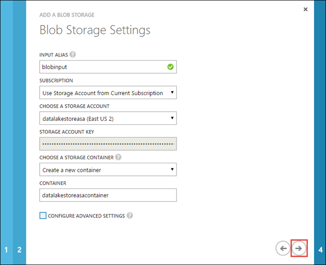
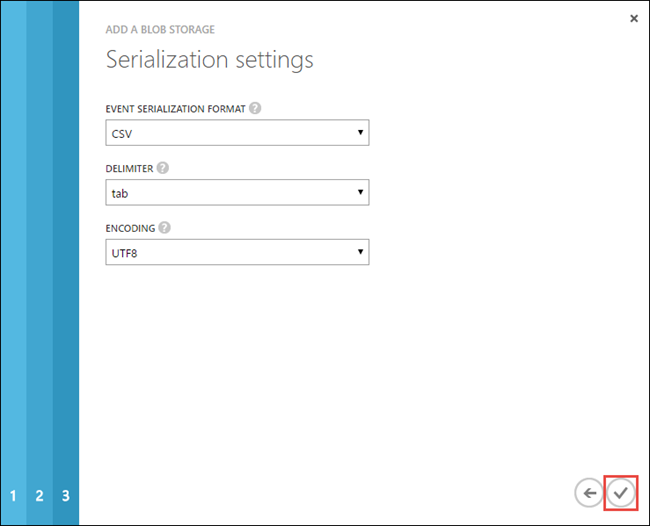

<properties
   pageTitle="Stream data from Stream Analytics into Data Lake Store | Azure"
   description="Use Azure Stream Analytics to stream data into Azure Data Lake Store"
   services="data-lake-store,stream-analytics" 
   documentationCenter=""
   authors="nitinme"
   manager="paulettm"
   editor="cgronlun"/>

<tags
   ms.service="data-lake-store"
   ms.devlang="na"
   ms.topic="article"
   ms.tgt_pltfrm="na"
   ms.workload="big-data"
   ms.date="07/07/2016"
   ms.author="nitinme"/>

# Stream data from Azure Storage Blob into Data Lake Store using Azure Stream Analytics

In this article you will learn how to use Azure Data Lake Store as an output for an Azure Stream Analytics job. This article demonstrates a simple scenario that reads data from an Azure Storage blob (input) and writes the data to Data Lake Store (output).

>[AZURE.NOTE] At this time, creation and configuration of Data Lake Store outputs for Stream Analytics is supported only in the [Azure Classic Portal](https://manage.windowsazure.com). Hence, some parts of this tutorial will use the Azure Classic Portal.

## Prerequisites

Before you begin this tutorial, you must have the following:

- **An Azure subscription**. See [Get Azure free trial](https://azure.microsoft.com/pricing/free-trial/).

- **Enable your Azure subscription** for Data Lake Store Public Preview. See [instructions](data-lake-store-get-started-portal.md#signup).

- **Azure Storage account**. You will use a blob container from this account to input data for a Stream Analytics job. For this tutorial, assume you create a storage account called **datalakestoreasa** and a container within the account called **datalakestoreasacontainer**. Once you have created the container, upload a sample data file to it. You can get a sample data file from the [Azure Data Lake Git Repository](https://github.com/Azure/usql/tree/master/Examples/Samples/Data/AmbulanceData/Drivers.txt). You can use various clients, such as [Azure Storage Explorer](http://storageexplorer.com/), to upload data to a blob container.

	>[AZURE.NOTE] If you create the account from the Azure Portal, make sure you create it with the **Classic** deployment model. This ensures that the storage account can be accessed from the Azure Classic Portal, because that is what we use to create a Stream Analytics job. For instructions on how to create a storage account from the Azure Portal using the Classic deployment, see [Create an Azure Storage account](../storage/storage-create-storage-account/#create-a-storage-account).
	>
	> Or, you could create a storage account from the Azure Classic Portal.

- **Azure Data Lake Store account**. Follow the instructions at [Get started with Azure Data Lake Store using the Azure Portal](data-lake-store-get-started-portal.md).  

## Create a Stream Analytics Job

You start by creating a Stream Analytics job that includes an input source and an output destination. For this tutorial, the source is an Azure blob container and the destination is Data Lake Store.

1. Sign on to the [Azure Classic Portal](https://manage.windowsazure.com).

2. From the bottom-left of the screen, click **New**, **Data Services**, **Stream Analytics**, **Quick Create**. Provide the values as shown below and then click **Create Stream Analytics Job**.

	

## Create a Blob input for the job

1. Open the page for the Stream Analytics job, click the **Inputs** tab, and then click **Add an Input** to launch a wizard.

2. On the **Add an input to your job** page, select **Data stream**, and then click the forward arrow.

	

3. On the **Add a data stream to your job** page, select **Blob storage**, and then click the forward arrow.

	

4. On the **Blob storage settings** page, provide details for the blob storage that you will use as the input data source.

	

	* **Enter an input alias**. This is a unique name you provide for the job input.
	* **Select a storage account**. Make sure the storage account is in the same region as the Stream Analytics job or you will incur additional cost of moving data between regions.
	* **Provide a storage container**. You can choose to create a new container or select an existing container.

	Click the forward arrow.

5. On the **Serialization settings** page, set the serialization format as **CSV**, delimiter as **tab**, encoding as **UTF8**, and then click the checkmark.

	

6. Once you are done with the wizard, the blob input will be added under the **Inputs** tab and the **Diagnosis** column should show **OK**. You can also explicitly test the connection to the input by using the **Test Connection** button at the bottom.

## Create a Data Lake Store output for the job

1. Open the page for the Stream Analytics job, click the **Outputs** tab, and then click **Add an Output** to launch a wizard.

2. On the **Add an output to your job** page, select **Data Lake Store**, and then click the forward arrow.

	

3. On the **Authorize connection** page, if you have already created a Data Lake Store account, click **Authorize Now**. Otherwise, click **Sign up now** to create a new account. For this tutorial, let us assume that you already have a Data Lake Store account created (as mentioned in the prerequisite). You will be automatically authorized using the credentials with which you signed into the Azure Classic Portal.

	

4. On the **Data Lake Store Settings** page, enter the information as shown in the screen capture below.

	

	* **Enter an output alias**. This is a unique name you provide for the job output.
	* **Specify a Data Lake Store account**. You should have already created this, as mentioned in the prerequisite.
	* **Specify a path prefix pattern**. This is required to identify the output files that are written to Data Lake Store by the Stream Analytics job. Because the titles of outputs written by the job are in a GUID format, including a prefix will help identify the written output. If you want to include a date and time stamp as part of the prefix make sure you include `{date}/{time}` in the prefix pattern. If you include this, the **Date Format **and **Time Format** fields are enabled and you can select the format of choice.

	Click the forward arrow.

5. On the **Serialization settings** page, set the serialization format as **CSV**, delimiter as **tab**, encoding as **UTF8**, and then click the check mark.

	

6. Once you are done with the wizard, the Data Lake Store output will be added under the **Outputs** tab and the **Diagnosis** column should show **OK**. You can also explicitly test the connection to the output by using the **Test Connection** button at the bottom.

## Run the Stream Analytics job

To run a Stream Analytics job, you must run a query from the Query tab. For this tutorial, you can run the sample query by replacing the placeholders with the job input and output aliases, as shown in the screen capture below.

Click **Save** from the bottom of the screen, and then click **Start**. From the dialog box, select **Custom Time**, and then select a date from the past, such as **1/1/2016**. Click the check mark to start the job. It can take up to a couple minutes to start the job.

After the job starts, click the **Monitor** tab to see how the data was processed.

Finally, you can use the [Azure Portal](https://portal.azure.com) to open your Data Lake Store account and verify whether the data was successfully written to the account.

In the Data Explorer pane, notice that the output is written to a folder as specified in the Data Lake Store output settings (`streamanalytics/job/output/{date}/{time}`).  

## See also

* [Create an HDInsight cluster to use Data Lake Store](data-lake-store-hdinsight-hadoop-use-portal.md)
