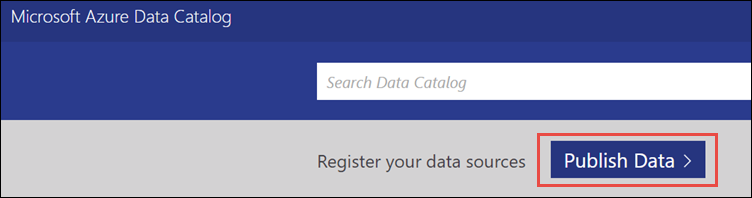
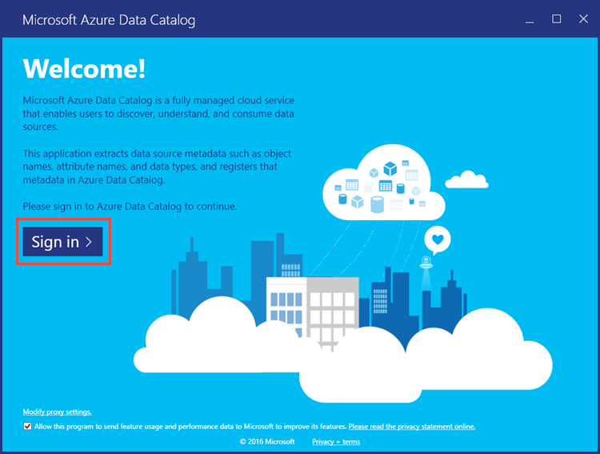
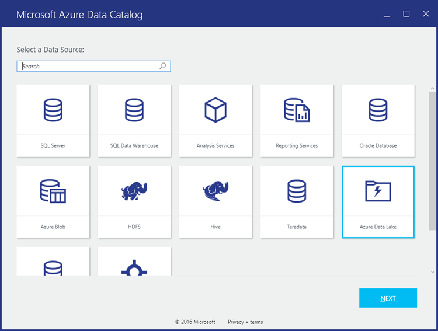
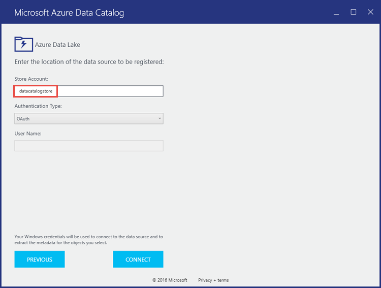
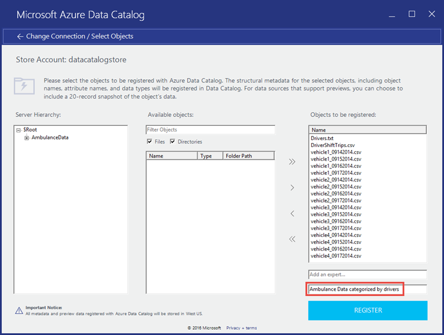
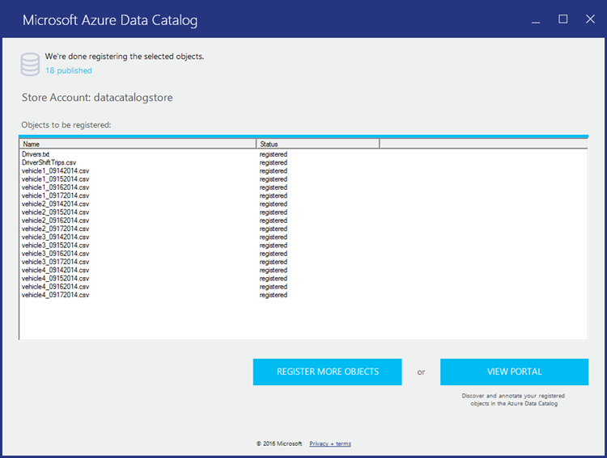
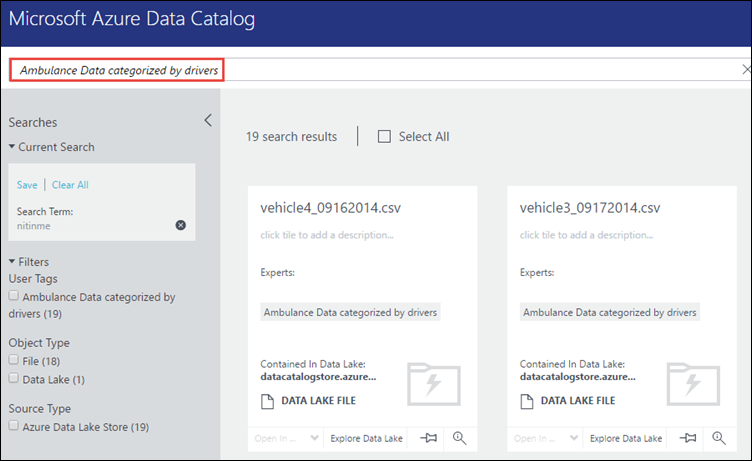

<properties
   pageTitle="Register data from Data Lake Store in Azure Data Catalog | Azure"
   description="Register data from Data Lake Store in Azure Data Catalog"
   services="data-lake-store,data-catalog" 
   documentationCenter=""
   authors="nitinme"
   manager="paulettm"
   editor="cgronlun"/>

<tags
   ms.service="data-lake-store"
   ms.devlang="na"
   ms.topic="article"
   ms.tgt_pltfrm="na"
   ms.workload="big-data"
   ms.date="05/17/2016"
   ms.author="nitinme"/>

# Register data from Data Lake Store in Azure Data Catalog

In this article you will learn how to integrate Azure Data Lake Store with Azure Data Catalog to make your data discoverable within an organization by integrating it with Data Catalog. For more information on cataloging data, see [Azure Data Catalog](../data-catalog/data-catalog-what-is-data-catalog.md). To understand scenarios in which you can use Data Catalog, see [Azure Data Catalog common scenarios](../data-catalog/data-catalog-common-scenarios.md).

## Prerequisites

Before you begin this tutorial, you must have the following:

- **An Azure subscription**. See [Get Azure free trial](https://azure.microsoft.com/pricing/free-trial/).

- **Enable your Azure subscription** for Data Lake Store Public Preview. See [instructions](data-lake-store-get-started-portal.md#signup).

- **Azure Data Lake Store account**. Follow the instructions at [Get started with Azure Data Lake Store using the Azure Portal](data-lake-store-get-started-portal.md). For this tutorial, let us create a Data Lake Store account called **datacatalogstore**. 

	Once you have created the account, upload a sample data set to it. For this tutorial, let us upload all the .csv files under the **AmbulanceData** folder in the [Azure Data Lake Git Repository](https://github.com/Azure/usql/tree/master/Examples/Samples/Data/AmbulanceData/). You can use various clients, such as [Azure Storage Explorer](http://storageexplorer.com/), to upload data to a blob container.

- **Azure Data Catalog**. Your organization must already have an Azure Data Catalog created for your organization. Only one catalog is allowed for each organization.

## Register Data Lake Store as a source for Data Catalog

>[AZURE.VIDEO adcwithadl] 

1. Go to `https://azure.microsoft.com/services/data-catalog`, and click **Get started**.

2. Log into the Azure Data Catalog portal, and click **Publish data**.

	

3. On the next page, click **Launch Application**. This will download the application manifest file on your computer. Double-click the manifest file to start the application.

4. On the Welcome page, click **Sign in**, and enter your credentials.

	

5. On the Select a Data Source page, select **Azure Data Lake**, and then click **Next**.

	

6. On the next page, provide the Data Lake Store account name that you want to register in Data Catalog. Leave the other options as default and then click **Connect**.

	

7. The next page can be divided into the following segments.

	a. The **Server Hierarchy** box represents the Data Lake Store account folder structure. **$Root** represents the Data Lake Store account root, and **AmbulanceData** represents the folder created in the root of the Data Lake Store account.

	b. The **Available objects** box lists the files and folders under the **AmbulanceData** folder.

	c. **Objects to be registered box** lists the files and folders that you want to register in Azure Data Catalog.

	

8. For this tutorial, you should register all the files in the directory. For that, click the () button to move all the files to **Objects to be registered** box. 

	Because the data will be registered in an organization-wide data catalog, it is a recommened approach to add some metadata which you can later use to quickly locate the data. For example, you can add an e-mail address for the data owner (for example, one who is uploading the data) or add a tag to identify the data. The screen capture below shows a tag that we add to the data.

	

	Click **Register**.

8. The following screen capture denotes that the data is successfully registered in the Data Catalog.

	

9. Click **View Portal** to go back to the Data Catalog portal and verify that you can now access the registered data from the portal. To search the data, you can use the tag you used while registering the data.

	

10. You can now perform operations like adding annotations and documentation to the data. For more information, see the following links.
	* [Annotate data sources in Data Catalog](../data-catalog/data-catalog-how-to-annotate.md)
	* [Document data sources in Data Catalog](../data-catalog/data-catalog-how-to-documentation.md)

## See also

* [Annotate data sources in Data Catalog](../data-catalog/data-catalog-how-to-annotate.md)
* [Document data sources in Data Catalog](../data-catalog/data-catalog-how-to-documentation.md)
* [Integrate Data Lake Store with other Azure services](data-lake-store-integrate-with-other-services.md)