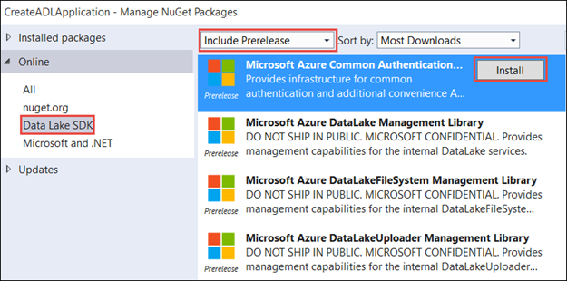

<properties 
   pageTitle="Use Data Lake .NET SDK to develop applications | Azure" 
   description="Use Azure Data Lake .NET SDK to develop applications" 
   services="data-lake" 
   documentationCenter="" 
   authors="nitinme" 
   manager="paulettm" 
   editor="cgronlun"/>
 
<tags
   ms.service="data-lake"
   ms.devlang="na"
   ms.topic="article"
   ms.tgt_pltfrm="na"
   ms.workload="big-data" 
   ms.date="09/29/2015"
   ms.author="nitinme"/>

# Get started with Azure Data Lake using .NET SDK

> [AZURE.SELECTOR]
- [Portal](azure-data-lake-get-started-portal.md)
- [PowerShell](azure-data-lake-get-started-powershell.md)
- [.NET SDK](azure-data-lake-get-started-net-sdk.md)

Learn how to use the Azure Data Lake .NET SDK to create an Azure Data Lake account and perform basic operations such as create folders, upload and download data files, delete your account, etc. For more information about Data Lake, see [Azure Data Lake](azure-data-lake-overview.md).

## Prerequisites

* Visual Studio 2013
* **An Azure subscription**. See [Get Azure free trial](http://azure.microsoft.com/documentation/videos/get-azure-free-trial-for-testing-hadoop-in-hdinsight/).

## Create a .NET application

1. Open Visual Studio 2013 and create a console application.

2. From the **File** menu, click **New**, and then click **Project**.

3. From **New Project**, type or select the following values:

	<table style="border-color: #c6c6c6; border-width: 2px; border-style: solid; border-collapse: collapse;">
	<tr>
	<th style="border-color: #c6c6c6; border-width: 2px; border-style: solid; border-collapse: collapse; width:90px; padding-left:5px; padding-right:5px;">Property</th>
	<th style="border-color: #c6c6c6; border-width: 2px; border-style: solid; border-collapse: collapse; width:90px; padding-left:5px; padding-right:5px;">Value</th></tr>
	<tr>
	<td style="border-color: #c6c6c6; border-width: 2px; border-style: solid; border-collapse: collapse; padding-left:5px;">Category</td>
	<td style="border-color: #c6c6c6; border-width: 2px; border-style: solid; border-collapse: collapse; padding-left:5px; padding-right:5px;">Templates/Visual C#/Windows</td></tr>
	<tr>
	<td style="border-color: #c6c6c6; border-width: 2px; border-style: solid; border-collapse: collapse; padding-left:5px;">Template</td>
	<td style="border-color: #c6c6c6; border-width: 2px; border-style: solid; border-collapse: collapse; padding-left:5px;">Console Application</td></tr>
	<tr>
	<td style="border-color: #c6c6c6; border-width: 2px; border-style: solid; border-collapse: collapse; padding-left:5px;">Name</td>
	<td style="border-color: #c6c6c6; border-width: 2px; border-style: solid; border-collapse: collapse; padding-left:5px;">CreateADLApplication</td></tr>
	</table>

4. Click **OK** to create the project.

5. [ TBD: Verify these steps ] Download and extract the [Azure Data Lake .NET SDK NuGet package](https://github.com/MicrosoftBigData/AzureDataLake/releases). Extract the contents of AzureSDK_DataLake_Only.zip and place the contents in a directory such as C:\Downloads\ADL_Nuget_Package.

6. [ TBD: Verify these steps ] Add the Nuget package to your project. 

	1. Right-click the project name in the Solution Explorer and click **Manage NuGet Packages**.
	2. In the **Manage Nuget Packages** dialog box, click **Settings**.
	3. Click the **+** button to add a new Nuget source. In the **Source** text box, provide the location where you downloaded the Nuget packages for Data Lake, click **Update**,  and then click **OK**.

				

	4. You should now be able to see **Data Lake SDK** in the list of Nuget sources. From the drop-down select **Include Prerelease**, and then click **Install** for each of the listed packages.

		

	5. Click **Close** in the **Manage Nuget Packages** dialog box.

7. Open Program.cs and replace the existing code block with the following code:

	
			using System;
			using System.Collections.Generic;
			using System.Linq;
			using System.Text;
			using System.Threading.Tasks;
			using System.Security;
			using System.Diagnostics;
			using System.IO;
			
			using Microsoft.Azure;
			using Microsoft.Azure.Common.Authentication;
			using Microsoft.Azure.Common.Authentication.Models;
			using Microsoft.Azure.Management.DataLake;
			using Microsoft.Azure.Management.DataLake.Models;
			using Microsoft.Azure.Management.DataLakeFileSystem;
			using Microsoft.Azure.Management.DataLakeFileSystem.Models;
			using Microsoft.Azure.Management.DataLakeFileSystem.Uploading;
			using Microsoft.IdentityModel.Clients.ActiveDirectory;
			
			
			namespace CreateADLApplication
			{
			    class CreateADLApplication
			    {
			        private static DataLakeManagementClient _dataLakeClient;
			        private static DataLakeFileSystemManagementClient _dataLakeFileSystemClient;
			        private static Guid SubscriptionId = new Guid("65a1016d-0f67-45d2-b838-b8f373d6d52e");
			        private const string ResourceGroupName = "myresourcegroup";
			        
			        
			        
			        static void Main(string[] args)
			        {
			            var profileClient = GetProfile();
			            var _credentials = GetCloudCredentials(profileClient, SubscriptionId);
			
			            _dataLakeClient = new DataLakeManagementClient(_credentials);
			            _dataLakeFileSystemClient = new DataLakeFileSystemManagementClient(_credentials);
			            
			            var parameters = new DataLakeAccountCreateOrUpdateParameters();
			            parameters.DataLakeAccount = new DataLakeAccount
			            {
			                Name = "adldotnetaccount",
			                Location = "East US 2"
			            };
			            
			            // Create an ADL account
			            Console.WriteLine("Creating an Azure Data Lake account ...");
			            _dataLakeClient.DataLakeAccount.Create(ResourceGroupName, parameters);
			
			            Console.WriteLine("Account created. Press any key to continue...");
			            Console.ReadLine();
			            /*
			            // Create a directory
			            Console.WriteLine("Creating a directory under the Azure Data Lake account");
			            CreateDir(_dataLakeFileSystemClient, "swebhdfs://adldotnetaccount.azuredatalake.net/mytempdir", "adldotnetaccount", "777");
			            Console.WriteLine("Directory created. Press any key to continue...");
			            Console.ReadLine();
			            */
			            // Upload a file
			            Console.WriteLine("Uploading a file to the Azure Data Lake account");
			            bool force = true;
			            UploadFile(_dataLakeFileSystemClient,"adldotnetaccount", "C:\\users\\nitinme\\desktop\\tweets.txt", "swebhdfs://adldotnetaccount.azuredatalake.net/mytempdir/tweets.txt", force);
			                        Console.WriteLine("File uploaded. Press any key to continue...");
			            Console.ReadLine();
			
			            // List the files
			            Console.WriteLine("Listing all files in the Azure Data Lake account");
			            ListItems(_dataLakeFileSystemClient, "adldotnetaccount", "swebhdfs://adldotnetaccount.azuredatalake.net/mytempdir");
			                        Console.WriteLine("Files listed. Press any key to continue...");
			            Console.ReadLine();
			
			            // Download the files
			            Console.WriteLine("Downloading files from an Azure Data Lake account");
			            bool force1 = true;
			            DownloadFile(_dataLakeFileSystemClient, "adldotnetaccount", "swebhdfs://adldotnetaccount.azuredatalake.net/mytempdir/tweets.txt", "C:\\users\\nitinme\\desktop\\tweets1.txt", force1);
			                        Console.WriteLine("Files downloaded. Press any key to continue...");
			            Console.ReadLine();
			
			            // Delete the ADL account
			            _dataLakeClient.DataLakeAccount.Delete(ResourceGroupName, "adldotnetaccount");
			            Console.WriteLine("Azure Data Lake account deleted. Press any key to continue...");
			            Console.WriteLine("Press any key to exit...");
			            Console.ReadLine();
			        }
			
			        public static ProfileClient GetProfile(string username = null, SecureString password = null)
			        {
			            var pClient = new ProfileClient(new AzureProfile());
			            var env = pClient.GetEnvironmentOrDefault(EnvironmentName.AzureCloud);
			            var acct = new AzureAccount { Type = AzureAccount.AccountType.User };
			            if (username != null && password != null)
			                acct.Id = username;
			
			            pClient.AddAccountAndLoadSubscriptions(acct, env, password);
			            return pClient;
			        }
			
			        private static SubscriptionCloudCredentials GetCloudCredentials(ProfileClient profileClient, Guid subscriptionId)
			        {
			            var sub = profileClient.Profile.Subscriptions.Values.FirstOrDefault(s => s.Id.Equals(subscriptionId));
			            Debug.Assert(sub != null, "subscription != null");
			            profileClient.SetSubscriptionAsDefault(sub.Id, sub.Account);
			            return AzureSession.AuthenticationFactory.GetSubscriptionCloudCredentials(profileClient.Profile.Context);
			        }
			
			        public static bool CreateDir(DataLakeFileSystemManagementClient dataLakeFileSystemClient, string path, string dlAccountName, string permission)
			        {
			            dataLakeFileSystemClient.FileSystem.Mkdirs(path, dlAccountName, permission);
			            return true;
			        }
			        
			        public static bool UploadFile(DataLakeFileSystemManagementClient dataLakeFileSystemClient, string dlAccountName, string srcPath, string destPath, bool force = false)
			        {
			            var parameters = new UploadParameters(srcPath, destPath, dlAccountName, isOverwrite: true);
			            var frontend = new DataLakeFrontEndAdapter(dlAccountName, dataLakeFileSystemClient);
			            var uploader = new DataLakeUploader(parameters, frontend);
			            uploader.Execute();
			            return true;
			        }
			
			        public static bool AppendBytes(DataLakeFileSystemManagementClient dataLakeFileSystemClient, string dlAccountName, string path, Stream streamContents)
			        {
			            var response = dataLakeFileSystemClient.FileSystem.BeginAppend(path, dlAccountName, null);
			            dataLakeFileSystemClient.FileSystem.Append(response.Location, streamContents);
			            return true;
			        }
			
			        public static void DownloadFile(DataLakeFileSystemManagementClient dataLakeFileSystemClient,
			        string dataLakeAccountName, string srcPath, string destPath, bool force)
			        {
			            var beginOpenResponse = dataLakeFileSystemClient.FileSystem.BeginOpen(srcPath, dataLakeAccountName,
			                new FileOpenParameters());
			            var openResponse = dataLakeFileSystemClient.FileSystem.Open(beginOpenResponse.Location);
			            if (force || !File.Exists(destPath))
			                File.WriteAllBytes(destPath, openResponse.FileContents);
			        }
			
			        public static List<FileStatusProperties> ListItems(DataLakeFileSystemManagementClient dataLakeFileSystemClient, string dataLakeAccountName, string path)
			        {
			            var response = dataLakeFileSystemClient.FileSystem.ListFileStatus(path, dataLakeAccountName, new DataLakeFileSystemListParameters());
			            return response.FileStatuses.FileStatus.ToList();
			        }
			    }
			}

8. Build and run the application. Follow the prompts
 
## See also

- [ TBD: Link to using ADL with Kona ]
- [ TBD: Link to using ADL with HDInsight ]
- [ TBD: Link to using ADL with HDP ]  
