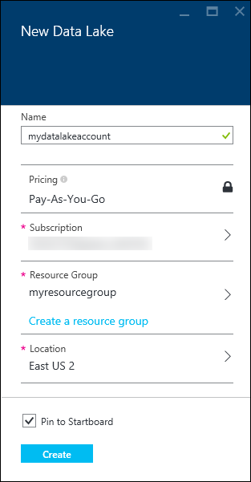
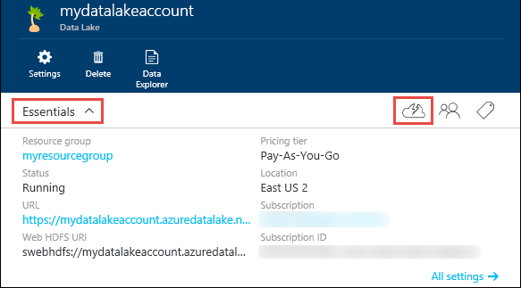
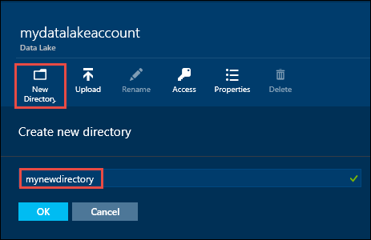
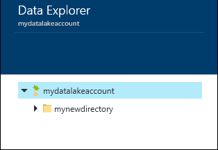
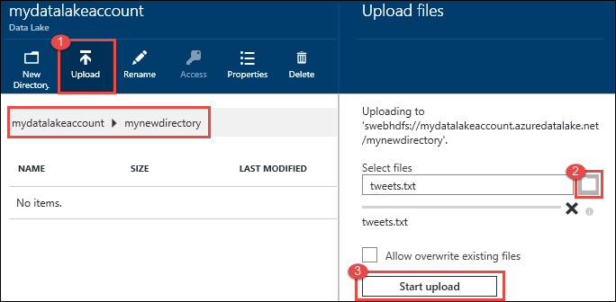
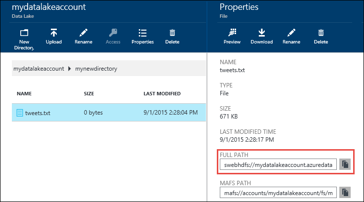
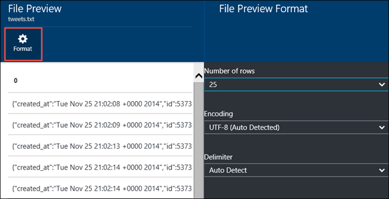
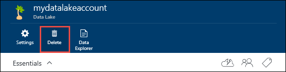

<properties 
   pageTitle="Get started with Data Lake | Azure" 
   description="Use the portal to create a Data Lake account and perform basic operations in the Data Lake" 
   services="data-lake" 
   documentationCenter="" 
   authors="nitinme" 
   manager="paulettm" 
   editor="cgronlun"/>
 
<tags
   ms.service="data-lake"
   ms.devlang="na"
   ms.topic="article"
   ms.tgt_pltfrm="na"
   ms.workload="big-data" 
   ms.date="09/29/2015"
   ms.author="nitinme"/>

# Get started with Azure Data Lake using the Azure preview portal

> [AZURE.SELECTOR]
- [Portal](azure-data-lake-get-started-portal.md)
- [PowerShell](azure-data-lake-get-started-powershell.md)
- [.NET SDK](azure-data-lake-get-started-net-sdk.md)

Learn how to use the Azure Preview Portal to create an Azure Data Lake account and perform basic operations such as create folders, upload and download data files, delete your account, etc. For more information about Data Lake, see [Azure Data Lake](azure-data-lake-overview.md).

## Prerequisites

Before you begin this tutorial, you must have the following:

- **An Azure subscription**. See [Get Azure free trial](http://azure.microsoft.com/documentation/videos/get-azure-free-trial-for-testing-hadoop-in-hdinsight/).

## Create an Azure Data Lake account

1. Sign on to the new [Azure preview portal](https://portal.azure.com).

2. Click **NEW**, click **Data + Storage**, and then click **Azure Data Lake**. Read the information in the **Azure Data Lake** blade, and then click **Create** in the bottom left corner of the blade.

3. In the **New Data Lake** blade, provide the values as shown in the screen capture below:

	

	- **Pricing**: [ TBD: Complete pricing info ]	
	- **Resource Group**. Select an existing resource group, or click **Create a resource group** to create one. A resource group is a container that holds related resources for an application. For more information, see [Resource Groups in Azure](resource-group-overview.md#resource-groups).
	- **Location**: Select a location. [ TBD: What's the importance of this location. Is the new resource group in the same location ]

4. Select **Pin to Startboard** if you want the Data Lake account to be accessible from the Startboard.

5. Click **Create**. If you chose to pin the account to the startboard, you are taken back to the startboard and you can see the progress of your data lake account provisioning. Once the Azure Data Lake account is provisioned, the account blade shows up.

6. Expand the **Essentials** drop-down to see the information about your data lake account such as the resource group it is a part of, the location, etc. Click the **Quick Start** icon to see links to other resources related to Azure Data Lake.

	

## Create directory structures in your Azure Data Lake account

You can create directories under your Azure Data Lake account to manage and store data.

1. Open the Data Lake account that you just created. From the left pane, click **Browse**, click **Data Lake**, and then from the Data Lake blade, click the account name under which you want to create directories. If you pinned the Data Lake account to the startboard, click that tile.

2. In your Data Lake account blade, click **Data Explorer**.

	

3. In your Data Lake account blade, click **New Directory**, enter a name for the new directory, and then click **OK**.
	
	
	
	The newly created directory will be listed in the **Data Explorer** blade. You can create nested directories upto any level.

	

## Upload data to your Azure Data Lake account

You can upload your data to an Azure Data Lake account directly at the root level or to a directory that you created within the account. In the screen capture below, follow the steps to upload a file to a sub-directory from the **Data Explorer** blade. In this screen capture, the file is uploaded to a sub-directory shown in the breadcrumbs (marked in a red box).

## Properties and actions available on the stored data

Click the newly added file to open the **Properties** blade. The properties associated with the file and the actions you can perform on the file are available in this blade. You can also copy the full path to file in your Azure Data Lake account, highlighted in the red box in the screen capture below. [ TBD: Talk about swebhdfs ]

* Click **Preview** to see a preview of the file, directly from the browser. You can specify the format of the preview as well. Click Preview, click Format in the File Preview blade, and in the File Preview Format blade specify the options such as number of rows to display, encoding to use, delimiter to use, etc.

  

* Click **Download** to download the file to your computer.

* Click **Rename** to rename the file.

* Click **Delete** to delete the file.

## Secure your data

You can secure the data stored in your Azure Data Lake account by using access control and providing expiry settings on the data. For instructions on how to do that, see [ TBD: Link to topic ].

## Delete your Azure Data Lake account

To delete an Azure Data Lake account, from your Data Lake blade, click Delete. As a confirmation, you'll be prompted to enter the name of the account you wish to delete. Enter the name of the account, and then click **Delete**.

## See Also

[ TBD: Add links ]