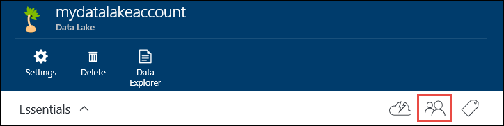

<properties 
   pageTitle="Securing data stored in Azure Data Lake | Azure" 
   description="Learn how to secure data in Azure Data Lake using groups and access control lists" 
   services="data-lake" 
   documentationCenter="" 
   authors="nitinme" 
   manager="paulettm" 
   editor="cgronlun"/>
 
<tags
   ms.service="data-lake"
   ms.devlang="na"
   ms.topic="article"
   ms.tgt_pltfrm="na"
   ms.workload="big-data" 
   ms.date="09/29/2015"
   ms.author="nitinme"/>

# Securing data stored in Azure Data Lake

Securing data in Azure Data Lake is a two-pronged approach.

1. Start by creating security groups in Azure Active Directory (AAD). These security groups are used to implement role-based access control (RBAC) in Azure Portal. For more information see [Role-based Access Control in Microsoft Azure](role-based-access-control-configure.md).

2. Assign the AAD security groups to the Azure Data Lake account. This controls access to the Data Lake account from the portal and management operations from the portal or APIs.

3. Assign the AAD security groups as access control lists (ACLs) on the Data Lake file system.

This article provides instructions on how to use the Azure portal to perform the above tasks. 

## Prerequisites

Before you begin this tutorial, you must have the following:

- **An Azure subscription**. See [Get Azure free trial](http://azure.microsoft.com/documentation/videos/get-azure-free-trial-for-testing-hadoop-in-hdinsight/).

## Create security groups in Azure Active Directory

For instructions on how to create AAD security groups, see [Managing security groups in Azure Active Directory](active-directory-accessmanagement-manage-groups.md).

## Assign the security group to Azure Data Lake accounts

When you assign security groups to Azure Data Lake accounts, you control the management operations on the account using the Azure portal and Azure Resource Manager APIs. In this section, you assign a security group to an Azure Data Lake account. 

1. Open the Data Lake account that you just created. From the left pane, click **Browse All**, click **Data Lake**, and then from the Data Lake blade, click the account name to which you want to assign a security group.

2. In your Data Lake account blade, click the user icon.

	

3. In your Data Lake account blade, click the user icon.
	
	
	
	The newly created directory will be listed in the **Data Explorer** blade. You can create nested directories upto any level.

	

## Upload data to your Azure Data Lake account

You can upload your data to an Azure Data Lake account directly at the root level or to a directory that you created within the account. In the screen capture below, follow the steps to upload a file to a sub-directory from the **Data Explorer** blade. In this screen capture, the file is uploaded to a sub-directory shown in the breadcrumbs (marked in a red box).

## Properties and actions available on the stored data

Click the newly added file to open the **Properties** blade. The properties associated with the file and the actions you can perform on the file are available in this blade. You can also copy the full path to file in your Azure Data Lake account, highlighted in the red box in the screen capture below. [ TBD: Talk about swebhdfs ]

* Click **Preview** to see a preview of the file, directly from the browser. You can specify the format of the preview as well. Click Preview, click Format in the File Preview blade, and in the File Preview Format blade specify the options such as number of rows to display, encoding to use, delimiter to use, etc.

  

* Click **Download** to download the file to your computer.

* Click **Rename** to rename the file.

* Click **Delete** to delete the file.

## Secure your data

You can secure the data stored in your Azure Data Lake account by using access control and providing expiry settings on the data. For instructions on how to do that, see [ TBD: Link to topic ].

## Delete your Azure Data Lake account

To delete an Azure Data Lake account, from your Data Lake blade, click Delete. As a confirmation, you'll be prompted to enter the name of the account you wish to delete. Enter the name of the account, and then click **Delete**.

## See Also

[ TBD: Add links ]