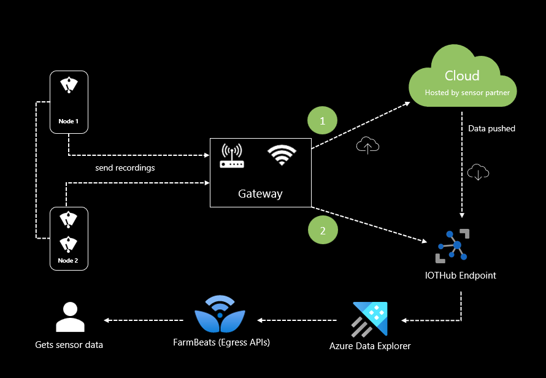
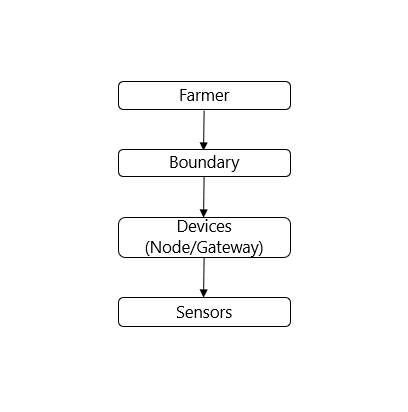

# Sensor data overview

Smart agriculture, also known as precision agriculture, allows farmers to maximize yields using minimal resources such as water, fertilizer, and seeds, etc. By deploying sensors, farmers can begin to understand their crops at a micro-scale, conserve resources, reduce impacts on the environment and ultimately maximize their crop yield. As more variables (pH, soil moisture, etc.) could be measured and entered into a crop model, more accurate recommendations for fertilizer application, watering, and even peak yield harvesting could be made.

> [!NOTE]
> Microsoft Azure Data Manager for Agriculture is currently in preview. For legal terms that apply to features that are in beta, in preview, or otherwise not yet released into general availability, see the [**Supplemental Terms of Use for Microsoft Azure Previews**](https://azure.microsoft.com/en-us/support/legal/preview-supplemental-terms/).
> Microsoft Azure Data Manager for Agriculture requires registration and is available to only approved customers and partners during the preview period. To request access to Microsoft Data Manager for Agriculture during the preview period, use this [**form**](https://forms.office.com/r/SDR0m3yjeS).

Sensors are of various types such as location-sensor (determines lat/long & altitude), electrochemical sensor (determines pH, soil nutrients), soil moisture sensor, airflow sensor (determines the pressure required to push a pre-determined amount of air into the ground at a prescribed depth), weather sensor, etc. Therefore, there is a huge ecosystem of customers dependent on sensor data that helps farmers monitor and optimize crop performance, as well as to adapt to changing environmental factors to achieve the desired outcome with minimal resources.

## How sensor works

Each sensor based on its characteristics will be placed in certain parts of the field. Sensors will be recording the measurements and will be transferring the data to the nodes to which it is being connected. Each node has one or many sensors connected to it. This way, nodes are placed all over the field, where each node can communicate with one another. Nodes can be equipped with internet in which case they directly push the data to cloud. If nodes are not equipped with internet, then all these nodes would be transferring the data to gateway either in wired or wireless manner using an IOT agent (a software component which talks to IOT devices).

Gateways collect all essential data from the nodes and push it securely to the cloud via either cellular connectivity, Wi-Fi, or Ethernet. Once the data resides in a sensor partner cloud, in the case of Agri Data Service integration, the sensor partner will push the relevant sensors data to the dedicated IOTHub endpoint provided by Agri Data Service.

In addition to the above approach, IOT devices (sensors/nodes/gateway) could directly push the data to IOTHub endpoint, in which case Agri Data Service will work the same way as above. In both cases the data first reaches the IOTHub, post which the next set of processing happens.  

## Sensor topology

The following diagram depicts the topology of a sensor in Agri Data Service. Each boundary under a farmer has a set of devices placed within it. Where a device can be either a node or a gateway. And each device has a set of sensors associated with it. Sensors are the leaf entity in this tree structure that sends the recordings up the branches via devices to the cloud. In most of the sensors, data is geo-tagged based on GPS coordinates creating geospatial time series for all measured data.

## Next steps

How to [get started as a customer](./how-to-setup-sensors-customer.md) to consume sensor data from the supported sensor partners.

How to [get started as a sensor partner](./how-to-setup-sensors-partner.md) to push sensor data into Agri Data Service.
