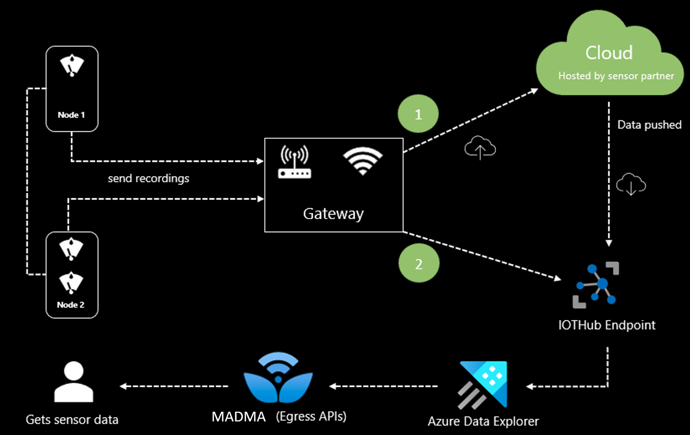
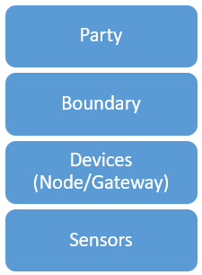

# Ingesting Sensor Data

Smart agriculture, also known as precision agriculture, allows growers to maximize yields using minimal resources such as water, fertilizer, and seeds, etc. By deploying sensors, growers and research organization can begin to understand crops at a micro-scale, conserve resources, reduce impact on the environment and ultimately maximize  crop yield. Sensors enable important ground truth data (soil moisture, rainfall, wind speed etc.) and this data in turn improves accuracy of recommendations. 

> [!NOTE]
> Microsoft Azure Data Manager for Agriculture is currently in preview. For legal terms that apply to features that are in beta, in preview, or otherwise not yet released into general availability, see the [**Supplemental Terms of Use for Microsoft Azure Previews**](https://azure.microsoft.com/support/legal/preview-supplemental-terms/).
> Microsoft Azure Data Manager for Agriculture requires registration and is available to only approved customers and partners during the preview period. To request access to Microsoft Data Manager for Agriculture during the preview period, use this [**form**](https://aka.ms/agridatamanager).

Sensors are of various types:
* Location-sensor (determines lat/long & altitude) 
* Electrochemical sensor (determines pH, soil nutrients) 
* Soil moisture sensor 
* Airflow sensor (determines the pressure required to push a pre-determined amount of air into the ground at a prescribed depth)
* Weather sensor 

There's a large ecosystem of sensor providers that helps growers to monitor and optimize crop performance. Sensor based data also enables an understanding of the changing environmental factors.

## How Sensors Work

Sensors are placed in the field based on it's characteristics. Sensors record measurements and transfer the data to the connected node. Each node has one or more sensors connected to it. Nodes equipped with internet connectivity can  directly push the data to cloud. Other nodes use an IOT agent tp transfer data the gateway.

Gateways collect all essential data from the nodes and push it securely to the cloud via either cellular connectivity, Wi-Fi, or Ethernet. Once the data resides in a sensor partner cloud, the sensor partner pushes the relevant sensors data to the dedicated IOTHub endpoint provided by Data Manager for Agriculture.

In addition to the above approach, IOT devices (sensors/nodes/gateway) can directly push the data to IOTHub endpoint. In both cases, the data first reaches the IOTHub, post that the next set of processing happens.  

## Sensor topology

The following diagram depicts the topology of a sensor in Azure Data Manager for Agriculture. Each boundary under a party has a set of devices placed within it. A device can be either be a node or a gateway and each device has a set of sensors associated with it. Sensors send the recordings via gateway to the cloud. Sensors are tagged with GPS coordinates helping in creating a geospatial time series for all measured data.

## Next steps

How to [get started as a customer](./how-to-setup-sensors-customer.md) to consume sensor data from the supported sensor partners.

How to [get started as a sensor partner](./how-to-setup-sensors-partner.md) to push sensor data into Data Manager for Agriculture Service.
