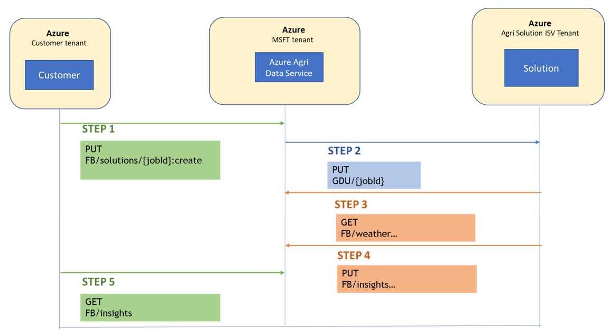

# How do I use a third-party solution?

## Overview
As a customer, once you have installed any ISV solution from Azure Portal, this document will provide you with step by step guide on how to make API calls from your application. All the integration (request/response) is done through API’s asynchronously.

Below is a high level view on how you can create a new request and get responses from the ISV partner solutions.

* Step 1: Customer will make an API call for a PUT request with the required parameter (Job ID, Farm details etc)
    * The Data Manager for Agriculture API will receive this request and authenticate the request.  If the request is invalid, it will throw back an error to the customer.
* Step 2: If the request is valid, the Data Manager for Agriculture will internally create a PUT request to ISV Partner solution API.
* Step 3: The ISV solution will make a GET request to the weather service in Data Manager for Agriculture that is required for its processing.
* Step 4: The ISV solution will complete the processing of this request and submit the response back   to the Data Manager for Agriculture.
    * If there is any error when this request is submitted, the user may have to verify  the configuration and parameters. If they are unable to resolve the issue, they may contact madma@microsoft.com
* Step 5: Now customer will have to make a call to Data Manager for Agriculture using the Job ID to get the final response.
    *  If the request processing is completed by ISV Solution, it will get a response back which can be used by the customer application.  
    * If the request processing is still in progress, it will throw a message as “Processing in progress”

Once all the request/responses are successfully processed, the status of the request is closed. This final output of the request will be stored in Data Manager for Agriculture. Customers must also ensure that they are submitting their requests within the pre-defined threshold defined as per the terms/agreements.  
