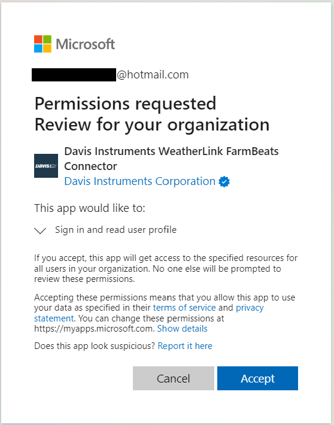
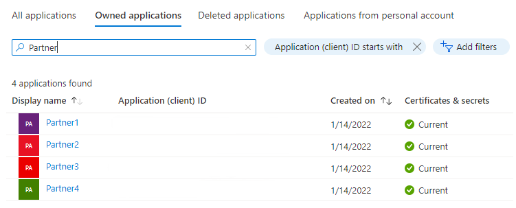
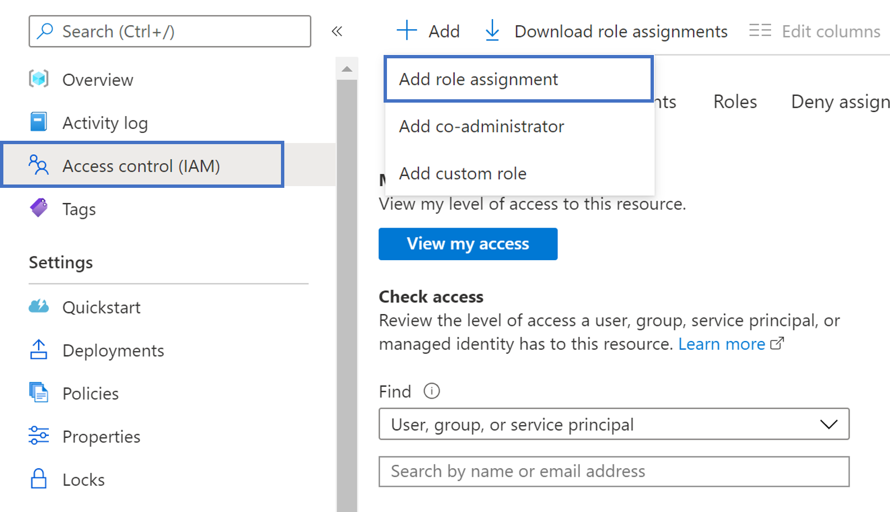
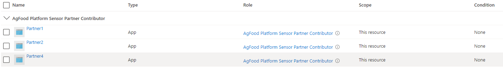

# Sensor Integration as a Customer

Follow the steps to integrate with a sensor partner to enable the partner to start pushing the data into your Data Manager for Agriculture instance.

## Step 1: Identify the sensor partner app and provide consent

Each sensor partner has their own multi-tenant AAD app created and published on the Data Manager for Agriculture platform. The sensor partner supported by default on the platform is Davis Instruments(sensorPartnerId: `DavisInstruments`). However, you are free to add your own sensors by being a sensor partner yourself. Follow [these steps](./sensor-partner.md) to sign up being a sensor partner on the platform.

To start using the on-boarded sensor partners, you need to give consent to the sensor partner so that they start showing up in `App Registrations`. The steps for you to follow:

1. Login to [Azure Portal](https://portal.azure.com/) using "Global Administrator" or "Privileged Role Administrator" credentials. [How to find Global Administrator?](https://docs.microsoft.com/en-us/answers/questions/40421/unsure-how-to-find-global-administrator.html)  

2. For Davis Instruments, please click on this [link](https://login.microsoftonline.com/common/adminconsent?client_id=30b00405-3b4e-4003-933c-0d96ce47d670) to provide consent. 

3. You will be redirected to the permission review page like below. AAD app would ask for minimum "read user profile" permission and that should be sufficient for sensor integration with Data Manager for Agriculture.



4. Click on "Accept" button above to grant admin consent. It grants admin consent and redirects to the app redirect URL. 

5. Now, look for `Davis Instruments WeatherLink Data Manager for Agriculture Connector` under All Applications tab in `App Registrations` page. This is illustrated with a generic Partner in the image.



6. Copy the Application (client) ID for the specific partner app that you want to provide access to.

## Step 2: Add role assignment to the partner app

The next step is to assign roles in the Azure portal to provide Authorization to the sensor partner application. Data Manager for Agriculture uses <a href="https://docs.microsoft.com/en-us/azure/role-based-access-control/overview" target="_blank">Azure RBAC</a> to manage Authorization requests.

Login to <a href="https://portal.azure.com" target=" blank">Azure Portal</a> and navigate to your Resource Group where you created the Data Manager for Agriculture resource. 

> [!NOTE] Inside the resource group tab, if you do not find the created Data Manager for Agriculture resource, you need to enable the **show hidden types** checkbox.

You find the IAM (Identity Access Management) menu option on the left hand side of the option pane as shown in the image:



Click **Add > Add role assignment**, this action opens up a pane on the right side of the portal, choose the  role from the dropdown:

- **AgFood Platform Sensor Partner Contributor** - has all privileges in the CRU (Create, Read, Update) operations that are specific to sensors.

To complete the role assignment, do the following steps:

1. Choose the mentioned role.

2. Choose **User, group, or service principal** in the Assign access to section.

3. **Paste the sensor partner App Name or ID** in the Select section (as shown in the image below).

4. Click **Save** to assign the role.



This ensures that the sensor partner app has been granted access (based on the role assigned) to Azure FarmBeats Resource.

## Step 3: Enable sensor integration

1. You need to enable sensor integrate before sensor integration can be initiated. This step provisions required internal Azure resources for sensor integration for Data Manager for Agriculture instance. This can be done by running the following <a href="https://github.com/projectkudu/ARMClient" target=" blank">armclient</a> command.

```armclient 
armclient patch /subscriptions/<subscription-id>/resourceGroups/<resource-group-name>/providers/Microsoft.AgFoodPlatform/farmBeats/<farmbeats-instance-name>?api-version=2021-09-01-preview "{properties:{sensorIntegration:{enabled:'true'}}}"
```

Sample output:

```json
{
  "id": "/subscriptions/<subscription-id>/resourceGroups/<resource-group-name>/providers/Microsoft.AgFoodPlatform/farmBeats/<farmbeats-instance-name>",
  "type": "Microsoft.AgFoodPlatform/farmBeats",
  "sku": {
    "name": "A0"
  },
  "systemData": {
    "createdBy": "<customer-id>",
    "createdByType": "User",
    "createdAt": "2022-03-11T03:36:32Z",
    "lastModifiedBy": "<customer-id>",
    "lastModifiedByType": "User",
    "lastModifiedAt": "2022-03-11T03:40:06Z"
  },
  "properties": {
    "instanceUri": "https://<farmbeats-instance-name>.farmbeats.azure.net/",
    "provisioningState": "Succeeded",
    "sensorIntegration": {
      "enabled": "True",
      "provisioningState": "**Creating**"
    },
    "publicNetworkAccess": "Enabled"
  },
  "location": "eastus",
  "name": "myfarmbeats"
}
```

2. The job might take a few minutes to complete. To know the status of the job, you can use the folowing  armclient command:

```armclient 
armclient get /subscriptions/<subscription-id>/resourceGroups/<resource-group-name> /providers/Microsoft.AgFoodPlatform/farmBeats/<farmbeats-instance-name>?api-version=2021-09-01-preview
```

3. To verify completed status, look at the **provisioningState** attribute. It should be updated as “Succeeded” from “Creating” in the earlier step.  

Sample output: 
```json
{
  "id": "/subscriptions/<subscription-id>/resourceGroups/<resource-group-name>/providers/Microsoft.AgFoodPlatform/farmBeats/<farmbeats-instance-name>",
  "type": "Microsoft.AgFoodPlatform/farmBeats",
  "sku": {
    "name": "A0"
  },
  "systemData": {
    "createdBy": "<customer-id>",
    "createdByType": "User",
    "createdAt": "2022-03-11T03:36:32Z",
    "lastModifiedBy": "<customer-id>",
    "lastModifiedByType": "User",
    "lastModifiedAt": "2022-03-11T03:40:06Z"
  },
  "properties": {
    "instanceUri": "https://<customer-host-name>.farmbeats.azure.net/",
    "provisioningState": "Succeeded",
    "sensorIntegration": {
      "enabled": "True",
      "provisioningState": "**Succeeded**"
    },
    "publicNetworkAccess": "Enabled"
  },
  "tags": {
    "usage": "<sensor-partner-id>"
  },
  "location": "eastus",
  "name": "<customer-id>"
}
```
You can create sensor integration objects after provisioning status for sensor integration is completed. 

## Step 4: Create integration object

Use the `SensorPartnerIntegrations` collection and call into the SensorPartnerIntegrations_CreateOrUpdate API to create an integration object for a given sensor partner. The way to imagine the concept of integration is, every single customer of a sensor partner (Ex: Davis) will need to have an unique integration ID created in their Data Manager for Agriculture resource.

There are two different use cases that arises here

- If you are the owners of the sensors provided by the sensor partners, then you are creating just one integration object (ID) for your account with sensor partner.

- If your end users (that is Farmers/Retailers/Agronomists) are the owners of the sensors provided by the sensor partners, then you will be creating an unique integration object (ID) for each end user. Because, each end user has their own accounts with the sensor partner.

API Endpoint: PATCH /sensor-partners/{sensorPartnerId}/integrations/{integrationID}


## Step 5: Generate consent link

Every integration is tied to a consent key. In your sensor partners integration flow you will see a section requesting for the consent link. This consent link is way for sensor partners to validate if the sensor customer  is a valid user of the Data Manager for Agriculture service. 

>[Note]
>Our sensor partner Davis Instruments uses this [UI](https://weatherlink.github.io/azure-farmbeats/setup), for enabling set-up and requesting for the consent link.

Sensor partners call into the `check-consent` API endpoint to verify the users validity. To generate a consent link, you will need to use the `SensorPartnerIntegrations_GenerateConsentLink` API and provide the integration ID created from the step (3). As a response, you will get a string called consentLink. Copy this string and  provided it to the sensor partner for further validation. If you are using sensors from Davis Instruments then follow instruction on this [page](https://weatherlink.github.io/azure-farmbeats/setup).

API Endpoint: PATCH /sensor-partners/{sensorPartnerId}/integrations/{integrationId}/:generate-consent-link

This step marks the completion of the sensor partner on-boarding from a customer perspective. With this step the sensor partners get all the required information to call your API endpoints to create Sensor model, Device model, Sensors & Devices. The partners are now be able to push sensor events using the connection string generated for each sensor ID.

The final step is to start consuming sensor events being sent by the partners. Before consuming the events, you will need to create a mapping of each sensor ID to a specific Party ID & Boundary ID. 

## Step 6: Create sensor mapping

Using the `SensorMappings` collection, call into the `SensorMappings_CreateOrUpdate` API to create a mapping for each of the sensors for which you would be consuming the sensor events. Mapping is nothing but associating a sensor ID with a specific PartyID and BoundaryID already present in the Data Manager for Agriculture system. This association ensures that as a platform you get to build data science models around a common boundary and party dimension. Every data source today (satellite, weather, farm operations) are tied to a party & boundary. As you establish this mapping object on a per sensor level you power all the agronomic use cases to benefit from sensor data.

API Endpoint: PATCH /sensor-mappings/{sensorMappingId}


## Step 7: Consume sensor events

Using the `SensorEvents` collection, call into the `SensorEvents_List` API to consume all the sensor data that is being pushed by the respective sensor partner. To consume the sensor data, you need to provide the following information

- sensorId (specifies for which sensor you want the data to be shown)
- sensorPartnerId (specifies which sensor partner is pushing this data)
- startDateTime & endDateTime (time range filters will ensure the data is slice to requested timeline)

API Endpoint: GET /sensor-events

