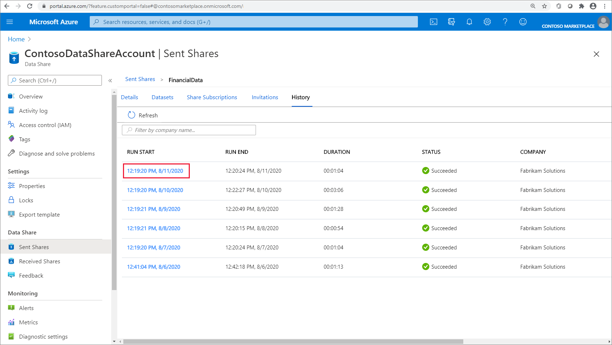
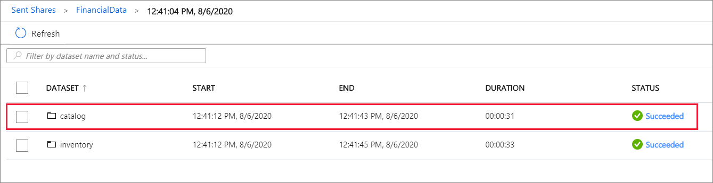
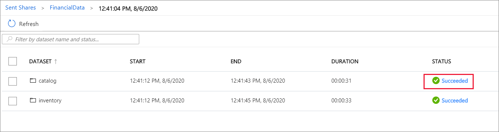
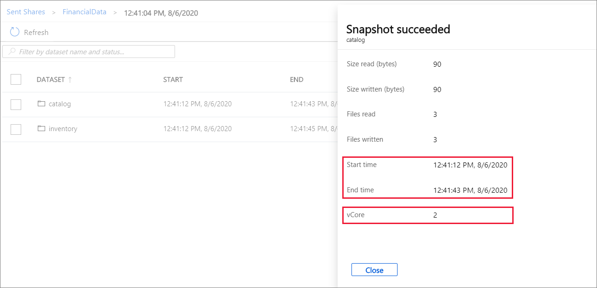

# Understand Azure Data Share pricing

For snapshot-based sharing, Azure Data Share charges for Dataset Snapshot and Snapshot Execution. This article explains how to estimate Dataset Snapshot and Snapshot Execution using snapshot history information. Currently, data provider is billed for the Dataset Snapshot and Snapshot Execution.

## Dataset Snapshot

Dataset Snapshot is the operation to move dataset from its source to destination. When snapshot is taken for a share, snapshot of each dataset within the share is a Dataset Snapshot operation. Follow the steps below to view a list of dataset snapshots. 

1. In Azure portal, navigate to your Data Share resource.

1. Select a share from Sent Share or Received Share.

1. Click on **History** tab.

1. Click on Start Time of a snapshot.
 
     

1. View the list of Dataset Snapshot operations. Each line item corresponds to a Dataset Snapshot operation. In this example, there are two Dataset Snapshots.

    

## Snapshot Execution

Snapshot Execution includes the resources required to move a dataset from the source to the destination. For each dataset snapshot operation, Snapshot Execution is calculated as number of vCores multiplied by the snapshot duration. Charges are prorated by the minute and rounded up. The number of vCore is dynamically selected based on the source-target pair and data pattern. Follow the steps below to view snapshot start time, end time and vCores used for a dataset snapshot operation.

1. In Azure portal, navigate to your Data Share resource.

1. Select a share from Sent Share or Received Share.

1. Click on **History** tab.

1. Click on Start Time of a snapshot.

     

1. Click on Status of a dataset snapshot operation.

    

1. View the start time, end time and vCores used for this dataset snapshot operation. 

    

## Next steps

- Get latest pricing information - [Azure Data Share pricing](https://azure.microsoft.com/pricing/details/data-share/)
- Use Azure pricing calculator to estimate cost - [Azure pricing calculator](https://azure.microsoft.com/pricing/calculator/)
