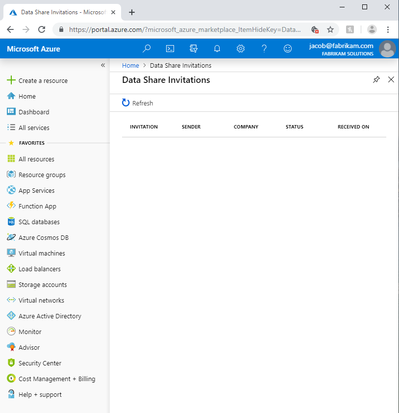

# Troubleshoot common issues in Azure Data Share Preview

This article shows how to troubleshoot common issues for Azure Data Share Preview. 

## Azure Data Share invitations 

In some cases, when a new user clicks **Accept Invitation** from the e-mail invitation that was sent, they may be presented with an empty list of invitations. 

The above error is a known issue with the service and is currently being addressed. As a workaround, follow the below steps. 

1. In the Azure portal, navigate to **Subscriptions**
1. Select the subscription that you're using for Azure Data Share
1. Click on **Resource Providers**
1. Search for Microsoft.DataShare
1. Click **Register**

You'll need to have the [Azure Contributor RBAC role](https://docs.microsoft.com/azure/role-based-access-control/built-in-roles#contributor) to complete these steps. 

If you still are unable to see a data share invitation, contact your data provider and ensure that they have sent the invitation to your Azure login e-mail address and *not* your e-mail alias. 

> [!IMPORTANT]
> If you have already accepted an Azure Data Share invitation and exited the service prior to configuring storage, follow the instructions detailed in the [configure a dataset mapping](how-to-configure-mapping.md) how-to guide to learn how to finish configuring your received data share and start receiving data. 

## Error when creating or receiving a new Data Share

"Error: Operation returned an invalid status code 'BadRequest'"

"Error: AuthorizationFailed"

"Error: role assignment to storage account"

If you receive any of the above errors when creating a new data share or receiving a new data share, it is because there are insufficient permissions to the storage account. The permission required is *Microsoft.Authorization/role assignments/write*, which exists in the storage owner role or can be assigned to a custom role. Even if you created the Storage account, it does NOT automatically make you the owner of the storage account. Follow these steps to grant yourself owner of the storage account. Alternatively, a custom role can be created with this permission that you can add yourself in to.  

1. Navigate to Storage account in Azure portal
1. Select **Access control (IAM)**
1. Click **Add**
1. Add yourself in as owner.

## Next steps

To learn how to start sharing data, continue to the [share your data](share-your-data.md) tutorial.

