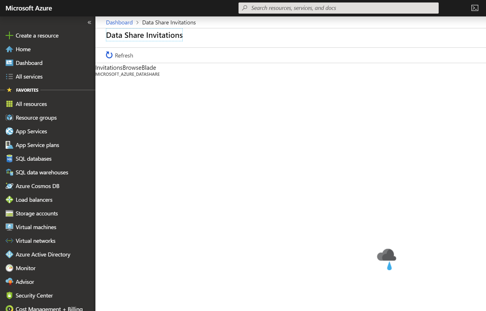

# Troubleshoot common issues in Azure Data Share Preview

This article shows how to troubleshoot common issues for Azure Data Share Preview. 

## Azure Data Share Invitations 

In some cases, when a new user accepts an Azure Data Share invitation, they may receive an error. For example:

**"InvitationBrowseBlade | MICROSOFT_AZURE_DATASHARE"**

The above error is a known issue with the service and is currently being addressed. As a workaround, follow the below steps. 

1. In the Azure portal, navigate to **Subscriptions**
1. Select the subscription that you're using for Azure Data Share
1. Click on **Resource Providers**
1. Search for Microsoft.DataShare
1. Click **Register**

You'll need to have the [Azure Contributor RBAC role](https://docs.microsoft.com/azure/role-based-access-control/built-in-roles#contributor) to complete these steps. 

## Error when creating a new Data Share

"Error: Operation returned an invalid status code 'BadRequest'"

"Error: AuthorizationFailed"

"Error: role assignment to storage account"

If you receive any of the above errors when creating a new data share or receiving a new data share, it is because there are insufficient permissions to the storage account. Even if you created the Storage account, it does NOT automatically make you the owner of the storage account. Follow these steps to grant yourself owner of the storage account.

1. Navigate to Storage account in Azure portal
1. Select **Access control (IAM)**
1. Click **Add**
1. Add yourself in as the Storage Blob Data Owner

## Next steps

Learn how to [share your data](share-your-data.md).
